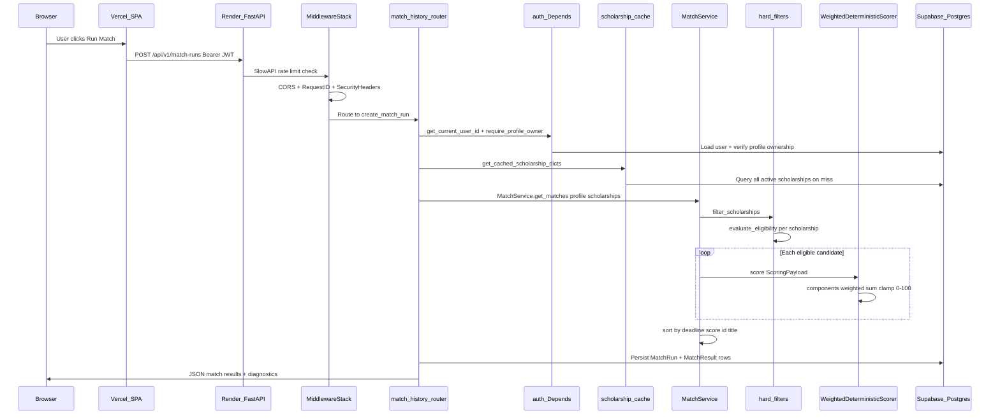

# ENGINEERING KNOWLEDGE PORTFOLIO — ISKONNECT

> **Purpose:** This is not project documentation. It is evidence that building ISKONNECT taught real software engineering — every concept below is anchored to code, migrations, tests, or deployment config that exists in this repository.
>
> **Repository:** `scholarship-match` (GitHub: `Manabatman/scholarship-match`)  
> **Stack:** FastAPI · SQLAlchemy · PostgreSQL (Supabase) · Redis · React/Vite · Render · Vercel  
> **Audit date:** July 2026 · 46 commits · 43 Alembic migrations · 51 backend test modules · 313 pytest cases

---

## Table of Contents

1. [Programming Concepts Learned](#section-1--programming-concepts-learned)
2. [Python Syntax I Have Used](#section-2--python-syntax-i-have-used)
3. [FastAPI Concepts](#section-3--fastapi-concepts)
4. [SQLAlchemy](#section-4--sqlalchemy)
5. [Pydantic](#section-5--pydantic)
6. [Database Design](#section-6--database-design)
7. [Backend Architecture](#section-7--backend-architecture)
8. [Data Structures Used](#section-8--data-structures-used)
9. [Algorithms Used](#section-9--algorithms-used)
10. [Big O Analysis](#section-10--big-o-analysis)
11. [APIs](#section-11--apis)
12. [Security](#section-12--security)
13. [Software Engineering Principles](#section-13--software-engineering-principles)
14. [Design Patterns](#section-14--design-patterns)
15. [Testing](#section-15--testing)
16. [DevOps](#section-16--devops)
17. [Git Knowledge](#section-17--git-knowledge)
18. [Engineering Vocabulary (Glossary)](#section-18--engineering-vocabulary-glossary)
19. [Things I Didn't Realize I Learned](#section-19--things-i-didnt-realize-i-learned)
20. [My Growth](#section-20--my-growth)
21. [Appendix: Frontend (React + TypeScript)](#section-21--appendix-frontend-react--typescript)

---

## SECTION 1 — Programming Concepts Learned

Each entry follows: **What → Why it exists → Where in ISKONNECT → Why chosen → If removed**

### Variables

- **What:** Named bindings that hold values in memory.
- **Why:** Without names, every value would be anonymous and impossible to compose across functions.
- **Where:** Every module. Example: `settings = Settings()` in [`app/config.py`](app/config.py) L226; `limiter` in [`app/limiter.py`](app/limiter.py).
- **Why chosen:** Module-level singletons for config and rate limiter avoid re-parsing `.env` on every request.
- **If removed:** Each request would reload environment variables — slow and inconsistent across workers.

### Functions

- **What:** Reusable blocks of logic with inputs and outputs.
- **Why:** Decompose problems; test units in isolation.
- **Where:** `verify_password()` / `hash_password()` in [`app/auth.py`](app/auth.py) L32–37; `evaluate_eligibility()` in [`app/matching/eligibility_result.py`](app/matching/eligibility_result.py).
- **Why chosen:** Auth hashing and eligibility evaluation are pure enough to unit-test without HTTP.
- **If removed:** Logic would be inlined in route handlers — untestable monoliths.

### Scope (local, module, global)

- **What:** Rules governing which names are visible where.
- **Why:** Prevents accidental mutation and name collisions.
- **Where:** `global _process_cache, _process_cache_time` in [`app/scholarship_cache.py`](app/scholarship_cache.py) L63 for in-process TTL fallback; module-level `_EVALUATOR_REGISTRY` in [`app/matching/eligibility_result.py`](app/matching/eligibility_result.py).
- **Why chosen:** Process-level cache must survive across requests within one worker.
- **If removed:** Cache would reset every call — Redis miss storm on every request.

### Modules & Packages

- **What:** Files (`module`) and directories with `__init__.py` (`package`) that organize code.
- **Why:** Namespaces prevent collisions; enable selective imports.
- **Where:** `app/matching/`, `app/scoring/`, `app/api/v1/` — 23 router modules; barrel exports in [`app/serialization/__init__.py`](app/serialization/__init__.py) with `__all__`.
- **Why chosen:** Domain boundaries (matching vs scoring vs API) map to deployable mental models.
- **If removed:** One giant `main.py` — impossible to navigate at 30+ models and 80+ endpoints.

### Imports (absolute)

- **What:** Bringing symbols from other modules into scope.
- **Why:** Reuse without duplication.
- **Where:** `from app.config import settings` throughout; lazy imports like `import sentry_sdk` inside `if settings.sentry_dsn:` in [`app/main.py`](app/main.py) L107–109 to avoid hard dependency when Sentry is off.
- **Why chosen:** Lazy imports break circular dependencies and keep cold-start imports minimal.
- **If removed:** Import cycles between `main.py` ↔ route modules would fail at startup.

### Control Flow (if/elif/else)

- **What:** Conditional execution paths.
- **Why:** Business rules are inherently conditional (eligibility, auth roles).
- **Where:** `_derive_status()` in [`app/matching/eligibility_result.py`](app/matching/eligibility_result.py) L853–865 — UNMET → NOT_ELIGIBLE, UNKNOWN → PROVISIONALLY_QUALIFIED, etc.
- **Why chosen:** Explicit priority chain is auditable for scholarship policy defense.
- **If removed:** Every student would get the same qualification label — legally and ethically wrong.

### Loops (for/while)

- **What:** Repeated execution over collections or until a condition.
- **Why:** Catalog iteration (hundreds of scholarships) requires batch processing.
- **Where:** `for sch in candidates:` in [`app/matching/match_service.py`](app/matching/match_service.py); `for line_no, raw in enumerate(reader, start=2):` in [`app/scripts/fix_gemini_csv.py`](app/scripts/fix_gemini_csv.py).
- **Why chosen:** Matching is O(N) over scholarships; loops are the natural expression.
- **If removed:** No batch matching — one scholarship at a time via separate HTTP calls (absurd latency).

### Recursion

- **What:** A function calling itself.
- **Why:** Natural for tree structures.
- **Where:** **Not used** in ISKONNECT application code. Eligibility is flat evaluator lists, not recursive trees.
- **Why not:** Scholarship rules are a fixed registry of 14 evaluators, not nested rule trees.
- **If added:** Could model nested geographic hierarchies (barangay → city → province) but current flat checks suffice.

### Error Handling & Exceptions

- **What:** Structured failure propagation via `try/except/raise`.
- **Why:** Separate expected failures (401, 404) from unexpected bugs (500).
- **Where:** Global handler in [`app/main.py`](app/main.py) L133–161; custom `CatalogAdminError` in [`app/services/scholarship_catalog_admin.py`](app/services/scholarship_catalog_admin.py) L63; `StorageNotConfiguredError` in [`app/storage/supabase_storage.py`](app/storage/supabase_storage.py).
- **Why chosen:** Admin catalog operations need domain-specific error codes; storage failures need graceful 503.
- **If removed:** Unhandled tracebacks leak to clients; no Sentry correlation.

### Typing (static annotations)

- **What:** Declaring expected types for parameters and returns.
- **Why:** Catch bugs before runtime; IDE autocomplete; self-documenting APIs.
- **Where:** `from __future__ import annotations` in 90+ files; `def get_profile_dict(...) -> dict | None:` in [`app/api/v1/profiles.py`](app/api/v1/profiles.py).
- **Why chosen:** FastAPI uses annotations for OpenAPI generation and validation wiring.
- **If removed:** OpenAPI schema degrades; refactor safety disappears.

### Generics (`TypeVar`, `Generic`)

- **What:** Parameterized types for reusable containers.
- **Where:** **Not used** in application code. `Union[str, None]` appears only in Alembic stubs ([`alembic/versions/043_scholarship_versions_cascade.py`](alembic/versions/043_scholarship_versions_cascade.py)).
- **Why not:** Python services use concrete `dict`, `list`, Pydantic models — no generic repository base class yet.
- **If added:** Could type `PaginatedResponse[T]` for search endpoints.

### Enums

- **What:** Named constant sets with type safety.
- **Why:** Prevent magic strings (`"NOT_ELIGIBLE"` typos).
- **Where:** `QualificationStatus(str, Enum)` in [`app/matching/eligibility_result.py`](app/matching/eligibility_result.py) L30; `ReadinessState(str, Enum)` in [`app/documents/readiness.py`](app/documents/readiness.py).
- **Why chosen:** `str, Enum` serializes to JSON strings without custom encoders.
- **If removed:** Status strings would scatter as literals — regression-prone.

### Decorators

- **What:** Functions that wrap other functions to add behavior.
- **Why:** Cross-cutting concerns (auth, rate limits, validation) without duplicating boilerplate.
- **Where:** `@router.get(...)` + `@limiter.limit("60/minute")` on every route; `@field_validator` in [`app/schemas.py`](app/schemas.py); `@asynccontextmanager` lifespan in [`app/main.py`](app/main.py) L86.
- **Why chosen:** FastAPI and Pydantic are decorator-driven frameworks.
- **If removed:** Every route would manually parse JWT, validate body, and enforce rate limits.

### Classes & Objects

- **What:** Bundling data and behavior.
- **Why:** Stateful services (DB session + scoring engine) benefit from encapsulation.
- **Where:** `MatchService` in [`app/matching/match_service.py`](app/matching/match_service.py); `WeightedDeterministicScorer` in [`app/scoring/engine.py`](app/scoring/engine.py); 30 SQLAlchemy model classes in [`app/models.py`](app/models.py).
- **Why chosen:** MatchService orchestrates filter → score → rank → timeline in one cohesive unit.
- **If removed:** Procedural spaghetti across route files.

### Inheritance

- **What:** Subclass derives behavior from parent.
- **Why:** Shared interfaces with enforced contracts.
- **Where:** All models inherit `Base` from [`app/db.py`](app/db.py); `WeightedDeterministicScorer` implements `ScoringEnginePort(ABC)`; middleware subclasses `BaseHTTPMiddleware`.
- **Why chosen:** SQLAlchemy declarative base provides metadata for Alembic; ABC enforces `score()` on any future ML scorer.
- **If removed:** No migration autogenerate; scoring engine becomes a loose function with no swap point.

### Composition

- **What:** Building complex objects from simpler parts rather than deep inheritance trees.
- **Why:** Favor flexibility over fragile base classes.
- **Where:** `MatchService.__init__(self, scoring_engine: ScoringEnginePort | None = None)` injects scorer; route handlers compose `Depends(get_db)` + `Depends(require_admin)`.
- **Why chosen:** Can swap `WeightedDeterministicScorer` for another implementation without changing MatchService.
- **If removed:** Tight coupling — testing MatchService would always run real scoring math.

### Abstraction & Interfaces / Protocols

- **What:** Hide implementation; expose contract.
- **Why:** Matching engine should not know scoring formula details.
- **Where:** `ScoringEnginePort(ABC)` with `@abstractmethod score()` in [`app/matching/scoring_port.py`](app/matching/scoring_port.py) L50–56.
- **Why chosen:** Enables policy version changes (`v1.1`) without touching match orchestration.
- **If removed:** `match_service.py` would import `WeightedDeterministicScorer` directly — no test doubles.

### Dependency Injection

- **What:** Dependencies supplied from outside rather than constructed internally.
- **Why:** Testability, configuration, request-scoped resources.
- **Where:** `get_db()` generator in [`app/db.py`](app/db.py) L45–50; `Depends(get_current_user_id)` in routes; `app.dependency_overrides[get_db]` in [`app/tests/conftest.py`](app/tests/conftest.py).
- **Why chosen:** FastAPI's `Depends()` is the standard DI container for Python web apps.
- **If removed:** Each route opens its own DB connection — connection leaks and untestable handlers.

### Pure Functions

- **What:** Same input → same output; no side effects.
- **Why:** Easy to test and reason about.
- **Where:** `score_academic()` in [`app/scoring/components.py`](app/scoring/components.py); `normalize_region()` in [`app/taxonomy/regions.py`](app/taxonomy/regions.py); `scholarship_dedupe_key()` in [`app/utils/dedupe.py`](app/utils/dedupe.py).
- **Why chosen:** Scoring components must be deterministic for explainability ("why 73.2?").
- **If removed:** Scores would depend on hidden global state — users couldn't trust rankings.

### Mutability vs Immutability

- **What:** Whether data can change after creation.
- **Why:** Immutable constants prevent accidental modification; mutable dicts enable building results.
- **Where:** Immutable: `frozenset` for `_STOP_WORDS` in [`app/utils/fuzzy_search.py`](app/utils/fuzzy_search.py), `APPLICATION_STATUSES` in [`app/utils/application_status.py`](app/utils/application_status.py); `@dataclass(frozen=True)` in [`app/verification/bundles.py`](app/verification/bundles.py). Mutable: match result dicts built in `MatchService._build_match_result()`.
- **Why chosen:** Constants are shared across threads/workers; result dicts are per-request scratch space.
- **If removed:** Accidental mutation of shared sets would corrupt search/filter behavior globally.

### State

- **What:** Data that changes over time and affects behavior.
- **Why:** HTTP is stateless; state lives in DB, cache, JWT, and session.
- **Where:** DB: `applications.status`, `scholarships.editorial_state`; Cache: Redis key `iskonnect:scholarships_json:v1`; JWT: `role`, `jti` in access tokens.
- **Why chosen:** Stateless API scales horizontally on Render; state in Postgres is source of truth.
- **If removed:** Sticky sessions required — breaks serverless scaling.

### Serialization & Deserialization

- **What:** Converting objects ↔ wire format (JSON, CSV, JWT).
- **Why:** APIs and imports exchange structured data.
- **Where:** `scholarship_row_to_payload()` in [`app/serialization/scholarship.py`](app/serialization/scholarship.py); Pydantic `model_validate()` for CSV rows; `json.dumps(changes)` in [`app/utils/scholarship_versioning.py`](app/utils/scholarship_versioning.py).
- **Why chosen:** Single serialization layer prevents field drift between admin, search, and match surfaces.
- **If removed:** Each endpoint would hand-build dicts — `test_scholarship_serialization.py` regressions would multiply.

### Reflection (`getattr`, `hasattr`, `isinstance`)

- **What:** Inspecting objects at runtime.
- **Why:** Generic merge/persist logic over dynamic field names.
- **Where:** `getattr(canonical, field)` in [`app/services/scholarship_catalog_admin.py`](app/services/scholarship_catalog_admin.py) L245; `isinstance(value, str)` guards before strip.
- **Why chosen:** `MERGEABLE_SCALAR_FIELDS` tuple drives field copy without 40 explicit assignments.
- **If removed:** Merge-before-delete would need a 40-line if-chain per field.

### Context Managers (`with`)

- **What:** Guaranteed setup/teardown (files, DB sessions).
- **Why:** Resources must close even on exceptions.
- **Where:** `with TestClient(app) as client:` in conftest; `with input_path.open(...) as f:` in scripts; `yield db` in `get_db()` (generator-based context).
- **Why chosen:** Prevents connection/file handle leaks in 27 CLI scripts.
- **If removed:** SQLite locks and open file descriptors accumulate in long-running dev sessions.

### Generators & Iterators (`yield`)

- **What:** Functions that pause and resume, producing values lazily.
- **Why:** FastAPI dependency injection uses yield for cleanup after request.
- **Where:** `get_db()` yields session, closes in `finally` ([`app/db.py`](app/db.py) L45–50); lifespan `yield` in [`app/main.py`](app/main.py) L101.
- **Why chosen:** Standard FastAPI pattern — session lives exactly one request.
- **If removed:** DB sessions would never close on 500 errors.

### Closures & Nested Functions

- **What:** Inner functions capturing outer scope variables.
- **Why:** Encapsulate helpers without polluting module namespace.
- **Where:** `nonlocal pid` in [`eval/generate_data.py`](eval/generate_data.py) L108; nested `_filled()` in [`app/matching/profile_completeness.py`](app/matching/profile_completeness.py).
- **Why chosen:** Synthetic data generation needs counters without class boilerplate.
- **If removed:** Module-level mutable counters would collide across parallel eval runs.

### Async Programming

- **What:** Non-blocking I/O via `async def` / `await`.
- **Why:** Handle concurrent connections efficiently.
- **Where:** Lifespan in [`app/main.py`](app/main.py); `async def dispatch()` in [`app/middleware/security_headers.py`](app/middleware/security_headers.py) L9; `await file.read()` for image upload in [`app/api/v1/scholarships.py`](app/api/v1/scholarships.py).
- **Why chosen:** FastAPI/Starlette is async-native; middleware must be async-compatible.
- **If removed:** Would need sync WSGI — loses FastAPI performance benefits. Note: most business logic (matching, scoring) remains **sync** — CPU-bound, not I/O-bound.

### Concurrency

- **What:** Multiple tasks progressing simultaneously.
- **Why:** Production runs multiple gunicorn workers; GitHub Actions crons run parallel jobs.
- **Where:** `WEB_CONCURRENCY` / gunicorn `-w ${WEB_CONCURRENCY:-2}` in [`Procfile`](Procfile); Redis-backed rate limiter for cross-worker consistency; `StaticPool` in tests (single connection).
- **Why chosen:** Render runs 2+ workers; in-memory rate limits would be per-worker without Redis.
- **If removed:** Rate limits ineffective; cache incoherent across workers.

---

## SECTION 2 — Python Syntax I Have Used

### Present — with evidence

| Syntax | Where | Why used | Alternative |
|--------|-------|----------|-------------|
| **f-strings** | `f"postgres @ {host}"` in [`app/main.py`](app/main.py) L62 | Readable interpolation in logs | `.format()` — more verbose |
| **f-string format specs** | `f"{k:<32} {_fmt_pct(v):>7}"` in [`eval/run_eval.py`](eval/run_eval.py) L373 | Aligned eval report columns | Manual padding |
| **Nested f-strings** | `f'failed ({tag})'` inside outer f-string in [`app/scripts/run_verification_bundle.py`](app/scripts/run_verification_bundle.py) L117 | Conditional detail in log line | Build string in steps |
| **List comprehension** | `[m for m in scored_matches]` patterns throughout | Transform collections concisely | `map()` — not used in this codebase |
| **Dict comprehension** | `{item["id"]: item for item in catalog}` in [`app/services/duplicate_detection.py`](app/services/duplicate_detection.py) L41 | O(1) lookup by ID | Loop + assign |
| **Set comprehension** | `{str(c).strip().lower() for c in ...}` in [`eval/oracle.py`](eval/oracle.py) L84 | Dedupe normalized codes | `set(map(...))` |
| **Generator expression** | `sum(1 for r in rows if ...)` in [`app/api/v1/admin_queues.py`](app/api/v1/admin_queues.py) L377 | Count without building list | `len([...])` — allocates |
| **Nested comprehension** | `[{k: row.get(k)...} for row in reader]` in [`app/scripts/apply_field_changes.py`](app/scripts/apply_field_changes.py) L277 | CSV row normalization | Imperative loop |
| **`lambda`** | Sort keys: `key=lambda m: (-m.get("final_score", 0), ...)` in [`app/matching/match_service.py`](app/matching/match_service.py) L183 | Inline comparator for `sorted()` | Named function — used where reused |
| **Type hints (PEP 604 `\|`)** | `str \| None`, `dict \| None` in modern modules | Cleaner than `Optional` | `Optional[str]` — still in [`app/schemas.py`](app/schemas.py) |
| **`Optional`, `List`, `Union`** | Legacy Pydantic schemas [`app/schemas.py`](app/schemas.py) L2 | Pydantic v1-style models coexist with v2 | Migrate all to `\|` + `list` |
| **`Literal`** | `EducationLevel = Literal["Grade 11", ...]` [`app/schemas.py`](app/schemas.py) L6 | Constrain allowed enum values in OpenAPI | Plain `str` — no validation |
| **`Annotated[..., Depends(...)]`** | `admin: Annotated[models.User, Depends(require_admin)]` in [`app/api/v1/admin_catalog.py`](app/api/v1/admin_catalog.py) L42 | FastAPI 0.115 DI syntax | Bare `Depends()` without Annotated |
| **`TypedDict`** | `SchoolEntry(TypedDict)` in [`app/taxonomy/schools.py`](app/taxonomy/schools.py) L14 | Structured dict for school registry | `@dataclass` — heavier for static data |
| **`@dataclass`** | `ScoringPayload`, `EligibilityResult` requirements | Lightweight data containers | Plain dict — no field defaults/type hints |
| **`field(default_factory=list)`** | [`app/matching/scoring_port.py`](app/matching/scoring_port.py) L45 | Avoid mutable default bug | `= []` — shared list bug |
| **`@dataclass(frozen=True)`** | [`app/verification/bundles.py`](app/verification/bundles.py) L27 | Immutable bundle config | Regular dataclass |
| **`Enum` / `str, Enum`** | [`app/matching/eligibility_result.py`](app/matching/eligibility_result.py) | JSON-serializable enums | String constants |
| **`@property`** | `FieldEvidence.is_active` [`app/models.py`](app/models.py) L282–284 | Computed attribute from `superseded_at` | Method `is_active()` |
| **`@staticmethod` / `@classmethod`** | `_normalized_weights` static in [`app/scoring/engine.py`](app/scoring/engine.py); Pydantic validators | Utility without `self` | Module-level function |
| **`async def` / `await`** | Middleware, lifespan, file upload | FastAPI async stack | Sync only — blocks event loop on I/O |
| **`yield` (generators)** | `get_db()` [`app/db.py`](app/db.py) | Request-scoped cleanup | Return session — no finally hook |
| **`*args` / `**kwargs`** | Test mocks, bulk helpers | Flexible signatures | Fixed params — brittle test doubles |
| **Keyword-only args (`*`)** | `def __init__(self, message: str, *, code: str = "invalid")` in catalog admin | Force named arguments for clarity | Positional — easy to swap args |
| **Tuple unpacking** | `cid, did = canonical.id, duplicate.id` in tests | Parallel assignment | Separate lines |
| **Starred unpacking** | `or_(*clauses)` in [`app/api/v1/scholarship_search.py`](app/api/v1/scholarship_search.py) L139 | Dynamic SQLAlchemy OR clauses | Manual OR chain |
| **`**dict` merge** | `{**match, **temporal, "ui_state": ...}` in [`app/matching/opportunity_timeline.py`](app/matching/opportunity_timeline.py) L95 | Merge match + temporal fields | `.update()` in place |
| **Set union `\|`** | `LINK_FIELDS \| STATUS_FIELDS` in [`app/scripts/fix_broken_links.py`](app/scripts/fix_broken_links.py) L107 | Combine constant sets | `.union()` |
| **`enumerate`** | CSV line numbers in import scripts | Index + value in one loop | Manual counter |
| **`zip`** | Header/value pairing in [`app/scripts/import_scholarships.py`](app/scripts/import_scholarships.py) L171 | Parallel iteration | Index by position |
| **`sorted(..., key=)`** | Match ranking, duplicate pairs | Custom ordering | `heapq` — not used |
| **`any` / `all`** | Eligibility checks, junk row detection | Short-circuit boolean | Explicit loops |
| **`pathlib.Path`** | All CLI scripts | Cross-platform paths | `os.path` strings |
| **`collections.defaultdict`** | Grouping in [`app/scripts/export_verification_package.py`](app/scripts/export_verification_package.py) | Auto-init missing keys | Manual `if key not in dict` |
| **`difflib.SequenceMatcher`** | Fuzzy search tiers in [`app/utils/fuzzy_search.py`](app/utils/fuzzy_search.py) | String similarity without deps | External fuzzy lib |
| **`# noqa: E712`** | SQLAlchemy `== True` filters [`app/api/v1/admin_queues.py`](app/api/v1/admin_queues.py) L61 | Silence linter for SQLAlchemy idiom | `is True` — breaks SQL generation |
| **Lazy imports** | `from app.scholarship_cache import invalidate...` inside functions | Break import cycles | Top-level — circular import crash |
| **`if __name__ == "__main__"`** | ~30 scripts/jobs | CLI entry points | Always-run on import |
| **`argparse`** | [`app/scripts/fix_gemini_csv.py`](app/scripts/fix_gemini_csv.py) L273 | Standard CLI parsing | Click/Typer — not adopted |
| **`raise ... from exc`** | [`app/api/v1/admin_catalog.py`](app/api/v1/admin_catalog.py) L50 | Exception chaining for debug | Bare raise — loses cause |
| **`global`** | Process cache in [`app/scholarship_cache.py`](app/scholarship_cache.py) | Worker-local fallback cache | Class singleton |
| **`nonlocal`** | [`eval/generate_data.py`](eval/generate_data.py) L108 | Counter in nested function | Class attribute |

### Explicitly ABSENT — and why

| Syntax | Status | Why it didn't come up |
|--------|--------|----------------------|
| **`match`/`case`** | Absent | Eligibility uses if/elif chains; no complex structural dispatch yet |
| **Walrus `:=`** | Absent | Assign-and-test not needed; explicit lines preferred |
| **f-string debug `f"{x=}"`** | Absent | Structured logging used instead |
| **`Protocol`, `TypeVar`, `Self`** | Absent | ABC (`ScoringEnginePort`) sufficient for one implementation |
| **`@lru_cache`, `@cached_property`** | Absent | Redis + module-level TTL cache used instead |
| **`yield from`** | Absent | No nested generator delegation |
| **`itertools`, `functools`, `heapq`, `Counter`, `deque`** | Absent | Plain loops + `sorted()` handle catalog sizes (~hundreds) |
| **Positional-only `/`** | Absent | Keyword-only `*` covers clarity needs |
| **Dict merge `\|` operator** | Absent for dicts | `{**a, **b}` used instead |
| **`typing.cast()`** | Absent | SQLAlchemy `cast(column, Text)` is SQL function, not typing |
| **Relative imports (`from .`)** | Absent | Absolute `from app.` everywhere |
| **Metaclasses, `__slots__`, `__call__`** | Absent | No performance-critical custom classes at that level |

---

## SECTION 3 — FastAPI Concepts

### Application & Lifespan

- **Module-level app:** `app = FastAPI(title="Iskonnect", lifespan=lifespan, ...)` in [`app/main.py`](app/main.py) L121 — not a factory pattern. Simpler for Render/gunicorn `app.main:app` import string.
- **Lifespan (`@asynccontextmanager`):** Runs on startup/shutdown — logging setup, `validate_for_production()`, optional Alembic upgrade, auth-disabled warning ([`app/main.py`](app/main.py) L86–101).
- **Import-time init:** Sentry, logging, and production validation also run at import (L104–116) so misconfiguration fails before first request.
- **Why lifespan exists:** Startup hooks (migrations, config validation) must run once per process, not per request.
- **If removed:** Migrations wouldn't run; production would boot with default `SECRET_KEY`.

### Routing

- **`APIRouter`:** 23 routers in `app/api/v1/` mounted with `app.include_router(..., prefix="/api/v1")` ([`app/main.py`](app/main.py) L177–200).
- **Route ordering bug (learned hard):** Comment at L182: `# Literal /profiles/sample-matches must register before /profiles/{profile_id}`. Fixed in commit `2bc536f` — `GET /profiles/sample-matches` was shadowed by `{profile_id}` → 422. Test: [`app/tests/test_production_regressions.py`](app/tests/test_production_regressions.py).
- **Prefix routers:** `scholarship_search.router` uses `prefix="/scholarships"` → `/api/v1/scholarships/search`.
- **HTTP methods:** GET (read), POST (create/auth), PUT (replace profile), PATCH (partial update), DELETE (remove).
- **Path params:** `{profile_id}`, `{scholarship_id}`, `{run_id}` — typed as `int` in signatures.
- **Query params:** `Query(100, ge=1, le=500)` for pagination limits in [`app/api/v1/matches.py`](app/api/v1/matches.py); `Query("full", pattern="^(minimal|full)$")` in match history.

### Dependency Injection

- **`Depends(get_db)`:** Yields SQLAlchemy session per request ([`app/db.py`](app/db.py)).
- **Auth chain:** `HTTPBearer(auto_error=False)` → `get_optional_user_id` → `get_current_user` → `require_admin` ([`app/auth.py`](app/auth.py)).
- **`Annotated[..., Depends(...)]`:** Modern FastAPI style for admin routes.
- **Sub-dependencies:** `require_admin` depends on `get_current_user` which depends on Bearer token parsing.
- **Test overrides:** `app.dependency_overrides[get_db] = override_get_db` in conftest — swap real Postgres for SQLite.
- **If removed:** Every route opens/closes DB manually; auth duplicated 80+ times.

### Request Lifecycle (order)

1. Client → Render load balancer → gunicorn Uvicorn worker
2. **SlowAPIMiddleware** — rate limit check
3. **CORSMiddleware** — preflight/Origin
4. **RequestLoggingMiddleware** — assign/propagate `X-Request-ID`
5. **SecurityHeadersMiddleware** — response headers
6. Route handler — `Depends()` resolution
7. Business logic — services/matching
8. Pydantic serialization → JSON response

### Middleware

| Middleware | File | Purpose |
|------------|------|---------|
| `SlowAPIMiddleware` | slowapi | Enforces `@limiter.limit("N/minute")` |
| `CORSMiddleware` | FastAPI built-in | `settings.cors_origins_list` from `CORS_ORIGINS` env |
| `RequestLoggingMiddleware` | [`app/middleware/request_logger.py`](app/middleware/request_logger.py) | Access logs + `X-Request-ID` |
| `SecurityHeadersMiddleware` | [`app/middleware/security_headers.py`](app/middleware/security_headers.py) | `X-Content-Type-Options`, `X-Frame-Options`, HSTS |

### Validation

- **Request body:** Pydantic models on POST/PUT/PATCH (`RegisterRequest`, `StudentProfile`, `Scholarship`).
- **Query validation:** `ge`, `le`, `pattern` on `Query(...)`.
- **Automatic 422:** FastAPI returns validation errors with field paths when Pydantic rejects input.

### Serialization & Response Models

- **`response_model=ScholarshipResponse`:** Strips internal fields, generates OpenAPI schema.
- **`from_attributes=True`:** ORM → Pydantic for response models ([`app/schemas.py`](app/schemas.py)).
- **Manual dict responses:** Some admin endpoints return constructed dicts without `response_model`.

### Exception Handlers

- **`RateLimitExceeded`:** slowapi handler → 429.
- **Global `Exception` handler:** Catches unhandled errors → 500 JSON with `request_id`, Sentry capture ([`app/main.py`](app/main.py) L133–161).
- **`HTTPException`:** Used in routes for 401/403/404 — FastAPI default handler (no custom override).
- **`raise HTTPException(...) from exc`:** Preserves cause chain in admin catalog.

### Authentication & Authorization

- **JWT Bearer:** `Authorization: Bearer <token>` via `HTTPBearer`.
- **Role checks:** `require_admin` (403 if not admin); sponsor/school portals check `user.role` inline.
- **Profile access:** `X-Profile-Access-Token` header + `assert_can_read_profile()` for shared profile links.
- **`AUTH_DISABLED`:** Dev bypass — logged as warning at startup.

### OpenAPI / Docs

- **Swagger UI:** `/docs`, ReDoc `/redoc`, JSON `/openapi.json` — **disabled in production** via `docs_url=None` when `ENVIRONMENT` is production/staging ([`app/main.py`](app/main.py) L118–126).
- **Why:** Reduces attack surface; internal API still documented locally.

### CORS

- **Config:** Comma-separated `CORS_ORIGINS` → `cors_origins_list` property.
- **`allow_credentials=True`:** Required for cookie-less JWT in Authorization header from browser.
- **Production guard:** `validate_for_production()` requires at least one non-localhost origin.

### Rate Limiting

- **Library:** slowapi wrapping limits library.
- **Storage:** Redis if `REDIS_URL` set, else `"memory://"` ([`app/limiter.py`](app/limiter.py)).
- **Key:** Client IP from `get_client_ip()` — respects `TRUST_PROXY_HEADERS` for Render.
- **Every route:** `@limiter.limit("60/minute")` (varies per endpoint) + `request: Request` first param (slowapi requirement).

### Background Tasks

- **Status:** **Not used.** No `BackgroundTasks` in codebase.
- **Alternative:** GitHub Actions cron jobs (`app/jobs/`) for async work — link checking, digests, cleanup.
- **Why:** Render free tier + reliability — scheduled jobs with DB logging beat in-request fire-and-forget.

### Startup Events vs Lifespan

- **Chosen:** Modern `lifespan` context manager (FastAPI 0.93+).
- **Runs:** `_run_startup_migrations()` when `RUN_MIGRATIONS_ON_STARTUP=true` (dev convenience; forbidden in production config).

---

## SECTION 4 — SQLAlchemy

### ORM (Object-Relational Mapping)

- **Declarative base:** `Base = declarative_base()` in [`app/db.py`](app/db.py) L42.
- **30 model classes** in [`app/models.py`](app/models.py) — `User`, `Student`, `Scholarship`, `MatchRun`, `Application`, etc.
- **No `relationship()` definitions:** All joins are explicit queries. Deliberate choice — no lazy-load surprises, no N+1 from accidental attribute access.
- **Tradeoff:** More verbose queries; full control over what loads when.

### Engine & Connection Pooling

```python
# app/db.py — PostgreSQL production settings
connect_args["connect_timeout"] = 5
connect_args["options"] = "-c statement_timeout=15000"
engine_kwargs["pool_pre_ping"] = True      # Drop stale connections
engine_kwargs["pool_recycle"] = 300        # Recycle every 5 min
engine_kwargs["pool_size"] = settings.db_pool_size       # default 5
engine_kwargs["max_overflow"] = settings.db_max_overflow # default 10
engine_kwargs["pool_timeout"] = 10
```

- **Why `pool_pre_ping`:** Supabase pooler drops idle connections; ping avoids `OperationalError` on first query after idle.
- **Why `statement_timeout=15000`:** Prevents runaway admin analytics queries from blocking workers (15s cap).

### Sessions

- **`SessionLocal`:** `autocommit=False, autoflush=False` — explicit transaction control.
- **`get_db()`:** Yields session, closes in `finally`. Does **not** auto-commit.
- **Pattern:** Route calls `db.commit()` on success, `db.rollback()` on error.

### Transactions

- **Unit of Work:** One session per request; multiple `db.add()` then single `commit()`.
- **`flush()`:** Sends SQL without commit — used when generated ID needed before commit ([`app/utils/scholarship_persist.py`](app/utils/scholarship_persist.py), [`app/api/v1/match_history.py`](app/api/v1/match_history.py)).
- **`refresh()`:** Reload ORM object after commit to get DB defaults/triggers.
- **Savepoints / `with db.begin()`:** **Not used.**

### Query Building

- **Filter:** `.filter(models.Scholarship.is_active != False)`
- **Order:** `.order_by(priority.asc(), models.Scholarship.title.asc())`
- **Pagination:** `.offset(offset).limit(limit)`
- **Aggregates:** `func.count()`, `func.max()` in analytics and versioning.
- **JSONB (PostgreSQL):** `cast(column, Text).ilike(pattern)` via [`app/utils/jsonb_filters.py`](app/utils/jsonb_filters.py) — cross-dialect with SQLite tests.
- **Raw SQL:** `db.execute(text("SELECT 1"))` in health checks ([`app/main.py`](app/main.py) L207).

### Indexes & Performance

- Migration [`017_performance_indexes.py`](alembic/versions/017_performance_indexes.py): `ix_scholarships_is_active`, composite indexes.
- Migration [`029_jsonb_eligibility_gin.py`](alembic/versions/029_jsonb_eligibility_gin.py): GIN indexes on 11 JSONB eligibility columns (PostgreSQL only).
- Migration [`023_fk_cascades_dedupe_search.py`](alembic/versions/023_fk_cascades_dedupe_search.py): pg_trgm `ix_scholarships_title_trgm` for fuzzy title search.

### Lazy vs Eager Loading

- **Neither used** — no `relationship()`, no `selectinload`/`joinedload`.
- **Instead:** Explicit `db.query(Model).filter(...).all()`; scholarship cache loads full catalog as dicts once ([`app/scholarship_cache.py`](app/scholarship_cache.py)).

### Migrations (Alembic)

- **43 migrations** in `alembic/versions/` — linear chain `001` → `043_scholarship_versions_cascade`.
- **`alembic/env.py`:** `target_metadata = Base.metadata`; URL from `settings.database_url`.
- **CI:** Postgres 16 service — `upgrade head` → `downgrade base` → `upgrade head` ([`.github/workflows/ci.yml`](.github/workflows/ci.yml)).
- **Production:** `release: alembic upgrade head` in [`Procfile`](Procfile) — not `RUN_MIGRATIONS_ON_STARTUP`.

### Identity Map

- SQLAlchemy session tracks loaded objects by primary key within a request — updating `scholarship.title` and `commit()` persists without re-query.

### Foreign Keys & Cascades

- **CASCADE:** Child rows deleted with parent (`match_results` → `match_runs`, `refresh_tokens` → `users`).
- **SET NULL:** Optional references (`scholarships.sponsor_id`, `verified_by`).
- **Migration 043:** `scholarship_versions.scholarship_id` → ON DELETE CASCADE (fix orphan version rows on permanent delete).

---

## SECTION 5 — Pydantic

### Validation

- **Core role:** Request bodies validated before route logic runs; invalid data → 422 with field errors.
- **Example:** `StudentProfile.age: Optional[int] = Field(None, ge=10, le=80)` — rejects age 5 or 200 at API boundary.

### Schemas (Models)

- **Primary module:** [`app/schemas.py`](app/schemas.py) — 40+ `BaseModel` subclasses.
- **Route-local models:** `RegisterRequest` in [`app/api/v1/auth_routes.py`](app/api/v1/auth_routes.py); `ApplicationCreate` in [`app/api/v1/applications.py`](app/api/v1/applications.py).
- **Input vs output:** `StudentProfile` (input) vs `StudentProfileResponse` (output with `from_attributes`).

### Serialization

- **`.model_dump()`** (v2) / dict coercion for DB persistence.
- **`from_attributes=True`:** Map SQLAlchemy rows to response models.
- **Custom serialization layer:** [`app/serialization/scholarship.py`](app/serialization/scholarship.py) for consistent card/display fields across endpoints.

### Aliases

- **`validation_alias` on Settings:** `Field(validation_alias="DATABASE_URL")` maps env var names to Python fields ([`app/config.py`](app/config.py)).
- **CSV import aliases:** Header normalization (`URL` → `link`) in import contract ([`app/utils/import_contract.py`](app/utils/import_contract.py)).

### Field Validators

```python
# app/schemas.py — pipe-separated CSV lists coerced to Python lists
@field_validator("eligible_levels", "eligible_regions", mode="before")
@classmethod
def split_pipe_lists(cls, v):
    if isinstance(v, str):
        return [x.strip() for x in v.split("|") if x.strip()]
    return v
```

- **URL validation:** `@field_validator("link")` rejects malformed URLs on scholarship create.
- **Password length:** `@field_validator("password")` on auth routes.

### Model Validators

- **`@model_validator(mode="after")`:** Cross-field rules after all fields parsed.
- **`StudentProfile.require_guardian_consent_for_minors`:** If age < 18, guardian fields required.
- **`Scholarship.check_age_range`:** `min_age <= max_age`.
- **`Scholarship.check_application_dates`:** open_date before deadline.

### Computed Fields

- **`@computed_field`:** **Not used.** Computed values done in services (e.g., `profile_completeness_payload()`) or model `@property` (`FieldEvidence.is_active`).

### Settings (Pydantic Settings)

- **`Settings(BaseSettings)`** with `SettingsConfigDict(env_file=".env", case_sensitive=False)`.
- **30+ fields:** database, JWT, Redis, SMTP, Supabase, feature flags.
- **`validate_for_production()`:** Raises `RuntimeError` if unsafe config in production — fail fast at boot.
- **Singleton:** `settings = Settings()` — no `@lru_cache` wrapper.

### Configuration Patterns

- **Feature flags:** `ENABLE_NOTIFICATIONS`, `ENABLE_LINK_CHECKER`, `AUTH_DISABLED`, `DB_DRIVEN_WEIGHTS`.
- **Why flags:** Deploy code with features off; enable via env without redeploying logic.

### Nested Models

- **`DocumentEntry`** nested in `StudentProfile.documents`.
- **`MatchResponse`** nested in `MatchRunDetail`.
- **`ScoringWeightItem`** list in `ScoringWeightResponse`.

### Special Types

- **`EmailStr`:** Registration, guardian email, HTE contact.
- **`Literal`:** Constrained enums for education level, gender, provider type.
- **Pydantic v1/v2 mix:** Newer models use `ConfigDict`; legacy response models use `class Config: from_attributes = True`.

### `extra` Handling

- **`extra="ignore"`:** `DocumentEntry`, input `Scholarship` — unknown CSV columns don't crash import.
- **`extra="allow"`:** `MatchResponse` — forward-compatible with new match fields.

---

## SECTION 6 — Database Design

### Normalization

- **3NF target:** Users separate from `students` (profile); scholarships are central entity; junction tables (`saved_scholarships`, `applications`) link users to scholarships with attributes.
- **Denormalization choices:** JSON lists in `Text`/JSONB columns (`eligible_regions`, `priority_groups`) — trade query flexibility for schema stability when Philippine scholarship rules vary wildly.
- **Why JSON lists:** A scholarship may require 5 regions and 12 PSCED codes — separate junction tables would explode join complexity for matching.

### Primary Keys

- **Pattern:** `id = Column(Integer, primary_key=True, index=True)` on all 30 tables.
- **Why integer PKs:** Simple joins; auto-increment; sufficient at catalog scale (thousands, not billions).

### Foreign Keys

| Child | Parent | ondelete | Rationale |
|-------|--------|----------|-----------|
| `refresh_tokens.user_id` | `users.id` | CASCADE | Tokens die with user |
| `match_results.run_id` | `match_runs.id` | CASCADE | Results belong to run |
| `scholarships.sponsor_id` | `sponsors.id` | SET NULL | Sponsor removal shouldn't delete scholarships |
| `scholarship_versions.scholarship_id` | `scholarships.id` | CASCADE (PG, mig 043) | Versions are audit trail of deleted catalog rows |
| `applications.user_id` | `users.id` | CASCADE | GDPR-style account deletion cascades |

### Unique Constraints

| Name | Table | Columns | Purpose |
|------|-------|---------|---------|
| `uq_students_user_id` | students | user_id | One profile per account |
| `uq_saved_scholarships_user_scholarship` | saved_scholarships | user_id, scholarship_id | No duplicate bookmarks |
| `uq_applications_user_scholarship` | applications | user_id, scholarship_id | One application tracker per pair |
| `uq_scoring_weights_component` | scoring_weights | component | One weight row per scoring dimension |
| `uq_scholarships_dedupe_key` | scholarships | dedupe_key | Prevent duplicate catalog entries |
| `uq_staging_pending_dedupe_key` | scholarships_staging | dedupe_key WHERE status='pending' | Partial unique — only pending imports |

### Composite Indexes

- **`ix_applications_user_status`** on `(user_id, status)` — fast "my applications by status" queries.
- **`ix_field_evidence_sch_field`** on `(scholarship_id, field_key)` — evidence lookup per field.

### Indexes (performance)

- `ix_scholarships_is_active`, `ix_scholarships_active_data_status` (migration 017)
- GIN indexes on JSONB eligibility columns (migration 029)
- Trigram GIN on title (migration 023) — fuzzy search support on PostgreSQL

### Relationship Cardinality

| Pattern | Example |
|---------|---------|
| **One-to-many** | User → MatchRun, Application, Notification |
| **One-to-one (enforced)** | User ↔ Student via `uq_students_user_id` |
| **Many-to-many via entity** | User ↔ Scholarship through `saved_scholarships` (with unique constraint, not pure association table) |
| **Many-to-many with attributes** | SponsorUser (user + sponsor + role) |

### Nullable vs NOT NULL

- **NOT NULL:** `scholarships.title`, `users.email`, `match_results.score`
- **Nullable:** Most eligibility JSON fields — empty means "no restriction" (nationwide/open)
- **Design rule:** Nullable eligibility lists = permissive matching ([`test_search_filter_superset.py`](app/tests/test_search_filter_superset.py) asserts this)

### Referential Integrity

- SQLite: `PRAGMA foreign_keys=ON` via engine connect event ([`app/db.py`](app/db.py) L28–34).
- PostgreSQL: FK constraints enforced at DB level; Alembic migrations add/modify cascades.

### Transactions & ACID

- **Atomicity:** `db.commit()` persists all adds in one transaction; `rollback()` on error.
- **Consistency:** Unique constraints reject duplicate bookmarks at DB level even if app logic fails.
- **Isolation:** Default READ COMMITTED (PostgreSQL) — sufficient for web CRUD.
- **Durability:** Supabase managed Postgres with backups (documented in [`docs/deployment.md`](docs/deployment.md)).

### Soft Delete Patterns

| Mechanism | Column/Table | Behavior |
|-----------|--------------|----------|
| Application soft-remove | `applications.removed_at` | Hidden from list, not deleted (migration 019) |
| Evidence supersession | `field_evidence.superseded_at` | Old evidence inactive; `@property is_active` |
| Catalog deactivation | `scholarships.is_active` + `editorial_state` | Archive vs publish |
| Staging rejection | `scholarships_staging.status` | pending → approved/rejected |
| Token revocation | `refresh_tokens.revoked_at` | Rotation without deleting row |

**No `deleted_at` on core catalog** — permanent delete is explicit admin action ([`permanently_delete_scholarship`](app/services/scholarship_catalog_admin.py)).

### Audit & Versioning Tables

- **`scholarship_versions`:** JSON diff per edit, `version_number`, `changed_by` — [`app/utils/scholarship_versioning.py`](app/utils/scholarship_versioning.py).
- **`audit_logs`:** Append-only — `action`, `resource_type`, `resource_id`, `details`, `actor_id` (no FK on actor).
- **`application_status_events`:** Status history timeline per application.

### Staging Table

- **`scholarships_staging`:** Import queue — `payload_json`, `dedupe_key`, `status`, `reviewed_at`.
- **Workflow:** CSV → staging → admin approve → live catalog ([`app/utils/staging_promotion.py`](app/utils/staging_promotion.py)).

### Row-Level Security (RLS)

- **Migration 020:** Enables RLS on all public tables (PostgreSQL only).
- **Current behavior:** FastAPI connects as table owner — RLS bypassed unless `FORCE ROW LEVEL SECURITY`.
- **Future:** [`docs/supabase_rls_blueprint.sql`](docs/supabase_rls_blueprint.sql) documents policies for Supabase Auth migration.

---

## SECTION 7 — Backend Architecture

### Folder Structure & Responsibilities

```
scholarship-match/
├── app/
│   ├── main.py              # FastAPI app, middleware, health, router registration
│   ├── config.py            # Pydantic Settings, production guards
│   ├── db.py                # Engine, SessionLocal, get_db
│   ├── auth.py              # JWT, bcrypt, Depends() auth chain
│   ├── models.py            # 30 SQLAlchemy models (single file)
│   ├── schemas.py           # Primary Pydantic request/response models
│   ├── limiter.py           # slowapi Limiter instance
│   ├── scholarship_cache.py # Redis + in-process TTL cache for catalog JSON
│   ├── api/v1/              # 23 HTTP routers (~80 endpoints)
│   ├── matching/            # Eligibility, hard filters, match orchestration, timeline
│   ├── scoring/             # Weighted deterministic scorer + components + explanation
│   ├── services/            # Duplicate detection, catalog admin (merge/delete/bulk)
│   ├── serialization/       # ORM → API dict consistency layer
│   ├── taxonomy/            # Regions, schools, PSCED, income brackets, equity groups
│   ├── utils/               # Cross-cutting helpers (dedupe, JSONB filters, audit, email)
│   ├── middleware/          # Request logging, security headers
│   ├── jobs/                # Cron-invoked maintenance scripts
│   ├── scripts/             # CLI tools (import, verification, catalog cleanup)
│   ├── storage/             # Supabase Storage adapter
│   ├── verification/        # Export bundle schemas
│   ├── documents/           # Application document readiness
│   ├── prediction/          # Scholarship cycle reopen prediction
│   └── tests/               # 51 test modules + conftest.py
├── alembic/                 # 43 database migrations
├── eval/                    # Matching quality eval harness (recall/precision gates)
├── frontend/                # React SPA (Vercel) — see Section 21
├── docs/                    # Public architecture, deployment, API, verification docs
├── scripts/                 # check_supabase.py, loadtest/
└── .github/workflows/       # CI + 7 cron jobs
```

### Request Lifecycle (Match Run Example)



### How Requests Reach the DB

1. **`Depends(get_db)`** injects session into route handler.
2. Handler queries/updates via `db.query(models.X).filter(...)`.
3. **`db.commit()`** on success; **`db.rollback()`** in except blocks.
4. Session closed in `get_db()` finally block.

### Service Layer

- **`MatchService`** ([`app/matching/match_service.py`](app/matching/match_service.py)): Orchestrates filter → score → rank → attach temporal fields.
- **`scholarship_catalog_admin`**: Merge-before-delete, bulk actions, permanent delete with FK migration.
- **`duplicate_detection`**: Exact dedupe_key grouping + fuzzy token-set ratio pass.

### Repository Layer

- **Not a formal Repository pattern.** Routes and services call `db.query()` directly.
- **Partial abstraction:** `scholarship_persist.py`, `staging_promotion.py` encapsulate write paths.

### Schemas vs Models

| Layer | Technology | Role |
|-------|------------|------|
| **Models** | SQLAlchemy | DB tables, persistence |
| **Schemas** | Pydantic | API validation + response shape |
| **Serialization** | Plain functions | Consistent dict keys for matching/search/card views |

### Authentication Flow

1. `POST /auth/login` → verify bcrypt hash → issue access JWT + refresh token (hashed in DB).
2. Protected routes: `Depends(get_current_user_id)` decodes JWT, checks Redis denylist for `jti`.
3. Admin routes: `Depends(require_admin)` adds role check.
4. `POST /auth/refresh` → rotate refresh token, issue new access token.

### Caching

- **Scholarship catalog:** Redis key `iskonnect:scholarships_json:v1`, TTL 300s, in-process fallback ([`app/scholarship_cache.py`](app/scholarship_cache.py)).
- **Invalidation:** `invalidate_scholarship_cache()` on any scholarship mutation.
- **JWT denylist:** Redis `auth:revoked:{jti}` with TTL until token expiry.

### Background Jobs

| Job | Module | Schedule (UTC) |
|-----|--------|----------------|
| Link checker | `app/jobs/link_checker.py` | `0 21 * * *` daily |
| Deadline reminders | `app/jobs/deadline_reminders.py` | `0 22 * * *` daily |
| Catalog maintenance | `app/scripts/expire_scholarship_deadlines` | `0 20 * * *` daily |
| Weekly digest | `app/jobs/weekly_digest.py` | `0 6 * * 1` Monday |
| Notification cleanup | `app/jobs/notification_cleanup.py` | `0 3 * * 0` Sunday |
| Retention scan | `app/jobs/retention_cleanup.py` | `0 22 * * 0` Sunday |
| Render keepalive | curl `/health` | `*/10 * * * *` |

Jobs use `SessionLocal()` directly — not FastAPI Depends. Outcomes logged to `scraper_runs` table via [`app/utils/job_run_logging.py`](app/utils/job_run_logging.py).

### Testing Architecture

- In-memory SQLite + `StaticPool` + `dependency_overrides[get_db]` — full app stack without Postgres.
- See Section 15.

### Deployment Architecture

```
Browser → Vercel (React static) → HTTPS → Render (gunicorn + UvicornWorker)
                                              ↓ DATABASE_URL
                                         Supabase PostgreSQL
                                              ↑
                                    GitHub Actions (crons)
```

Documented in [`docs/architecture.md`](docs/architecture.md).

---

## SECTION 8 — Data Structures Used

| Structure | Where Used | Why Chosen | Advantages | Disadvantages | Time | Space |
|-----------|------------|------------|------------|---------------|------|-------|
| **`list`** | Match results, evaluator lists, CSV rows | Ordered collection; natural for API JSON arrays | Index access O(1); preserves order | Membership O(n); slow dedup | Index O(1) | O(n) |
| **`dict`** | Profile payloads, match rows, weight maps, `scored_by_id` index | Key-value lookup for named fields | O(1) average lookup | No order guarantee (Py3.7+ ordered but not sorted) | Get O(1) avg | O(n) |
| **`set`** | Token sets in field matching, `seen_ids` dedup in timeline, evidence keys | O(1) membership test | Fast intersection/union | Unordered; not JSON-serializable directly | In O(1) avg | O(n) |
| **`frozenset`** | `_STOP_WORDS`, `APPLICATION_STATUSES`, `TIMING_FILTER_MAP` values | Immutable shared constants | Hashable; thread-safe reads | Cannot add elements | In O(1) | O(n) |
| **`tuple`** | Sort keys in `match_service.py`, `MERGEABLE_SCALAR_FIELDS`, immutable coords | Hashable; fixed structure | Memory efficient; dict keys | Fixed size | Index O(1) | O(n) |
| **`dataclass`** | `ScoringPayload`, `RequirementCheck`, `DeleteResult` | Typed field bundles without boilerplate | `__init__` auto-generated | Not validated like Pydantic | — | O(fields) |
| **`defaultdict`** | Grouping in export scripts | Auto-create empty lists on first access | Cleaner grouping code | Hidden default mutation | O(1) | O(n) |
| **Adjacency via dict-of-lists** | Timeline lanes `dict[str, list[dict]]` in `opportunity_timeline.py` | Bucket cards by UI state | O(1) lane append | Not a formal graph | Append O(1) | O(cards) |

### NOT Used (and why)

| Structure | Status | Why |
|-----------|--------|-----|
| **`heap` / priority queue** | Absent | `sorted()` on hundreds of items is fast enough; tuple sort key is clearer |
| **`deque`** | Absent | No BFS/queue processing needed |
| **`Counter`** | Absent | Manual `dict[str, int]` for elimination counts in hard_filters |
| **`OrderedDict`** | Absent | Regular dict insertion-ordered since Python 3.7 |
| **`tree` / `graph` classes** | Absent | Eligibility is flat evaluators, not graph traversal |
| **Adjacency list graph** | Absent | No network/pathfinding problems |

---

## SECTION 9 — Algorithms Used

### Hard Eligibility Filtering

- **File:** [`app/matching/hard_filters.py`](app/matching/hard_filters.py), [`app/matching/eligibility_result.py`](app/matching/eligibility_result.py)
- **Algorithm:** For each scholarship, run 14 registered evaluators → build `RequirementCheck` list → derive `QualificationStatus`.
- **Why:** Deterministic, explainable eligibility — required for trust with students and professors.
- **Big-O:** O(S × E) where S = scholarships, E ≈ 14 evaluators.
- **Alternative:** ML classifier — rejected because no labeled training data and no explainability.

### Weighted Scoring

- **File:** [`app/scoring/engine.py`](app/scoring/engine.py), [`app/scoring/components.py`](app/scoring/components.py)
- **Formula:**

```python
components = {academic, income, field_alignment, geographic, equity_priority}  # each 0.0-1.0
norm = renormalized_weights(payload)  # zero irrelevant components, sum to 1.0
base_score = sum(components[k] * norm[k] for k in components) * 100
final_score = clamp(base_score, 0, 100)
```

- **Default weights:** academic 30%, income 28%, field 22%, geographic 10%, equity 10% ([`app/scoring/config.py`](app/scoring/config.py)).
- **Post-score penalty:** `data_status == "needs_review"` → `final_score *= 0.65` ([`app/matching/match_service.py`](app/matching/match_service.py)).
- **Why:** Weighted sum is transparent — every point traceable in `breakdown` dict.
- **Alternative:** Learned weights (ML) — future work; admin can tune via `scoring_weights` table.

### Ranking / Sorting

- **File:** [`app/matching/match_service.py`](app/matching/match_service.py) L183–191
- **Sort key (tuple):** `(deadline_passed, reliability_warning, -final_score, id, title.lower())`
- **Why tuple sort:** Multi-criteria ranking with stable tie-breakers — passed deadlines sink, then score desc, then id.
- **Big-O:** O(M log M) for M eligible matches.
- **Alternative:** Single-key sort — loses deadline prioritization.

### Field Matching (Token Intersection)

- **File:** [`app/matching/field_match.py`](app/matching/field_match.py)
- **Algorithm:** Normalize → tokenize with regex → set intersection for overlap; substring for short codes (≤3 chars exact only).
- **Why:** Philippine course names vary ("BS Computer Science" vs "Computer Science") — token overlap handles variants.
- **Big-O:** O(T) per token set where T = token count (small).

### Geographic Matching

- **File:** [`app/matching/match_service.py`](app/matching/match_service.py) `_get_geographic_match_level`
- **Levels:** city → region → island_group → none via `normalize_region()` and alias dict.
- **Why:** LGU scholarships are geographically scoped; nationwide programs skip geographic component (weight zeroed).

### Duplicate Detection

- **Exact:** Group by `dedupe_key` (SHA-256 of title|provider|link) — confidence 1.0 ([`app/utils/dedupe.py`](app/utils/dedupe.py)).
- **Fuzzy:** Sørensen–Dice coefficient on word token sets ([`app/utils/duplicate_candidates.py`](app/utils/duplicate_candidates.py)):

```python
inter = len(ta & tb)
score = (2.0 * inter) / (len(ta) + len(tb))
# +0.15 if provider match; =1.0 if link match
```

- **Why:** Imports from different sources create near-duplicate titles; fuzzy catches "DOST Scholarship 2025" vs "DOST-SEI Scholarship Program".
- **Big-O:** O(N²) pairwise in fuzzy pass — acceptable for admin batch (hundreds, not millions).
- **Alternative:** MinHash/LSH for large scale — not needed yet.

### Fuzzy Search (Autocomplete)

- **File:** [`app/utils/fuzzy_search.py`](app/utils/fuzzy_search.py)
- **Tiers:** prefix 1.0 → word boundary 0.9 → acronym 0.85 → substring 0.7 → `SequenceMatcher.ratio()` scaled 0.3–0.6.
- **Why:** Tiered scoring prefers exact prefix matches over fuzzy noise.
- **Top-k:** Return top `limit` (default 10) after full score + sort.

### Search / Filtering (SQL)

- **File:** [`app/api/v1/scholarship_search.py`](app/api/v1/scholarship_search.py)
- **Algorithm:** Build SQLAlchemy query with dynamic `filter()` clauses; `CASE` expression for priority ordering; offset/limit pagination.
- **Timing filter:** Maps UI timing to `application_status` via `TIMING_FILTER_MAP` frozensets.
- **Invariant tests:** [`app/tests/test_search_filter_superset.py`](app/tests/test_search_filter_superset.py) — broader filters ⊇ narrower filters.

### Pagination

- **Offset/limit:** `offset = (page - 1) * limit`, `limit = min(max(1, limit), 50)`.
- **Why simple offset:** Catalog size ~hundreds–low thousands; cursor pagination not needed yet.
- **Cost:** O(offset + limit) — degrades at high page numbers.

### Hashing

- **Passwords:** bcrypt ([`app/auth.py`](app/auth.py)).
- **Refresh tokens at rest:** SHA-256 hex ([`app/auth.py`](app/auth.py) L151–152).
- **Dedupe keys:** SHA-256 truncated to 64 hex ([`app/utils/dedupe.py`](app/utils/dedupe.py)).

### Caching

- **TTL cache:** 300s Redis + process-level fallback for scholarship dicts.
- **Algorithm:** Check Redis → on miss, query DB, serialize, set with TTL, return.

### Validation

- **Pydantic:** Structural validation on input.
- **Import contract:** 40 canonical columns locked by [`app/tests/test_import_contract.py`](app/tests/test_import_contract.py).
- **Completeness scoring:** Weighted sum of populated fields ([`app/utils/data_completeness.py`](app/utils/data_completeness.py)) — threshold 40 for publishability.

### Aggregation / Grouping

- **Admin analytics:** `func.count()`, grouped queries in [`app/api/v1/analytics.py`](app/api/v1/analytics.py).
- **Elimination diagnostics:** Count by first failed requirement key in `hard_filters.py`.

### Top-k Selection

- **Timeline lanes:** Sort each lane, trim to `max_per_lane=12` ([`app/matching/opportunity_timeline.py`](app/matching/opportunity_timeline.py)).
- **Duplicate candidates:** Top 5 by confidence from fuzzy pass.

### Cycle Prediction

- **File:** [`app/prediction/cycle_predictor.py`](app/prediction/cycle_predictor.py) (referenced by temporal_state)
- **Purpose:** Predict next application window from historical open/close dates when deadline passed.

### Deduplication

- **Staging import:** `dedupe_key` partial unique index prevents duplicate pending rows.
- **Timeline:** `seen_ids: set[int]` prevents same scholarship appearing in multiple lanes.

---

## SECTION 10 — Big O Analysis

### Matching Engine (full run)

| Stage | Worst Case | Average Case | Space | Bottleneck |
|-------|------------|--------------|-------|------------|
| Load catalog (cache hit) | O(1) | O(1) | O(N) dicts in memory | Cache miss → O(N) DB query |
| Load catalog (cache miss) | O(N) | O(N) | O(N) | Full table scan + serialization |
| Hard filter | O(N × E) | O(N × E) | O(N) diagnostics | 14 evaluators × every scholarship |
| Score eligible | O(M × C) | O(M × 5) | O(M) results | M = eligible count, C = constant components |
| Sort results | O(M log M) | O(M log M) | O(1) extra | M could be hundreds |
| Build timeline | O(N + M log M) | O(N) | O(N) lanes | Second pass over full catalog |
| Persist match run | O(M) inserts | O(M) | O(1) | DB write latency |

**Overall match run:** O(N × E + M log M) time, O(N) space.

### Search / Browse

| Operation | Complexity | Notes |
|-----------|------------|-------|
| Filter query build | O(F) | F = number of active filters (~8 max) |
| SQL execution | O(N) scan worst case | GIN indexes help JSONB contains on PG |
| Count total | O(N) | Full count for pagination header |
| Offset pagination page k | O(k × limit) | Deep pages slow — not a current issue |

### Duplicate Detection (admin)

| Pass | Complexity |
|------|------------|
| Exact dedupe_key grouping | O(N) |
| Fuzzy pairwise | O(N²) |
| Sort pairs | O(P log P) |

**Risk:** N > ~5000 would need indexing/LSH for fuzzy pass.

### Authentication

| Operation | Complexity |
|-----------|------------|
| bcrypt verify | O(2^cost) — intentionally slow (~100ms) |
| JWT decode | O(1) |
| Redis denylist check | O(1) |

### Database Lookups

| Pattern | Complexity |
|---------|------------|
| PK lookup | O(1) with index |
| User's applications by status | O(log n + k) with composite index |
| JSONB ilike scan | O(n) per column without GIN; O(log n) with GIN on PG |

### Validation

| Layer | Complexity |
|-------|------------|
| Pydantic single request | O(fields) |
| CSV import 1000 rows | O(rows × columns) |

### Optimization Paths (not yet implemented)

1. **Pre-filter in SQL** before loading full catalog for match — [`test_matching_remediation.py`](app/tests/test_matching_remediation.py) explores education-level SQL prefilters.
2. **Cursor pagination** for search when catalog exceeds ~5000 rows.
3. **MinHash** for duplicate detection at scale.
4. **Materialized view** for filter option counts instead of loading all rows in Python ([`scholarship_search.py`](app/api/v1/scholarship_search.py) filter options endpoint).
5. **Background match runs** — currently synchronous in request; acceptable at current load.

---

## SECTION 11 — APIs

### REST

- **Style:** Resource-oriented URLs under `/api/v1/` — nouns not verbs (`/scholarships`, `/profiles`, `/match-runs`).
- **Versioning:** URL prefix `/api/v1` — breaking changes would become `/api/v2`.
- **Stateless:** No server-side session; JWT carries auth state.

### HTTP Verbs (as used)

| Verb | ISKONNECT Usage | Example |
|------|-----------------|---------|
| **GET** | Read resources, search, health | `GET /api/v1/scholarships/search` |
| **POST** | Create, auth, actions | `POST /api/v1/auth/login`, `POST /api/v1/match-runs` |
| **PUT** | Full replace | `PUT /api/v1/profiles/me` |
| **PATCH** | Partial update | `PATCH /api/v1/applications/{id}` |
| **DELETE** | Remove | `DELETE /api/v1/saved-scholarships/{id}` |
| **OPTIONS** | CORS preflight | Handled by CORSMiddleware |

### Status Codes (from real handlers)

| Code | Meaning | Where |
|------|---------|-------|
| **200** | Success | Most GET/POST/PATCH responses |
| **201** | Created | Implicit via 200 on create routes |
| **401** | Not authenticated | `require_admin`, `get_current_user_id` failures |
| **403** | Forbidden | Wrong role, profile access denied |
| **404** | Not found | Missing scholarship, profile, application |
| **422** | Validation error | Pydantic/FastAPI automatic |
| **429** | Rate limited | slowapi `RateLimitExceeded` |
| **500** | Internal error | Global exception handler |
| **503** | Service unavailable | `/health` DB down, `/metrics` failure, storage not configured |

### Headers

- **`Authorization: Bearer <jwt>`** — Primary auth ([`docs/api.md`](docs/api.md)).
- **`X-Request-ID`** — Client may send; server always returns on errors ([`app/middleware/request_logger.py`](app/middleware/request_logger.py)).
- **`X-Profile-Access-Token`** — Shareable profile read links ([`app/auth.py`](app/auth.py)).
- **`X-Forwarded-For`** — Client IP when `TRUST_PROXY_HEADERS=true` on Render.
- **Security response headers** — Set by [`SecurityHeadersMiddleware`](app/middleware/security_headers.py).

### JSON

- **Request body:** `Content-Type: application/json` — parsed by Pydantic.
- **Response body:** FastAPI serializes Pydantic models / dicts to JSON.
- **JSON in DB:** Eligibility lists stored as JSON strings (ORM Text) / JSONB (PostgreSQL).

### Request / Response Body

- **Request models:** Validated at boundary — invalid fields never reach business logic.
- **Response models:** `response_model=` strips internal fields from OpenAPI and responses.
- **Pagination response:** `ScholarshipSearchResponse` includes `items`, `total`, `page`, `limit`.

### Idempotency

- **POST /match-runs:** Creates new run each call — not idempotent (by design — history tracking).
- **POST /saved-scholarships:** Unique constraint prevents duplicate bookmarks — second call may error.
- **PUT /profiles/me:** Idempotent replace — same payload → same state.
- **No Idempotency-Key header** — not implemented.

### Pagination

- **Offset-based:** `page` (1-indexed) + `limit` (max 50 search, max 500 match runs).
- **Query:** `offset = (page - 1) * limit`.

### Filtering

- **Search filters:** region, field, education_level, provider, school, max_income, timing, life_stage, include_archived.
- **Admin queues:** `queue_name` Literal with typed queue types.

### Authentication on Endpoints

Documented in [`docs/api.md`](docs/api.md) — public (search, health), JWT (profiles, match runs), admin JWT (staging, analytics, metrics).

### Rate Limiting

- Per-endpoint `@limiter.limit("N/minute")` — protects against abuse on public search and auth endpoints.

---

## SECTION 12 — Security

### JWT (JSON Web Tokens)

- **Library:** PyJWT ([`app/auth.py`](app/auth.py)).
- **Algorithm:** HS256 symmetric ([`app/config.py`](app/config.py) L49).
- **Access token payload:** `sub` (user id), `role`, `iat`, `exp`, `typ="access"`, `jti`.
- **Expiry:** 30 minutes default (`ACCESS_TOKEN_EXPIRE_MINUTES`).
- **Why JWT:** Stateless auth scales across gunicorn workers without shared session store.
- **Risk mitigated:** Short expiry + refresh rotation limits stolen token window.

### bcrypt Password Hashing

- **Functions:** `hash_password()`, `verify_password()` — [`app/auth.py`](app/auth.py) L32–37.
- **Why bcrypt:** Adaptive cost factor; industry standard for password storage.
- **Not used:** passlib, argon2 — bcrypt sufficient for MVP.
- **If removed:** Plaintext passwords — catastrophic breach.

### Refresh Tokens

- **Generation:** `secrets.token_urlsafe(48)` — plaintext sent to client once.
- **Storage:** SHA-256 hash in `refresh_tokens` table — never store plaintext server-side.
- **Rotation:** `consume_refresh_token_rotation()` — old token revoked on refresh.
- **Expiry:** 14 days (`REFRESH_TOKEN_EXPIRE_DAYS`).

### Access Token Revocation (Logout)

- **Redis denylist:** Key `auth:revoked:{jti}` with TTL until natural expiry ([`app/auth.py`](app/auth.py) L70–101).
- **Graceful degradation:** Without Redis, logout only revokes refresh token — access token valid until expiry.

### Authorization (RBAC)

| Role | Access |
|------|--------|
| **student** (default) | Own profile, applications, match runs |
| **admin** | Staging, catalog CRUD, analytics, metrics |
| **sponsor** | Sponsor portal applications |
| **school_verifier** | School verification queue |

- **Enforcement:** `require_admin`, inline role checks in portal routes.

### Secrets & Environment Variables

- **`SECRET_KEY`:** JWT signing — production guard rejects default placeholder ([`app/config.py`](app/config.py) L175).
- **`DATABASE_URL`, `SUPABASE_SERVICE_ROLE_KEY`:** Never in frontend — Vercel bundle is public ([`docs/architecture.md`](docs/architecture.md) L98).
- **`.env.example`:** Documents all vars without real values.

### CORS

- **Explicit allowlist:** `CORS_ORIGINS` comma-separated — no wildcard in production.
- **`allow_credentials=True`:** Required for cross-origin authenticated requests.
- **Learned:** Misconfigured CORS blocked Render deploy — fixed in commit `26e0051`.

### Rate Limiting

- **slowapi** per IP — Redis-backed in production for cross-worker consistency.
- **Test helper:** `_reset_api_rate_limits` autouse fixture clears in-memory storage.

### Input Validation

- **Pydantic:** Type, range, pattern validation on all inputs.
- **File upload:** Image size limit `SCHOLARSHIP_IMAGE_MAX_BYTES` (5MB); Pillow processing.
- **CSV import:** Strict column contract + coercion tests.

### SQL Injection

- **ORM parameterization:** SQLAlchemy `.filter(Model.col == value)` binds parameters — no string concatenation of user input.
- **Raw SQL:** Only `text("SELECT 1")` in health checks — no user input.
- **JSONB ilike:** User search terms passed as bound parameters in `ilike(f'%{query}%')` patterns.

### XSS (Cross-Site Scripting)

- **API returns JSON** — no HTML rendering server-side.
- **Frontend responsibility:** React escapes by default; user-generated content in scholarship descriptions displayed as text.
- **Security headers:** `X-Content-Type-Options: nosniff`, `X-Frame-Options: DENY`.

### CSRF

- **JWT in Authorization header** — not cookie-based session — CSRF not applicable to API auth model.
- **If cookie auth added later:** Would need CSRF tokens.

### Email Security

- **Non-enumerating forgot-password:** Same response whether email exists ([`app/tests/test_auth_extended.py`](app/tests/test_auth_extended.py)).
- **Email abuse cooldown:** Redis-backed rate limits in [`app/utils/email_abuse.py`](app/utils/email_abuse.py) — 300s cooldown, daily caps.

### Production Config Guards

`validate_for_production()` refuses boot if:
- Default `SECRET_KEY`
- `AUTH_DISABLED=true`
- SQLite `DATABASE_URL`
- Localhost-only CORS
- Missing Redis, proxy headers, SMTP (when verification required)

### Row-Level Security

- Enabled on tables (migration 020) — future defense in depth when moving to Supabase Auth.

### Dependency Security

- Pinned versions in [`requirements.txt`](requirements.txt) — `fastapi==0.115.6`, `PyJWT==2.10.1`, etc.
- [`SECURITY.md`](SECURITY.md) — vulnerability reporting process.

---

## SECTION 13 — Software Engineering Principles

### DRY (Don't Repeat Yourself)

- **Applied:** [`app/serialization/scholarship.py`](app/serialization/scholarship.py) — single source for card/display field keys used by search, match, and detail endpoints.
- **Applied:** Taxonomy modules (`regions.py`, `education_levels.py`) — one normalization function, used by matching and search.
- **Partial:** Some admin routes duplicate pagination logic — could extract shared dependency.

### KISS (Keep It Simple, Stupid)

- **Applied:** Weighted sum scoring instead of ML — explainable, testable, no training pipeline.
- **Applied:** Offset pagination instead of cursor — sufficient for catalog size.
- **Applied:** No ORM relationships — explicit queries over magic lazy loading.

### SOLID

| Principle | ISKONNECT Evidence |
|-----------|-------------------|
| **S — Single Responsibility** | `MatchService` orchestrates; `WeightedDeterministicScorer` only scores; `hard_filters` only filters |
| **O — Open/Closed** | `ScoringEnginePort` ABC — new scorer without changing MatchService |
| **L — Liskov Substitution** | Any `ScoringEnginePort` implementation usable in MatchService |
| **I — Interface Segregation** | Separate auth deps (`get_optional_user_id` vs `require_admin`) — clients get minimum needed |
| **D — Dependency Inversion** | MatchService depends on `ScoringEnginePort` abstraction, not concrete engine |

### YAGNI (You Aren't Gonna Need It)

- **Applied:** No GraphQL — REST sufficient.
- **Applied:** No `BackgroundTasks` — cron jobs instead.
- **Applied:** Scraper workflow disabled ([`.github/workflows/scraper.yml`](.github/workflows/scraper.yml)) — curated catalog, not scraped.
- **Applied:** No `TypeVar`/generics — one paginated shape, no generic repository.

### Separation of Concerns

- **Layers:** API routes → services/matching → serialization → models/DB.
- **Frontend/backend:** Vercel serves static JS; Render serves API only — no Python in browser bundle.

### Single Responsibility

- Each router file owns one domain (`auth_routes.py`, `scholarship_search.py`, `admin_catalog.py`).
- Each evaluator in `eligibility_result.py` checks one requirement dimension.

### Composition over Inheritance

- `MatchService` composes `ScoringEnginePort` rather than inheriting from scorer.
- Middleware stack composes behaviors vs monolithic request handler.

### Dependency Injection

- FastAPI `Depends()` throughout — see Section 3.

### Layered Architecture

```
Presentation (api/v1/) → Domain (matching/, scoring/) → Infrastructure (db.py, storage/, scholarship_cache.py)
```

### Clean Architecture (partial)

- **Port:** `ScoringEnginePort` — domain interface.
- **Not fully clean:** Routes sometimes query DB directly without repository layer.

### Fail Fast

- **`validate_for_production()`:** App refuses to boot with unsafe config in production.
- **Pydantic validation:** Bad input rejected at API boundary before DB touched.
- **Import contract tests:** CSV schema mismatch caught in CI, not in production import.

### Defensive Programming

- **Cross-dialect JSONB:** `cast(column, Text).ilike()` works on SQLite tests and PostgreSQL prod ([`app/utils/jsonb_filters.py`](app/utils/jsonb_filters.py)).
- **Nullable eligibility = permissive:** Empty field lists mean "open to all" — tested in superset tests.
- **Global exception handler:** Never leak stack traces to clients — log server-side, return generic 500.

### Domain-Driven Design (ideas, not full DDD)

- **Ubiquitous language:** `EligibilityResult`, `QualificationStatus`, `editorial_state`, `application_status` — terms match domain (Philippine scholarships).
- **Bounded contexts:** Matching domain vs catalog admin vs auth — separate modules.
- **Not DDD:** No aggregates, domain events, or event sourcing.

---

## SECTION 14 — Design Patterns

### Repository Pattern (partial)

- **Where:** `scholarship_persist.py`, direct `db.query()` in routes.
- **Not formal:** No `ScholarshipRepository` class — queries inline.
- **Why partial:** Small team, explicit queries easier to grep than abstract repository.

### Factory Pattern (implicit)

- **Where:** `SessionLocal()` creates sessions; `create_access_token()` builds JWT payloads.
- **Not a Factory class** — module-level functions serve same role.

### Builder Pattern (implicit)

- **Where:** `build_opportunity_timeline()`, `build_preparation_plan()`, `build_explanation()` — stepwise construction of complex response objects.

### Dependency Injection Pattern

- **Where:** FastAPI `Depends(get_db)`, `Depends(require_admin)` — framework-native DI container.

### Strategy Pattern

- **Where:** `ScoringEnginePort` — `WeightedDeterministicScorer` is one strategy; could add `MLScoringEngine` implementing same interface.
- **Where:** Eligibility evaluators registered by `opportunity_type` in `_EVALUATOR_REGISTRY` — strategy per opportunity type.

### Adapter Pattern

- **Where:** [`app/storage/supabase_storage.py`](app/storage/supabase_storage.py) — adapts Supabase Storage REST API to app's `upload_object`/`delete_object` interface.
- **Where:** [`app/utils/jsonb_filters.py`](app/utils/jsonb_filters.py) — adapts JSONB (PG) and Text (SQLite) to same filter API.

### Facade Pattern

- **Where:** `MatchService.get_matches()` — single entry point hiding filter + score + rank + temporal + diagnostics pipeline.
- **Where:** `get_cached_scholarship_dicts()` — hides Redis vs process cache vs DB load.

### Singleton Pattern (implicit)

- **Where:** `settings = Settings()` module singleton; `limiter` module singleton.
- **Not classic Singleton class** — module-level instance achieves same goal.

### Observer Pattern

- **Not used** — no event bus or pub/sub. Notifications created synchronously in helpers.

### Command Pattern

- **Partial:** Admin bulk actions (`BulkAction = Literal[...]`) dispatch to handlers — command-like but not encapsulated as Command objects.

### Unit of Work

- **Where:** SQLAlchemy session per request — tracks all changes, commits atomically.

### Template Method (partial)

- **Where:** Evaluator registry — each `_evaluate_*` follows same `RequirementCheck` return contract.

### Patterns NOT Present

- **Singleton (class-based):** Not used.
- **Decorator (GoF):** Python decorators are language feature, not GoF decorator pattern for object wrapping.
- **Proxy:** No lazy-loading proxy objects.
- **Chain of Responsibility:** Middleware stack is closest analog (Starlette middleware chain).

---

## SECTION 15 — Testing

### Test Inventory

- **51 test modules** in [`app/tests/`](app/tests/)
- **313 pytest test cases** collected
- **10 frontend test files** (7 `.test.tsx`, 3 `.test.ts`) — 26 Vitest tests
- **No `pytest.ini`** — plain `python -m pytest app/tests/ -v --tb=short` in CI

### Fixtures ([`app/tests/conftest.py`](app/tests/conftest.py))

| Fixture | Scope | Purpose |
|---------|-------|---------|
| `_test_email_verification_off` | function, autouse | `monkeypatch` disables email verification requirement |
| `_reset_api_rate_limits` | function, autouse | Clears slowapi in-memory counters between tests |
| `sqlite_engine` | function | In-memory SQLite, `StaticPool`, `create_all`/`drop_all` |
| `db_session` | function | SQLAlchemy session bound to test engine |
| `api_with_db` | function | `(TestClient, sessionmaker)` with `dependency_overrides[get_db]` |

**DB strategy:** Schema recreate per test engine — not transaction rollback.  
**Auth tokens:** No shared fixture — inline `create_access_token(user.id, role=...)` per test.

### Unit Tests

- **Scoring components:** [`app/tests/test_scoring_engine.py`](app/tests/test_scoring_engine.py) — 36 tests on `score_academic`, `score_income`, engine integration.
- **GWA normalizer:** [`app/tests/test_gwa_normalizer.py`](app/tests/test_gwa_normalizer.py) — locked formulas for 5.0 and 4.0 scales.
- **Dedupe keys:** [`app/tests/test_dedupe.py`](app/tests/test_dedupe.py).
- **PSGC matching:** [`app/tests/test_psgc.py`](app/tests/test_psgc.py).

### Integration Tests

- **MatchService end-to-end:** [`app/tests/test_match_service_integration.py`](app/tests/test_match_service_integration.py).
- **API flows:** [`app/tests/test_api_flows.py`](app/tests/test_api_flows.py) — auth refresh/logout, applications CRUD.
- **Auth isolation:** [`app/tests/test_authz_isolation.py`](app/tests/test_authz_isolation.py) — cross-user 403.

### Regression Tests (production incidents → permanent tests)

| File | What broke | What test guards |
|------|------------|------------------|
| [`test_production_regressions.py`](app/tests/test_production_regressions.py) | Route shadowing, timeline NameError, admin tz 500, JSONB ilike | 7 tests for specific production failures |
| [`test_plan_regressions.py`](app/tests/test_plan_regressions.py) | Dedupe stability, deadline expiry query | Plan endpoint regressions |
| [`test_eval_regression.py`](app/tests/test_eval_regression.py) | Matching quality drift | Recall ≥ 0.99, precision ≥ 0.995 CI gate |

### Contract Tests

| File | Contract |
|------|----------|
| [`test_import_contract.py`](app/tests/test_import_contract.py) | 40 canonical CSV columns ↔ `schemas.Scholarship` fields |
| [`test_eligibility_contract.py`](app/tests/test_eligibility_contract.py) | `EligibilityResult` status/missing_requirements shape |

### Invariant / Superset Tests

- [`test_search_filter_superset.py`](app/tests/test_search_filter_superset.py) — `timing=any` results ⊇ `timing=archived`; empty eligibility lists = permissive.

### Lifecycle Tests

- [`test_catalog_maintenance_lifecycle.py`](app/tests/test_catalog_maintenance_lifecycle.py) — past deadline must NOT deactivate scholarship (`is_active` stays True).

### Testing Techniques Used

| Technique | Example File |
|-----------|--------------|
| `@pytest.mark.parametrize` | `test_gwa_normalizer.py`, `test_scholarship_csv_coercion.py` |
| `pytest.raises` | `test_scholarship_permanent_delete.py` (`CatalogAdminError`) |
| `monkeypatch` | `conftest.py`, `test_auth_extended.py` |
| `unittest.mock.patch/MagicMock` | `test_notification_helpers.py` |
| `tmp_path` | `test_load_csv_strict.py` |
| `pytest.approx` | `test_scoring_engine.py` |

### Techniques NOT Used

- `pytest.mark.skipif`, `caplog`, `freezegun` — time passed explicitly via `today=` kwargs instead.

### Coverage

- **No coverage tooling configured** — no `.coveragerc` or pytest-cov in CI.
- **Eval harness as quality gate:** [`eval/run_eval.py`](eval/run_eval.py) — synthetic 100 profiles × 200 scholarships, confusion matrix.

### Eval Regression Gates ([`app/tests/test_eval_regression.py`](app/tests/test_eval_regression.py))

- PROD recall ≥ 0.99, precision ≥ 0.995, FP ≤ 10
- Senior-high recall ≥ 0.95
- Explanation coverage ≥ 0.95

### Frontend Tests (Vitest + Testing Library)

- Config in [`frontend/vite.config.ts`](frontend/vite.config.ts) — jsdom, `@testing-library/jest-dom`.
- Examples: `ScholarshipSearchPage.test.tsx` (dialog UX), `PermanentDeleteScholarshipModal.test.tsx` (type DELETE to confirm).
- Mocking: `vi.mock()` for AuthContext and hooks.

### CI Test Pipeline ([`.github/workflows/ci.yml`](.github/workflows/ci.yml))

1. **test job:** Python 3.11, `pip install -r requirements.txt`, full pytest + separate eval regression run.
2. **migrate-postgres job:** Postgres 16 — `alembic upgrade head` → `downgrade base` → `upgrade head`.
3. **frontend job:** Node 24 — `npm ci`, lint, typecheck, vitest, build.

### Load Testing ([`scripts/loadtest/`](scripts/loadtest/))

- `read_paths.py` — concurrent health/search/list/detail against Render.
- Success criteria: error ≤ 1%, p95 ≤ 3000ms (documented in README).

---

## SECTION 16 — DevOps

### Docker

**[`Dockerfile`](Dockerfile):**
- Base: `python:3.11-slim`
- Non-root: `USER appuser` (uid 1000)
- **HEALTHCHECK:** curls `/health` every 30s
- **CMD:** gunicorn + UvicornWorker — not bare uvicorn

```dockerfile
CMD sh -c "gunicorn app.main:app -k uvicorn.workers.UvicornWorker -w ${WEB_CONCURRENCY:-2} -b 0.0.0.0:${PORT:-8000} --forwarded-allow-ips='*' --proxy-headers"
```

**[`docker-compose.yml`](docker-compose.yml):** postgres:16, redis:7, api — dev uvicorn with `alembic upgrade head` first.  
**No `.dockerignore`** — noted gap.

### CI/CD — GitHub Actions (9 workflows)

| Workflow | Trigger | Command / Action |
|----------|---------|------------------|
| **CI** | push/PR to `main` | pytest + alembic round-trip + frontend lint/test/build |
| **keepalive** | `*/10 * * * *` | curl `$RENDER_API_URL/health` |
| **link-checker** | `0 21 * * *` | `python -m app.jobs.link_checker` |
| **deadline-reminders** | `0 22 * * *` | `python -m app.jobs.deadline_reminders` |
| **deadline-maintenance** | `0 20 * * *` | `python -m app.scripts.expire_scholarship_deadlines` |
| **weekly-digest** | `0 6 * * 1` | `python -m app.jobs.weekly_digest` |
| **notification-cleanup** | `0 3 * * 0` | `python -m app.jobs.notification_cleanup` |
| **retention-cleanup** | `0 22 * * 0` | `python -m app.jobs.retention_cleanup` |
| **scraper** | manual only | **Disabled** — echo + exit 0 |

**Secrets:** `DATABASE_URL`, `RENDER_API_URL`.

### Deployment

| Platform | Role | Config |
|----------|------|--------|
| **Vercel** | Frontend SPA | Root: `frontend/`, [`frontend/vercel.json`](frontend/vercel.json) SPA rewrites |
| **Render** | FastAPI API | [`Procfile`](Procfile): `release: alembic upgrade head` + gunicorn web |
| **Supabase** | PostgreSQL + Storage | `DATABASE_URL` pooler port 6543, `SUPABASE_URL` for images |
| **Redis** | Rate limits + cache + JWT denylist | `REDIS_URL` |

**Deprecated:** [`render.yaml`](render.yaml) — marked do not use; live stack uses Procfile.

### Environment Variables

- Backend template: [`.env.example`](.env.example) — 30+ vars documented.
- Frontend template: [`frontend/.env.example`](frontend/.env.example) — `VITE_API_BASE_URL`, optional Sentry.
- **Rule:** Never put secrets in Vercel — public bundle.

### Runtime

- [`runtime.txt`](runtime.txt): `python-3.11.12`
- [`requirements.txt`](requirements.txt): pinned deps including pytest in main file.

### Logging

- [`app/utils/logging_config.py`](app/utils/logging_config.py) — `JsonFormatter` when `STRUCTURED_LOGGING=true`.
- Fields: `{ts, level, logger, message, exc_info?}`.
- Request ID in every access log via middleware.

### Monitoring & Observability

| Tool | Purpose |
|------|---------|
| **Sentry** | Backend (`SENTRY_DSN`) + frontend (`VITE_SENTRY_DSN`) — 10% trace sample |
| **`GET /health`** | DB + Redis + last maintenance run — uptime monitors |
| **`GET /ready`** | Strict DB ping — k8s-style readiness |
| **`GET /metrics`** | Admin-only counts — scholarships, users, staging pending |
| **`scraper_runs` table** | Job outcome logging (legacy name) |

### Supabase

- **Postgres:** SQLAlchemy + Alembic — not Supabase JS client.
- **Storage:** [`app/storage/supabase_storage.py`](app/storage/supabase_storage.py) — scholarship image uploads.
- **RLS:** Migration 020 enables; blueprint in [`docs/supabase_rls_blueprint.sql`](docs/supabase_rls_blueprint.sql).
- **Sanity check:** [`scripts/check_supabase.py`](scripts/check_supabase.py).

### Gunicorn / Uvicorn Workers

- Production: gunicorn master + N UvicornWorker async workers (`WEB_CONCURRENCY` default 2).
- Why: Multiple workers for concurrent requests; UvicornWorker for FastAPI async support.

### Documentation (DevOps-relevant)

- [`docs/deployment.md`](docs/deployment.md) — deploy order: Vercel → Render → set CORS → set `VITE_API_BASE_URL`.
- [`docs/architecture.md`](docs/architecture.md) — system diagram, env var table, troubleshooting.
- [`CONTRIBUTING.md`](CONTRIBUTING.md) — fork, test, PR workflow.

---

## SECTION 17 — Git Knowledge

### Repository Facts

- **Remote:** `https://github.com/Manabatman/scholarship-match.git`
- **Default branch:** `main`
- **Total commits:** 46 (linear history)
- **Merge commits:** 0 — solo/small-team linear workflow
- **Tags:** None yet
- **Backup branch:** `backup/pre-history-rewrite` — safety before history rewrite

### Branches

- **`main`:** Production-ready code; CI runs on push/PR.
- **`backup/pre-history-rewrite`:** Preserved pre-rewrite history.
- **Branch rename:** `history-rewrite` → `main` (reflog `HEAD@{10}`) — cleaned commit history for portfolio.

### Commits & Conventional Commits

100% of commit messages follow Conventional Commits:

| Prefix | Count | Example |
|--------|-------|---------|
| `feat:` | 27 | `feat: admin catalog cleanup with permanent delete...` |
| `fix:` | 11 | `fix: restore shadowed routes and correct admin datetime handling` |
| `refactor:` | 3 | `refactor: standardize Iskonnect branding...` |
| `chore:` | 3 | `chore: polish search header, remove internal docs...` |
| `docs:` | 1 | `docs: revise README for clarity...` |
| `style:` | 1 | `style: enlarge navbar and auth logos...` |

**First commit:** `017ab0b feat: bootstrap FastAPI scholarship matcher with SQLite and rule-based scoring`

### Commit --amend

- Reflog shows multiple amends: `commit (amend): feat: admin catalog cleanup...` before final `reset: moving to f7653d6`.
- **Why amend:** Fix commit message or squash WIP before push — keeps history clean.

### Reset

- `reset: moving to f7653d6...` in reflog — moved HEAD to specific commit after amend chain.
- **Learned:** Reset adjusts branch pointer; understand soft vs mixed vs hard before using.

### Revert

- **Not observed** in 46-commit history — fixes go forward as new `fix:` commits rather than `git revert`.

### Cherry-pick

- **Not used** in this repo — linear development without porting individual commits across branches.

### Stash

- **Not evidenced** in reflog — small focused commits instead of stashing WIP.

### Remote & HEAD

- **`origin/main`** tracked by local `main`.
- **HEAD** points to tip of current branch — `f7653d6` at audit time.

### Merge & Rebase

- **No merge commits** — feature work committed directly to main (solo project pattern).
- **History rewrite:** Branch rename suggests `git rebase` or filter-repo was used to clean early history — backup branch preserved.

### Merge Conflicts

- **Not applicable** in linear solo workflow — would arise in team PR merges.

### Tags

- **None** — no `v1.0.0` release tags yet. Version references in commits (`v2.0 UX`) are descriptive only.

### .gitignore

- Ignores `dev.db`, `.env`, `__pycache__`, `node_modules`, pytest cache.
- Commit `72c70a6 chore: stop tracking local SQLite dev database` — learned not to commit local DB files.

### GitHub Integration

- **GitHub Actions** triggered on push/PR to `main`.
- **Secrets** configured for `DATABASE_URL`, `RENDER_API_URL`.
- **SECURITY.md** — GitHub Security Advisories for vulnerability reports.

### What I Would Do Differently on a Team

- Feature branches + PR reviews instead of direct-to-main.
- Release tags (`v1.0.0`) at milestones.
- `git revert` for production hotfix rollbacks without rewriting history.

---

## SECTION 18 — Engineering Vocabulary (Glossary)

*Alphabetical. Terms marked (ISKONNECT) appear in this codebase.*

### A

- **ACID** — Atomicity, Consistency, Isolation, Durability; PostgreSQL transaction guarantees.
- **Alembic (ISKONNECT)** — SQLAlchemy migration tool; 43 versions in `alembic/versions/`.
- **API** — Application Programming Interface; ISKONNECT REST API at `/api/v1/`.
- **Async/Await** — Non-blocking I/O; used in FastAPI middleware and lifespan.
- **Authentication** — Verifying identity (JWT login); distinct from authorization.

### B

- **BaseSettings (ISKONNECT)** — Pydantic settings class loading from `.env` ([`app/config.py`](app/config.py)).
- **bcrypt (ISKONNECT)** — Password hashing in [`app/auth.py`](app/auth.py).
- **Big-O** — Algorithm complexity notation; see Section 10.
- **Bearer Token** — JWT sent in `Authorization: Bearer <token>` header.

### C

- **CASCADE (ISKONNECT)** — FK ondelete — child rows deleted with parent.
- **CI/CD (ISKONNECT)** — GitHub Actions pipeline in [`.github/workflows/ci.yml`](.github/workflows/ci.yml).
- **CORS (ISKONNECT)** — Cross-Origin Resource Sharing; `CORSMiddleware` with `CORS_ORIGINS`.
- **CRUD** — Create, Read, Update, Delete — standard API operations.

### D

- **Dataclass (ISKONNECT)** — `@dataclass` for `ScoringPayload`, `RequirementCheck`, etc.
- **Dependency Injection (ISKONNECT)** — FastAPI `Depends(get_db)`, `Depends(require_admin)`.
- **DRY** — Don't Repeat Yourself; serialization layer enforces this.
- **DTO** — Data Transfer Object; Pydantic schemas serve this role.

### E

- **EligibilityResult (ISKONNECT)** — Explainable eligibility output from [`eligibility_result.py`](app/matching/eligibility_result.py).
- **Enum (ISKONNECT)** — `QualificationStatus`, `RequirementResult` — typed constants.
- **ORM** — Object-Relational Mapping; SQLAlchemy maps classes to tables.

### F

- **FastAPI (ISKONNECT)** — Python web framework; `app.main:app`.
- **Fixture (ISKONNECT)** — pytest setup in [`conftest.py`](app/tests/conftest.py).
- **Foreign Key** — Column referencing another table's PK; enforces referential integrity.

### G

- **Generator** — Function with `yield`; `get_db()` uses this pattern.
- **GIN Index (ISKONNECT)** — PostgreSQL JSONB index; migration 029.
- **Gunicorn (ISKONNECT)** — WSGI/ASGI process manager in Procfile.

### H

- **Hard Filter (ISKONNECT)** — Binary eligibility gate before scoring ([`hard_filters.py`](app/matching/hard_filters.py)).
- **HS256 (ISKONNECT)** — HMAC-SHA256 JWT signing algorithm.
- **HTTP Status Code** — 200, 401, 403, 404, 422, 429, 500, 503 — see Section 11.

### I

- **Idempotency** — Repeat request → same result; PUT profiles idempotent; POST match-runs not.
- **Index** — DB structure speeding lookups; `ix_applications_user_status`, GIN indexes.
- **Injection (SQL)** — Attack via raw SQL strings; prevented by ORM parameterization.

### J

- **JSON** — Data interchange format; all API bodies.
- **JSONB (ISKONNECT)** — PostgreSQL binary JSON; eligibility columns on prod.
- **JWT (ISKONNECT)** — JSON Web Token; access + refresh auth flow.

### K

- **Keyword-only argument** — Parameters after `*` in signature; used throughout services.

### L

- **Lazy Loading** — ORM loads relations on access — **not used** in ISKONNECT (no relationships).
- **Lifespan (ISKONNECT)** — FastAPI startup/shutdown hook in [`main.py`](app/main.py).
- **Literal (ISKONNECT)** — Type hint constraining string values; `EducationLevel`, `BulkAction`.

### M

- **Middleware** — Request/response processing chain; rate limit, CORS, logging, security headers.
- **Migration** — Versioned DB schema change; Alembic revision files.
- **MatchService (ISKONNECT)** — Match orchestration facade.

### N

- **Normalization (DB)** — Organizing data to reduce redundancy; 3NF with pragmatic JSON denormalization.
- **Nullable** — Column allowing NULL; empty eligibility lists = no restriction.

### O

- **OpenAPI (ISKONNECT)** — API schema at `/openapi.json`; disabled in production.
- **Offset Pagination (ISKONNECT)** — `page` + `limit` in search endpoints.

### P

- **Parameterized Query** — SQL with bound placeholders; SQLAlchemy default.
- **Pydantic (ISKONNECT)** — Validation library; v2 with v1 legacy patterns.
- **Primary Key** — Unique row identifier; `id` integer on all tables.
- **PSCED (ISKONNECT)** — Philippine Standard Classification of Education; field matching taxonomy.

### Q

- **QualificationStatus (ISKONNECT)** — QUALIFIED | PROVISIONALLY_QUALIFIED | NOT_ELIGIBLE | etc.

### R

- **Rate Limiting (ISKONNECT)** — slowapi per IP; Redis or memory storage.
- **Redis (ISKONNECT)** — Cache, rate limits, JWT denylist.
- **Referential Integrity** — FK constraints ensuring valid references.
- **Refresh Token (ISKONNECT)** — Long-lived token stored hashed; rotation on use.
- **REST** — Representational State Transfer; ISKONNECT API style.
- **RLS (ISKONNECT)** — Row-Level Security; migration 020.

### S

- **Schema (Pydantic)** — Request/response validation model.
- **Serialization** — Object → wire format; [`serialization/scholarship.py`](app/serialization/scholarship.py).
- **Session (SQLAlchemy)** — Unit of Work managing DB transaction scope.
- **SET NULL** — FK ondelete — reference nulled when parent deleted.
- **SOLID** — OOP design principles; see Section 13.
- **Sentry (ISKONNECT)** — Error tracking; backend + frontend SDK.
- **Staging (ISKONNECT)** — `scholarships_staging` import queue before live catalog.
- **StaticPool (ISKONNECT)** — SQLite test engine pool in conftest.

### T

- **Transaction** — Atomic DB operation group; `commit()` / `rollback()`.
- **TTL Cache (ISKONNECT)** — 300s scholarship catalog cache.
- **TypedDict (ISKONNECT)** — `SchoolEntry` in taxonomy.
- **Type Hint** — Python annotation for static analysis and FastAPI.

### U

- **Unique Constraint (ISKONNECT)** — `uq_applications_user_scholarship`, etc.
- **Unit of Work** — SQLAlchemy session tracking changes before commit.
- **Uvicorn** — ASGI server; used in dev docker-compose; UvicornWorker in gunicorn prod.

### V

- **Validation** — Input checking; Pydantic at API boundary.
- **Vercel (ISKONNECT)** — Frontend static hosting.

### W

- **Weighted Scoring (ISKONNECT)** — Linear combination of 5 components × weights → 0–100.
- **Worker (gunicorn)** — Separate process handling requests; `WEB_CONCURRENCY`.

### X

- **X-Request-ID (ISKONNECT)** — Correlation ID for log tracing across request lifecycle.

### Y

- **YAGNI** — You Aren't Gonna Need It; no GraphQL, no BackgroundTasks, no scraper.

---

## SECTION 19 — Things I Didn't Realize I Learned

These are habits and instincts that emerged from building ISKONNECT — visible only in hindsight when reading commits, tests, and comments.

### 1. Incident → Test Discipline

When production broke, I didn't just fix and move on — I added a permanent test:
- Route shadowing → `test_production_regressions.py::test_sample_matches_not_shadowed_by_profile_id_route`
- JSONB ilike on SQLite vs Postgres → compile assertion test
- Admin datetime naive/aware → dashboard test

**Hidden skill:** Regression test authorship — treating every bug as a missing invariant.

### 2. Comments as Guardrails

The comment `# Literal /profiles/sample-matches must register before /profiles/{profile_id}` in [`app/main.py`](app/main.py) L182 exists because I lost hours to a 422 error. Comments now mark **ordering constraints** that aren't enforced by the type system.

### 3. Cross-Dialect Defensive Coding

Writing `cast(column, Text).ilike()` instead of PostgreSQL-only JSONB operators — because tests run on SQLite but production runs on PostgreSQL. I learned to ask: **"Will this pass CI and prod?"**

### 4. Config Refuses to Boot

`validate_for_production()` isn't just validation — it's a **policy statement**: the application has opinions about safe deployment. I now think about "fail at startup" vs "fail at 3am under load."

### 5. Feature Flags as Deploy Safety

`ENABLE_NOTIFICATIONS`, `ENABLE_LINK_CHECKER`, `AUTH_DISABLED`, `REQUIRE_EMAIL_VERIFICATION` — deploy code with features off, enable via env. Hidden skill: **decouple deployment from feature activation**.

### 6. Empty Means Open (Domain Semantics)

Nullable/empty eligibility lists mean "no restriction" — not missing data. This inverted intuition (empty = bad) required explicit invariant tests in `test_search_filter_superset.py`.

### 7. Explainability as Architecture Requirement

The `EligibilityResult` with per-requirement `RequirementCheck` objects wasn't a nice-to-have — it became a **contract** tested in `test_eligibility_contract.py`. I learned to design APIs that answer "why?" not just "what?"

### 8. Serialization Layer Against Field Drift

Creating `SCHOLARSHIP_CARD_DISPLAY_KEYS` and `MATCH_SCORING_KEYS` tuples — I unconsciously built an **anti-corruption layer** between DB rows and API surfaces. `test_scholarship_serialization.py` locks this.

### 9. Cron Over Background Tasks

Choosing GitHub Actions crons over FastAPI `BackgroundTasks` — I learned that **reliability beats convenience** for maintenance jobs. Failed jobs log to `scraper_runs`; in-request tasks die with the worker.

### 10. History Hygiene

Creating `backup/pre-history-rewrite` before rewriting git history — I learned backup-before-destructive-ops applies to git too, not just databases.

### 11. Documentation as Liability Management

The `docs/DOCS_AUDIT_MANIFEST.md` records 105 removed internal docs — I learned that **stale docs are worse than no docs**, and public repo docs need curation.

### 12. Load Testing Before Declaring "Production Ready"

`scripts/loadtest/read_paths.py` with explicit success criteria (p95 ≤ 3000ms) — I learned to define **measurable SLOs**, not just "it works on my machine."

### 13. Eval Harness as ML-Alternative Quality Gate

Without ML, I still built recall/precision gates (`eval/run_eval.py`) — borrowing ML evaluation vocabulary for rule-based systems. Hidden skill: **quality metrics for deterministic engines**.

### 14. Ordering Dependencies in Router Registration

FastAPI matches routes in registration order — a framework detail I won't forget because it cost a production incident.

### 15. Thinking in Layers Without Naming Them

I organized code into `api/`, `matching/`, `scoring/`, `utils/` before studying Clean Architecture formally — the structure emerged from **pain**, not textbooks.

---

## SECTION 20 — My Growth

### Before ISKONNECT

- I could write Python scripts and follow tutorials, but **boundaries between layers** (API vs business logic vs DB) were fuzzy.
- Database meant "save to SQLite file" — not migrations, indexes, FK cascades, or connection pooling.
- Authentication meant "check if logged in" — not JWT expiry, refresh rotation, token denylisting, or bcrypt cost factors.
- Testing meant "run the app and click around" — not fixtures, regression tests, contract tests, or CI gates.
- Deployment meant "run locally" — not CORS, environment variables, cold starts, health checks, or cron jobs.
- Git meant "save code" — not conventional commits, history hygiene, or backup branches before rewrites.
- I thought matching meant "if score > threshold" — not two-stage filter-then-rank with explainable components.

### After ISKONNECT

- **I think in request lifecycles:** middleware → auth → validation → service → DB → serialization → response. I can draw this from memory ([Section 7 diagram](#section-7--backend-architecture)).
- **I think in invariants:** empty eligibility = permissive; deadline passed ≠ deactivated; broader filter ⊇ narrower filter. These are tested, not assumed.
- **I think in failure modes:** What if Redis is down? (Rate limits per-worker; denylist skipped.) What if Supabase pooler drops connection? (`pool_pre_ping`.) What if Render cold-starts? (70s fetch timeout in frontend.)
- **I think in deploy safety:** Production config refuses unsafe boot; secrets never in frontend bundle; migrations via release command not startup.
- **I think in explainability:** Every match score decomposes into weighted components; every eligibility decision lists requirement checks. Users — and professors — can ask "why?"
- **I think in evidence:** 313 tests, eval recall gates, load test criteria, 43 migrations — quality is measured, not felt.
- **I think in operational continuity:** Cron jobs for link checking, deadline maintenance, retention scans — software doesn't end at "feature complete."

### Engineering Maturity Shift

| Dimension | Before | After |
|-----------|--------|-------|
| **Scope control** | Build everything at once | Feature flags, staging tables, incremental migrations |
| **Error handling** | Print traceback | Global handler + Sentry + request_id correlation |
| **Data integrity** | Hope for the best | Unique constraints, FK cascades, dedupe keys, contract tests |
| **Security** | Password in database | bcrypt + JWT + refresh rotation + production guards |
| **Observability** | printf debugging | Structured JSON logs, health/ready/metrics, job run logging |
| **Documentation** | README only | Architecture, deployment, API, verification, import contract |
| **Algorithm thinking** | Ad hoc if/else | Documented pipeline with Big-O analysis and alternatives considered |

### What I'd Tell My Professor

> "I didn't just build a scholarship website. I built a system with a deterministic matching engine, 43 database migrations, 313 automated tests including recall/precision quality gates, production deployment on three cloud services, scheduled maintenance jobs, and security controls that refuse to boot if misconfigured. Every architectural decision — from skipping ORM relationships to choosing weighted sum over ML — has a documented reason and a test that would break if I regressed."

---

## SECTION 21 — Appendix: Frontend (React + TypeScript)

> Backend is the spine of this portfolio (Sections 1–20). This appendix documents frontend engineering concepts learned — anchored to real files in `frontend/`.

### Stack

| Technology | Version | Role |
|------------|---------|------|
| React | 18.3 | UI components |
| TypeScript | 5.6 | Type safety |
| Vite | (via plugin) | Dev server + build |
| React Router | 6.22 | Client-side routing |
| Tailwind CSS | 3.4 | Utility-first styling |
| Vitest | 3.0 | Unit/component tests |
| Testing Library | 16.2 | DOM testing |
| Sentry React | 7.99 | Frontend error tracking |
| vite-plugin-pwa | 1.3 | Offline/service worker |

### Key Concepts Learned

#### Component Architecture

- **Pages vs components:** `frontend/src/pages/` (route-level) vs `frontend/src/components/` (reusable).
- **Admin subfolder:** `components/admin/` — role-specific UI isolated from student-facing components.
- **Example:** `PermanentDeleteScholarshipModal.tsx` — destructive action requires typing "DELETE" (tested in `.test.tsx`).

#### React Hooks & State

- **Custom hooks:** `useScholarshipSearch` — encapsulates search state, API calls, filter logic.
- **Context:** `AuthContext` — user session shared across navbar, protected routes.
- **Local state:** `useState` for forms, modals, UI toggles.

#### TypeScript

- **Typed API client:** [`frontend/src/api/client.ts`](frontend/src/api/client.ts) — `API_BASE_URL` from `VITE_*` env vars.
- **Production guard:** Throws if `VITE_API_BASE_URL` missing in prod build (L5–8).
- **Type-safe constants:** `frontend/src/constants/opportunityTypes.ts` — opportunity type roadmap.

#### Routing

- **React Router v6:** `MemoryRouter` in tests; browser router in app.
- **Route-order lesson mirrored from backend:** Frontend routes must not shadow catch-all patterns.

#### API Integration

- **`apiFetch()` wrapper:** Timeout (70s for Render cold starts), retry, auth header injection, in-flight tracking via `CustomEvent` ([`client.ts`](frontend/src/api/client.ts) L21–39).
- **Token storage:** `localStorage` keys `auth_token`, `auth_refresh_token`.
- **Why 70s timeout:** Render free tier cold starts can exceed 50s — learned from production.

#### Environment Variables

- **`VITE_*` prefix:** Required for Vite to expose vars to browser bundle.
- **Never secrets in VITE_:** Only public URLs and optional Sentry DSN.

#### Styling

- **Tailwind CSS:** Utility classes; responsive grid fixes tested (`test_production_regressions` backend counterpart for card grid).
- **Framer Motion:** Animation for UX polish.
- **Radix UI Dialog:** Accessible modal primitives (`OpportunityRoadmapDialog`).

#### PWA (Progressive Web App)

- **vite-plugin-pwa:** Service worker, Workbox caching — scholarship catalog NetworkFirst strategy ([`vite.config.ts`](frontend/vite.config.ts)).
- **Why:** Repeat visitors load catalog faster; offline browse of cached pages.

#### Testing (Vitest)

- **10 test files, 26 tests:** Component rendering, user interactions, mock contexts.
- **`vi.mock()`:** Isolate AuthContext and hooks in page tests.
- **Testing Library:** `render`, `screen`, `fireEvent`, `waitFor`, `toBeInTheDocument`.
- **Setup:** `frontend/src/test/setup.ts` imports `@testing-library/jest-dom/vitest`.

#### Build & Deploy

- **Vercel:** Static build from `frontend/` root; SPA rewrite in `vercel.json`.
- **CI:** `npm run lint`, `npm run typecheck`, `npm test`, `npm run build` in GitHub Actions.
- **ESLint flat config:** `eslint.config.js` with typescript-eslint + react-hooks plugin.

#### Frontend Security Awareness

- **No secrets in bundle:** Only `VITE_API_BASE_URL` — public by design.
- **JWT in localStorage:** XSS risk acknowledged — React escaping + CSP on API; HttpOnly cookies would be improvement.
- **Sentry:** Client-side error capture with optional release tracking.

#### Notable Frontend Files

| File | Learned From |
|------|--------------|
| `ScholarshipSearchPage.tsx` | Filter UX, opportunity types dialog |
| `ScholarshipCardV2.tsx` | Status badges, verification labels |
| `profileBuilderState.ts` | Multi-step form completion percentage |
| `scholarshipStatus.ts` | Pure functions mapping backend status → UI labels |
| `googleAiModeSearch.ts` | External search query builders |

### Frontend vs Backend Symmetry

| Concern | Backend | Frontend |
|---------|---------|----------|
| Validation | Pydantic | TypeScript types + form validation |
| Auth | JWT Depends | Token in localStorage + apiFetch header |
| Error handling | Global exception handler | try/catch + user-facing messages |
| Config | `.env` + Settings | `VITE_*` env vars |
| Testing | pytest + TestClient | Vitest + Testing Library |
| Deploy | Render + gunicorn | Vercel static |

---

## Document Metadata

| Field | Value |
|-------|-------|
| **Generated for** | Mark Justin S. Manabat — ISKONNECT project defense & portfolio |
| **License** | MIT (same as project — [`LICENSE`](LICENSE)) |
| **Not project documentation** | For personal learning evidence; see [`docs/`](docs/) for operational docs |
| **Evidence standard** | Every concept tied to file path, symbol, migration, test, or commit |
| **Sections** | 21 (20 requested + frontend appendix) |

---

*End of Engineering Knowledge Portfolio*
