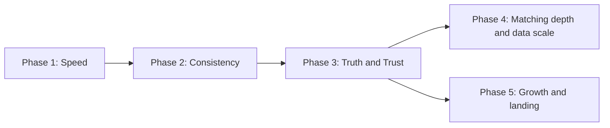
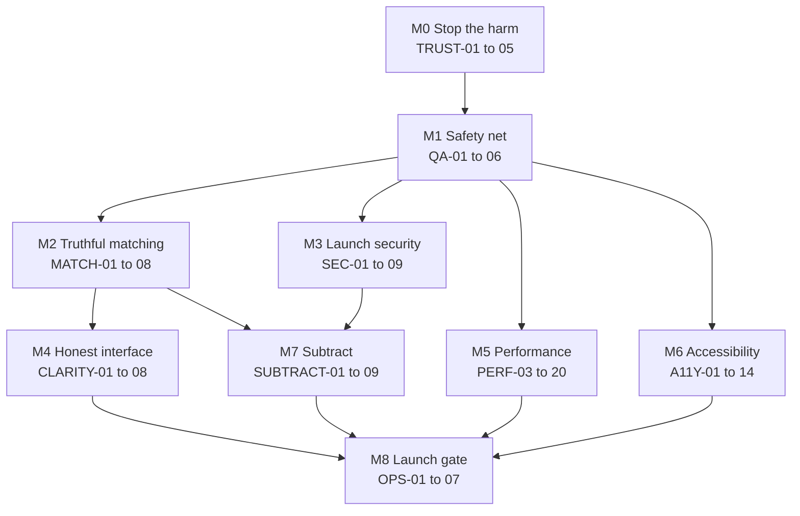
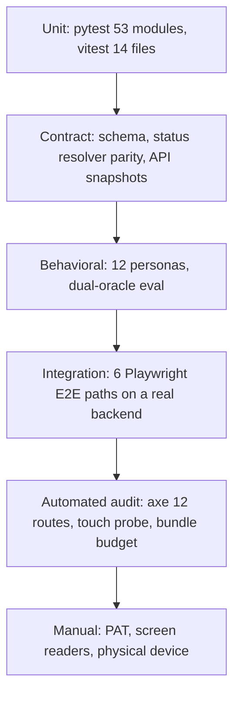

# ISKONNECT Phase 3 Master Plan
## Truth, Trust, and Launch Readiness

> **Status:** Proposed — awaiting approval
> **Created:** 2026-07-31
> **Supersedes:** the Phase 3 block of `ISKONNECT_PRODUCT_REFINEMENT_MASTER_PLAN.md` §20
> **Relationship to the original master plan:** the original document remains the canonical *long-range* roadmap and the source of task-ID semantics (Appendix A). This document is the canonical *Phase 3 execution* plan. Where the two disagree on Phase 3 sequencing, this document wins, and every deviation is justified in §4.3.
> **Rule:** no work is done in Phase 3 without a task ID from this document.

---

## Table of contents

1. [Executive summary](#1-executive-summary)
2. [Part I — Product Readiness Review](#part-i--product-readiness-review)
3. [Part II — Codebase audit](#part-ii--codebase-audit)
4. [Part III — Launch readiness assessment](#part-iii--launch-readiness-assessment)
5. [Part IV — Phase 3 strategy](#part-iv--phase-3-strategy)
6. [Part V — Milestones](#part-v--milestones)
7. [Part VI — Task catalog](#part-vi--task-catalog)
8. [Part VII — Definition of Done](#part-vii--definition-of-done)
9. [Part VIII — Exit criteria](#part-viii--exit-criteria)
10. [Part IX — Success metrics](#part-ix--success-metrics)
11. [Part X — Risk register](#part-x--risk-register)
12. [Part XI — QA strategy](#part-xi--qa-strategy)
13. [Part XII — Performance budgets](#part-xii--performance-budgets)
14. [Part XIII — Accessibility requirements](#part-xiii--accessibility-requirements)
15. [Part XIV — Product acceptance tests](#part-xiv--product-acceptance-tests)
16. [Part XV — Engineering acceptance tests](#part-xv--engineering-acceptance-tests)
17. [Part XVI — Monitoring requirements](#part-xvi--monitoring-requirements)
18. [Part XVII — Documentation requirements](#part-xvii--documentation-requirements)
19. [Part XVIII — Architecture decision records](#part-xviii--architecture-decision-records)
20. [Appendices](#appendices)

---

## 1. Executive summary

### 1.1 What this review found

Phase 1 made ISKONNECT **fast**. Phase 2 made it **consistent**. Both are genuinely complete and should not be reopened.

A full readiness review across product, UX, architecture, security, data quality, and matching accuracy found that the product's remaining weaknesses are **not** performance and **not** design. They are **correctness and honesty** — precisely the dimensions on which the product's entire value proposition rests.

Four defects are severe enough that they would damage student trust on day one, and all four are confirmed in code:

| # | Defect | Evidence | Consequence |
| --- | --- | --- | --- |
| 1 | A student who fills the profile builder **before** registering loses **all 41 fields** the moment they register | `AuthContext.tsx:255` calls `clearProfileDraft()`; `ProfileBuilderPage.tsx:66-74` resets state to step 1 on `AUTH_USER_CHANGED_EVENT` | Abandonment at the exact moment of conversion |
| 2 | A scholarship with **unknown** lifecycle status renders as **"Open now"** with an enabled **Apply** button | `scholarshipStatus.ts:120` returns `"open"` as the terminal fallback in `resolveApplicationStatus` | Student applies to a closed program; direct misinformation |
| 3 | Deadline comparison uses **server local date**, not Manila | `hard_filters.py:53` — `deadline_day < date.today()`; docstring claims Asia/Manila | On a UTC host, an expired scholarship reads as open for the first 8 hours of every Philippine day |
| 4 | Match percentage is shown prominently on cards, dashboard, and the analysis modal with **no non-guarantee disclaimer at the point of decision** | `ScholarshipCardV2.tsx:251-257`, `MatchAnalysisModal.tsx:139-140`; disclaimer exists only on the detail page and `/match-methodology` | Students read a fit score as an odds-of-winning score |

Underneath these sits a deeper design question: **eligibility fails open on unknowns**. Any requirement the system cannot evaluate becomes `UNKNOWN`, which becomes `provisionally_qualified`, which is still shown and still scored (`eligibility_result.py:852-865`, `88-90`). That is a defensible product choice, but it is currently invisible to the student and unmeasured in CI, because the eval oracle *also* fails open (`eval/oracle.py:9-11`) — so the 99.86% recall / 99.95% precision gate cannot detect over-inclusive matching on sparse real profiles.

### 1.2 What Phase 3 is

**Phase 3 is the truth phase.** Its thesis:

> A scholarship platform that is fast, beautiful, and accessible but occasionally wrong is worth less than one that is slower, plainer, and never lies. Every remaining task must make ISKONNECT more truthful, more honest about its own uncertainty, or safer to operate.

Phase 3 therefore reorders work by **risk to the student**, not by engineering category:



### 1.3 Shape of the work

Nine milestones, risk-ordered. Estimated **3-4 weeks** — longer than the original plan's 2-3 week Phase 3 estimate, because correctness work and a reduced persona suite have been pulled forward.

| Milestone | Theme | Why here |
| --- | --- | --- |
| **M0** | Stop the harm | Four confirmed defects that mislead or cost students data |
| **M1** | Safety net | Nothing risky ships without tests that can catch a regression |
| **M2** | Truthful matching | The core promise; fixes fail-open honesty and dead states |
| **M3** | Launch security and privacy | Config-dependent guards must not be the last line of defense |
| **M4** | Honest interface | Comprehension, disclaimers, jargon, error copy |
| **M5** | Performance and delivery | Mobile landing 67 to 90; backend hot paths |
| **M6** | Accessibility conformance | WCAG 2.2 AA closure |
| **M7** | Subtract | Remove what does not serve a student |
| **M8** | Launch readiness gate | Monitoring, docs, ADRs, acceptance tests, exit |

### 1.4 What is explicitly excellent and must not be rewritten

Naming these matters as much as naming the defects, because Phase 3 must not churn working systems.

- **Refresh-token rotation** — correct, atomic, and tested (`auth.py:198-225`, `test_api_flows.py`). Do not touch.
- **Cross-user authorization isolation tests** — `app/tests/test_authz_isolation.py` covers profile, application, and match-run IDOR. Rare at this stage. Extend, never replace.
- **RA 10173 posture** — a real data-export endpoint and a real cascade-deleting account-deletion endpoint already exist (`profiles.py:236-276`, `309-362`). Most products this age have neither.
- **Field-level provenance** — the `FieldEvidence` table with per-field `source_url`, snippet, and reviewer is the single best architectural decision in the codebase. It is the foundation of the entire trust proposition.
- **The eval harness and CI gate** — `eval/` plus `test_eval_regression.py` running on every push is genuinely strong engineering. It needs a second oracle mode (see `MATCH-02`), not a replacement.
- **Status guide copy** — `LIFECYCLE_STATUS_GUIDE` and `UI_ELIGIBILITY_GUIDE` in `scholarshipStatus.ts` are honest, student-oriented, and include a `whatToDo` for every state. This is model content. The problem is that it is under-surfaced, not that it is wrong.
- **The scholarship detail page trust surface** — verify-on-official-site banner, `TrustCard` field evidence, change history, and report-issue in one place. Excellent. The task is to propagate it, not rebuild it.
- **The honest `/success-stories` stub** — *"We don't publish student outcome stories yet"* instead of fabricated testimonials. This integrity is the product's brand. Protect it.
- **Student documents are external URLs only** — no server-side student file storage (`applications.py:504-506`). A large class of security and privacy risk was avoided by design.
- **Admin role read from the database, not the JWT claim** (`auth.py:300-319`) — the correct choice.
- **Phase 2 design tokens and primitives** — solid foundation. Phase 3 consumes them; it does not revisit them.

---

# Part I — Product Readiness Review

Fifteen lenses. Each records what is strong, what is weak, and the resulting Phase 3 task IDs.

## I.1 Product management

**Strong.** The product has a clear, defensible thesis (verified, explained, provenance-tracked scholarship data) and has repeatedly chosen honesty over growth theater — the empty success-stories page, the "not a guarantee" language, the published verification methodology.

**Weak.**

- **Catalog depth is unmeasured and probably the true launch blocker.** `seed_data.py` contains roughly 24 hand-crafted scholarships; the real catalog depends on CSV imports (`seed_demo_csvs.py`, `import_scholarships.py`) whose output is gitignored. The original master plan's own partnership gate (§19.2) requires **≥300 published listings with median verification age under 90 days**. No document in the repository records the current number. *A scholarship platform with 24 scholarships is a demo, not a product.* → `OPS-01`
- **Unlaunched verticals still ship.** Three tables (`hte_partners`, `internship_opportunities`, `ojt_compliance_vault`) exist with migrations and RLS but **zero API routes and zero frontend references**. → `SUBTRACT-03`
- **Two role-gated portals (sponsor, school) are built with unclear present demand.** They work, they are tested, and they are dead weight if no sponsor or school is onboarded before launch. → `SUBTRACT-06`
- **Feature surface exceeds validated need.** 37 frontend routes, of which 11 are unreachable from any navigation component.

## I.2 UX

**Strong.** Empty states are unusually good — every one audited explains *why* it is empty and offers a recovery action. The dashboard auto-runs a first match after profile completion, which is the right instinct.

**Weak.**

- **Profile draft destruction at registration** — the single worst UX defect in the product. → `TRUST-01`
- **41 profile fields across 5 steps with no per-step validation.** A student can reach step 5 entirely empty, then be rejected on save by a rule they never saw (`ProfileBuilderPage.tsx:218-237` requires consent, name, valid email, and region — none of which is enforced at the step where it is asked). → `CLARITY-05`
- **Completion percentage and save requirements disagree.** The progress meter measures one thing; the save gate measures another. A student at "100%" can still fail to save.
- **Mobile search buries the search input** under two full-width CTAs plus helper text (`ScholarshipSearchPage.tsx:181-231`). → `CLARITY-07`
- **"Check my match" returns a 0% shell** when the scholarship is not in the plan (`ScholarshipSearchPage.tsx:156-165`). A student reads 0% as "you have no chance," not "not yet calculated." → `TRUST-05`

## I.3 UI

**Strong.** Phase 2 delivered a real token layer, twenty primitives, and CI guards. Dark mode works. Touch targets pass at 0 violations.

**Weak.**

- **The design system is built but under-adopted.** `ui/dialog.tsx` has **zero consumers** — all seven feature modals still import `@radix-ui/react-dialog` directly, and three more overlays are hand-rolled with no focus trap at all.
- **Roughly 3,200 raw palette utilities remain** outside the CI-guarded paths, so the token layer is enforced on about 5% of the surface.
- **Two near-identical layout shells** (`DashboardLayout`, `AdaptiveSearchLayout`) with ~80% duplicated structure. → `SUBTRACT-04`

## I.4 Accessibility

**Strong.** Touch targets, contrast tokens with a unit test, reduced-motion handling, `aria-label` on most icon controls, and honest `role="alert"` usage on auth errors.

**Weak.**

- **No skip link**, and `DashboardLayout` / `AdaptiveSearchLayout` have **no `<main>` landmark at all** — content sits in a bare `div`. Keyboard users cannot bypass navigation on authenticated routes. → `A11Y-01`
- **Five different focus-ring patterns** across 19 files, plus widespread legacy `focus:ring-*` that fires on mouse click. → `A11Y-02`
- **Three modals with no focus trap** — `ScholarshipDetailPanel.tsx:54-63`, the report-issue modal, and the legacy filters overlay. → `A11Y-07`
- **`AutocompleteInput` is missing `role="combobox"`** despite having most other combobox ARIA. → `A11Y-09`
- **No axe in CI, no `eslint-plugin-jsx-a11y`.** → `QA-04`

## I.5 Software architecture

**Strong.** Clean layer separation (`api/` → `matching/` → `scoring/` → `taxonomy/`); eligibility centralized in a single authority (`eligibility_result.py`); serialization centralized; Alembic migrations disciplined and reversible.

**Weak.**

- **`ScoringEnginePort` has exactly one implementation.** Speculative generalization. → `SUBTRACT-07` (document the decision or inline it)
- **`Opportunity = Scholarship` alias** (`models.py:305`) exists for verticals that never launched.
- **Backend/frontend constant duplication with real drift.** Year levels are strings in the frontend and integers in the backend. Deadline-precision labels exist in both, with different strings, and the backend copy is never imported. → `SUBTRACT-05`
- **Three overlapping quality modules** — `quality_score.py`, `opportunity_quality.py`, `data_completeness.py`.
- **Two eligibility paths coexist** — `hard_filters.py` legacy helpers (`_income_matches` fails open on missing income) alongside the live `evaluate_eligibility`. Only one is used, but both are readable and could be reintroduced by mistake. → `SUBTRACT-08`

## I.6 Security

**Strong.** Refresh rotation, jti denylist design, per-endpoint rate limits on all nine auth routes, security-headers middleware, OpenAPI disabled in production, no `dangerouslySetInnerHTML`, no secrets in the client bundle, image uploads re-encoded through Pillow with EXIF stripped.

**Weak.** Full detail in §II.6.

- **Every production guard is conditional on `ENVIRONMENT=production`** (`config.py:171-173`), which **defaults to `development`**. A deploy that forgets one environment variable silently accepts the default `SECRET_KEY`, permits SQLite, and skips the `AUTH_DISABLED` block. → `SEC-01`
- **The access-token denylist is a silent no-op without Redis** (`auth.py:84-85`). Logout does not actually invalidate the access token in that configuration. → `SEC-02`
- **Access and refresh tokens both in `localStorage`**, with a 14-day refresh lifetime and no CSP. → `SEC-03`, `SEC-04`
- **Student emails written to logs in plaintext** (`profiles.py:375`, `405`, `421`). → `SEC-05`
- **`DELETE /profiles/me` has no rate limit.** → `SEC-06`

## I.7 Performance

**Strong.** Phase 1 removed a login round trip; Redis catalog cache with a 300s TTL; route-shaped skeletons; a cold-start banner that tells the truth instead of spinning.

**Weak.**

- **Mobile Lighthouse Performance is 67** on landing and search against a budget of 90.
- **813 KB main bundle**, no `manualChunks`, 22 pages eagerly imported.
- **4.7 MB of hero JPGs shipped but never referenced** — `heroImages.ts` points at SVGs.
- **764 KB of logo PNGs load on every page.**
- **`/plan` scores the entire catalog in Python on every request.** The SQL prefilter exists (`matches.py:35-51`) and is not wired in. No plan cache.
- **N+1 on `GET /applications`** (`applications.py:210-219`); no pagination on four list endpoints.
- **Every authenticated request hits the database** for the user row.

## I.8 Data quality

**Strong.** The provenance model is excellent: `FieldEvidence` per-field sourcing, `editorial_state` lifecycle, `link_status`, `last_verified_at`, `verification_source`, and a maintenance job that flags staleness at 30 days.

**Weak.**

- **Stale listings stay visible** with only a soft chip. A scholarship unverified for a year still appears.
- **`data_status`, `application_status`, `editorial_state`, and `is_active` are four overlapping state fields.** Understanding the catalog requires holding all four in your head. → `MATCH-07` (document the state machine), and consider consolidation in Phase 4.
- **The catalog quality report is gitignored**, so data quality is invisible in review.
- **Taxonomy is thin** — 10 broad disciplines and 4 hierarchy edges against a product goal of ~90 fields. HUMSS and TVL have no hierarchy bridge. School registry covers ~127 institutions; anything unmatched fails open.

## I.9 Scholarship matching accuracy

This is the product. Full analysis in §II.7.

**Strong.** Deterministic, explainable, weighted scoring (30/28/22/10/10) with renormalization for non-applicable factors; every match carries an explanation with a guaranteed fallback; a CI regression gate on recall, precision, false positives, and explanation coverage.

**Weak.**

- **Fail-open on `UNKNOWN`** is invisible to the student and unmeasured in CI. → `MATCH-01`, `MATCH-02`
- **The eval oracle also fails open**, so the gate cannot catch the failure mode that matters most. → `MATCH-02`
- **`almost_qualified` is a dead state.** `_derive_status` never returns it, yet it is in the enum, the API contract, the TypeScript types, and the badge component. → `MATCH-04`
- **Citizenship silently defaults to "Filipino"** (`eligibility_result.py:565`) rather than `UNKNOWN`. → `MATCH-05`
- **Geographic scoring uses substring city matching; eligibility uses exact matching.** The rank and the verdict can disagree. → `MATCH-06`
- **Scoring does not renormalize on missing data** — a student with no GWA still spends 30% of the score weight on a 0.3 placeholder, producing a confident-looking number built on nothing.

## I.10 Student trust

**Strong.** The detail page is a genuinely trustworthy surface. Verification badges, last-verified dates, and provider attribution appear on cards. The product refuses to fabricate social proof.

**Weak.** The trust surface is concentrated on one page and absent where decisions are actually made — the card, the dashboard match list, and the analysis modal. A student can go from landing to clicking Apply without ever seeing "verify this on the official site."

Plus the four M0 defects in §1.1.

## I.11 Maintainability

**Strong.** Consistent module boundaries, 53 backend test modules, real Alembic discipline, no TODO/FIXME/HACK markers anywhere in application source (a genuinely rare signal of care).

**Weak.** Six files over 400 lines including a 1,239-line `AdminPage.tsx`; duplicated layouts, banners, and constants; **zero coverage measurement in either language**; `V2` naming with no V1.

## I.12 Scalability

**Strong.** The prefilter query exists; JSONB GIN indexes are in place from migration 029; the catalog cache is shared through Redis; a `ScoringEnginePort` abstraction means the engine can be swapped.

**Weak.** Full-catalog Python scoring per request; per-row `MatchResult` inserts; a full-table Python distinct on the filter-values endpoint; four unpaginated list endpoints; no index on `provider`, `editorial_state`, `link_status`, or `last_verified_at`.

## I.13 Technical debt

The honest inventory is in Part II. Headline: **~25 unused API endpoints, 11 orphan routes, 3 unused tables, 7 unused npm packages, 2 dead dashboard cards, and 1 dead eligibility state.** None of it is catastrophic; all of it is drag.

## I.14 Engineering best practices

**Strong.** CI runs pytest, the eval gate, Alembic up/down/up against real Postgres, plus frontend lint, typecheck, test, and build. Deterministic seeds in the eval harness. Reversible migrations.

**Weak.** No coverage in either language; Playwright exists but is not in CI and only runs a touch probe; no axe; no jsx-a11y; no bundle budget; `pytest` sits in production `requirements.txt`.

## I.15 Long-term sustainability

**The single biggest sustainability risk is the maintainer, not the code.** `ContactPage.tsx` discloses a solo student developer. Against that reality:

- The 41-field profile builder, four overlapping catalog state fields, and six near-duplicate trust pages all carry ongoing cost with unclear return.
- The verification promise (30-day staleness flagging on a growing catalog) is **manual labor that scales linearly with the catalog**. This is the true scaling constraint — not CPU. → `OPS-02` must state the sustainable verification throughput honestly.
- Removing surface area is therefore not cleanup; it is survival. This is why **M7 (Subtract)** is a first-class milestone rather than a chore.

---

# Part II — Codebase audit

Everything below is evidence-based. Nothing here is fixed yet.

## II.1 Frontend route reachability

37 routes. **11 are unreachable from any of the five navigation components** (`Navbar`, `Footer`, `DashboardSidebar`, `BottomNav`, `DashboardTopbar`).

| Route | Reachability | Disposition |
| --- | --- | --- |
| `/success-stories` | **Zero inbound links anywhere** | Delete route, keep the honest stance in copy elsewhere |
| `/organizations/:slug` | **Zero inbound links anywhere** | Link from provider name on the detail page, or delete |
| `/design-system` | URL-only, dev reference | Gate to non-production builds |
| `/match-methodology` | Linked only from other content pages | Consolidate into `/transparency` |
| `/opportunities/:typeSlug` | Reachable only via the roadmap dialog | Keep — it is the honest "not yet" surface |
| `/changelog` | Settings only | Keep |
| `/match/:profileId`, `/match-compare` | Programmatic only | Keep |
| `/admin/analytics` | From `/admin` only | Keep |
| `/forgot-password`, `/reset-password`, `/verify-email` | Email/redirect only | Correct by design |

## II.2 API endpoint usage

23 router files. **~25 endpoints have no frontend consumer.**

| Cluster | Endpoints | Disposition |
| --- | --- | --- |
| Admin dashboards | `/admin/dashboard/health`, `/admin/dashboard/import`, `/admin/data-quality`, `/admin/staging/stats`, `/admin/scraper-runs/latest` | Wire into `/admin` or delete |
| Scoring admin | `GET`/`PUT /admin/scoring/weights` | No UI; weights are load-bearing — keep and document as ops-only |
| Audit | `GET /admin/audit/logs` | Keep; required for the RA 10173 story |
| Staging | `POST /scholarships/staging/import`, `GET .../diff` | Confirm CLI usage, then document or delete |
| Search | `GET /scholarships/search/semantic` | Unused; delete or document as a Phase 4 seam |
| Suggestions | `/suggestions/regions`, `/suggestions/readiness` | `regions` is unused **because the frontend hardcodes a static list** — this is the fix, not the endpoint |
| Profiles | `PUT /profiles/me`, `GET /profiles`, `GET /profiles/{id}` | `PUT` unused because the builder always POSTs — a real bug, see `SUBTRACT-05` |
| Saved | `GET /saved-scholarships/ids` | Delete |
| Applications | `GET /applications/{id}`, `POST /applications/{id}/remove` | Delete |

## II.3 Database surface

30 tables. **3 are entirely unused** — no route reads or writes them, and no frontend code references them:

- `hte_partners`
- `internship_opportunities`
- `ojt_compliance_vault`

All three arrived in `alembic/versions/025_sipp_ojt_compliance.py` with RLS in `027_rls_sipp_tables.py`.

## II.4 Duplication

| Duplication | Locations |
| --- | --- |
| `SavedScholarshipsErrorBanner` | Identical in `DashboardLayout.tsx` and `AdaptiveSearchLayout.tsx` |
| Auth-error dismiss banner | Same two files |
| Whole dashboard shell | ~80% structural overlap between the same two files |
| Notification time formatting | `DashboardTopbar.tsx` `formatNotifTime` duplicates `utils/formatDate.ts` |
| Status label maps | `frontend/src/utils/scholarshipStatus.ts` and `app/utils/application_status.py` — the backend comment literally says "match frontend keys" |
| Deadline precision labels | `formatDeadline.ts` and `app/taxonomy/profile_constants.py`, with different strings; the backend copy is never imported |
| Profile options | `constants/profileOptions.ts` versus `GET /suggestions/profile-options`, with the API used *and* a local fallback |
| Regions | `constants/regions.ts` (17 static) versus `app/taxonomy/regions.py` (aliases and normalization), whose endpoint is unused |
| FAQ content | `pages/FaqPage.tsx` and `components/landing/FaqSection.tsx` |

**Confirmed type drift:** year levels are **strings** in the frontend and **integers** in the backend.

## II.5 Dead code

**Frontend components with zero imports:** `dashboard/CareerRoadmapCard.tsx`, `dashboard/ReviewCenterFinderCard.tsx`, `SocialProofTicker.tsx` (plus its `marquee` keyframes).

**Frontend exports with zero consumers:** `lib/motion.ts` (the entire module), `ui/icon.tsx`, `formatDate`, `parseDateOnly`, `dataStatusToLifecycle` (already `@deprecated`).

**Unused npm packages:** `@tanstack/react-virtual`, `@radix-ui/react-accordion`, `@radix-ui/react-dropdown-menu`, `@radix-ui/react-popover`, `@radix-ui/react-scroll-area`, `@radix-ui/react-select`, `@radix-ui/react-toast`.

**Backend:** `equity_multipliers` and `max_equity_multiplier` in `scoring/config.py` are self-documented as unused by the engine. `pytest` is in production `requirements.txt`.

**Dead state:** `QualificationStatus.ALMOST_QUALIFIED` — reachable in the enum, the API, the TypeScript types, and `QualificationStatusBadge.tsx`, but **never produced** by `_derive_status`.

## II.6 Security findings

| ID | Severity | Finding | Evidence |
| --- | --- | --- | --- |
| S-01 | **Critical** | Production guards run only when `ENVIRONMENT` is prod/staging; the default is `development` | `config.py:27-29`, `171-178` |
| S-02 | **Critical** | Access-token denylist silently no-ops without Redis — logout does not invalidate the access token | `auth.py:84-85`, `96-97` |
| S-03 | **Critical** | Access **and** 14-day refresh tokens in `localStorage`; any XSS is a full account takeover | `AuthContext.tsx:18-19`, `108`, `117` |
| S-04 | High | No Content-Security-Policy on the API or the SPA | `security_headers.py:19` |
| S-05 | High | Password policy is 8 characters, no complexity, no breach check, no lockout | `auth_routes.py:51-56` |
| S-06 | High | Student emails logged in plaintext and stored in audit `details` | `profiles.py:375`, `405`, `421` |
| S-07 | High | `AUTH_DISABLED` bypasses profile access control and has **no test** | `auth.py:333-334`, `370-371` |
| S-08 | High | RLS is enabled with **no policies** and FastAPI connects as table owner, so RLS is bypassed entirely | `alembic/versions/020_enable_rls_public_tables.py:5-7` |
| S-09 | Medium | `DELETE /profiles/me` has no rate limit | `profiles.py:309-310` |
| S-10 | Medium | Email abuse caps disabled without Redis | `email_abuse.py:47-49` |
| S-11 | Medium | Account deletion leaves `ProductFeedback` and `AuditLog` PII | `profiles.py:309-362` |
| S-12 | Medium | Sample-matches sets `privacy_consent: True` without user action | `product_features.py:35` |
| S-13 | Medium | 7-day anonymous profile-read JWT grants full PII access if leaked | `profiles.py:87-88` |

## II.7 Matching correctness findings

| ID | Severity | Finding | Evidence |
| --- | --- | --- | --- |
| M-01 | **Critical** | Any `UNKNOWN` requirement yields `provisionally_qualified`, which is still shown and scored — fail open, invisible to the student | `eligibility_result.py:852-865`, `88-90` |
| M-02 | **Critical** | The eval oracle also fails open, so the CI gate structurally cannot detect over-inclusion on sparse profiles | `eval/oracle.py:9-11`, `93-94` |
| M-03 | **Critical** | Backend deadline comparison uses `date.today()`, not Manila, contradicting its own docstring | `hard_filters.py:39-53` |
| M-04 | High | `almost_qualified` is unreachable but present throughout the contract | `eligibility_result.py:852-865` |
| M-05 | High | Missing citizenship silently defaults to Filipino instead of `UNKNOWN` | `eligibility_result.py:565` |
| M-06 | High | Geographic **scoring** uses substring city match; **eligibility** uses exact match | `match_service.py:93-96` vs `eligibility_result.py:143-149` |
| M-07 | Medium | Provisional matches receive confident explanation text ("you meet the listed requirements") | `explanation.py:243-251` |
| M-08 | Medium | A null `application_deadline` can never be "passed", so undated expired programs look perpetually open | `hard_filters.py:40-41` |
| M-09 | Medium | Scoring renormalizes only for non-applicable factors, never for missing data — 30% of the score can rest on a 0.3 placeholder | `engine.py:34-45` |
| M-10 | Medium | Unmatched schools fail open on school-restricted scholarships | `school_registry.py:21-22` |
| M-11 | Medium | `needs_review` listings are penalized 35% but still shown | `match_service.py:169-176` |

## II.8 Largest files

| File | Lines |
| --- | --- |
| `frontend/src/pages/AdminPage.tsx` | 1,239 |
| `app/matching/eligibility_result.py` | 831 |
| `frontend/src/pages/ProfileDashboard.tsx` | 826 |
| `app/schemas.py` | 737 |
| `frontend/src/pages/ScholarshipDetailPage.tsx` | 699 |
| `frontend/src/components/layout/DashboardTopbar.tsx` | 481 |
| `app/api/v1/applications.py` | 452 |
| `app/api/v1/profiles.py` | 452 |

---

# Part III — Launch readiness assessment

Assume thousands of Filipino students arrive tomorrow.

| Question | Verdict | Reasoning |
| --- | --- | --- |
| **Would I trust this product?** | **Not yet** | It can show an expired scholarship as "Open now" with a working Apply button, and it destroys profile progress at registration. |
| **Would universities recommend it?** | Not yet | Institutions vet before endorsing. `AUTH_DISABLED` is untested, RLS has no policies, and student emails are in logs. |
| **Would scholarship providers recommend it?** | Cautiously yes | Provenance, official-link-out, and the published verification methodology are exactly what providers want. The risk is a listing misrepresented as open. |
| **Would students understand it?** | Partially | Status copy is excellent; the profile builder is jargon-dense (GWA, TVET, ALS, LOA, PSCED, 4Ps) with no glossary. |
| **Would first-time users succeed?** | **At elevated risk of failure** | 41 fields, no step validation, and total draft loss at registration. |
| **Could misinformation occur?** | **Yes, confirmed** | Unknown status renders as "Open now"; deadlines compare against the wrong calendar day. |
| **Could users misunderstand eligibility?** | **Yes, confirmed** | A prominent match percentage with no non-guarantee text at the point of decision, and "Qualified" reads as provider approval. |
| **Could users miss deadlines?** | **Yes** | An 8-hour daily timezone window plus reminders that are passive in-app only. |
| **Could users lose trust?** | **Yes** | One expired scholarship applied to in good faith is enough. |
| **Could support requests explode?** | **Yes** | Lost profiles, `VITE_API_BASE_URL` shown to students, silent match-run delete failures, and a Google-Drive-dependent documents flow. |
| **Could incorrect recommendations appear?** | **Yes, by design** | Fail-open on unknowns is intentional, but currently undisclosed and unmeasured. |

### The five biggest pre-launch risks

1. **Misinformation about scholarship status and deadlines** — `TRUST-02`, `TRUST-03`
2. **Profile data loss at registration** — `TRUST-01`
3. **Over-confident eligibility presentation** — `TRUST-04`, `MATCH-01`
4. **Security posture dependent on environment variables nobody validates** — `SEC-01`, `SEC-02`
5. **Catalog too small to be useful, and verification labor that does not scale** — `OPS-01`, `OPS-02`

### Launch recommendation

**Do not launch publicly until M0, M2, and M3 are complete and `OPS-01` reports a catalog of sufficient depth.** M4 through M8 improve quality; M0 through M3 prevent harm.

---

# Part IV — Phase 3 strategy

## IV.1 Principles

1. **Truth beats polish.** A defect that misleads outranks any performance or design task.
2. **Honest uncertainty beats false confidence.** Where the system does not know, it must say so — in the UI, in the API, and in the tests.
3. **Prove before you change.** Nothing risky ships until a test exists that would catch its regression.
4. **Subtract before you add.** Removal is a deliverable.
5. **Behavior-preserving means behavior-preserving.** Audit and refactor tasks change zero observable behavior.
6. **Every task carries an ID.** No ID, no merge.

## IV.2 What Phase 3 deliberately does not do

- No landing redesign (`LAND-*`) — Phase 5.
- No taxonomy expansion to ~90 fields (`DATA-01`…`DATA-06`) — Phase 4, and it depends on the persona suite.
- No new student-facing features. Not one.
- No revisiting Phase 1 or Phase 2 decisions.
- No React Query adoption unless `PERF-06a` measurement justifies it.

## IV.3 Deviations from the original master plan (each justified)

| Deviation | Justification |
| --- | --- |
| A **reduced persona suite (12 personas)** moves from Phase 4 into Phase 3 M1 | The audit shows matching correctness is the #1 trust risk. `MATCH-01` and `PERF-07` both change matching behavior and are unsafe without human-legible expectations. The **full 41-persona suite stays in Phase 4**; only the safety net moves. |
| **Security hardening is promoted** to its own milestone | Original §17.8 folded security into a general audit task. Three Critical findings warrant a milestone. |
| **Comprehension and copy work (M4)** partially pulls from Phase 5 `CONT-*` | Only the items that prevent *misunderstanding*, not the marketing rewrite. Trust copy at the point of decision is a correctness concern. |
| **`PERF-07` ships behind a flag** with eval-fixture parity, default off | R-02 is rated Critical. Full persona parity (`MATCH-08`) gates flipping the default in Phase 4. |
| **`AUDIT-16` (planned vs needed vs requested)** is promoted to milestone M7 | The audit found 25 unused endpoints, 11 orphan routes, and 3 unused tables. This is a decision milestone, not a documentation task. |
| Phase 3 estimated at **3-4 weeks**, not 2-3 | Correctness work plus a persona suite was not in the original estimate. |

## IV.4 Task ID scheme

| Prefix | Domain | Maps to original plan |
| --- | --- | --- |
| `TRUST-nn` | Student-facing correctness | new |
| `MATCH-nn` | Matching accuracy | §14 |
| `SEC-nn` | Security and privacy | §17.8 |
| `QA-nn` | Test and eval infrastructure | `AUDIT-12`, `AUDIT-13` |
| `CLARITY-nn` | Comprehension and honest interface | §16 `CONT-*` subset |
| `PERF-nn` | Performance | §12 (IDs preserved) |
| `A11Y-nn` | Accessibility | §13 (IDs preserved) |
| `SUBTRACT-nn` | Removal and consolidation | §17 `AUDIT-*` |
| `OPS-nn` | Monitoring, docs, launch | §12.7, §17.10 |

---

# Part V — Milestones



| ID | Name | Entry condition | Exit condition | Est. |
| --- | --- | --- | --- | --- |
| **M0** | Stop the harm | Phase 2 merged | All five `TRUST-*` shipped and manually verified on a real phone | 2-3 days |
| **M1** | Safety net | M0 merged | Coverage ratchets active, 5 E2E paths green in CI, axe reporting, 12 personas green | 4-5 days |
| **M2** | Truthful matching | M1 green | Fail-open disclosed and measured; `almost_qualified` resolved; timezone correct; dual-oracle eval passing | 4-5 days |
| **M3** | Launch security | M1 green | Zero Critical, zero High security findings open | 3-4 days |
| **M4** | Honest interface | M2 merged | Non-guarantee copy at every decision point; glossary live; no dev strings in student errors | 3-4 days |
| **M5** | Performance | M1 green | Every §XII budget met; mobile landing ≥ 90 | 4-5 days |
| **M6** | Accessibility | M1 green | axe hard-gate clean on 12 routes; keyboard and screen-reader passes documented | 3-4 days |
| **M7** | Subtract | M2 and M3 merged | Keep/defer/delete decision recorded for every unused surface; deletions executed | 3-4 days |
| **M8** | Launch gate | All above | Exit criteria in Part VIII satisfied | 2-3 days |

---

# Part VI — Task catalog

**Format convention.** P0 and P1 tasks receive a full specification block. P2 and P3 tasks are grouped into batch tables that share a strategy, risk profile, and rollback approach stated once for the batch — this keeps the plan actionable without padding.

**Complexity scale:** XS (< 2h), S (< 1d), M (1-2d), L (3-5d), XL (> 5d).

---

## M0 — Stop the harm

---

### `TRUST-01` — Preserve profile progress across registration

- **Objective.** A student who completes any part of the profile builder anonymously keeps every field after registering or signing in.
- **Why it matters.** This is the highest-severity defect in the product. It destroys work at the exact moment of conversion, and it is invisible to us because the student simply leaves.
- **Dependencies.** None. Ship first.
- **Affected files.** `frontend/src/contexts/AuthContext.tsx` (L255 in `register`, and the equivalent in `login`), `frontend/src/pages/ProfileBuilderPage.tsx` (L66-74), `frontend/src/components/profile-builder/profileBuilderState.ts`.
- **Implementation strategy.** Distinguish **identity change** from **identity acquisition**. Clearing the draft is correct when switching from user A to user B, and wrong when going from anonymous to user A. Emit the previous user id alongside the new one in `dispatchAuthUserChanged`; clear only when a *different* non-null previous id existed. On anonymous-to-authenticated, merge: server profile fields win where present, local draft fills the rest. Clear the draft on explicit logout.
- **Risks.** A merge could overwrite a server profile with a stale local draft.
- **Regression risks.** Draft persistence across account switching on a shared device — must still clear.
- **Acceptance criteria.**
  1. Fill 10+ fields anonymously, register, land on the builder with all 10 intact and on the same step.
  2. Same for sign-in with an existing account that has **no** server profile.
  3. Sign in with an account that **has** a server profile: server values win, local-only fields are merged, nothing is silently lost.
  4. Log out then log in as a different user: draft is cleared.
  5. Explicit logout clears the draft.
- **Testing.** Vitest for the merge reducer (all four transitions); Playwright E2E `anonymous builder → register → fields intact`.
- **Rollback.** Single behavioral flag around the merge branch; reverting restores current clear-always behavior.
- **Complexity.** M. **Priority.** **P0.**

---

### `TRUST-02` — Never present unknown lifecycle status as "Open now"

- **Objective.** When lifecycle status cannot be determined, the UI says so rather than defaulting to open, and the Apply action is not presented as if the program were accepting applications.
- **Why it matters.** Confirmed misinformation. `resolveApplicationStatus` terminally returns `"open"` (`scholarshipStatus.ts:120`), and cards enable Apply when `appStatus === "open"` (`ScholarshipCardV2.tsx:152-156`). A student can apply to a closed program because we told them it was open.
- **Dependencies.** None.
- **Affected files.** `frontend/src/utils/scholarshipStatus.ts` (`resolveApplicationStatus`), `frontend/src/components/ScholarshipCardV2.tsx`, `frontend/src/pages/ScholarshipDetailPage.tsx`, `app/utils/application_status.py` (mirror), `app/matching/match_service.py` (serialized status).
- **Implementation strategy.** Change the terminal fallback from `"open"` to `"needs_verification"`, whose copy already exists and is already honest: *"We are still confirming some details… Use it as a lead, but confirm all requirements and deadlines on the official provider website."* Apply remains available as a **link out** but is never labeled or styled as a confirmed-open call to action. Add a backend contract test asserting the same default so frontend and backend cannot drift.
- **Risks.** More listings will display `needs_verification`, which looks worse. **That is the correct outcome** — the alternative is looking better than we are. Quantify the shift in the report.
- **Regression risks.** Search timing filters and freshness chips read the same resolver; verify counts on `/scholarships/search?timing=open_now`.
- **Acceptance criteria.**
  1. A scholarship with null `application_status`, null `data_status`, and null `is_active` renders "Needs verification", never "Open now".
  2. No Apply control is styled as a primary confirmed action for a non-`open` status.
  3. Backend and frontend resolvers agree on all input permutations (contract test).
  4. The report records how many current catalog rows change status.
- **Testing.** Vitest table test over every permutation of the three inputs; pytest mirror; Playwright assertion on a seeded unknown-status listing.
- **Rollback.** Single-constant revert of the fallback value.
- **Complexity.** S. **Priority.** **P0.**

---

### `TRUST-03` — Compare deadlines against the Philippine calendar day

- **Objective.** All deadline-passed logic evaluates against Asia/Manila regardless of server timezone.
- **Why it matters.** `hard_filters.py:53` uses `date.today()` while its own docstring claims Asia/Manila. Render runs UTC. Between 00:00 and 08:00 Manila time every day, a scholarship that closed yesterday still evaluates as open. For a Philippines-only product, this is a correctness bug with a daily eight-hour blast radius. The frontend already does this correctly (`formatDate.ts` uses `Asia/Manila`), so backend and frontend actively disagree.
- **Dependencies.** None.
- **Affected files.** `app/utils/timezone.py` (add `today_manila()`), `app/matching/hard_filters.py`, `app/matching/temporal_state.py`, `app/jobs/catalog_maintenance.py`, any other `date.today()` / `datetime.now()` call in matching or maintenance.
- **Implementation strategy.** Add `today_manila() -> date` in `app/utils/timezone.py` using the existing `PH_TZ`. Replace every naive today/now in matching and catalog maintenance. Grep for `date.today()` and `datetime.now()` across `app/` and justify every remaining use.
- **Risks.** Some listings flip to `deadline_passed` immediately on deploy. That is the bug being fixed; note the count.
- **Regression risks.** Eval fixtures with dates near today may shift; the eval gate must be re-baselined deliberately, not silently.
- **Acceptance criteria.**
  1. With `TZ=UTC` and a frozen clock at 2026-08-01 01:00 Manila (2026-07-31 17:00 UTC), a deadline of 2026-07-31 evaluates as **passed**.
  2. No naive `date.today()` remains in `app/matching/` or `app/jobs/`.
  3. Backend and frontend agree on deadline-passed for the same listing at the same instant.
  4. Eval gate green, with any threshold change explicitly reviewed.
- **Testing.** pytest with frozen time at the UTC/Manila boundary in both directions; a parity test comparing backend `deadline_passed` with the frontend rule for a fixture set.
- **Rollback.** `today_manila()` is a single function; revert restores prior behavior.
- **Complexity.** S. **Priority.** **P0.**

---

### `TRUST-04` — Non-guarantee disclosure at every decision point

- **Objective.** Wherever a match score or qualification badge appears, the student also sees that this is ISKONNECT's estimate and the provider decides.
- **Why it matters.** The disclaimer exists — on the detail page, `/match-methodology`, and Terms. It is absent exactly where students decide: the card, the dashboard match list, and the analysis modal, which announces *"{N}% overall match"* with no qualifier.
- **Dependencies.** None. Coordinate copy with `CLARITY-01`.
- **Affected files.** `frontend/src/components/ScholarshipCardV2.tsx`, `frontend/src/components/MatchAnalysisModal.tsx`, `frontend/src/components/MatchScoreRing.tsx`, `frontend/src/pages/ProfileDashboard.tsx`, `frontend/src/pages/MatchResultsPage.tsx`, `frontend/src/components/QualificationStatusBadge.tsx`.
- **Implementation strategy.** One shared `MatchConfidenceNote` component so the wording exists in exactly one place. On cards, a compact form ("Estimate — provider decides"). In the modal and match results, the full sentence plus a link to `/transparency`. Give `MatchScoreRing` an accessible name that states what the number means rather than just the number. Add a tooltip or expandable definition to `QualificationStatusBadge`.
- **Risks.** Visual clutter on an already dense card. Mitigate with the compact variant and a single placement rule.
- **Regression risks.** Card height changes could affect virtualized or grid layouts; verify at 360 px.
- **Acceptance criteria.**
  1. Every surface displaying a score or qualification badge renders the note without interaction.
  2. Wording lives in one module; no duplicated disclaimer strings.
  3. The note is announced by screen readers, not `aria-hidden`.
  4. Verified at 360 px in both themes with no overflow.
- **Testing.** Vitest presence assertions per surface; axe on affected routes; visual check at five widths.
- **Rollback.** Component-level revert.
- **Complexity.** S. **Priority.** **P0.**

---

### `TRUST-05` — Distinguish "not calculated" from "zero match"

- **Objective.** When a scholarship is not in the student's computed plan, the UI says the match has not been calculated — never 0%.
- **Why it matters.** `ScholarshipSearchPage.tsx:156-165` fabricates `{ score: 0 }`. A student reads 0% as "you have no chance." We have told them something false about their eligibility.
- **Dependencies.** None.
- **Affected files.** `frontend/src/pages/ScholarshipSearchPage.tsx`, `frontend/src/components/MatchAnalysisModal.tsx`.
- **Implementation strategy.** Make the modal accept an explicit `notCalculated` state instead of a synthesized zero. Offer the recovery action — run a match, or complete the profile — rather than a number.
- **Risks.** None material.
- **Regression risks.** Modal open path from search must still work for scholarships that *are* in the plan.
- **Acceptance criteria.**
  1. Checking a scholarship outside the plan shows "Not calculated yet" with a recovery action, never 0%.
  2. Scholarships inside the plan are unaffected.
  3. A genuine computed score of 0 remains distinguishable from not-calculated.
- **Testing.** Vitest for both states; Playwright on the search-to-modal path.
- **Rollback.** Single-component revert.
- **Complexity.** XS. **Priority.** **P0.**

---

## M1 — Safety net

---

### `QA-01` — Real backend in CI

- **Objective.** CI runs the application end to end: Postgres, migrations, uvicorn, and a seeded deterministic test user.
- **Why it matters.** Every subsequent milestone changes behavior students depend on. Playwright currently boots only the frontend dev server, so no authenticated path can be tested. Without this, M2 and M5 are unsafe.
- **Dependencies.** None.
- **Affected files.** `.github/workflows/ci.yml`, new `frontend/e2e/fixtures/seed.ts` or a backend seeding command, `app/scripts/` seed entry point.
- **Implementation strategy.** Add a Postgres service to the existing frontend CI job, run `alembic upgrade head`, seed a fixed test user plus a small deterministic catalog covering open, closed, needs-verification, and unknown-status listings, start uvicorn, and wait on `/health` before Playwright. Set `PLAYWRIGHT_BASE_URL` against a preview build rather than dev for realistic timing.
- **Risks.** CI time increases. Cap with a small seed catalog and parallel jobs.
- **Regression risks.** A flaky backend makes CI untrustworthy, which is worse than no E2E. Enforce health-check gating and one retry.
- **Acceptance criteria.**
  1. CI provisions Postgres, migrates, seeds, and serves the API.
  2. Seed data is deterministic and includes an unknown-status listing for `TRUST-02`.
  3. Total CI wall time stays under 15 minutes.
  4. Three consecutive green runs with no flakes before merge.
- **Testing.** The workflow is the test; verify by running it three times.
- **Rollback.** The job is additive; disable it without affecting existing gates.
- **Complexity.** M. **Priority.** **P0.**

---

### `QA-02` — Five end-to-end smoke paths

- **Objective.** The five journeys that define the product are verified on every push.
- **Why it matters.** These are the paths where a regression is unacceptable, and three of them touch code that M0 through M5 will change.
- **Dependencies.** `QA-01`.
- **Affected files.** `frontend/playwright.config.ts`, `frontend/e2e/*.spec.ts`.
- **Implementation strategy.** Add a `desktop-chrome` project beside the existing `mobile-chrome`. Implement: (1) register → build profile → dashboard shows matches; (2) login → dashboard → open a match explanation; (3) public search → filter → open detail; (4) save a scholarship → appears in saved; (5) theme toggle persists across reload. Add a sixth guarding `TRUST-01`: anonymous builder → register → fields intact.
- **Risks.** Flakiness. Use role-based selectors, never CSS classes; explicit waits, never sleeps.
- **Regression risks.** None — additive.
- **Acceptance criteria.** All six paths green on both projects; zero flakes over three consecutive runs; total suite under 6 minutes.
- **Testing.** Self-verifying.
- **Rollback.** Additive.
- **Complexity.** L. **Priority.** **P0.**

---

### `QA-03` — Coverage ratchets in both languages

- **Objective.** Coverage is measured and can only go up.
- **Why it matters.** Neither language measures coverage today. M7 deletes code; a ratchet is what proves deletion did not remove tested behavior.
- **Dependencies.** None.
- **Affected files.** `requirements.txt`, new `pytest.ini`, `frontend/package.json`, `frontend/vite.config.ts`.
- **Implementation strategy.** Add `pytest-cov` and create `pytest.ini` (none exists) with `--cov=app --cov-fail-under=<measured baseline>`. Add `@vitest/coverage-v8` with thresholds at the measured baseline. Record both in the milestone report. **Set thresholds at the measured value, not an aspiration** — a ratchet that fails on day one gets disabled.
- **Risks.** Coverage becomes a number to game. Mitigate by pairing with the persona suite, which measures behavior rather than lines.
- **Regression risks.** Ratchet blocks an urgent fix. Document a single-PR override requiring a stated follow-up (see R-15).
- **Acceptance criteria.** Both baselines recorded in `docs/engineering/reports/QA-03-report.md`; CI fails on a deliberate coverage decrease; override procedure documented.
- **Testing.** Verify by deliberately deleting a test and confirming CI fails.
- **Rollback.** Lower or remove thresholds.
- **Complexity.** S. **Priority.** **P1.**

---

### `QA-04` — axe on 12 routes plus jsx-a11y

- **Objective.** Accessibility regressions are caught automatically.
- **Why it matters.** M6 closes fourteen accessibility items; without automation they reopen within a month.
- **Dependencies.** `QA-01` (authenticated routes need a backend).
- **Affected files.** `frontend/e2e/a11y.spec.ts`, `frontend/eslint.config.js`, `frontend/package.json`.
- **Implementation strategy.** Add `@axe-core/playwright` scanning `/`, `/login`, `/register`, `/scholarships/search`, `/scholarship/:id`, `/faq`, `/scholarship-status`, `/how-it-works`, `/dashboard`, `/profile-builder`, `/settings`, `/applications`. **Reporting-only in M1**; flipped to hard-fail in M6 once violations are fixed. Add `eslint-plugin-jsx-a11y` as warnings on legacy paths and errors on `src/components/ui/**`.
- **Risks.** A hard gate before fixes would block all work — hence the two-stage rollout.
- **Regression risks.** None while reporting-only.
- **Acceptance criteria.** All 12 routes scanned; the baseline violation count is recorded; lint runs clean at the configured severities.
- **Testing.** Self-verifying.
- **Rollback.** Additive.
- **Complexity.** M. **Priority.** **P1.**

---

### `QA-05` — Reduced persona suite (12 personas)

- **Objective.** Twelve named, human-legible student personas with expected inclusions, expected exclusions, and expected eligibility status, green in CI.
- **Why it matters.** This is the safety net for `MATCH-01`, `MATCH-05`, `MATCH-06`, and `PERF-07` — every one of which changes who sees which scholarship. The synthetic eval measures aggregate statistics against an oracle that shares the system's fail-open assumption; it cannot answer *"does Maria, a Grade 11 public-school 4Ps student in Region V, still see the scholarships a human expects?"* Nothing else in the codebase can answer that.
- **Scope discipline.** The original plan specifies 41 personas in Phase 4. **Twelve** are pulled forward — the minimum covering each risk class. The remaining 29 stay in Phase 4.
- **Dependencies.** None; blocks M2 and `PERF-07`.
- **Affected files.** New `app/tests/fixtures/persona_catalog.json`, new `app/tests/test_persona_matching.py`, new `docs/engineering/matching-personas.md`.
- **Implementation strategy.** Build a fixture catalog of ~40 scholarships spanning all six `application_status` values, `needs_review`, merit/need/hybrid, region- and school-restricted, all three GWA scales, every income bracket boundary, members-only, and TVET/graduate-only. Define 12 personas covering: incoming freshman (STEM, low income), senior high 4Ps, private-university mid-income, TVET trainee with no GWA, ALS completer with no GWA, graduate student, income exactly at a ceiling, high income merit-only, GWA scale conversion equivalence, missing-GWA provisional, school-restricted match and near-miss, and region-restricted exclusion. Assert three layers: expected inclusions with rationale, expected exclusions with the named disqualifying requirement, and expected eligibility status per named fixture. Ranking assertions are **relative only**, never absolute scores.
- **Risks.** Personas encode our current assumptions and could enshrine a bug. Mitigate by writing `matching-personas.md` for **non-engineer review** and requiring sign-off before the suite becomes a gate.
- **Regression risks.** None — additive.
- **Acceptance criteria.**
  1. 12 personas, all green.
  2. Every expectation carries a one-line human rationale.
  3. `matching-personas.md` is readable by someone who cannot read Python.
  4. A deliberate mutation (invert one income comparison) fails at least three personas — proving the suite has teeth.
- **Testing.** The suite is the test; the mutation check validates it.
- **Rollback.** Additive.
- **Complexity.** L. **Priority.** **P0.**

---

### `QA-06` — Bundle size budget in CI

- **Objective.** Bundle regressions fail the build.
- **Why it matters.** M5 reduces the bundle; without a gate it grows straight back.
- **Dependencies.** None.
- **Affected files.** `.github/workflows/ci.yml`, `frontend/package.json`, new `scripts/check-bundle-budget.mjs`.
- **Implementation strategy.** After `npm run build`, measure gzip sizes of the entry chunk and the largest route chunk and compare against Part XII. Fail on exceedance. Print a size table on every run so reviewers see the trend.
- **Risks.** None material.
- **Regression risks.** None — additive.
- **Acceptance criteria.** CI prints the table; a deliberate 50 KB import fails the build.
- **Testing.** Verify with a temporary heavy import.
- **Rollback.** Additive.
- **Complexity.** S. **Priority.** **P1.**

---

## M2 — Truthful matching

---

### `MATCH-01` — Disclose provisional eligibility honestly

- **Objective.** When a match is provisional because something is unknown, the student is told **which** requirement is unverified and **what to do about it** — in the API and the UI.
- **Why it matters.** Fail-open is a reasonable product choice: excluding a student because their profile is incomplete would be worse. But presenting a fail-open result as a match, with a confident explanation and a large percentage, is not honest. This is the difference between *"we think you may qualify, but we could not check your GWA"* and *"you match."* The entire trust proposition rests on this sentence.
- **Dependencies.** `QA-05`.
- **Affected files.** `app/matching/eligibility_result.py`, `app/matching/match_service.py`, `app/scoring/explanation.py`, `app/schemas.py`, `frontend/src/components/ScholarshipCardV2.tsx`, `frontend/src/components/MatchAnalysisModal.tsx`, `frontend/src/components/QualificationStatusBadge.tsx`, `frontend/src/types.ts`.
- **Implementation strategy.** Additive API change: expose `unverified_requirements: string[]` and `provisional_reason: string` on the match result, derived from the `UNKNOWN` checks already computed inside `_derive_status`. The data exists; it is discarded. Surface it as "We could not verify: your GWA, your school" with a direct link to the profile field. Fix `explanation.py:243-251` so the generic confident fallback is never used for a provisional result.
- **Risks.** Matches look weaker. This is accurate, not a regression.
- **Regression risks.** Explanation coverage is an eval gate metric; ensure provisional explanations still count as covered.
- **Acceptance criteria.**
  1. Every `provisionally_qualified` result names at least one unverified requirement.
  2. No provisional result carries the "you meet the listed requirements" fallback.
  3. Each named requirement links to the profile field that would resolve it.
  4. Response fields are additive; no field removed or renamed.
  5. All 12 personas still green.
- **Testing.** pytest per requirement type; Vitest for UI rendering; persona suite; eval gate.
- **Rollback.** Fields are additive; the UI can hide them with one flag.
- **Complexity.** M. **Priority.** **P0.**

---

### `MATCH-02` — Second eval oracle mode (strict)

- **Objective.** The eval harness runs a second oracle that fails **closed** on unknowns, producing a measured over-inclusion rate.
- **Why it matters.** The current oracle grants benefit of the doubt on missing student data (`eval/oracle.py:9-11`), exactly as the engine does. Two systems sharing an assumption cannot check each other. Today's 99.86% recall does not prove the engine is not over-including; it proves the engine and the oracle agree. This is the most important structural gap in the test strategy.
- **Dependencies.** `QA-05`.
- **Affected files.** `eval/oracle.py`, `eval/run_eval.py`, `app/tests/test_eval_regression.py`, `docs/engineering/matching-personas.md`.
- **Implementation strategy.** Parameterize the oracle with `unknown_policy: "lenient" | "strict"`. Run both. Lenient keeps the existing thresholds unchanged. Strict produces a new reported metric — **over-inclusion rate** — recorded as a **baseline with no threshold in Phase 3**, because we do not yet know the right number. Phase 4 sets the threshold once real data exists. Also generate profiles with realistic sparsity, not only complete ones.
- **Risks.** Adding a metric without a threshold can be ignored. Mitigate by requiring it in the exit report and in every matching PR.
- **Regression risks.** Do not change existing lenient thresholds in this task.
- **Acceptance criteria.**
  1. Both oracle modes run in CI.
  2. Over-inclusion rate is reported and recorded in `perf-baseline.md` and the exit report.
  3. Existing thresholds unchanged and still green.
  4. Sparse-profile generation covers missing GWA, missing income, missing region, and missing school.
- **Testing.** Eval harness self-verifies; assert both modes produce output.
- **Rollback.** Strict mode is additive and non-gating.
- **Complexity.** M. **Priority.** **P0.**

---

### `MATCH-04` — Resolve `almost_qualified`

- **Objective.** Either implement `almost_qualified` or remove it from the enum, the API, the types, and the UI. No dead state remains in the contract.
- **Why it matters.** A state that appears in the API contract, the TypeScript types, and a badge component but is never produced is a lie in the schema. It also wastes the most useful UX opportunity in the product: telling a student they are one requirement away.
- **Dependencies.** `QA-05`.
- **Affected files.** `app/matching/eligibility_result.py`, `app/api/v1/match_history.py`, `app/schemas.py`, `frontend/src/types.ts`, `frontend/src/components/QualificationStatusBadge.tsx`, new `docs/engineering/adr/ADR-006-almost-qualified.md`.
- **Implementation strategy.** **Recommendation: implement it.** Define it precisely as *exactly one applicable requirement is `UNMET` and that requirement is achievable by the student* (GWA, documents, year level) rather than immutable (region, citizenship, school). Return it from `_derive_status` before `NOT_ELIGIBLE`. Show these as a distinct "Almost — one requirement away" group with the named requirement. If implementation is deferred, **delete the state everywhere** and record why. Either way, write the ADR.
- **Risks.** Widening the shown set could surface scholarships a student truly cannot get. Mitigate with the achievable/immutable distinction and a separate visual group that never mixes with qualified results.
- **Regression risks.** `passes_for_matching` semantics change; the persona suite must assert the boundary explicitly.
- **Acceptance criteria.**
  1. `almost_qualified` is either produced by `_derive_status` **or** absent from every layer.
  2. If implemented: never returned for an immutable-requirement failure.
  3. If implemented: displayed in a distinct group, never merged with qualified matches.
  4. ADR-006 written.
  5. Persona suite covers both the almost and the not-eligible boundary.
- **Testing.** pytest per requirement class; persona assertions; Vitest for the badge; eval gate.
- **Rollback.** Behind a config flag defaulting off until the persona suite is green.
- **Complexity.** M. **Priority.** **P1.**

---

### `MATCH-05` — Treat missing citizenship as unknown

- **Objective.** Absent citizenship yields `UNKNOWN`, not an assumed "Filipino".
- **Why it matters.** `eligibility_result.py:565` defaults to Filipino. For a Philippines-focused product this is *usually* right, which is what makes it dangerous — it silently converts a fact we do not have into a fact we assert, and the student is never asked.
- **Dependencies.** `QA-05`, `MATCH-01` (so the unknown is disclosed rather than merely downgrading the result).
- **Affected files.** `app/matching/eligibility_result.py`, `frontend/src/components/profile-builder/PersonalInfoStep.tsx`.
- **Implementation strategy.** Return `UNKNOWN` when citizenship is absent. Because `MATCH-01` now names unverified requirements, the student sees "We could not verify: your citizenship" with a link to the field. Add citizenship to the profile builder if it is not already collected there.
- **Risks.** More results become provisional. Correct.
- **Regression risks.** Every Filipino-restricted scholarship shifts status for profiles lacking the field. Quantify in the report.
- **Acceptance criteria.** Missing citizenship yields `UNKNOWN`, never `MET`; the field is collectible in the builder; personas green; the report states how many results changed status.
- **Testing.** pytest; persona suite; eval both oracle modes.
- **Rollback.** One-line revert.
- **Complexity.** XS. **Priority.** **P1.**

---

### `MATCH-06` — Reconcile geographic scoring with geographic eligibility

- **Objective.** One city-matching rule shared by scoring and eligibility.
- **Why it matters.** Scoring uses substring matching (`match_service.py:93-96`); eligibility uses exact matching (`eligibility_result.py:143-149`). A student can be ranked highly for location fit on a scholarship whose location requirement they fail. The explanation and the verdict contradict each other.
- **Dependencies.** `QA-05`.
- **Affected files.** `app/matching/match_service.py`, `app/matching/eligibility_result.py`, `app/taxonomy/regions.py`.
- **Implementation strategy.** Promote the eligibility rule (`cities_match`) to the single authority and have scoring call it. Where substring matching was genuinely catching real-world variants ("Quezon City" versus "Quezon"), encode those as **explicit aliases** in `regions.py` rather than as accidental substring behavior.
- **Risks.** Some previously high-scoring geographic matches drop. Correct.
- **Regression risks.** Region-restricted personas must be asserted before and after.
- **Acceptance criteria.** One shared function; no substring city matching remains in scoring; alias cases covered by tests; personas green; eval reviewed.
- **Testing.** pytest for the alias table; persona assertions; eval both modes.
- **Rollback.** Revert scoring to the prior helper.
- **Complexity.** S. **Priority.** **P1.**

---

### Batch: `MATCH-03`, `MATCH-07`, `MATCH-08`, `MATCH-09`

**Shared strategy.** Behavior-preserving clarity work on the matching contract. **Shared risks:** low; each is documentation or a narrow rule change. **Shared rollback:** per-task revert; none is load-bearing. **Shared testing:** persona suite plus eval both modes must stay green.

| ID | Title | Objective | Files | Acceptance | Cx | Pri |
| --- | --- | --- | --- | --- | --- | --- |
| `MATCH-03` | Null deadline is not "open forever" | A listing with no deadline and a stale verification is not presented as actively open | `hard_filters.py:40-41`, `temporal_state.py` | Null deadline plus verification older than the staleness threshold resolves to `needs_verification` | S | P1 |
| `MATCH-07` | Document the catalog state machine | One diagram reconciling `is_active`, `editorial_state`, `data_status`, `application_status` | new `docs/engineering/catalog-state-machine.md` | Every state combination is either documented as valid or flagged as impossible; contradictions listed for Phase 4 | S | P1 |
| `MATCH-08` | Prefilter parity test | Prove the `PERF-07` prefilter returns identical ordered results | `app/tests/test_plan_prefilter_parity.py` | Identical id order and scores across all eval fixtures and all 12 personas, flag on and off | M | P0 |
| `MATCH-09` | Renormalize score weights on missing data | A score built on placeholders must not look confident | `app/scoring/engine.py:34-45`, `components.py` | Either renormalize away missing components or expose a `score_confidence` field; the choice is recorded in an ADR | M | P2 |

---

## M3 — Launch security and privacy

---

### `SEC-01` — Fail closed on unsafe configuration

- **Objective.** The application refuses to start in an unsafe configuration regardless of whether `ENVIRONMENT` was set correctly.
- **Why it matters.** Every production guard is gated on `ENVIRONMENT` being one of prod/staging/production (`config.py:171-173`), and the default is `development`. A deploy that forgets that one variable silently accepts the placeholder `SECRET_KEY`, permits SQLite, allows `AUTH_DISABLED`, and skips the Redis requirement. **The security posture depends on remembering an environment variable.** That is not a security posture.
- **Dependencies.** None.
- **Affected files.** `app/config.py`, `app/main.py`, `app/tests/test_config_guards.py` (new), `.env.example`, `docs/deployment.md`.
- **Implementation strategy.** Invert the default: treat unset or unrecognized `ENVIRONMENT` as **production** for validation purposes, requiring an explicit `ENVIRONMENT=development` to relax. Additionally, make the dangerous conditions self-detecting regardless of environment: refuse to start if `SECRET_KEY` equals the known placeholder **and** the bind address is not loopback. Log a single loud startup line stating the resolved environment and which guards are active.
- **Risks.** A misconfigured dev machine now fails to start. Mitigate with an actionable error naming the exact variable to set.
- **Regression risks.** CI and local development must set `ENVIRONMENT=development`; update `.env.example`, the README, and the CI workflow in the same change.
- **Acceptance criteria.**
  1. With `ENVIRONMENT` unset and the placeholder `SECRET_KEY`, startup fails with an actionable message.
  2. `ENVIRONMENT=development` preserves current developer experience.
  3. Guards are covered by tests, including an explicit `AUTH_DISABLED` rejection test (closing S-07).
  4. Startup logs the resolved environment and active guards.
- **Testing.** pytest across the configuration matrix — unset, development, production, and production with each dangerous default individually.
- **Rollback.** Revert the default-resolution function; guards return to opt-in.
- **Complexity.** S. **Priority.** **P0.**

---

### `SEC-02` — Token revocation must not silently no-op

- **Objective.** Logout always invalidates the access token, or the deployment refuses to run.
- **Why it matters.** `_access_token_revoked` returns `False` when Redis is absent (`auth.py:96-97`), so logout leaves the access token valid for up to 30 minutes. The failure is silent — logs show a successful logout. A student logging out on a shared computer is a realistic and common scenario in the Philippines.
- **Dependencies.** `SEC-01`.
- **Affected files.** `app/auth.py`, `app/config.py`, `app/tests/test_auth_revocation.py` (new).
- **Implementation strategy.** Make Redis a hard requirement whenever authentication is enabled outside local development (enforced by `SEC-01`'s validator). If Redis is unreachable at runtime, log at error severity and fail the revocation check **closed** — treat the token as revoked rather than valid. Add the integration test that does not currently exist: log in, log out, and assert the old access token is rejected.
- **Risks.** A Redis outage logs everyone out. That is the correct trade for a security control; document it in the runbook.
- **Regression risks.** Tests that run without Redis must explicitly opt into the development path.
- **Acceptance criteria.**
  1. Post-logout access token is rejected (integration test).
  2. Missing Redis in a deployed environment fails startup.
  3. Runtime Redis failure fails closed and logs at error severity.
  4. Password reset revokes sessions (existing behavior, now covered).
- **Testing.** pytest integration with a Redis service in CI; a failure-injection test for the unreachable path.
- **Rollback.** Revert the fail-closed branch; startup requirement is independent.
- **Complexity.** S. **Priority.** **P0.**

---

### `SEC-03` — Content-Security-Policy

- **Objective.** A CSP on the SPA that meaningfully constrains script execution.
- **Why it matters.** Access and refresh tokens live in `localStorage` with a 14-day lifetime. React escaping is currently the *only* XSS mitigation. CSP is the compensating control that makes `SEC-04`'s risk acceptance defensible.
- **Dependencies.** None.
- **Affected files.** `frontend/index.html` or the hosting configuration (`vercel.json`), `app/middleware/security_headers.py`, `docs/deployment.md`.
- **Implementation strategy.** Set CSP at the **SPA hosting layer**, not the API, which is why it is currently absent — the existing comment correctly notes that `/docs` needs a permissive policy. Start in `Content-Security-Policy-Report-Only`, measure, then enforce. Restrict `script-src` to self, `object-src` to none, `base-uri` to self, `frame-ancestors` to none, and `connect-src` to self plus the API origin and Sentry. Self-hosted fonts from Phase 2 mean no external font origin is needed.
- **Risks.** A too-strict policy breaks Sentry or the service worker. Report-only first is the mitigation.
- **Regression risks.** PWA and Sentry must be verified explicitly.
- **Acceptance criteria.**
  1. Report-only deployed and observed with zero legitimate violations.
  2. Enforcing policy shipped.
  3. No `unsafe-eval`; any `unsafe-inline` is justified in writing.
  4. Sentry, the service worker, and the API all function under enforcement.
- **Testing.** Playwright smoke under the enforcing policy; manual console-violation check on all 12 axe routes.
- **Rollback.** Revert to report-only with one header change.
- **Complexity.** M. **Priority.** **P1.**

---

### `SEC-04` — Token storage decision (ADR)

- **Objective.** A written, reviewed decision on `localStorage` versus HttpOnly cookies.
- **Why it matters.** This is an architectural decision with real trade-offs — cookies require CSRF protection and complicate the cross-origin Vercel-to-Render setup. It should be **decided and documented**, not defaulted into. Rewriting authentication during a launch-hardening phase carries its own risk.
- **Dependencies.** `SEC-03`.
- **Affected files.** New `docs/engineering/adr/ADR-008-token-storage.md`; implementation only if the ADR selects migration.
- **Implementation strategy.** Document three options: (a) keep `localStorage` with CSP plus a shortened refresh TTL; (b) migrate to HttpOnly Secure SameSite cookies with CSRF tokens; (c) hybrid — access token in memory, refresh in an HttpOnly cookie. Include effort, blast radius, and residual risk for each. **Recommended for Phase 3: option (a) plus reduce refresh TTL from 14 days to 7**, with option (c) scheduled for Phase 4. Rationale: CSP delivers most of the mitigation at a fraction of the risk during launch hardening.
- **Risks.** Deferring feels like accepting risk. It is — explicitly, in writing, with a date.
- **Regression risks.** A shortened refresh TTL means more frequent re-login; verify the session-expiry path preserves the intended destination.
- **Acceptance criteria.** ADR-008 written with all three options costed; the selected option implemented; refresh TTL change (if selected) covered by tests; residual risk stated with a review date.
- **Testing.** pytest for the TTL change; E2E for session expiry and return-to-destination.
- **Rollback.** TTL is a configuration value.
- **Complexity.** S (ADR plus TTL) / L (if cookie migration selected). **Priority.** **P1.**

---

### Batch: `SEC-05` through `SEC-09`

**Shared strategy.** Each closes a specific finding from §II.6 with a narrow, well-understood change. **Shared risks:** low. **Shared regression risk:** logging and deletion changes must not break the audit trail required for RA 10173. **Shared rollback:** per-task revert. **Shared testing:** pytest per task, plus a security checklist re-run at M8.

| ID | Finding | Objective | Files | Acceptance | Cx | Pri |
| --- | --- | --- | --- | --- | --- | --- |
| `SEC-05` | S-06 | Remove PII from logs | `profiles.py:375,405,421`, `auth_routes.py:147,155`, `request_logger.py` | No email, name, or address in any log line; audit `details` stores a user id, never an email; a log-scrub test asserts it | S | P1 |
| `SEC-06` | S-09 | Rate-limit account deletion | `profiles.py:309` | `@limiter.limit` applied; test asserts the limit | XS | P1 |
| `SEC-07` | S-05 | Strengthen password policy | `auth_routes.py:51-56`, `RegisterPage.tsx`, `ResetPasswordPage.tsx` | Minimum 10 characters with a common-password denylist; a 72-byte bcrypt maximum enforced; identical client and server rules; clear, non-scolding error copy | S | P1 |
| `SEC-08` | S-11, S-12 | Complete the erasure path; fix consent assertion | `profiles.py:309-362`, `product_features.py:35` | Deletion removes or anonymizes `ProductFeedback` and redacts PII from `AuditLog` details while preserving the audit record; sample-matches no longer asserts consent the user did not give | M | P1 |
| `SEC-09` | S-08 | Decide the RLS posture | `alembic/versions/020`, `docs/supabase_rls_blueprint.sql`, new ADR-009 | Written decision: either apply real policies for defense in depth or document that FastAPI is the sole enforcement layer, with a compensating control named | S | P2 |

---

## M4 — Honest interface

---

### `CLARITY-01` — Student-safe error copy

- **Objective.** No student ever sees a developer-facing string.
- **Why it matters.** `ProfileDashboard.tsx:115-117` shows *"Check that the API is running and VITE_API_BASE_URL matches your backend."* A student concludes the product is broken. This single string probably generates more support contacts than any other.
- **Dependencies.** None.
- **Affected files.** `frontend/src/pages/ProfileDashboard.tsx`, `frontend/src/pages/MatchResultsPage.tsx`, `frontend/src/api/client.ts`, `frontend/src/components/ErrorBoundary.tsx`, new `frontend/src/constants/errorCopy.ts`.
- **Implementation strategy.** One `errorCopy.ts` module mapping error class to student-facing copy, each with exactly one recovery action. Distinguish four cases the product already knows how to detect: offline, server unreachable, cold start (the existing `ApiWarmupBanner` already handles this honestly and well), and validation. Keep the technical detail in the console and in Sentry, never on screen. Add a lint rule or CI grep banning `VITE_`, `localhost`, and `undefined` in user-visible strings.
- **Risks.** Losing diagnostic detail for support. Mitigate with a short correlation id shown to the student and logged.
- **Regression risks.** Existing error tests assert current copy; update them.
- **Acceptance criteria.**
  1. No `VITE_`, `API_BASE_URL`, `localhost`, `undefined`, or `null` in any rendered string.
  2. All four error classes have distinct copy and exactly one recovery action.
  3. Every error is announced to assistive technology.
  4. CI grep guard active.
- **Testing.** Vitest per error class; Playwright with the API stopped; axe on the error state.
- **Rollback.** Constants module revert.
- **Complexity.** S. **Priority.** **P1.**

---

### `CLARITY-02` — Inline glossary for unavoidable terms

- **Objective.** Every term a Grade 11 student may not know is explained where it is used.
- **Why it matters.** The profile builder asks for GWA, TVET, ALS, LOA, 4Ps, and PSCED. A student who guesses produces a wrong profile, which produces wrong matches, which is a data-quality problem disguised as a copy problem. This is the cheapest accuracy improvement available.
- **Dependencies.** None.
- **Affected files.** New `frontend/src/constants/glossary.ts`, new `frontend/src/components/GlossaryTerm.tsx`, profile-builder step components, `ScholarshipDetailPage.tsx`, `ScholarshipSearchFilters.tsx`.
- **Implementation strategy.** A `GlossaryTerm` component rendering the term with an accessible definition — a `<button>` with `aria-describedby` and a popover, not a `title` attribute, which is unusable on touch. Expand on first use per page. Include Filipino-language glosses where a Tagalog term is clearer than the English one. Replace the raw `eligible_courses_psced` field label on the detail page with plain language.
- **Risks.** Over-annotation becomes noise. Limit to first use per page and to a curated list.
- **Regression risks.** Layout shift inside form labels; verify at 360 px.
- **Acceptance criteria.**
  1. GWA, TVET, ALS, LOA, 4Ps, PSCED, SUC, LUC, HEI, CHED, DOST-SEI, TESDA, LGU all have definitions.
  2. Definitions are keyboard-accessible and screen-reader-announced.
  3. No raw backend field names appear in student-facing copy.
  4. Verified at 360 px.
- **Testing.** Vitest for the component; axe; manual keyboard pass.
- **Rollback.** Component renders plain text if disabled.
- **Complexity.** M. **Priority.** **P1.**

---

### Batch: `CLARITY-03` through `CLARITY-08`

**Shared strategy.** Each removes a specific comprehension or expectation risk found in the UX audit. **Shared risks:** copy changes can alter meaning — every change is reviewed against the existing `LIFECYCLE_STATUS_GUIDE` wording, which is already good and must not be degraded. **Shared regression risk:** status copy is consumed by `/scholarship-status`, which renders the same source. **Shared rollback:** per-task revert. **Shared testing:** Vitest snapshot of copy constants plus a manual read-through at 360 px.

| ID | Title | Objective | Files | Acceptance | Cx | Pri |
| --- | --- | --- | --- | --- | --- | --- |
| `CLARITY-03` | Fix "Deadline clear" | Remove a label that reads as "still open" but means "more than 30 days away" | `ProfileDashboard.tsx:638-640` | Label states the actual meaning, e.g. "Over 30 days left" | XS | P1 |
| `CLARITY-04` | Explain the match score in student language | The score ring states what it measures | `MatchScoreRing.tsx`, `MatchAnalysisModal.tsx` | An accessible name and visible caption state "eligibility fit, not chance of winning" | XS | P1 |
| `CLARITY-05` | Per-step validation in the profile builder | A student cannot reach step 5 only to be rejected by a step-1 rule | `ProfileBuilderPage.tsx`, profile-builder steps | Fields required for save are validated at the step where they are asked; Next explains what is missing; consent is requested where it is required | M | P1 |
| `CLARITY-06` | Align completion percentage with save requirements | The meter and the save gate measure the same thing | `profileBuilderState.ts` | 100% implies saveable; also fixes the pre-existing `profileBuilderState.test.ts` failure (96 vs 100) | S | P1 |
| `CLARITY-07` | Mobile search reachability | The search input is above the fold at 360 px | `ScholarshipSearchPage.tsx:181-231` | Search input visible without scrolling on a 360x640 viewport; at most one primary CTA above it | S | P2 |
| `CLARITY-08` | Replace the register-page tagline | First impression matches a financial-aid product | `RegisterPage.tsx:61-63` | Copy is warm and serious; no meme phrasing | XS | P2 |

---

## M5 — Performance and delivery

**Batch strategy.** These retain their original master-plan IDs and definitions (§12). **Shared risks:** performance work can change behavior; every task in this milestone is gated by the `QA-02` E2E suite. **Shared regression risk:** lazy-loading and chunk splitting can break route transitions. **Shared rollback:** per-commit revert; `PERF-07` additionally behind a flag. **Shared testing:** E2E suite, bundle budget, and a Lighthouse re-run per merged task.

| ID | Title | Key detail from the audit | Acceptance | Cx | Pri |
| --- | --- | --- | --- | --- | --- |
| `PERF-19` | Remove dead weight | 7 unused npm packages; `SocialProofTicker`; 2 dead dashboard cards; `lib/motion.ts`; `ui/icon.tsx` | Removed with evidence; bundle shrinks measurably | S | P1 |
| `PERF-18` | Image optimization | **4.7 MB of hero JPGs shipped but unreferenced**; 764 KB of logo PNGs on every page; most `` lack dimensions | Hero converted to AVIF/WebP with `srcset` or deleted; logos under 60 KB; every `` has width and height; CLS ≤ 0.05 | M | **P0** |
| `PERF-11` | Bundle split and budgets | 813 KB main chunk; no `manualChunks`; 22 eager pages | `manualChunks` for vendor, Sentry, framer-motion, Radix; marketing and legal pages lazy; budgets in Part XII met | M | P1 |
| `PERF-20` | PWA cache audit | Update flow unverified | A new deploy cannot serve a stale shell; no authenticated response is cached | S | P1 |
| `PERF-03` | Optimistic shell | No cached user descriptor | Returning user shell renders before `/auth/me`; **cached data is presentational only and never an authorization input** (R-14) | M | P1 |
| `PERF-05` | Prefetch on intent | Zero prefetch handlers | Dashboard chunk prefetched from login; hover prefetch guarded by `saveData` | S | P2 |
| `PERF-06` | Single-wave dashboard bootstrap | `/plan` and `/match-runs/{id}` serialized behind `/profiles/me` | At most two serialized waves; login to dashboard content ≤ 1.5 s warm p75 | M | P1 |
| `PERF-06a` | Client-cache ADR | Decision not recorded | ADR-005 with a measured bundle delta; adopt only if it reduces both code and round trips | S | P2 |
| `PERF-07` | SQL prefilter, flagged | Prefilter exists at `matches.py:35-51`, unwired | Behind `PLAN_PREFILTER_ENABLED` default **off**; `MATCH-08` parity green; ADR-007 written | M | P1 |
| `PERF-08` | Plan cache | No plan cache | Redis, keyed by profile fingerprint plus catalog and policy version, TTL 10 min, invalidated on profile and catalog change | M | P1 |
| `PERF-12` | N+1 and pagination | `applications.py:210-219`; 4 unpaginated endpoints | Single `IN` query; pagination added with **current behavior preserved as page 1** | M | P1 |
| `PERF-13` | Filter values in SQL | Full-table Python distinct | SQL distinct plus 10-minute cache; p95 ≤ 300 ms | S | P1 |
| `PERF-14` | Indexes and hosting | No index on provider, editorial_state, link_status, last_verified_at | `EXPLAIN ANALYZE` **before** each index; no speculative indexes; costed hosting recommendation written | M | P2 |
| `PERF-15` | Authenticated user cache | DB hit per request | 60 s Redis cache with correct invalidation; **must not weaken the jti denylist** (R-14) | M | P2 |
| `PERF-16` | Bulk match-result insert | Per-row inserts | Single bulk insert; retention threshold documented | S | P2 |
| `PERF-01` | Instrumentation closeout | Only login is instrumented | `Server-Timing` phases on `/plan`, search, applications, match-runs; `parseServerTiming` wired into the client; Sentry measurements; `perf-baseline.md` before/after complete | M | P1 |

---

## M6 — Accessibility conformance

**Batch strategy.** Retains original §13.1 IDs. **Shared risks:** modal migration can change focus behavior. **Shared regression risk:** the seven raw Radix modals and three hand-rolled overlays have differing current behavior; migrate one per commit. **Shared rollback:** per-modal, per-surface revert. **Shared testing:** axe on all 12 routes, keyboard-only pass, and screen-reader verification per Part XIII.

| ID | Title | Audit finding | Acceptance | Cx | Pri |
| --- | --- | --- | --- | --- | --- |
| `A11Y-01` | Skip link and `<main>` | **`DashboardLayout` and `AdaptiveSearchLayout` have no `<main>` at all** | `<main id="main-content">` in all three shells; skip link is the first focusable element | S | **P0** |
| `A11Y-02` | Uniform focus ring | 5 patterns across 19 files plus legacy `focus:ring-*` | One `focus-visible:ring-ring` treatment everywhere; no `outline: none` without a replacement | M | P1 |
| `A11Y-07` | Dialog focus management | 3 hand-rolled overlays with no focus trap; `ui/dialog.tsx` has zero consumers | All 10 dialogs use the shared wrappers; focus enters, is trapped, and returns; Escape closes; background inert | L | **P0** |
| `A11Y-08` | Form semantics | Missing `aria-invalid` and `aria-describedby`; no `inputMode` on numeric fields | Error summary on submit failure with focus moved to it; numeric fields use `inputMode="numeric"`; every field labelled | M | P1 |
| `A11Y-09` | Combobox pattern | `AutocompleteInput` missing `role="combobox"` | Full ARIA combobox including result-count announcement; provider autocomplete in filters fixed too | M | P1 |
| `A11Y-10` | Live regions | Search results are not announced | Polite announcements for result counts, filter application, save/unsave, and match completion | S | P1 |
| `A11Y-05` | Headings and landmarks | `SplitLayout` has no landmarks | One `h1` per page; no skipped levels; landmarks correct | S | P1 |
| `A11Y-14` | Non-color meaning and names | Collapsed sidebar and account menu use `title` only | Every icon-only control has an accessible name; no status conveyed by color alone | S | P1 |
| `A11Y-03` | Contrast closure | Token-level fixes only | Zero AA failures; `contrast-pairs.json` extended | S | P1 |
| `A11Y-12` | Zoom and reflow | Unverified | Usable at 200%; no two-dimensional scrolling at 400% (320 px equivalent) | S | P1 |
| `A11Y-13` | Screen-reader passes | None documented | NVDA, VoiceOver, and TalkBack on five flows — **or an explicit written record of which platforms were unavailable.** Do not claim coverage that was not performed (R-08) | M | P1 |
| `A11Y-04`, `A11Y-06`, `A11Y-11` | Targets, keyboard, motion | Largely satisfied by Phase 2 | Verified and recorded, not rebuilt | S | P2 |

---

## M7 — Subtract

---

### `SUBTRACT-01` — Keep, defer, or delete decision for every unused surface

- **Objective.** A written decision, with one line of rationale, for all 11 orphan routes, ~25 unused endpoints, and 3 unused tables.
- **Why it matters.** The maintainer is one person (`ContactPage.tsx`). Every retained surface is permanent cost. This document, not intuition, decides what survives — and it must be produced before anything is deleted.
- **Dependencies.** M2 and M3 merged, so decisions are made with correctness work settled.
- **Affected files.** New `docs/engineering/codebase-audit-2026Q3.md`.
- **Implementation strategy.** Three columns per item — **planned** (built), **needed** (serves a current student goal), **requested** (users asked) — plus a keep/defer/delete decision. Named candidates: `/success-stories`, `/organizations/:slug`, `/design-system`, `/match-methodology`, `/match-compare`, `/planner/:profileId`, sponsor and school portals, the SIPP/OJT tables, and the four overlapping trust pages.
- **Risks.** Deleting something with a non-obvious consumer (R-04).
- **Regression risks.** Deferred to the per-deletion tasks.
- **Acceptance criteria.** Every item in §II.1 through §II.3 has a decision and a rationale; the document is reviewable by a non-engineer; deletions are scheduled as explicit tasks.
- **Testing.** Not applicable — this is a decision artifact.
- **Rollback.** Not applicable.
- **Complexity.** M. **Priority.** **P1.**

---

### Batch: `SUBTRACT-02` through `SUBTRACT-09`

**Shared strategy.** Every deletion follows the same protocol, which is non-negotiable per R-04: (1) grep including dynamic string construction, (2) full test suite green, (3) the `QA-02` E2E suite green, (4) a route smoke pass, (5) one logical deletion per commit. **Shared risk:** a non-obvious consumer. **Shared rollback:** `git revert` of the single deletion commit. **Shared testing:** full suite plus E2E per commit.

| ID | Title | Scope | Acceptance | Cx | Pri |
| --- | --- | --- | --- | --- | --- |
| `SUBTRACT-02` | Delete dead frontend code | `CareerRoadmapCard`, `ReviewCenterFinderCard`, `SocialProofTicker` and `marquee`, `lib/motion.ts`, `ui/icon.tsx`, `formatDate`, `parseDateOnly`, `dataStatusToLifecycle` | Removed with grep evidence; bundle shrinks | S | P1 |
| `SUBTRACT-03` | Remove the unlaunched SIPP/OJT vertical | `hte_partners`, `internship_opportunities`, `ojt_compliance_vault` plus their schemas | Reversible down-migration with a backup note; **no column dropped without it**; zero references remain | M | P1 |
| `SUBTRACT-04` | Unify the dashboard shell | `DashboardLayout` and `AdaptiveSearchLayout` share ~80% structure; the error banner is duplicated verbatim | One shared shell and one shared banner component; **zero visual change** verified at five widths | M | P1 |
| `SUBTRACT-05` | One source of truth for profile options | `profileOptions.ts` versus the API; **year levels are strings in the frontend and integers in the backend** | The API is canonical; the static fallback is removed or generated; the type mismatch is fixed; `PUT /profiles/me` is either used by the builder or deleted | M | P1 |
| `SUBTRACT-06` | Decide on the sponsor and school portals | Built, tested, role-gated, unclear demand | Decision recorded: launch, feature-flag off, or remove. If flagged off, the routes and nav entries are hidden and the tests remain | S | P2 |
| `SUBTRACT-07` | Resolve speculative abstractions | `ScoringEnginePort` has one implementation; `Opportunity = Scholarship` | Either a written justification naming the second implementation, or inlined | S | P2 |
| `SUBTRACT-08` | Remove the legacy eligibility path | `hard_filters.py` legacy helpers that fail open differently from the live path | Dead helpers deleted so they cannot be reintroduced by mistake | S | P1 |
| `SUBTRACT-09` | Consolidate the trust pages | Six overlapping pages: about, why, how-it-works, transparency, match-methodology, FAQ | Merged with redirects preserving inbound links; no factual disclosure lost — verified by content diff | M | P2 |

---

### `SUBTRACT-10` — Decompose oversized modules

- **Objective.** Split the eight largest files by responsibility with **zero behavior change**.
- **Why it matters.** `AdminPage.tsx` at 1,239 lines is the single largest maintenance liability. For a solo maintainer this is the difference between a fifteen-minute fix and an afternoon.
- **Dependencies.** `QA-02` and `QA-03` — decomposition without tests is a rewrite.
- **Affected files.** `AdminPage.tsx` (1,239), `eligibility_result.py` (831), `ProfileDashboard.tsx` (826), `schemas.py` (737), `ScholarshipDetailPage.tsx` (699), `DashboardTopbar.tsx` (481), `applications.py` (452), `profiles.py` (452).
- **Implementation strategy.** One file per commit. `AdminPage` splits into per-tab modules under `src/features/admin/`. `ProfileDashboard` splits into section components plus one bootstrap hook. `eligibility_result.py` splits per requirement evaluator with the decision logic kept in one place — **`_derive_status` must remain a single readable function**, since it is the trust contract.
- **Risks.** A large diff hides a behavior change.
- **Regression risks.** Any behavior change here is a correctness regression in matching or admin operations.
- **Acceptance criteria.** No file over 400 lines among the listed set, or a written justification; every test unchanged and green; E2E green; **no diff in API responses for a fixture set, verified by snapshot**.
- **Testing.** Full suite plus E2E per commit; API response snapshots before and after.
- **Rollback.** Per-file revert.
- **Complexity.** L. **Priority.** **P2.**

---

## M8 — Launch readiness gate

| ID | Title | Objective | Acceptance | Cx | Pri |
| --- | --- | --- | --- | --- | --- |
| `OPS-01` | **Catalog readiness report** | Measure and publish the real catalog: total published, verified within 90 days, by region, by education level, by provider | `docs/engineering/catalog-readiness.md` states the counts. **A recommendation on whether the catalog is deep enough to launch is required** — this may be the real launch blocker | S | **P0** |
| `OPS-02` | Verification capacity statement | State honestly how many listings one person can verify per week and what that implies for catalog growth and the 30-day staleness promise | A written throughput number and its implications; a decision on whether the staleness SLA is achievable | S | P1 |
| `OPS-03` | Monitoring and alerting | Per Part XVI | Alerts wired for the four launch-critical signals with a named recipient | M | P1 |
| `OPS-04` | Documentation reconciliation | `architecture.md`, README, CONTRIBUTING, `design-system.md`, deployment runbook | Every document matches reality; the deployment runbook lists every required environment variable and its failure mode | M | P1 |
| `OPS-05` | ADR directory | Per Part XVIII | ADR-001 through ADR-009 exist | S | P1 |
| `OPS-06` | Product and engineering acceptance tests | Execute Parts XIV and XV | Both signed off; blockers triaged | M | **P0** |
| `OPS-07` | Phase 3 exit report | Evidence for every exit criterion | `docs/engineering/reports/PHASE-3-EXIT-report.md` complete | S | P1 |

---

# Part VII — Definition of Done

## VII.1 Universal — every task

- [ ] Acceptance criteria demonstrably met, with evidence in the pull request
- [ ] `pytest app/tests/` green, including the eval regression gate **and the 12-persona suite**
- [ ] `npm run lint`, `typecheck`, `test`, `build` green
- [ ] `npx playwright test` green — all six E2E paths
- [ ] Coverage ratchet not decreased
- [ ] Bundle budget not exceeded
- [ ] Alembic up → down → up green if the schema changed
- [ ] No public API field removed or renamed without a deprecation window
- [ ] Verified at 360, 390, 768, 1024, and 1440 px in both themes (UI tasks)
- [ ] Keyboard-only operation verified with visible focus (UI tasks)
- [ ] axe: zero serious or critical violations on touched routes
- [ ] Documentation updated where behavior or architecture changed; ADR written for architectural decisions
- [ ] Pull request states: what changed, blast radius, verification performed, rollback plan

## VII.2 Additional for trust and matching tasks

- [ ] All 12 personas green, with the diff reviewed if any expectation changed
- [ ] Eval gate green in **both** oracle modes; the over-inclusion rate recorded
- [ ] Any change in the number of results shown to a student is **quantified and stated** in the report
- [ ] No student-facing copy asserts more certainty than the underlying data supports

## VII.3 Additional for security tasks

- [ ] A test exists that fails if the control is removed
- [ ] The failure mode is documented in the deployment runbook
- [ ] No change to bcrypt cost, refresh rotation, or the jti denylist without a security-reviewed ADR

## VII.4 Additional for removal tasks

- [ ] Grep evidence including dynamically constructed references
- [ ] Route smoke pass performed and recorded
- [ ] One logical deletion per commit
- [ ] Reversible migration plus a backup note for any database change

---

# Part VIII — Exit criteria

Phase 3 is complete when **all** of the following are true and evidenced in `PHASE-3-EXIT-report.md`.

### Trust and correctness
1. All five `TRUST-*` tasks shipped and verified on a physical Android device.
2. No student-facing surface presents unknown data as confirmed.
3. Deadline evaluation is Manila-correct in backend and frontend, proven by a boundary test.
4. Every scored surface displays non-guarantee copy without interaction.
5. `almost_qualified` is either produced or fully removed, with ADR-006.

### Matching accuracy
6. 12 personas green in CI, with `matching-personas.md` reviewed by a non-engineer.
7. Both eval oracle modes run; the over-inclusion rate is recorded as a baseline.
8. A mutation check proves the persona suite detects a deliberate scoring bug.
9. Every `provisionally_qualified` result names at least one unverified requirement.

### Security and privacy
10. Zero Critical and zero High findings from §II.6 remain open.
11. The application fails to start in an unsafe configuration, covered by a test.
12. Post-logout access-token rejection is proven by an integration test.
13. No PII in logs, verified by an automated check.

### Quality infrastructure
14. Six E2E paths green in CI with a real backend; zero flakes over three consecutive runs.
15. Coverage ratchets active in both languages with baselines recorded.
16. axe hard-gates on 12 routes with zero serious or critical violations.
17. Bundle budget enforced in CI.

### Performance
18. Every budget in Part XII met.
19. Lighthouse mobile landing Performance ≥ 90 (from a baseline of 67).
20. `/plan` p95 warm ≤ 800 ms.
21. Bundle smaller than the Phase 2 exit measurement.

### Accessibility
22. All §XIII items closed or explicitly documented as not verifiable with available hardware.
23. Screen-reader passes documented for the platforms that were available.
24. 200% zoom and 400% reflow verified.

### Subtraction
25. `codebase-audit-2026Q3.md` records a decision for every unused surface.
26. Approved deletions executed with evidence.
27. No file among the eight listed exceeds 400 lines without a written justification.

### Launch readiness
28. `catalog-readiness.md` published with a launch recommendation.
29. Monitoring live for all four launch-critical signals.
30. Product and engineering acceptance tests signed off with zero open blockers.

---

# Part IX — Success metrics

## IX.1 Leading — measurable at Phase 3 exit

| Metric | Baseline | Target | Source |
| --- | --- | --- | --- |
| Lighthouse mobile Performance, landing | 67 | ≥ 90 | `benchmarks/` |
| Lighthouse mobile Performance, search | 67 | ≥ 85 | `benchmarks/` |
| Lighthouse Accessibility, all audited routes | 90-96 | ≥ 95 | `benchmarks/` |
| axe serious/critical violations, 12 routes | unmeasured | 0 | CI |
| Main bundle, gzip | ~813 KB raw | ≤ 180 KB entry | CI |
| `/plan` p95 warm | unmeasured | ≤ 800 ms | `Server-Timing` |
| Backend coverage | unmeasured | baseline, ratcheting | pytest-cov |
| Frontend coverage | unmeasured | baseline, ratcheting | vitest |
| Persona suite | 0 | 12 green | CI |
| Eval over-inclusion rate, strict oracle | unmeasured | recorded | eval |
| Open Critical or High security findings | 3 Critical, 5 High | 0 | §II.6 |
| Unused API endpoints | ~25 | decided, and deleted where agreed | audit |
| Files over 400 lines | 8 | 0, or justified | audit |

## IX.2 Lagging — measurable after launch

| Metric | Why | Instrument |
| --- | --- | --- |
| Profile completion rate | Directly tests `TRUST-01` and `CLARITY-05` | analytics |
| Drop-off step in the builder | Locates remaining friction | analytics |
| Share of matches that are provisional | Quantifies fail-open reality | backend metric |
| Reports of incorrect listings per 1,000 sessions | The single best trust proxy | `POST /reports` |
| Support contacts per 100 new users | Tests `CLARITY-01` and `CLARITY-02` | contact form |
| Outbound clicks to official provider sites | Delivered value to providers | `OPS-03` |
| Median verification age of shown listings | Tests the `OPS-02` promise | backend metric |

## IX.3 Anti-metrics — must not improve at the cost of truth

- **Matches shown per student.** Increasing this by loosening eligibility is a failure, not a win.
- **Match score averages.** Rising averages caused by placeholder defaults are a regression.
- **Listings labelled "Open now".** A drop after `TRUST-02` is the intended outcome.

---

# Part X — Risk register

| ID | Risk | L | I | Mitigation | Owner task |
| --- | --- | --- | --- | --- | --- |
| R-01 | `TRUST-02` makes many listings show "Needs verification", damaging perceived quality | High | Medium | Quantify the shift; pair with `OPS-01`; **being accurate beats looking good** | `TRUST-02`, `OPS-01` |
| R-02 | `PERF-07` prefilter silently changes match results | Medium | **Critical** | Flag default off; `MATCH-08` parity across all fixtures and personas; instant revert | `PERF-07`, `MATCH-08` |
| R-03 | The 12 personas encode a current bug as expected behavior | Medium | High | `matching-personas.md` written for non-engineer review and signed off before gating | `QA-05` |
| R-04 | Deleting code with a non-obvious consumer | Medium | Medium | Grep including dynamic strings; E2E; one deletion per commit | `SUBTRACT-*` |
| R-05 | Fail-open disclosure makes the product look weak, prompting a reversal | Medium | High | Frame provisional as a **prompt to complete the profile**, not a failure; measure completion lift | `MATCH-01` |
| R-06 | `SEC-01` fail-closed startup breaks developer machines | High | Low | Actionable error naming the exact variable; `.env.example`, README, and CI updated in the same change | `SEC-01` |
| R-07 | CSP breaks Sentry or the service worker | Medium | Medium | Report-only first; explicit PWA and Sentry verification | `SEC-03` |
| R-08 | Accessibility treated as axe-only, missing real issues | Medium | High | Manual keyboard and screen-reader passes are mandatory; unavailable platforms are recorded, not claimed | `A11Y-13` |
| R-09 | E2E flakiness makes CI untrustworthy | Medium | High | Role-based selectors; explicit waits; three clean consecutive runs before merge | `QA-02` |
| R-10 | Scope creep turns Phase 3 into a rewrite | High | High | Task IDs required; behavior-preserving rule; no new student-facing features | all |
| R-11 | Timezone fix flips many listings to closed on deploy | High | Medium | Expected; count and communicate; verify against provider sites for the top listings | `TRUST-03` |
| R-12 | Coverage ratchet blocks an urgent fix | Low | Low | Documented single-PR override requiring a stated follow-up | `QA-03` |
| R-13 | Catalog is too small to be useful at launch | **High** | **Critical** | `OPS-01` measures it before anything else; launch decision is data-driven | `OPS-01` |
| R-14 | `PERF-03` or `PERF-15` weakens authentication | Low | **Critical** | Cached user is presentational only; no change to the denylist or bcrypt; explicit security tests | `PERF-03`, `PERF-15` |
| R-15 | Verification labor does not scale, making the trust promise unkeepable | **High** | **Critical** | `OPS-02` states real throughput; if the SLA is unachievable, **change the promise, not the data** | `OPS-02` |
| R-16 | Solo maintainer burnout from a long correctness phase | Medium | High | M0 ships visible wins in days; every milestone has a shippable outcome; M7 reduces permanent load | all |

---

# Part XI — QA strategy

## XI.1 Test pyramid



## XI.2 Gate matrix

| Gate | Runs on | Blocks merge | Added by |
| --- | --- | --- | --- |
| pytest plus eval regression | every push | yes | existing |
| **12-persona suite** | every push | yes | `QA-05` |
| **Dual-oracle eval** | every push | lenient blocks; strict reports | `MATCH-02` |
| Alembic up/down/up | every push | yes | existing |
| lint, typecheck, vitest, build | every push | yes | existing |
| **Backend and frontend coverage ratchet** | every push | yes | `QA-03` |
| **6 Playwright E2E paths** | every push | yes | `QA-02` |
| **axe, 12 routes** | every push | reports in M1; blocks from M6 | `QA-04` |
| Touch-target probe | every push | yes | Phase 2 |
| Design-token guard | every push | yes | Phase 2 |
| **Bundle budget** | every push | yes | `QA-06` |
| **PII-in-logs check** | every push | yes | `SEC-05` |
| **Dev-string-in-UI check** | every push | yes | `CLARITY-01` |
| Lighthouse | scheduled | reports | `OPS-03` |

## XI.3 Non-negotiables

1. **No matching change merges without the persona suite green.**
2. **No deletion merges without E2E green plus a route smoke pass.**
3. **No security control merges without a test that fails when the control is removed.**
4. **No accessibility item is marked done on axe alone.**
5. **Flaky tests are fixed or deleted, never retried into green.**

---

# Part XII — Performance budgets

Enforced in CI by `QA-06` and verified at M8.

| Metric | Budget | Phase 2 actual | Status |
| --- | --- | --- | --- |
| Landing initial JS, gzip | ≤ 180 KB | ~813 KB raw main chunk | **Fail** |
| Per-route lazy chunk, gzip | ≤ 120 KB | unmeasured | Unknown |
| Total landing transfer | ≤ 900 KB | 4.7 MB of unused hero JPGs present | **Fail** |
| LCP, Moto G4 / Fast 3G | ≤ 2.5 s | unmeasured | Unknown |
| CLS | ≤ 0.05 | unmeasured | Unknown |
| INP | ≤ 200 ms | unmeasured | Unknown |
| TTFB warm | ≤ 400 ms | unmeasured | Unknown |
| Login submit → skeleton | ≤ 200 ms | unmeasured | Unknown |
| Login submit → dashboard content, warm p75 | ≤ 1.5 s | unmeasured | Unknown |
| `GET /plan/{id}` p95 warm | ≤ 800 ms | unmeasured | Unknown |
| `GET /scholarships/search` p95 | ≤ 300 ms | unmeasured | Unknown |
| Lighthouse mobile Performance, landing | ≥ 90 | **67** | **Fail** |
| Lighthouse mobile Performance, search | ≥ 85 | **67** | **Fail** |

**"Unmeasured" is itself a finding.** `perf-baseline.md` is a template with no recorded numbers. `PERF-01` closes this, and no optimization is credited without a before value.

---

# Part XIII — Accessibility requirements

**Target: WCAG 2.2 Level AA on every student-facing route.**

## XIII.1 Mandatory

| Requirement | Verification |
| --- | --- |
| Skip link as the first focusable element, targeting `<main>` in all three shells | Manual keyboard, all layouts |
| One uniform focus indicator, 2 px with 2 px offset, ≥ 3:1 contrast | axe plus manual, both themes |
| Every flow completable by keyboard alone | Manual, 5 flows |
| Focus enters, is trapped in, and returns from every dialog; Escape closes; background inert | Manual, all 10 dialogs |
| Programmatic labels; `aria-invalid` and `aria-describedby` on errors; error summary with focus moved | axe plus manual |
| Full ARIA combobox on `AutocompleteInput` and the provider filter | Manual, screen reader |
| Polite live regions for result counts, filters, saves, and match completion | Screen reader |
| One `h1` per page, no skipped levels, correct landmarks | axe |
| 44 x 44 px targets | Automated probe |
| No meaning conveyed by color alone; accessible names on all icon-only controls | Manual |
| Usable at 200% zoom; no two-dimensional scrolling at 400% | Manual |
| Reduced motion honored globally | Manual |
| Zero serious or critical axe violations on 12 routes | CI |

## XIII.2 Screen-reader passes — `A11Y-13`

Five flows: register, build profile, view matches, search and filter, save a scholarship.

| Platform | Availability | Requirement |
| --- | --- | --- |
| NVDA on Windows and Chrome | Available | **Mandatory** |
| VoiceOver on macOS and iOS | Unknown | Perform if available; **otherwise record the gap explicitly** |
| TalkBack on Android | Likely available | **Mandatory** — this is the target device class |

**R-08 rule: never claim coverage that was not performed.** An honest gap is a finding; a false claim is a defect in the audit itself.

## XIII.3 Content accessibility

Grade 11 reading level; abbreviations expanded on first use (`CLARITY-02`); link text meaningful out of context; meaningful `alt` on informative images and empty `alt` on decorative ones; tables with proper `th` and `scope`.

---

# Part XIV — Product acceptance tests

Executed by a human on a **physical Android phone on a throttled connection**, not an emulator. Recorded in `docs/engineering/product-acceptance-test-checklist.md`. Required by `OPS-06`.

## XIV.1 Trust-critical — any failure blocks launch

| # | Scenario | Pass condition |
| --- | --- | --- |
| T1 | Fill 10 profile fields anonymously, then register | Every field survives; the same step is restored |
| T2 | Open a listing with unknown status | Shows "Needs verification", never "Open now"; no confirmed-open Apply styling |
| T3 | At 00:30 Manila, open a listing whose deadline was yesterday | Shown as closed |
| T4 | View any match score | Non-guarantee copy is visible without interaction |
| T5 | Check a match for a scholarship outside the plan | "Not calculated yet", never 0% |
| T6 | Complete a profile with no GWA | Provisional status names GWA as unverified and links to the field |
| T7 | Log out on a shared device, press Back | Cannot reach authenticated content; the old token is rejected |
| T8 | Stop the API, then load the dashboard | Student-safe message with one recovery action; no `VITE_` string |

## XIV.2 Journey

| # | Scenario | Pass condition |
| --- | --- | --- |
| J1 | Register through first match | Completed without external help |
| J2 | Abandon the builder at step 3, return the next day | Progress restored |
| J3 | Search, filter, open detail, save | Every step obvious; filters usable in the sheet |
| J4 | Read a scholarship detail page | Deadline, requirements, and verification date understood; the official link is obvious |
| J5 | A student who qualifies for nothing | Sees a constructive path, not a dead end |
| J6 | Change the theme, reload | Persists; every surface legible in dark mode |

## XIV.3 Comprehension — with a real Grade 11 student if possible

| # | Scenario | Pass condition |
| --- | --- | --- |
| C1 | Read every profile-builder label aloud | No unexplained jargon |
| C2 | Explain what "Provisionally qualified" means | Explanation matches our intent |
| C3 | Explain what a 78% match means | Understood as fit, not as odds of winning |
| C4 | Explain what "Needs verification" means | Understood as "check the official site" |

## XIV.4 Sign-off

- [ ] All XIV.1 pass — **launch blocker**
- [ ] All XIV.2 pass or have a filed follow-up
- [ ] XIV.3 attempted with at least one real student
- [ ] Reviewer name and date recorded

---

# Part XV — Engineering acceptance tests

Automated and re-runnable. Required by `OPS-06`.

## XV.1 Correctness

| # | Test | Assertion |
| --- | --- | --- |
| E1 | Status resolver parity | Backend and frontend agree on every permutation of the three status inputs |
| E2 | Deadline boundary | Frozen clock at the UTC/Manila boundary in both directions produces Manila-correct results |
| E3 | Persona suite | 12 personas green |
| E4 | Persona mutation check | Inverting one income comparison fails at least three personas |
| E5 | Prefilter parity | Identical ordered results, flag on and off, across all fixtures and personas |
| E6 | Provisional disclosure | Every provisional result names at least one unverified requirement |
| E7 | Explanation coverage | 100% of non-deadline-passed matches carry an explanation; provisional results never use the confident fallback |

## XV.2 Security

| # | Test | Assertion |
| --- | --- | --- |
| E8 | Unsafe config | Startup fails with the placeholder secret and unset environment |
| E9 | `AUTH_DISABLED` guard | Rejected in production configuration |
| E10 | Token revocation | Post-logout access token rejected |
| E11 | Refresh rotation | An old refresh token is rejected after rotation |
| E12 | Cross-user isolation | User A cannot read B's profile, applications, documents, or match runs |
| E13 | Rate limits | Every auth endpoint plus account deletion enforces its limit |
| E14 | PII in logs | No email, name, or address appears in any log line |
| E15 | Bundle secrets | No secret pattern in the built output |

## XV.3 Contract and data

| # | Test | Assertion |
| --- | --- | --- |
| E16 | API additive-only | No response field removed or renamed versus the Phase 2 snapshot |
| E17 | Migration reversibility | up → down → up green |
| E18 | Pagination compatibility | Default page-1 responses match pre-pagination behavior |
| E19 | Cache invalidation | The plan cache invalidates on profile update, catalog mutation, and weight change |

## XV.4 Quality gates

| # | Test | Assertion |
| --- | --- | --- |
| E20 | E2E | 6 paths green, zero flakes over three runs |
| E21 | axe | Zero serious or critical on 12 routes |
| E22 | Touch targets | Zero violations |
| E23 | Bundle budget | Within Part XII |
| E24 | Coverage ratchet | Not decreased |
| E25 | Lighthouse | Mobile landing ≥ 90 |

---

# Part XVI — Monitoring requirements

`OPS-03`. The principle: **monitor the promises, not just the servers.**

## XVI.1 Launch-critical alerts

| Signal | Threshold | Why | Source |
| --- | --- | --- | --- |
| API 5xx rate | > 1% over 5 min | Students see failures | Sentry |
| `/plan` p95 | > 2 s over 10 min | The core interaction is degrading | `Server-Timing` |
| Auth failure rate | > 20% over 5 min | Outage or credential attack | logs |
| Incorrect-listing reports | > 3 per day | **The trust canary** | `POST /reports` |

## XVI.2 Trust dashboard — reviewed weekly

| Metric | Why |
| --- | --- |
| Share of shown matches that are provisional | Quantifies fail-open reality |
| Median verification age of shown listings | Tests the `OPS-02` promise |
| Listings by lifecycle status | Detects a `TRUST-02` cliff |
| Broken official links | Direct student harm |
| Over-inclusion rate, strict oracle | Matching honesty over time |

## XVI.3 Product health — reviewed weekly

Profile completion rate; builder drop-off by step; matches per student, watched for **unexplained increases** (see anti-metrics); outbound clicks to providers; saved-to-application conversion.

## XVI.4 Implementation

Extend the existing Sentry integration with performance measurements and release tagging so a regression is attributable to a deploy. Expose the trust dashboard through the existing admin analytics surface rather than a new tool. Add a scheduled Lighthouse run and a scheduled timed-login probe against production.

---

# Part XVII — Documentation requirements

## XVII.1 New documents

| Document | Task | Purpose |
| --- | --- | --- |
| `matching-personas.md` | `QA-05` | The 12 personas, readable by a non-engineer |
| `catalog-state-machine.md` | `MATCH-07` | Reconciles the four overlapping state fields |
| `codebase-audit-2026Q3.md` | `SUBTRACT-01` | Keep, defer, or delete for every surface |
| `catalog-readiness.md` | `OPS-01` | Real catalog counts plus a launch recommendation |
| `verification-capacity.md` | `OPS-02` | Honest verification throughput |
| `security-checklist.md` | M3 | Pre-deploy verification, every variable and its failure mode |
| `PHASE-3-EXIT-report.md` | `OPS-07` | Evidence for every exit criterion |

## XVII.2 Updated documents

`architecture.md` (matching flow, caching, decomposition); `perf-baseline.md` (**real numbers, before and after**); `deployment.md` (every required variable and what happens if it is missing); `product-acceptance-test-checklist.md` (extended with Part XIV); README and CONTRIBUTING (verified against reality); `design-system.md` (created if missing).

## XVII.3 Standard

Every document states its owner, its last-verified date, and what would make it wrong. A document nobody can falsify is not documentation.

---

# Part XVIII — Architecture decision records

Created under `docs/engineering/adr/` by `OPS-05`.

| ID | Decision | Task | Status |
| --- | --- | --- | --- |
| ADR-001 | CSS variable design tokens | Phase 2 | Retroactive |
| ADR-002 | framer-motion over anime.js | Phase 2 | Retroactive |
| ADR-003 | Inter retained; Russo One display-only | Phase 2 | Retroactive |
| ADR-004 | Taxonomy model | Phase 4 | Placeholder |
| ADR-005 | React Query adoption or rejection | `PERF-06a` | **New** |
| ADR-006 | `almost_qualified` — implement or remove | `MATCH-04` | **New** |
| ADR-007 | Candidate prefiltering for `/plan` | `PERF-07` | **New** |
| ADR-008 | Token storage: localStorage versus cookies | `SEC-04` | **New** |
| ADR-009 | RLS posture | `SEC-09` | **New** |

**Proposed architectural changes in Phase 3 are deliberately few.** The architecture is sound. The problems are correctness, honesty, and surface area — not structure. ADR-006 and ADR-007 are the only two that change runtime behavior; both are gated by the persona suite.

---

# Appendices

## Appendix A — Task index

**M0 Stop the harm:** `TRUST-01` profile preservation, `TRUST-02` unknown status, `TRUST-03` Manila deadlines, `TRUST-04` non-guarantee copy, `TRUST-05` not-calculated state

**M1 Safety net:** `QA-01` CI backend, `QA-02` E2E paths, `QA-03` coverage ratchets, `QA-04` axe and jsx-a11y, `QA-05` 12 personas, `QA-06` bundle budget

**M2 Truthful matching:** `MATCH-01` provisional disclosure, `MATCH-02` strict oracle, `MATCH-03` null deadline, `MATCH-04` almost_qualified, `MATCH-05` citizenship, `MATCH-06` geographic reconciliation, `MATCH-07` state machine, `MATCH-08` prefilter parity, `MATCH-09` weight renormalization

**M3 Security:** `SEC-01` fail-closed config, `SEC-02` revocation, `SEC-03` CSP, `SEC-04` token storage ADR, `SEC-05` PII logs, `SEC-06` deletion rate limit, `SEC-07` password policy, `SEC-08` erasure completeness, `SEC-09` RLS posture

**M4 Honest interface:** `CLARITY-01` error copy, `CLARITY-02` glossary, `CLARITY-03` deadline label, `CLARITY-04` score explanation, `CLARITY-05` step validation, `CLARITY-06` completion alignment, `CLARITY-07` mobile search, `CLARITY-08` register copy

**M5 Performance:** `PERF-01`, `PERF-03`, `PERF-05`, `PERF-06`, `PERF-06a`, `PERF-07`, `PERF-08`, `PERF-11`, `PERF-12`, `PERF-13`, `PERF-14`, `PERF-15`, `PERF-16`, `PERF-18`, `PERF-19`, `PERF-20`

**M6 Accessibility:** `A11Y-01` through `A11Y-14`

**M7 Subtract:** `SUBTRACT-01` decisions, `SUBTRACT-02` dead frontend code, `SUBTRACT-03` SIPP tables, `SUBTRACT-04` shell unification, `SUBTRACT-05` profile options, `SUBTRACT-06` portals, `SUBTRACT-07` abstractions, `SUBTRACT-08` legacy eligibility, `SUBTRACT-09` trust pages, `SUBTRACT-10` decomposition

**M8 Launch gate:** `OPS-01` through `OPS-07`

## Appendix B — Key file map

| Concern | Path |
| --- | --- |
| Eligibility authority | `app/matching/eligibility_result.py` |
| Match orchestration | `app/matching/match_service.py` |
| Deadline logic | `app/matching/hard_filters.py` |
| Scoring | `app/scoring/engine.py`, `config.py`, `components.py`, `explanation.py` |
| Auth and authorization | `app/auth.py` |
| Configuration guards | `app/config.py` |
| Plan endpoint and prefilter | `app/api/v1/matches.py` |
| Eval harness | `eval/`, `app/tests/test_eval_regression.py` |
| Status resolution, frontend | `frontend/src/utils/scholarshipStatus.ts` |
| Auth context and draft clearing | `frontend/src/contexts/AuthContext.tsx` |
| Profile builder | `frontend/src/pages/ProfileBuilderPage.tsx`, `components/profile-builder/` |
| Design tokens | `frontend/src/index.css`, `tailwind.config.js` |
| CI | `.github/workflows/ci.yml` |

## Appendix C — Execution workflow

- One task per branch: `feature/<TASK-ID>-<slug>`; fast-forward merge after verification.
- A report per task at `docs/engineering/reports/<TASK-ID>-report.md`.
- Verification gate before every merge:

```bash
cd scholarship-match
python -m pytest app/tests/
cd frontend
npm run lint && npm run typecheck && npm run test && npm run build
npx playwright test
npm run audit:touch-targets
npm run audit:design-tokens
```

- Alembic up → down → up whenever the schema changes.
- Commit only when asked.
- Do not re-add gitignored study assets.
- Preserve all Phase 1 and Phase 2 behavior unless a task explicitly changes it.

## Appendix D — What this plan deliberately excludes

| Excluded | Reason |
| --- | --- |
| Landing redesign (`LAND-*`) | Phase 5; needs post-migration screenshots |
| Taxonomy expansion to ~90 fields | Phase 4; depends on the full persona suite |
| The remaining 29 personas | Phase 4; 12 are the safety net, 41 are the full gate |
| Any new student-facing feature | Phase 3 adds no features by design |
| Public roadmap and structured feedback | Phase 5 |
| Partnership outreach | Phase 6, behind the §19.2 traction gate |
| Cookie-based auth migration | Deferred by ADR-008 unless the ADR selects it |
| Full raw-palette sweep (~3,200 utilities) | Opportunistic only; touch files already being edited |

---

**End of document.**

> This plan is falsifiable. If the audit findings in Part II are wrong, the plan is wrong, and both should be corrected together. Every claim cites a file and a line so it can be checked.
