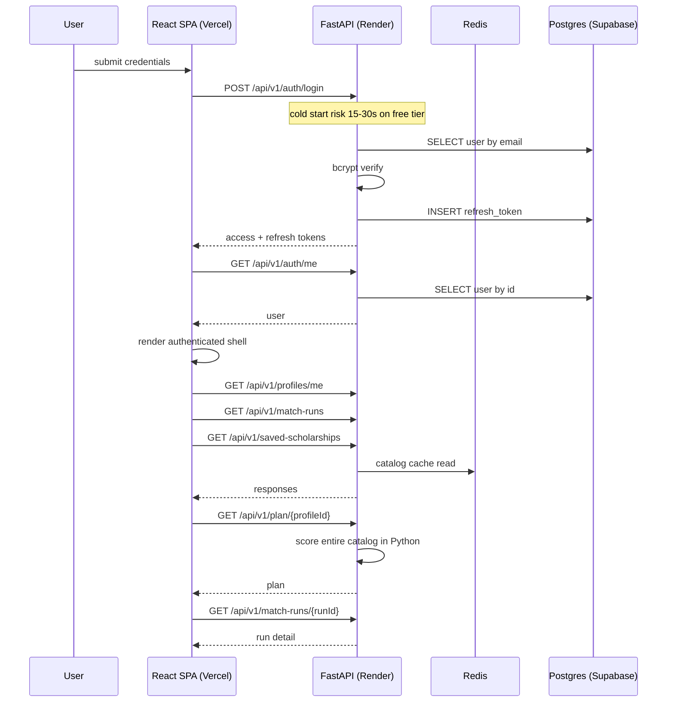
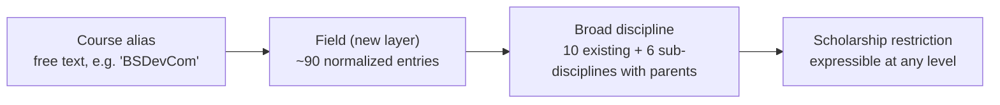
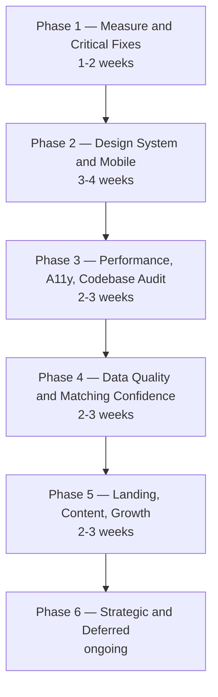

# ISKONNECT — Product Refinement Master Plan

> **Document type:** Product Requirements Document (PRD) + Engineering RFC + UX Audit + Implementation Roadmap
> **Status:** Approved specification — source of truth for the Refinement Phase
> **Owner:** Lead Product Engineer
> **Version:** 1.0
> **Last updated:** 2026-07-31
> **Scope:** ISKONNECT web platform (`frontend/` React SPA + `app/` FastAPI backend + Supabase Postgres)
> **This document is a specification, not an implementation.** Every future implementation prompt must cite the task IDs defined here.

---

## Document Control

| Field | Value |
| --- | --- |
| Repository root | `c:\Iskonnect\scholarship-match` |
| Path conventions | All file paths in this document are relative to `scholarship-match/` unless stated otherwise |
| Task ID conventions | `FB-nn` feedback item, `P1-nn`…`P6-nn` phase task, `DS-nn` design system, `MOB-nn` mobile, `PERF-nn` performance, `A11Y-nn` accessibility, `MATCH-nn` matching validation, `DATA-nn` data, `AUDIT-nn` codebase audit, `CONT-nn` content |
| Related docs | `docs/architecture.md`, `docs/api.md`, `docs/deployment.md`, `docs/verification.md`, `docs/import_csv_contract.md`, `CONTRIBUTING.md`, `SECURITY.md` |
| Change process | Amend this document by PR. Any deviation during implementation must be recorded in Appendix G (Decision Log) with rationale |

### Table of contents

1. [Executive Summary](#1-executive-summary)
2. [Product Vision](#2-product-vision)
3. [Product Principles](#3-product-principles)
4. [Engineering Principles](#4-engineering-principles)
5. [Current System Baseline](#5-current-system-baseline-verified)
6. [Implementation Protocol (how to execute this document)](#6-implementation-protocol-how-to-execute-this-document)
7. [Complete Feedback Analysis](#7-complete-feedback-analysis)
8. [Product Audit](#8-product-audit)
9. [Mobile Responsiveness Plan](#9-mobile-responsiveness-plan)
10. [Design System](#10-design-system)
11. [Landing Page Redesign](#11-landing-page-redesign)
12. [Performance Optimization](#12-performance-optimization)
13. [Accessibility](#13-accessibility)
14. [Scholarship Matching Validation](#14-scholarship-matching-validation)
15. [Data Improvements](#15-data-improvements)
16. [Content Audit](#16-content-audit)
17. [Codebase Audit Plan](#17-codebase-audit-plan)
18. [UX Improvements](#18-ux-improvements)
19. [Partnership Strategy](#19-partnership-strategy)
20. [Roadmap](#20-roadmap)
21. [Definition of Done](#21-definition-of-done)
22. [Risk Register](#22-risk-register)
23. [Final Checklist](#23-final-checklist)
24. [Appendices](#24-appendices)

---

## 1. Executive Summary

### 1.1 Why this phase exists

ISKONNECT has completed its MVP arc. The catalog pipeline works, the matching engine is deterministic and explainable, authentication and profiles are shipped, and a public beta is live on Vercel + Render + Supabase. Feature coverage is no longer the constraint.

The constraint is now **credibility per interaction**. Users judge a scholarship platform in the first ten seconds and in the first three taps. Concretely, the feedback collected from real usage reports:

- Interactive elements are too small to use confidently on a phone, which is the primary device for the target audience.
- Login feels slow, with a blank or spinner-only screen where progress should be visible.
- The landing page reads as informative but not authoritative — "a school project" rather than a product a student would recommend to a friend.
- Visual language drifts between pages: fonts, badge colors, card shapes, and button styles are re-invented per screen.
- The Scholarship Status Guide is transparent but dense enough that users will not read it, defeating its purpose.
- Field-of-study granularity (10 broad buckets) is coarser than how students describe themselves, which weakens perceived match accuracy.
- Matching correctness has synthetic evaluation coverage but no human-legible persona regression suite, so refactors are riskier than they should be.

None of these are new features. All of them are **trust defects**. A scholarship platform that looks unfinished, responds slowly, or presents unreadable policy text will be treated as unofficial regardless of how good its matching engine is.

### 1.2 What this phase solves

This refinement phase converts a functionally complete product into a **trustworthy** one, along five axes:

1. **Usability on the primary device.** Every interactive element becomes thumb-reliable (44×44 px minimum), every layout survives a 360 px viewport, and mobile-specific patterns (bottom sheets, sticky action bars, card-per-row instead of tables) replace desktop patterns that were merely shrunk.
2. **Perceived and actual performance.** The authenticated entry path is instrumented end to end, one network round trip is removed from login, skeletons replace blank screens, and cold-start behavior on Render's free tier is contained rather than ignored.
3. **A single visual system.** One typography scale, one color token set with verified contrast in both themes, one spacing and radius scale, one motion vocabulary, and one component library (incremental shadcn/ui adoption) so new screens inherit correctness instead of re-deriving it.
4. **Verifiable matching quality.** A persona-based regression suite in plain language — 32 named Filipino student profiles with documented expectations — layered on top of the existing synthetic eval gate, so the team can refactor scoring without fear.
5. **Content that respects attention.** Dense transparency pages become scannable decision aids without removing a single disclosure.

### 1.3 Expected outcome

At the end of the phase, measured rather than asserted:

| Outcome | Baseline (to be measured in P1-01) | Target |
| --- | --- | --- |
| Mobile touch-target violations (< 44 px) on core flows | Unknown, believed widespread | 0 on landing, auth, search, dashboard, profile builder |
| Time from login submit to first meaningful dashboard content (p75, warm backend) | Unmeasured | ≤ 1.5 s |
| Time from login submit to first pixel of feedback (spinner does not count) | Unmeasured, includes blank frames | ≤ 200 ms (skeleton) |
| Lighthouse mobile Performance (landing) | Unmeasured | ≥ 90 |
| Lighthouse mobile Accessibility (landing, auth, dashboard, search) | Unmeasured | ≥ 95 |
| Axe-core serious/critical violations across audited routes | Unmeasured | 0 |
| Distinct field-of-study options selectable by a student | 10 broad + ~35 sample courses | 10 broad + 80–100 normalized fields |
| Persona regression cases in CI | 0 (synthetic eval only) | ≥ 32, all green |
| Frontend test files | 10 | ≥ 25 plus E2E smoke on 5 critical paths |
| Dead components / unused dependencies | ≥ 3 components, ≥ 1 dependency | 0 |
| Documented design tokens | 0 (values inlined per component) | Complete token set in `frontend/src/index.css` + this document |

### 1.4 What is explicitly *not* in this phase

To protect focus, the following are deferred and tracked in Phase 6:

- New opportunity verticals beyond scholarships (internships/OJT models exist in the schema but stay behind the existing coming-soon route).
- Native mobile applications. The PWA already installed via `vite-plugin-pwa` is the mobile strategy for this phase.
- Paid infrastructure migration as a *fix*. Upgrading Render is a business decision, not an engineering answer to a latency defect; we optimize first and then quantify the residual gain from paid hosting (see `PERF-14`).
- Any partnership outreach, including PHILSCHOLAR, before the traction gate in §19 is met.
- Any scraping of third-party scholarship aggregators. See §19.4.

---

## 2. Product Vision

**After this phase, ISKONNECT should feel like a government-grade utility built with consumer-grade craft.**

Concretely, the target experience:

- **It opens fast and it opens on a phone.** A student on mobile data in Region VIII sees usable content in under two seconds, can complete the profile builder one-handed, and never has to pinch-zoom to hit a button.
- **It tells you where you stand, plainly.** Every scholarship card answers three questions without a tap: *Can I apply?*, *Am I likely eligible?*, and *How current is this information?*
- **It never bluffs.** Where data is uncertain, the interface says so with a specific label ("Needs verification"), a specific action ("confirm on the official provider site"), and a visible last-verified date. There are no invented testimonials, no unverifiable counts, and no implied endorsement by providers.
- **It looks like one product.** A student moving from the landing page to search to the dashboard experiences the same typography, the same card shapes, the same status colors, and the same motion timing. Nothing feels bolted on.
- **It explains its reasoning.** The score breakdown, the weights, and the reason a scholarship ranked lower are all reachable in one tap, because a matching engine that cannot be interrogated cannot be trusted.
- **It respects attention.** Policy and transparency content is written to be *read* — short lines, scannable labels, action-first phrasing — with full detail available one level down for the users who want it.
- **It is quietly alive.** Motion exists to explain change: a card entering, a progress ring filling, a sheet rising. Nothing moves for decoration; nothing delays input.

The emotional target for a first-time visitor is: *"This is official-looking, fast, and honest. I can send this to my classmates."*

---

## 3. Product Principles

These are decision rules. When two options conflict, the higher-numbered principle yields to the lower-numbered one.

### P1. Trust before aesthetics
A visual choice that increases polish but obscures uncertainty is rejected. If a scholarship's deadline is unconfirmed, the card must say so even if the badge is visually noisier. Trust signals — verification date, provider attribution, official link, data-status label — are never removed to reduce clutter; they are made smaller or moved, never hidden.

### P2. Speed before animation
Motion may never delay interaction. Any animation on the critical path (auth, first dashboard paint, search results) is capped at 200 ms and must be interruptible. If a choice exists between a 300 ms entrance animation and 300 ms faster content, content wins. `prefers-reduced-motion` is honored globally, not per component.

### P3. Mobile-first, not mobile-tolerated
Every screen is designed at 360 px width first and progressively enhanced. A desktop-only interaction pattern (hover-reveal, wide table, multi-column form) requires an explicit mobile equivalent in the same task, not a follow-up ticket.

### P4. Accessibility is a functional requirement
WCAG 2.2 AA is the floor, not the aspiration. Keyboard operability, focus visibility, contrast, and target size are acceptance criteria on every UI task, tested before merge. A component that cannot be operated without a mouse is a broken component.

### P5. Professional over flashy
The reference aesthetic is a well-built public institution portal or a modern fintech dashboard — generous whitespace, restrained palette, confident typography — not a marketing microsite. Gradients, glows, and display type are accents, never the substrate.

### P6. Consistency over novelty
A slightly worse component used everywhere beats a slightly better component used once. New patterns require either (a) replacing the old pattern everywhere, or (b) a documented reason the old pattern cannot serve. "It looked nicer on this page" is not a reason.

### P7. Radical transparency about data quality
The platform is a discovery layer over third-party truth. Every listing exposes its source, its last verification, and its confidence. The interface consistently states that providers make final decisions. We never present a match score as an admissions prediction.

### P8. Clarity over completeness in copy
Say the smallest true thing first, then link to the whole truth. Dense pages get a scannable summary layer and a details layer. Reading level target: understandable by a Grade 11 student, in English, with Filipino terms used where they are the actual terms (GWA, 4Ps, Listahanan, barangay).

### P9. Simple interfaces, few decisions per screen
One primary action per view. Secondary actions are visually subordinate. Filters, options, and advanced controls are progressively disclosed. Any screen presenting more than seven simultaneous choices needs justification.

### P10. Evidence-based decisions
Feedback becomes a measurement before it becomes a change. "Login is slow" becomes a waterfall with numbers; "buttons are tiny" becomes an inventory of measured pixel sizes. Post-change, the same measurement is repeated and recorded. We do not ship perceived improvements we cannot demonstrate.

### P11. Reliability over feature velocity
A feature that works 95% of the time on a scholarship platform destroys more trust than the absence of that feature creates disappointment. Error, empty, and loading states are part of the feature definition, not polish afterwards.

### P12. Inclusive by default
Equity groups (PWD, IP, solo-parent dependents, working students, 4Ps beneficiaries) are first-class in taxonomy, copy, and testing — not special cases handled by an "other" field. Low-end devices and slow connections are the default assumption, not the edge case.

---

## 4. Engineering Principles

### E1. Never break existing functionality
Every task begins by identifying the tests that already protect the behavior being changed. If none exist, writing one is part of the task. The suites that must remain green: `pytest app/tests/` (52 modules), the eval regression gate in `app/tests/test_eval_regression.py` (PROD recall ≥ 0.99, precision ≥ 0.995, FP ≤ 10, senior-high recall ≥ 0.95, explanation coverage ≥ 0.95), `npm run test`, `npm run lint`, `npm run typecheck`, `npm run build`, and Alembic up/down/up on Postgres.

### E2. Preserve API compatibility
The frontend and backend deploy independently (Vercel and Render). Therefore: no removal or renaming of response fields without a deprecation window; additive changes preferred; when a field must change, ship the new field alongside the old, migrate the client, then remove. `app/serialization/scholarship.py` is the single serialization authority — new fields go there, not into ad-hoc dict building in routers.

### E3. Single source of truth per concept
Status labels live in `frontend/src/utils/scholarshipStatus.ts` and `app/utils/application_status.py`; eligibility derivation lives only in `app/matching/eligibility_result.py`; scoring weights only in `app/scoring/config.py`. Duplicating any of these is a defect. New shared concepts (design tokens, field taxonomy) get exactly one home, documented here.

### E4. Reuse before creation
Before adding a component, search `frontend/src/components/` for an existing one. The refinement phase actively reverses past drift: `primaryButtonClass`/`secondaryButtonClass`/`cardClass` in `frontend/src/components/landing/Section.tsx` and the hundreds of inline `rounded-lg bg-primary-600 …` strings collapse into shadcn primitives.

### E5. Delete aggressively, with evidence
Dead code is a maintenance tax and a comprehension hazard. Removal requires proof of non-use (no imports, no dynamic route, no runtime string reference) recorded in the PR description. Confirmed candidates are enumerated in §17.

### E6. Prefer maintainability over cleverness
Explicit over implicit. A 40-line readable function beats a 12-line dense one. Files above ~400 lines are split by responsibility — `frontend/src/pages/AdminPage.tsx` (1239 lines) and `frontend/src/pages/ProfileDashboard.tsx` (783 lines) are the priority targets.

### E7. Types and contracts at the boundary
`frontend/src/types.ts` must mirror backend Pydantic schemas for every field consumed. `tsc --noEmit` and Pydantic validation are the enforcement points. Any `any` introduced requires a comment naming the follow-up.

### E8. Test the behavior, not the implementation
Prefer testing at the seam a user perceives: rendered output for components, HTTP contract for endpoints, and eligibility/score outcomes for matching. Snapshot tests are allowed only for stable serialized contracts (e.g. persona golden files) and must be human-reviewed on change.

### E9. Improve coverage where risk lives
Priority order for new tests: eligibility and scoring, auth and token lifecycle, profile builder state, search filter composition, then presentational components. Coverage measurement is added in this phase (`AUDIT-12`) because it currently does not exist.

### E10. Performance is a budget, not a hope
Explicit budgets, enforced in CI where feasible: initial landing JS ≤ 180 KB gzip, per-route lazy chunk ≤ 120 KB gzip, LCP ≤ 2.5 s on emulated Moto G4 / Fast 3G, CLS ≤ 0.05, INP ≤ 200 ms. Any regression above budget blocks merge.

### E11. Observability before optimization
Never optimize an unmeasured path. Add `Server-Timing` headers, structured request logs with request IDs (`app/middleware/request_logger.py` already provides the hook), and client-side timing marks first; then optimize the largest verified contributor.

### E12. Security and privacy are non-negotiable
No secrets in the client bundle. No PII in logs or analytics events. RA 10173 (Data Privacy Act) posture is maintained: explicit consent capture before profile persistence (`ConsentRequiredModal`), user-triggered export (`GET /api/v1/profiles/me/export`), and hard delete (`DELETE /api/v1/profiles/me`) all remain functional and covered by tests after every refactor.

### E13. Document decisions, not code
Architectural choices go into `docs/engineering/adr/` as short ADRs (template in Appendix F). Comments explain constraints, never narrate syntax.

### E14. Small, reversible, independently deployable changes
One concern per PR. Every PR states: what changed, what it could break, how it was verified, and how to roll it back. Migrations are additive and reversible; `alembic downgrade` is tested in CI already and must stay working.

### E15. Idempotent, deterministic data operations
Catalog changes flow through the staging workflow (`app/api/v1/scholarship_staging.py`) per `CONTRIBUTING.md`. Taxonomy migrations must be re-runnable, with old values mapped forward, never dropped in place.

---

## 5. Current System Baseline (verified)

This section records the *actual* state of the system as of 2026-07-31. It exists because several pieces of incoming feedback assumed a different architecture; implementation prompts must use the facts below, not the assumptions.

### 5.1 Stack

| Layer | Reality |
| --- | --- |
| Frontend | Vite 6 + React 18.3 + TypeScript (strict) + `react-router-dom` 6, SPA on Vercel |
| Frontend state | React Context only — `AuthContext`, `ThemeContext`, `SavedScholarshipsContext`, `FeedbackProvider`. **No** React Query / Zustand / Redux |
| Styling | Tailwind 3.4, `darkMode: "class"`, custom color scales (`primary`, `accent`, `success`, `danger`, `highlight`), default breakpoints/radius/shadow/spacing |
| Fonts | Google Fonts request for **Inter 400–800** and **Montserrat 900** (`frontend/index.html`). **Russo One is not used anywhere today** |
| Component library | **No shadcn/ui.** 73 bespoke components; only `@radix-ui/react-dialog` installed, used by 7 hand-wired modals |
| Motion | `framer-motion` 12 (landing only, via `LandingMotionProvider` + `Reveal.tsx`, with `useReducedMotion()`), plus 5 custom Tailwind keyframes |
| Backend | FastAPI 0.115.6, Python 3.11.12, SQLAlchemy 2.0.36, Gunicorn + Uvicorn workers on Render |
| Auth | **Own HS256 JWT** (PyJWT) with bcrypt password hashing and hashed rotating refresh tokens in Postgres. **Supabase Auth is not used** — Supabase provides Postgres and Storage only |
| Database | Supabase Postgres (SQLite in tests), 43 Alembic migrations, jsonb + GIN indexes on eligibility arrays (migration 029) |
| Caching | Redis: scholarship catalog JSON (`iskonnect:scholarships_json:v1`, 300 s TTL), rate limits (slowapi), access-token denylist |
| Matching | `app/matching/match_service.py` orchestration → `app/matching/eligibility_result.py` hard gates → `app/scoring/engine.py` weighted deterministic scorer |
| Tests | 52 backend pytest modules + synthetic eval gate; 10 frontend Vitest files; no E2E; no coverage measurement |
| CI | `.github/workflows/ci.yml` (pytest, eval gate, Alembic up/down/up on Postgres 16, frontend lint/typecheck/test/build) plus 8 scheduled ops workflows including `keepalive.yml` pinging `/health` every 10 minutes |

### 5.2 Corrections to incoming assumptions

| Assumption in feedback | Verified reality | Consequence for the plan |
| --- | --- | --- |
| "Supabase auth waiting" causes slow login | Login is local: bcrypt verify + one `users` SELECT + refresh-token INSERT. No external auth network call | Latency work targets Render cold start, bcrypt cost, the extra `GET /auth/me` round trip, and dashboard fan-out — not Supabase Auth (`PERF-01`…`PERF-08`) |
| Project may already use shadcn/ui | It does not | Adoption is net-new infrastructure work, scoped incrementally per the approved decision (`DS-03`) |
| Add anime.js for animations | `framer-motion` 12 already ships with reduced-motion support | anime.js is **rejected**; all motion requirements are satisfied by framer-motion + CSS (`DS-14`, ADR-002) |
| Use Russo One for the brand | Brand font today is Montserrat 900 | Russo One replaces Montserrat for wordmark/display only, and Montserrat is dropped to avoid a third font payload (`DS-05`) |
| Badge colors are "probably hardcoded" | Partly true: badges use raw Tailwind palette (`emerald`, `amber`, `sky`, `slate`) via `LIFECYCLE_TONE_CLASSES` in `frontend/src/utils/scholarshipStatus.ts` and `QualificationStatusBadge.tsx`, bypassing the `success`/`highlight`/`danger` scales | Fix is tokenization, not one-off color swaps (`DS-08`) |
| Status guide needs simplification | Content is already structured data (`LIFECYCLE_STATUS_GUIDE`, `UI_ELIGIBILITY_GUIDE`) rendered as full-prose cards | Simplification is a presentation change over existing data, cheap and low-risk (`CONT-01`) |
| Feedback system needs to be built | `FeedbackButton`/`FeedbackModal` + `POST /api/v1/feedback` + admin review already exist; `ChangelogPage` exists | Work is categorization, triage, and a public roadmap view — not greenfield (`FB-12`) |

### 5.3 Known defects discovered during baseline audit

These were not in the incoming feedback but are in scope because they directly undermine the same principles.

| ID | Defect | Location |
| --- | --- | --- |
| BL-01 | `primary` color ramp is non-monotonic and mislabeled: `600 = #1d4ed8` (actually blue-700), `700 = #1d40af`, `800 = #1e40af` — 700 and 800 are visually identical, so hover/active states on primary buttons are nearly imperceptible | `frontend/tailwind.config.js:66-77` |
| BL-02 | `QualificationStatus.almost_qualified` exists in the enum and is consumed by match responses but is **never assigned** by `_derive_status` — a dead eligibility state | `app/matching/eligibility_result.py:853-865`, `app/matching/match_service.py:272-277` |
| BL-03 | `GET /api/v1/applications` performs one scholarship query per application row (N+1) | `app/api/v1/applications.py` |
| BL-04 | `GET /api/v1/scholarships/search/filters` loads every publishable row into Python to compute distinct filter values | `app/api/v1/scholarship_search.py` |
| BL-05 | `GET /api/v1/plan/{profile_id}`, `POST /api/v1/match-runs`, and `GET /api/v1/profiles/sample-matches` score the entire catalog in Python per request; the SQL prefilter (`_prefilter_scholarships_query`) exists but is not wired into `/plan` | `app/api/v1/matches.py` |
| BL-06 | No pagination on `GET /scholarships`, `GET /match-runs`, `GET /saved-scholarships`, `GET /applications` | `app/api/v1/*` |
| BL-07 | Registration and login both land on `/dashboard`, so a brand-new user with no profile sees an empty dashboard rather than onboarding | `frontend/src/pages/LoginPage.tsx:32-38`, `RegisterPage.tsx` |
| BL-08 | Lazy-route fallback renders the bare string "Loading…" | `frontend/src/App.tsx` (`RouteFallback`) |
| BL-09 | Duplicated `SavedScholarshipsErrorBanner` implementation | `frontend/src/components/layout/DashboardLayout.tsx`, `AdaptiveSearchLayout.tsx` |
| BL-10 | `@tanstack/react-virtual` is a dependency with zero imports; `SocialProofTicker`, `CareerRoadmapCard`, `ReviewCenterFinderCard` have no importers; `animate-marquee` keyframes exist only for the unused ticker | `frontend/package.json`, `frontend/src/components/**` |
| BL-11 | Authenticated search layout (`AdaptiveSearchLayout`) omits `BottomNav`, so mobile navigation disappears on one of the most-used authenticated screens | `frontend/src/components/layout/AdaptiveSearchLayout.tsx` |
| BL-12 | No coverage measurement in CI for either language; no E2E tests at all | `.github/workflows/ci.yml` |
| BL-13 | Deprecated `dataStatusToLifecycle` still exported alongside `resolveApplicationStatus` | `frontend/src/utils/scholarshipStatus.ts:175-178` |

---

## 6. Implementation Protocol (how to execute this document)

This section exists so that AI-assisted implementation is accurate and non-destructive. Every implementation session must follow it.

### 6.1 Session contract

Each implementation prompt handles **one task ID** from this document (or one tightly coupled group, e.g. `DS-01`+`DS-02`), and must:

1. **Quote the task** — ID, acceptance criteria, and testing requirements from this document.
2. **Read before writing** — open every file named in the task plus its direct importers, and report the current behavior before changing it.
3. **State the blast radius** — list every file to be modified and every consumer that could break.
4. **Change the minimum** — no drive-by refactors, no reformatting untouched lines, no dependency additions beyond those named in the task.
5. **Verify** — run the applicable commands from §6.3 and paste the results.
6. **Report honestly** — if acceptance criteria cannot be met, stop and report why. Never mark a criterion met without evidence.

### 6.2 Prompt template for implementation sessions

```
TASK: <ID> — <title> (see docs/engineering/ISKONNECT_PRODUCT_REFINEMENT_MASTER_PLAN.md §<section>)

CONTEXT
- Repo: scholarship-match (Vite/React/TS frontend, FastAPI backend, Supabase Postgres)
- Read §5 Current System Baseline before proposing anything.
- Auth is our own JWT (not Supabase Auth). No shadcn/ui unless DS-03 is already done.
- Motion library is framer-motion. Do NOT add anime.js.

SCOPE (from the master plan)
<paste Proposed Solution>

ACCEPTANCE CRITERIA
<paste acceptance criteria verbatim>

TESTING REQUIREMENTS
<paste testing requirements verbatim>

CONSTRAINTS
- Do not change public API response shapes (E2). Additive only.
- Do not modify files outside the listed scope without stating why.
- Keep dark mode parity for every visual change.
- Preserve keyboard operability and prefers-reduced-motion behavior.
- Do not add dependencies not named in the task.

DEFINITION OF DONE
1. All acceptance criteria demonstrably met (show evidence).
2. Commands in §6.3 pass, output pasted.
3. Report: files changed, risk, rollback, follow-ups.
```

### 6.3 Verification commands

Run the subset relevant to the change; run all of them before closing a phase.

```bash
# Backend (repo root, venv active)
pytest app/tests/ -q
pytest app/tests/test_eval_regression.py -q          # matching quality gate
alembic upgrade head && alembic downgrade base && alembic upgrade head

# Frontend (frontend/)
npm run lint
npm run typecheck
npm run test
npm run build
```

Additional gates introduced by this plan: `npm run test:e2e` (after `AUDIT-13`), `npm run analyze` (after `PERF-11`), and the persona suite `pytest app/tests/test_persona_matching.py -q` (after `MATCH-02`).

### 6.4 Non-negotiable guardrails for every UI change

- Verify at 360 px, 390 px, 768 px, 1024 px, and 1440 px widths.
- Verify in light and dark themes.
- Verify keyboard-only operation of anything interactive, with a visible focus ring.
- Verify with `prefers-reduced-motion: reduce` enabled.
- Never reduce a disclosed trust signal (verification date, data status, official link, provider name) to gain visual cleanliness.

### 6.5 Sequencing rule

Tasks are executed in phase order (§20). Within a phase, dependency order is stated per task. **`DS-01` through `DS-04` (tokens + shadcn foundation) precede all other visual work**, because doing mobile and landing work first would produce components that must then be rewritten.

**Do not jump ahead.** Phase 2 (design system, Russo One, landing redesign, animations) starts only after Phase 1 exits with all §21.2 criteria met. Measurement tasks (`P1-01`, `P1-02`) are never skipped, even when the problem feels obvious.

### 6.6 Git branch discipline (one task = one branch)

Every task runs on its **own branch**, branched from `main` (or the previous merged task). Never batch unrelated tasks on one branch.

**Branch naming:** `feature/<TASK-ID>-<short-slug>`

Examples:

- `feature/P1-01-login-waterfall`
- `feature/P1-02-touch-target-audit`
- `feature/P1-03-login-roundtrip`

**Per-task workflow:**

1. `git checkout main && git pull` (when remote is available)
2. `git checkout -b feature/P1-01-login-waterfall`
3. Implement **only** that task's scope
4. Run verification commands (§6.3)
5. Write the task report (§6.7) at `docs/engineering/reports/P1-01-report.md`
6. Commit with message: `P1-01: instrument login waterfall baseline`
7. Merge to `main` (or open a PR if team policy requires review)

If a task breaks something, only that branch is affected — not the whole phase.

### 6.7 Task completion report (required)

At the end of **every** implementation task, produce a short report saved to `docs/engineering/reports/<TASK-ID>-report.md`. This becomes the audit trail for demos, changelogs, and future debugging.

**Report template:**

```markdown
# <TASK-ID> Report

## Objective
<one sentence from the master plan>

## Files changed
- path/to/file.ts
- path/to/file.py

## Before
<behavior or metrics before the change>

## After
<behavior or metrics after the change>

## Performance (if applicable)
| Step | Before | After |
| --- | --- | --- |
| ... | ... | ... |

## Tests
- [x] pytest (backend)
- [x] npm run lint
- [x] npm run typecheck
- [x] npm run test
- [x] npm run build
- [ ] E2E (only when AUDIT-13 is complete)

## Regression risk
Low | Medium | High — <one line why>

## Rollback
<how to revert if needed>

## Follow-ups
<task IDs blocked on this, or deferred items>
```

Reports are committed on the same branch as the code change.

---
## 7. Complete Feedback Analysis

Every item of incoming feedback is analyzed below. Nothing is dropped; items judged premature are assigned to a later phase rather than removed. Overlapping suggestions are merged and cross-referenced.

**Difficulty scale:** S (≤ 0.5 day), M (1–3 days), L (4–8 days), XL (> 8 days or multi-phase).
**Priority scale:** P0 blocker, P1 critical, P2 important, P3 valuable, P4 opportunistic.

### FB-01 — Mobile responsiveness overhaul ("buttons are tiny")

**Problem.** Interactive elements across the product are smaller than the platform minimum for reliable touch input. Audit-confirmed patterns include `py-1.5 text-xs` action buttons on dashboard cards, small icon-only controls, dense filter chips, and desktop-shaped tables (`AdminPage`, `MatchComparisonPage`, `SponsorPortalPage`, `PrivacyPage`) rendered on phone widths. Additionally, `AdaptiveSearchLayout` omits `BottomNav`, so authenticated mobile users lose primary navigation on the search screen (BL-11).

**Reason.** The product was designed desktop-out: responsive prefixes were applied to layout containers (60+ files use `sm:`/`md:`/`lg:`) but control sizing was never given a floor. Because there is no shared `Button` component, each control's height is decided inline at the call site, so no single change can fix them all. Tailwind's default scale makes `py-1.5 text-xs` (≈26 px tall) as easy to write as a compliant size.

**Importance.** Highest. The target user is a Filipino student on a mid-range Android phone; mobile is the primary, often only, device. A control the user misses twice reads as "broken site," which directly attacks the Trust principle (P1) and Mobile-first principle (P3). This is the single most-reported issue.

**Proposed solution.** See §9 for the full plan. Summary:
1. Land the design system first (`DS-01`…`DS-04`) so `Button`, `Input`, `Select`, and `Badge` have a compliant default (`min-h-11` = 44 px, `min-w-11` for icon-only) that cannot be accidentally undercut.
2. Sweep surfaces in traffic order: auth → dashboard → search + filters → scholarship card/detail → profile builder → settings → admin (`MOB-03`…`MOB-10`).
3. Replace mobile tables with card lists via a shared `ResponsiveTable` pattern (`MOB-11`).
4. Convert full-screen mobile modals to bottom sheets using Radix Dialog with sheet styling (`MOB-12`).
5. Add `BottomNav` to `AdaptiveSearchLayout` and reconcile safe-area padding (`MOB-06`).
6. Add sticky mobile action bars for primary actions on long pages (profile builder, scholarship detail) (`MOB-13`).
7. Add an ESLint guard and a documented review checklist to prevent regression (`MOB-16`).

**Tradeoffs.** Larger controls consume vertical space; some dense dashboard cards will show less information per screen and require progressive disclosure. Card-per-row replacements for admin tables reduce information density for power users on desktop — mitigated by keeping the table at `md:` and above. Doing this properly requires the design system first, which delays visible mobile improvement by roughly one week.

**Dependencies.** `DS-01` (tokens), `DS-03` (shadcn foundation), `DS-04` (Button/Input/Badge primitives). Independent of all backend work.

**Estimated difficulty.** XL — 73 components, 35+ routes. Split across `MOB-01`…`MOB-16`.

**Priority.** P0 for auth/dashboard/search/profile-builder surfaces; P2 for admin and internal portals.

**Acceptance criteria.**
- Every interactive element on `/`, `/login`, `/register`, `/dashboard`, `/scholarships/search`, `/scholarship/:id`, `/profile-builder`, `/settings` measures ≥ 44 × 44 px CSS pixels at 360 px viewport width, verified by the automated probe in `MOB-01`.
- Minimum 8 px clear spacing between adjacent touch targets.
- No horizontal page scroll at 320, 360, and 390 px widths on any audited route.
- No text smaller than 12 px; body copy ≥ 14 px on mobile; all form inputs ≥ 16 px font-size to prevent iOS auto-zoom.
- Tables on audited routes render as stacked cards below `md`.
- `BottomNav` is present on every authenticated route, including search, and respects `env(safe-area-inset-bottom)`.
- Mobile dialogs originate as bottom sheets, are dismissible by swipe or a ≥ 44 px close control, and trap focus.

**Testing requirements.** Automated touch-target probe (Playwright script measuring `getBoundingClientRect` of all focusable elements per route, asserting ≥ 44 px) added to CI; visual verification at the five reference widths in light and dark themes; real-device smoke test on one iOS and one Android device with recorded results; axe-core scan per route; existing Vitest suite green.

**Potential risks.** Layout regressions on desktop while enlarging controls (mitigated: responsive size variants, not global size increases). Sweep fatigue causing partially migrated screens — mitigated by per-surface task IDs with independent acceptance. Increased vertical scroll perceived as "more work" — mitigated by tightening section padding as controls grow.

---

### FB-02 — Slow login and slow perceived performance

**Problem.** Login feels slow, with a period of blank or spinner-only screen. Users cannot tell whether the app is working.

**Reason.** Verified contributors, in order of expected impact:
1. **Render free-tier cold start** — the instance spins down when idle; `docs/architecture.md` records 15–30 s cold starts. `keepalive.yml` pings `/health` every 10 minutes, but GitHub Actions cron drift can exceed the idle window, so some users still hit a cold instance.
2. **Sequential round trips.** `POST /api/v1/auth/login` returns tokens only; `AuthContext` then fires `GET /api/v1/auth/me` to obtain the user, so the client waits on two serialized requests before it can render an authenticated shell (`frontend/src/contexts/AuthContext.tsx:149-167`).
3. **bcrypt verification cost** on the login request — intentional and must not be weakened, but it must be measured so it is not mistaken for a bug.
4. **Dashboard fan-out.** `ProfileDashboard` opens with `Promise.all([/profiles/me, /match-runs])` (already parallel, good) but then serially fetches `/plan/{profileId}` and `/match-runs/{runId}` once IDs are known; `SavedScholarshipsContext` adds a third concurrent request.
5. **Heavy plan computation.** `/plan/{profile_id}` loads the whole cached catalog and scores it in Python per request (BL-05).
6. **Blank or undifferentiated loading UI.** `DashboardLayout` shows a full-screen spinner while `authLoading || !user`; lazy routes render the string "Loading…" (BL-08). A spinner communicates "waiting"; a skeleton communicates "arriving".

**Importance.** Highest, and universal — every user pays this cost on every session. Perceived speed is a trust proxy: a slow authenticated entry reads as an unmaintained service.

**Proposed solution.** See §12. Summary: instrument the waterfall first (`PERF-01`), return the user object in the login response so `/auth/me` is not needed on the login path (`PERF-02`), persist a minimal cached user for optimistic shell render (`PERF-03`), replace spinners with route-shaped skeletons (`PERF-04`), prefetch the dashboard chunk from the login page (`PERF-05`), collapse dashboard bootstrap into one parallel wave with a single aggregate endpoint where beneficial (`PERF-06`), wire the existing SQL prefilter into `/plan` and cache plan results (`PERF-07`, `PERF-08`), warm the instance more reliably (`PERF-09`), and add a visible cold-start affordance reusing `ApiWarmupBanner` (`PERF-10`).

**Tradeoffs.** Returning the user object in the login response slightly enlarges that payload and duplicates data available from `/auth/me` — acceptable and additive (E2). Optimistic shell rendering from cached user data risks a brief incorrect state if the account changed server-side; mitigated by treating the cache as presentational only and reconciling on the first authenticated response. An aggregate bootstrap endpoint reduces round trips but couples concerns; it will be introduced as an additive endpoint, leaving existing endpoints untouched.

**Dependencies.** `PERF-01` (measurement) gates all other performance tasks. `PERF-04` (skeletons) benefits from `DS-04` (`Skeleton` primitive) but can ship with a temporary local component.

**Estimated difficulty.** L overall; `PERF-02`/`PERF-04` are S–M and deliver most of the perceived gain.

**Priority.** P0.

**Acceptance criteria.**
- A recorded waterfall (before/after) exists in `docs/engineering/perf-baseline.md` for: login submit → tokens, tokens → authenticated shell painted, shell → first dashboard content, and each dashboard request.
- Warm-backend p75 from login submit to first meaningful dashboard content ≤ 1.5 s; cold-backend path shows an explanatory banner within 3 s instead of an indeterminate spinner.
- Feedback (skeleton) is painted within 200 ms of login submit; no blank frame longer than one animation frame.
- The login path performs exactly one backend request before the authenticated shell renders.
- Dashboard bootstrap issues no more than two serialized waves of requests.
- No auth security regression: bcrypt cost unchanged, refresh rotation unchanged, denylist behavior unchanged.

**Testing requirements.** Backend timing assertions via `Server-Timing` headers; pytest for the extended login response shape and for `/plan` parity between cached-catalog and prefiltered paths (identical ordered results for a fixture profile); Vitest for `AuthContext` bootstrap with a cached user; Playwright timing assertion on the login → dashboard path against a warm local backend; manual cold-start verification against the deployed Render instance with results recorded.

**Potential risks.** Cache-related stale-user bugs (mitigated by reconcile-on-response and a version key). Prefilter parity drift changing match results — the highest-risk item here; gated by the eval regression suite plus a dedicated parity test. Aggregate endpoint becoming a dumping ground — mitigated by a documented contract and no business logic inside it.

---

### FB-03 — Email validation improvements

**Problem.** Client-side email validation is `type="email"` plus, in one place, `state.email.includes("@")` (`frontend/src/pages/ProfileBuilderPage.tsx:214-216`). Typos ("gmial.com"), invalid addresses, and throwaway addresses pass, which corrupts the contact channel and inflates apparent user counts.

**Reason.** Validation was implemented at MVP speed with browser defaults and never centralized. There is no shared validator module on the frontend, so each form does its own minimum.

**Importance.** High but bounded. Email is the account identity, the password-reset channel, and the future deadline-reminder channel (`app/jobs/deadline_reminders.py`). A wrong address is a silently lost user.

**Proposed solution.**
1. Create `frontend/src/utils/validateEmail.ts` as the single validator: pragmatic RFC 5322-subset regex, length limits (local ≤ 64, total ≤ 254), rejection of consecutive dots, leading/trailing dots, and missing TLD.
2. Add a typo-suggestion layer for the top Philippine domains (`gmail.com`, `yahoo.com`, `outlook.com`, `icloud.com`, plus `.edu.ph` institutions) using Levenshtein distance ≤ 2, surfaced as a non-blocking "Did you mean …?" affordance.
3. Apply it in `LoginPage`, `RegisterPage`, `ForgotPasswordPage`, `PersonalInfoStep`, `ProfileBuilderPage`, and `FeedbackModal`, with inline errors on blur (never on every keystroke) and `aria-invalid` + `aria-describedby` wiring.
4. Mirror the same rule server-side in `app/schemas.py` with Pydantic `EmailStr` and an explicit length/format guard, so the client cannot be the only gate.
5. Verification email: `REQUIRE_EMAIL_VERIFICATION` and the `POST /auth/verify-email` + `resend-verification` endpoints already exist. This phase makes verification the default in production and improves the pending-verification UI.
6. Disposable-domain blocking and MX lookups are **deferred to Phase 4** (`DATA-09`) behind a feature flag: a bundled disposable-domain list server-side, and optional DNS MX check with a strict timeout and fail-open behavior.

**Tradeoffs.** Stricter validation can reject valid but unusual addresses (long subdomains, new TLDs) — mitigated by an intentionally permissive regex plus soft suggestions rather than hard blocks. MX verification adds latency and a new failure mode on the registration path, which is why it is deferred and fail-open. Requiring verification adds a step that will reduce raw signups while improving list quality; this is the correct trade for a trust-oriented product.

**Dependencies.** None blocking. `DS-04` improves the error presentation but is not required.

**Estimated difficulty.** S for the validator and wiring; M including the verification-state UI.

**Priority.** P1.

**Acceptance criteria.**
- One exported validator used by all six call sites; no remaining `includes("@")` check in the codebase.
- Invalid formats are rejected with a specific, human message ("Add a domain, like `@gmail.com`"), not a generic "invalid email".
- Typo suggestions appear for at least the eight configured domains and are dismissible/ignorable.
- Server-side rejection returns 422 with a field-level error; a request that bypasses the client cannot create a user with a malformed address.
- Errors are announced to assistive technology (`role="alert"`, `aria-invalid`, label association).
- Validation never blocks submission for a valid address, and never runs on every keystroke.

**Testing requirements.** Unit tests for the validator with a table of ≥ 40 cases (valid, invalid, unicode, long, plus-addressing, `.edu.ph`, subdomains); Vitest interaction tests for one representative form covering blur error, suggestion accept, and successful submit; pytest for schema rejection and for the verification endpoints; regression check that existing accounts with legacy addresses can still log in and reset passwords.

**Potential risks.** Over-strict regex locking out real users — mitigated by tests derived from real address shapes and by soft suggestions. Making verification mandatory could strand users whose SMTP delivery fails — mitigated by a working resend flow, clear pending-state UI, and an admin override path.

---

### FB-04 — Return to dashboard after profile completion

**Problem.** After saving the profile in `ProfileBuilderPage`, the user stays on the wizard with a green "Profile saved to your account." message and an inline text link to the dashboard (`frontend/src/pages/ProfileBuilderPage.tsx:347-352`). The wizard ends in a dead end: the user has just done the most effortful task in the product and receives no payoff. Separately, registration and login both route to `/dashboard` (BL-07), so a new user without a profile sees an empty dashboard before ever seeing the wizard — the inverse of the intended flow.

**Reason.** The builder was designed to support anonymous drafting and repeated editing, so a terminal redirect was avoided. The consequence is that the "complete → reward" loop was never closed.

**Importance.** High. This is the conversion moment of the entire product: profile completion is what produces matches, and matches are the value proposition. An unrewarded completion wastes the user's investment and suppresses the first successful match view.

**Proposed solution.**
1. On successful save from the final step, show a brief success confirmation (inline, ≤ 1.2 s, no blocking modal) and then `navigate("/dashboard", { replace: true, state: { justCompletedProfile: true } })`.
2. `ProfileDashboard` reads `justCompletedProfile` and renders a one-time celebratory header — "Profile complete. Here are your scholarship matches." — above the matches section, and auto-triggers a match run if none exists so the dashboard is never empty at that moment.
3. Distinguish **first completion** from **subsequent edits**: an edit performed on an already-complete profile saves in place with a toast and no redirect, preserving the current editing ergonomics.
4. Post-registration routing: new accounts without a profile go to `/profile-builder`; accounts with a profile go to `/dashboard`. Implement as a single routing decision derived from the profile-existence flag returned during bootstrap (see `PERF-02`), not as a second network request.
5. Preserve every existing guard: unauthenticated save still redirects to `/login` with `state.from`, and the privacy-consent gate (`ConsentRequiredModal` → step 5) still blocks save.

**Tradeoffs.** Auto-triggering a match run on first completion consumes backend CPU at exactly the moment the user is waiting; mitigated by the `/plan` optimizations (`PERF-07`) and by rendering a skeleton with an explicit "Finding your matches…" label. A redirect can feel abrupt for users who wanted to keep editing — mitigated by the edit-vs-first-completion distinction and by a persistent "Edit profile" entry point on the dashboard.

**Dependencies.** `PERF-02` (profile-existence flag on bootstrap) for the routing decision; benefits from `PERF-04` skeletons.

**Estimated difficulty.** S–M.

**Priority.** P1.

**Acceptance criteria.**
- First-time completion redirects to `/dashboard` within 1.5 s of a successful save, with matches visible or a labeled loading state.
- Subsequent saves of a complete profile do not redirect; they show a toast and remain in place.
- A newly registered account with no profile lands on `/profile-builder`, not an empty dashboard.
- Anonymous save → login → return-to-builder behavior is unchanged.
- Consent gating is unchanged and still blocks persistence.
- The dashboard's post-completion banner appears once and does not reappear on refresh or back-navigation.

**Testing requirements.** Vitest tests for: first completion redirect, edit-in-place no-redirect, unauthenticated save redirect preservation, consent gate. Playwright E2E for register → build profile → dashboard shows matches. pytest coverage that profile upsert response carries whatever flag the routing decision needs.

**Potential risks.** Redirect loops if the profile-completeness check disagrees between client and server (mitigated by deriving completeness from one server-provided value, reusing `app/matching/profile_completeness.py`). Losing unsaved draft state on redirect (mitigated by clearing the localStorage draft only after a confirmed save).

---

### FB-05 — Expand the field-of-study taxonomy

**Problem.** The taxonomy is 10 broad PSCED buckets (`STEM`, `Engineering`, `IT`, `Medical`, `Business`, `Education`, `Agriculture`, `Arts`, `Law`, `Architecture`) plus ~35 sample course names (`app/taxonomy/psced_fields.py`). A student who studies Journalism, Marketing, Hospitality Management, Criminology, Social Work, Psychology, Veterinary Medicine, Maritime, or a TESDA trade cannot describe themselves accurately. "Arts" absorbing Communication, Psychology, and Literature is the clearest failure: a Development Communication student selecting "Arts" gets field-alignment scoring that does not reflect reality.

**Reason.** The taxonomy was seeded to unblock matching, with the intent to expand later. It is used in two different roles — the student's self-description and the scholarship's eligibility restriction — and both were kept coarse to guarantee overlap.

**Importance.** High, and it is a *trust* issue rather than a data-modeling nicety. Field alignment carries 0.22 of the score weight (`app/scoring/config.py`), so coarse fields directly reduce perceived match accuracy. Users experience taxonomy poverty as "this site doesn't understand my course."

**Proposed solution.** Full specification in §15. Summary: introduce a three-level taxonomy — **broad discipline** (the existing 10, preserved verbatim for backward compatibility) → **field** (80–100 normalized entries, the new student-facing selection layer) → **course alias** (free-text and common program names mapped to a field). Scholarship eligibility continues to be expressible at any level; matching resolves student field → parent discipline so existing broad restrictions keep working. Extend `FIELD_HIERARCHY` rather than replacing it, and extend `app/matching/field_match.py` to score exact-field, sibling-field, same-discipline, and unrelated as distinct levels.

**Tradeoffs.** More options increase selection effort — mitigated by keeping the existing `AutocompleteInput` search-first interaction, not a 100-item dropdown. A finer taxonomy can *reduce* match counts if scholarship restrictions are interpreted too narrowly, so the resolution rule must be generous upward (a field always satisfies its discipline). Migration risk: existing student records store broad values and must keep working untouched.

**Dependencies.** `DATA-01` (taxonomy definition) → `DATA-02` (backend constants + hierarchy) → `DATA-03` (matching resolution levels) → `DATA-04` (frontend options + autocomplete) → `DATA-05` (data migration mapping legacy values). Requires `MATCH-02` persona suite to exist first, so the change can be proven non-regressive.

**Estimated difficulty.** L.

**Priority.** P2 (Phase 4), but scheduled immediately after the persona suite because it needs that safety net.

**Acceptance criteria.**
- 80–100 normalized fields, each mapped to exactly one broad discipline, covering at minimum: all Engineering disciplines; IT/CS/IS/Data Science; Health (Nursing, Medicine, Pharmacy, Med Tech, PT/OT, Radiologic Tech, Public Health, Midwifery, Dentistry, Veterinary Medicine); Business (Accountancy, Management, Marketing, Finance, Entrepreneurship, HRM, Economics, Office Administration); Communication (Journalism, Broadcasting, Communication Research, Advertising, Development Communication, Multimedia Arts); Education (Elementary, Secondary, Special Needs, TLE, PE); Agriculture/Fisheries/Forestry/Agribusiness; Social Sciences (Psychology, Social Work, Sociology, Political Science, Public Administration, Criminology); Humanities (Literature, History, Philosophy, Languages); Law; Architecture and Planning; Tourism and Hospitality; Maritime; Aviation; Sports Science; Fine Arts, Design, Music, Film; Library and Information Science; and TESDA/TVET trade clusters.
- Every legacy stored value continues to resolve; zero students lose their selection.
- The eval regression gate and the persona suite pass unchanged or improved — no persona loses a previously expected scholarship.
- Autocomplete returns a relevant field within three keystrokes for each of 20 sampled real program names.
- Taxonomy is defined once in the backend and exposed to the frontend via `GET /api/v1/suggestions/profile-options` — no duplicated hardcoded list in `frontend/src/constants/profileOptions.ts`.

**Testing requirements.** Unit tests for legacy-value resolution (every old value → a valid new field or discipline); field-match level tests for exact/sibling/discipline/unrelated pairs; persona suite before/after diff reviewed and committed; migration dry-run report of affected student rows; eval regression gate.

**Potential risks.** Silent match-set changes for existing users — mitigated by the persona diff being a required, human-reviewed artifact. Taxonomy sprawl over time — mitigated by an explicit governance rule in §15.5 (additions require mapping to an existing discipline; no new top-level disciplines without an ADR).

---

### FB-06 — Student test cases / persona regression suite

**Problem.** Matching correctness is protected only by a synthetic evaluation (100 generated profiles × 200 generated scholarships, `eval/`) whose ground truth comes from an independent oracle. There is no suite of human-legible, named personas with documented expectations, so a maintainer cannot answer "does Juan from UP Diliman still get DOST?" without manual testing. Every scoring or taxonomy change is therefore riskier than it needs to be.

**Reason.** The synthetic eval was built for statistical confidence (recall/precision), which is the right primary gate but the wrong communication tool. Persona tests serve a different purpose: they encode product intent in language a non-engineer can review.

**Importance.** Very high, and it is a **prerequisite** for FB-05 and any scoring work. Its value is compounding: it makes every subsequent change cheaper and safer.

**Proposed solution.** See §14. Summary: 32 named personas covering education stage, income bracket, GWA band, school type, region, field, and equity group; each with expected inclusions ("must include at least one DOST-SEI-category scholarship"), expected exclusions ("must not include members-only GSIS scholarships"), expected eligibility status per named fixture, expected relative ranking invariants, and documented edge cases. Implemented as `app/tests/test_persona_matching.py` against a committed fixture catalog in `app/tests/fixtures/persona_catalog.json`, with golden output files reviewed on change.

**Tradeoffs.** Golden files require discipline: an unreviewed regeneration silently blesses regressions. Mitigated by making the golden diff a mandatory PR artifact and by asserting invariants (relationships) in addition to snapshots (exact output). A fixture catalog can drift from the production catalog; mitigated by deriving it once from real anonymized listings and by keeping the synthetic eval as the independent statistical gate.

**Dependencies.** None. Should be executed first in Phase 3 so it protects FB-05.

**Estimated difficulty.** L (fixture design is the bulk of the effort).

**Priority.** P1.

**Acceptance criteria.**
- ≥ 32 personas, each in plain language with the fields in §14.2 and a stated rationale.
- Fixture catalog of ≥ 40 scholarships spanning every provider category, restriction type, and status label used in production.
- Assertions of three kinds per persona: inclusion/exclusion sets, eligibility status per fixture, ranking invariants.
- Suite runs in CI in under 30 seconds and is required for merge.
- A single command regenerates goldens, and the diff is human-readable.
- Documented in `docs/engineering/matching-personas.md` so a non-engineer can review expectations.

**Testing requirements.** The suite is itself the test. Additionally: a meta-test asserting every persona has non-empty expectations; a mutation check — deliberately perturb a scoring weight locally and confirm the suite fails (proving it has teeth); confirm the suite is independent of database state.

**Potential risks.** Overfitting to fixtures, making legitimate improvements look like failures — mitigated by preferring invariants over exact scores and by never asserting on absolute score values, only orderings and thresholds.

---

### FB-07 — Dark mode scholarship tag/badge audit

**Problem.** Status and qualification badges are readable in light mode but inconsistent in dark mode, and they bypass the product's own color scales. `LIFECYCLE_TONE_CLASSES` in `frontend/src/utils/scholarshipStatus.ts:92-98` uses raw `emerald`/`amber`/`slate`/`primary`; `QualificationStatusBadge.tsx` uses `emerald`/`amber`/`sky`/`slate`; `ProfileDashboard.tsx` adds `red`, `teal`. Meanwhile the configured semantic scales (`success`, `danger`, `highlight`) are largely unused for these purposes. The result is three near-identical greens and unverified dark-mode contrast.

**Reason.** Badges were built per surface before a token layer existed, and dark mode was added later by appending `dark:` variants without a contrast pass.

**Importance.** Medium-high. Status color *is* the information on a scholarship card. If "Open now" and "Needs verification" are not instantly distinguishable in dark mode, the card lies by ambiguity, violating P1 and P7.

**Proposed solution.**
1. Define semantic tone tokens in `frontend/src/index.css` as CSS variables with light and dark values: `--tone-success-{bg,fg,border}`, and the same for `warning`, `danger`, `info`, `neutral` (`DS-02`).
2. Build one `Badge` primitive with a `tone` prop consuming those tokens (`DS-04`), and route `LIFECYCLE_TONE_CLASSES` and `QualificationStatusBadge` through it (`DS-08`).
3. Verify every tone pair against WCAG AA in both themes; adjust the token, not the call site, when a pair fails.
4. Add a visual reference route or Storybook-style page listing every badge in both themes so drift is visible (`DS-16`).
5. Sweep all remaining raw palette usage for semantic meaning (`red`, `teal`, `sky`, `emerald`, `amber`) and replace with tokens (`DS-09`).

**Tradeoffs.** Consolidating three greens into one slightly reduces visual variety and may make two previously distinguishable states look similar — resolved by differentiating with icon and label rather than hue. A token indirection layer is marginally harder to read inline than a literal Tailwind class.

**Dependencies.** `DS-01`, `DS-02`, `DS-04`.

**Estimated difficulty.** S–M.

**Priority.** P1 (grouped into Phase 2 design-system work).

**Acceptance criteria.**
- Zero raw semantic palette classes (`emerald|amber|sky|teal|red|green|yellow`) remain in badge, status, or alert code paths; enforced by a lint rule or CI grep (`DS-17`).
- Every tone/theme combination meets ≥ 4.5:1 for text and ≥ 3:1 for borders and non-text indicators, with measured ratios recorded in §10.4.
- All six lifecycle statuses and all four eligibility states are visually distinct in both themes by hue *and* by icon/label.
- The reference page renders every badge variant in both themes.

**Testing requirements.** Automated contrast assertions over the token table (a unit test computing ratios from the token values); Vitest snapshot of badge class output per status; visual check of the reference page in both themes at 360 px and 1440 px; axe-core scan on `/scholarship-status` and `/scholarships/search`.

**Potential risks.** Changing brand-adjacent colors could surprise users mid-beta — acceptable and communicated via the changelog. Token drift if a future component reintroduces raw classes — mitigated by the lint rule.

---

### FB-08 — Font and typography consistency

**Problem.** Typography is decided per component. There is no defined scale, so heading sizes are chosen ad hoc (`text-3xl` here, `text-xl` there), weights are inconsistent for the same semantic level, and two webfont families are loaded (Inter 400–800, Montserrat 900) where the brand identity is carried by a single wordmark.

**Reason.** No type scale was ever specified; Tailwind's utilities make per-instance choices frictionless.

**Importance.** High. Typography is the most pervasive signal of production quality. Inconsistent hierarchy is precisely what makes a competent product read as a student project (see FB-16).

**Proposed solution.** Full specification in §10.2. Summary: one documented type scale mapped to semantic roles (display, h1–h4, body-lg, body, body-sm, caption, overline, mono); **Russo One** for wordmark and hero display only, with hard usage rules; **Inter** for everything else; drop Montserrat; self-host both via `@fontsource` to remove the render-blocking Google Fonts request; encode the scale as Tailwind theme values so `text-h2` is available and arbitrary sizes become the exception.

**Tradeoffs.** Self-hosting removes third-party caching benefits (largely irrelevant post cache-partitioning) in exchange for one fewer connection and deterministic loading. A rigid scale occasionally forces a size that is not pixel-ideal for one composition — accepted per P6. Russo One ships a single weight (400) with no italic, so hierarchy within display type must come from size and case, not weight.

**Dependencies.** `DS-01` (tokens). Must precede FB-16 (landing redesign) so the redesign is executed in the final type system.

**Estimated difficulty.** M (definition S; codebase sweep M).

**Priority.** P1.

**Acceptance criteria.**
- Exactly two font families load: Russo One (display) and Inter (everything else). Montserrat is removed from `frontend/index.html` and `tailwind.config.js`.
- Fonts are self-hosted, preloaded, `font-display: swap`, with a metric-compatible fallback stack that keeps CLS ≤ 0.05.
- Semantic type utilities exist and are used on all migrated surfaces; arbitrary one-off sizes on those surfaces are eliminated.
- Russo One appears only in the wordmark and in explicitly approved display headings, never below 20 px, never in body copy, buttons, inputs, labels, tables, or badges.
- Heading hierarchy is semantically correct (one `h1` per page, no level skips) on every audited route.

**Testing requirements.** Build-output check that only the two families are requested; CLS measurement before/after on landing; a CI grep asserting `font-brand`/display font usage only in allowed files; heading-order assertions via axe-core; visual verification of all audited routes.

**Potential risks.** Russo One's condensed, geometric character can read as "gaming/esports" if over-applied — mitigated by the explicit prohibition list in §10.2.4 and by restricting it to the wordmark plus at most one heading per page. Fallback metric mismatch causing layout shift — mitigated by `size-adjust` tuning and measurement.

---

### FB-09 — Comprehensive codebase and architecture audit

**Problem.** The codebase carries accumulated drift: dead components, an unused dependency, a 1239-line page component, duplicated UI logic, a dead eligibility enum state, deprecated exported helpers, no coverage measurement, and no E2E tests. Separately, there is a product-level drift between what was planned, what exists, and what users actually asked for — visible in 21 public routes where several overlap (`/transparency`, `/match-methodology`, `/how-we-verify`, `/why-iskonnect`) and in schema surface for verticals not yet launched.

**Reason.** Normal MVP velocity. Features were added faster than they were retired, and no scheduled audit existed.

**Importance.** High as an investment: every subsequent task in this plan is cheaper in a smaller, clearer codebase, and comprehension cost is the dominant cost for a small team.

**Proposed solution.** Full plan in §17, organized as: inventory (§17.1) → dead-code removal with evidence (§17.2) → duplication consolidation (§17.3) → decomposition of oversized modules (§17.4) → API and database surface audit including unused columns and endpoints (§17.5) → dependency and asset audit (§17.6) → structure, naming, and state-management conventions (§17.7) → error handling, logging, and security review (§17.8) → test and coverage infrastructure (§17.9) → documentation reconciliation (§17.10). Includes the "planned vs needed vs requested" reconciliation as a required deliverable (§17.11).

**Tradeoffs.** Audit work is invisible to users, so it competes with visible improvements; scheduled as Phase 3 after the highest-visibility fixes. Deleting code always risks removing something with a non-obvious consumer, which is why evidence is mandatory rather than optional.

**Dependencies.** Best executed after Phase 2 so the design-system migration does not conflict with component deletions.

**Estimated difficulty.** XL, decomposed into `AUDIT-01`…`AUDIT-16`.

**Priority.** P2.

**Acceptance criteria.**
- A written inventory exists at `docs/engineering/codebase-audit-2026Q3.md` covering components, hooks, utils, routes, endpoints, tables and columns, types, styles, assets, icons, and dependencies, each classified as used / unused / uncertain with evidence.
- All confirmed dead code from BL-10 and the audit is removed; the build, all tests, and all routes still work.
- No file above 500 lines remains in `frontend/src/pages/` or `frontend/src/components/` without a documented exception.
- Coverage measurement runs in CI for both languages with a recorded baseline and a no-decrease rule.
- E2E smoke tests cover five critical paths.
- Every duplicated implementation identified in §17.3 has one owner.
- The reconciliation document lists every planned-but-unneeded item with a keep/defer/delete decision.

**Testing requirements.** Full suite green after each removal batch; route-by-route manual smoke of all 35+ routes recorded in a checklist; bundle-size comparison before/after; `alembic upgrade/downgrade` still passing after any schema cleanup.

**Potential risks.** Deleting a component referenced only dynamically or only in an unreleased branch — mitigated by grep across `.tsx`, `.ts`, and string literals plus a one-release deprecation for anything uncertain. Scope creep turning the audit into a rewrite — mitigated by the explicit no-behavior-change rule for audit tasks.

---

### FB-10 — PHILSCHOLAR and partnership strategy

**Problem.** There is an impulse to approach PHILSCHOLAR (and similar aggregators) for data access or partnership now. Approaching too early, or framing the request as data access, invites rejection and signals dependence rather than value. There is also a real legal and ethical hazard if data acquisition drifts toward scraping content whose terms prohibit it.

**Reason.** Catalog breadth is the perceived competitive gap, and partnership looks like a shortcut.

**Importance.** Strategically high, tactically deferred. A refused or awkward first contact is expensive to reverse; a well-timed approach from a position of demonstrated traction is far more likely to succeed.

**Proposed solution.** See §19. Summary: gate outreach behind measurable traction (500–1000 verified active users, ≥ 300 verified listings, published verification methodology, working referral instrumentation); frame the approach as mutual traffic and attribution rather than data extraction; prepare a one-page partnership brief, a data-ownership and attribution position, and a legal checklist (terms review, RA 10173 posture, database-rights and IP considerations) before any contact; maintain an absolute prohibition on scraping sources whose terms disallow it, with permission-based or official-source-only acquisition as the only sanctioned paths.

**Tradeoffs.** Waiting delays potential catalog growth; accepted, because catalog *quality* with verifiable provenance is the differentiator, and borrowed data without provenance would undermine §7's transparency posture.

**Dependencies.** Traction gate; referral-attribution instrumentation (`P5` growth tasks).

**Estimated difficulty.** M (documents and instrumentation), plus external timeline.

**Priority.** P4 — Phase 5/6.

**Acceptance criteria.**
- Partnership brief, outreach template, attribution policy, and legal checklist exist in `docs/engineering/partnerships/`.
- Traction gate metrics are instrumented and reportable before any outreach.
- A written, dated position on scraping is published in `docs/verification.md`, and no scraper targets a prohibited source.
- Outbound referral clicks to official providers are measurable so partnership value can be quantified.

**Testing requirements.** Not a code deliverable primarily; verify referral instrumentation with a click-tracking test and confirm no PII is transmitted in referral events.

**Potential risks.** Reputational and legal exposure from premature or improper data use — mitigated by the prohibition and by official-source-first acquisition. Partner dependency risk — mitigated by treating any partnership as additive, never as a catalog foundation.

---

### FB-11 — Simplify the Scholarship Status Guide

**Problem.** `/scholarship-status` presents six lifecycle statuses and four eligibility states as full-prose cards, each with a description sentence and a "What to do" sentence, plus an approach panel and a disclaimer. The information is excellent and the transparency is a genuine asset — but users do not read it, so it fails at its actual job: helping someone decode a badge in three seconds.

**Reason.** The page was written to be complete and honest, optimizing for disclosure rather than for scanning.

**Importance.** Medium-high. This page is where the platform's honesty becomes legible. If it is skipped, the badges it explains become noise.

**Proposed solution.** See §16.1. Summary: restructure into a two-layer page. Layer one is a scannable decision grid — badge, four-to-six-word meaning, and imperative next action — for all six lifecycle statuses and all four eligibility states, readable in under 30 seconds on a phone. Layer two is progressive disclosure ("More about this status") containing today's full prose, so **no disclosure is removed**. Keep the "Our approach" panel but reduce it to three short lines, keep the last-updated date, and keep the provider-authority disclaimer as a compact, visually distinct note. Add cross-links from every badge in the product to the relevant anchor on this page. Implementation reuses the existing structured data in `frontend/src/utils/scholarshipStatus.ts` — the copy already exists in `label`, `shortDescription`, and `whatToDo` fields, so this is a presentation change plus copy tightening.

**Tradeoffs.** Collapsed detail is less immediately visible for users who want everything; mitigated by expansion controls that are obvious and keyboard-accessible, and by keeping the full text in the DOM for search and screen readers where feasible. Shorter phrasing risks losing nuance; mitigated by review against the current copy line by line.

**Dependencies.** `DS-04` (Badge, Accordion primitives) improves the result; `CONT-01` is the task.

**Estimated difficulty.** S.

**Priority.** P2.

**Acceptance criteria.**
- All ten states are comprehensible from the summary layer alone, without expansion.
- Reading the summary layer for one status takes ≤ 3 seconds; the whole page scans in ≤ 30 seconds (validated with three test readers).
- No factual disclosure present today is removed; every removed sentence is either reworded in place or available under expansion.
- The provider-authority disclaimer remains visible without interaction.
- Every badge elsewhere in the product deep-links to the corresponding anchor.
- The page is fully operable by keyboard, and expansion state is announced to assistive technology.

**Testing requirements.** Vitest for expansion behavior and anchor routing; axe-core scan; content diff review confirming no lost disclosure; mobile verification at 360 px; three-reader comprehension check with results recorded in the PR.

**Potential risks.** Compression that accidentally changes meaning — mitigated by the line-by-line diff requirement and legal/ethical review of the disclaimer wording.

---

### FB-12 — Structured feedback system and public roadmap

**Problem.** Feedback arrives through ad-hoc channels, so patterns are invisible and prioritization is anecdotal. Users also have no visibility into what is planned, in progress, or shipped, which makes the product feel static and makes repeat feedback feel unheard.

**Reason.** Partial infrastructure already exists (`FeedbackButton`, `FeedbackModal`, `POST /api/v1/feedback`, admin review in `admin_extended.py`, and a `ChangelogPage`), but without categorization, triage workflow, or a public forward-looking view.

**Importance.** Medium-high and compounding: it converts scattered opinion into a prioritized queue, and it is the mechanism by which everything in this plan gets validated after shipping.

**Proposed solution.**
1. Extend the feedback submission with a required category (`bug`, `data issue`, `feature request`, `confusing UI`, `performance`, `other`), an optional route/context automatically attached (current path, viewport width, theme, app version — no PII), and an optional email for follow-up.
2. Extend the admin feedback view with filtering by category and status, plus a status field (`new`, `triaged`, `planned`, `in progress`, `shipped`, `declined`) and an internal note.
3. Add a public `/roadmap` route with three columns — **Planned**, **In Progress**, **Shipped** — sourced from a curated data file first (`frontend/src/data/roadmap.ts`, mirroring the existing `changelog.ts` pattern) and optionally backed by an endpoint later. Curated content avoids exposing raw user submissions and keeps editorial control.
4. Link `/roadmap` from the footer, the settings page, and the feedback modal's success state ("See what we're working on").
5. Report submissions for specific scholarships continue to flow through the existing `POST /api/v1/reports` path — feedback and data-issue reporting stay distinct, and the modal routes the user to the right one.

**Tradeoffs.** A public roadmap creates an implicit commitment; mitigated by dating items loosely (quarter, not date) and stating explicitly that plans can change. Curated-over-automatic means manual upkeep; accepted for editorial control and because volume is low at this stage.

**Dependencies.** `DS-04` for form primitives. Backend change is additive (new nullable columns), so it needs one Alembic migration.

**Estimated difficulty.** M.

**Priority.** P3 — Phase 5.

**Acceptance criteria.**
- Category is required on submission and persisted; context metadata is attached automatically and contains no PII.
- Admin can filter by category and status and can change status with an audit trail entry.
- `/roadmap` renders three states, is mobile-first, is reachable from the footer, and is accessible.
- The changelog and the roadmap are consistent: anything marked Shipped has a changelog entry.
- Existing feedback submissions continue to work; the migration is reversible.

**Testing requirements.** pytest for the extended schema, the new columns, admin filtering, and migration up/down; Vitest for the modal's required-category validation and success state; axe-core on `/roadmap`; verification that submitted context contains no email, name, or profile identifiers unless the user typed them.

**Potential risks.** Feedback volume outpacing triage capacity, making the system look ignored — mitigated by a weekly triage ritual defined in §21 and by auto-acknowledgment copy that sets expectations.

---

### FB-13 — Russo One as the brand font (display only)

**Problem.** ISKONNECT has no distinctive typographic identity. The wordmark uses Montserrat 900, which is competent but generic — it does not make the brand recognizable, and it costs a second webfont family for a single element.

**Reason.** Font selection was pragmatic rather than identity-driven.

**Importance.** Medium for function, high for perception. A recognizable wordmark is the cheapest available brand asset, and it costs no runtime performance if scoped correctly.

**Proposed solution.** Adopt Russo One strictly as a **display/brand** face: the wordmark, and optionally one hero display heading per marketing page. Inter remains the interface face for all UI, body, buttons, labels, tables, and badges. Montserrat is removed. Both faces are self-hosted via `@fontsource` with `font-display: swap` and preloading of only the wordmark's subset. The rules — including explicit prohibitions and minimum sizes — are specified in §10.2.4 and enforced by a CI grep.

The originally suggested alternatives (Manrope, Geist, Space Grotesk) are evaluated in §10.2.2 and **rejected for now**: Inter is already loaded, is metrically excellent for dense UI, has the widest fallback compatibility, and switching body faces mid-refinement would churn every screen for a marginal aesthetic delta. Recorded as ADR-003 so the decision is revisitable.

**Tradeoffs.** Russo One is single-weight (400) with no italic, so display hierarchy must use size, case, and spacing. Its geometric-condensed character can read "esports" when over-applied — hence the hard scoping. Its Latin-only coverage is acceptable because it is never used for body content.

**Dependencies.** `DS-05` within the design-system phase; must land before FB-16.

**Estimated difficulty.** S.

**Priority.** P2.

**Acceptance criteria.**
- Wordmark renders in Russo One in `Navbar`, `Footer`, auth pages, and any brand lockup, in both themes, at all breakpoints.
- Russo One usage never appears below 20 px, never in body/buttons/inputs/labels/tables/badges, and never for more than one heading per page.
- Montserrat is fully removed from the codebase and from network requests.
- Wordmark CLS contribution is ≤ 0.01 (measured), achieved via preload plus a metric-compatible fallback.
- Letter-spacing and case rules from §10.2.4 are applied consistently.

**Testing requirements.** Network-panel confirmation of exactly two font families; CLS measurement on landing and login; CI grep asserting the display font class appears only in approved files; visual verification of the wordmark at 360 px and 1440 px in both themes.

**Potential risks.** Brand recognition loss during transition (negligible at beta scale, and communicated in the changelog). Font-file FOUT visible on the wordmark — mitigated by preload and fallback tuning.

---

### FB-14 — Adopt shadcn/ui (incremental, approved)

**Problem.** There is no component library. 73 bespoke components each re-derive spacing, radius, focus rings, disabled states, and dark-mode variants. Consequences: inconsistent controls, inconsistent accessibility, duplicated class strings (`primaryButtonClass` in `landing/Section.tsx` versus hundreds of inline equivalents), and no single place to fix a defect like touch-target size.

**Reason.** Speed. Hand-rolled Tailwind is the fastest path to the first screen and the slowest path to the fiftieth.

**Importance.** High — this is the structural enabler for FB-01, FB-07, FB-08, and FB-16. Without it, each of those becomes a per-file sweep that immediately begins drifting again.

**Proposed solution — approved approach: incremental adoption.**
1. **Foundation (`DS-03`).** Add `components.json`, `clsx`, `tailwind-merge`, `class-variance-authority`, `tailwindcss-animate`, and `frontend/src/lib/utils.ts` exporting `cn()`. Configure the Tailwind theme to consume the CSS variable tokens from `DS-01`/`DS-02` so shadcn defaults inherit the ISKONNECT palette rather than shadcn's.
2. **Primitives (`DS-04`).** Add and ISKONNECT-tune: `Button`, `Card`, `Badge`, `Input`, `Label`, `Select`, `Checkbox`, `RadioGroup`, `Textarea`, `Dialog`, `Sheet`, `Skeleton`, `Tabs`, `Tooltip`, `Accordion`, `Alert`, `Separator`, `Progress`, `DropdownMenu`, `Toast`. Defaults encode the 44 px touch minimum and the token colors.
3. **Migration order (`DS-06`, `DS-07`).** Auth pages → dashboard shell and cards → search and filters → scholarship card and detail → profile builder → settings → status/marketing pages → admin and portals last.
4. **Existing Radix dialogs.** The seven hand-wired `@radix-ui/react-dialog` modals migrate to the shadcn `Dialog`/`Sheet` wrappers, preserving current behavior and the existing `matchDialogIn/Out` motion timing.
5. **Long tail (`DS-18`).** Anything not migrated by the end of Phase 2 is inventoried with an owner and a target phase — never left undocumented.
6. **Guardrail (`DS-17`).** A lint rule blocks new inline button/card class strings on migrated surfaces.

**Tradeoffs.** shadcn is copy-in source, not a versioned dependency, so we own the code — good for control, and it means upstream fixes must be pulled manually. Bundle size grows modestly with Radix primitives, offset by deleted bespoke code and by tree-shaking; measured against the §12 budgets. A partially migrated codebase temporarily has two conventions, which is why the migration order and the long-tail inventory are mandatory.

**Dependencies.** `DS-01`, `DS-02` (tokens) must precede `DS-03` so primitives are generated against final tokens.

**Estimated difficulty.** XL overall; foundation is S–M, per-surface migrations are M each.

**Priority.** P1 (Phase 2), as the enabler for most other visual work.

**Acceptance criteria.**
- `cn()` exists and is used by all new components; `components.json` is committed.
- The 20 named primitives exist, consume ISKONNECT tokens, default to compliant touch targets, and render correctly in both themes.
- All auth, dashboard, search, card/detail, profile-builder, and settings surfaces use primitives; zero inline `bg-primary-600 rounded-lg` button strings remain there.
- `primaryButtonClass`, `secondaryButtonClass`, and `cardClass` in `landing/Section.tsx` are deleted, with call sites migrated.
- All seven existing modals use the shared `Dialog`/`Sheet` wrappers with unchanged behavior and focus trapping.
- Bundle budgets in §12.2 are met after migration.
- Long-tail inventory exists with owners and target phases.

**Testing requirements.** Vitest tests for each primitive's variants, disabled state, and keyboard behavior; existing page tests updated and green; axe-core on every migrated route; bundle-size diff recorded per migration PR; manual verification of each migrated surface at the five reference widths in both themes.

**Potential risks.** Half-migrated visual inconsistency (mitigated by surface-level, not component-level, migration units). Regression in modal behavior (mitigated by tests for the two modals that already have coverage and by adding tests for the rest). Token mismatch making shadcn defaults look foreign — mitigated by generating primitives only after tokens land.

---

### FB-15 — Animation strategy (anime.js evaluated and rejected)

**Problem.** The product needs purposeful motion — hero entrance, card hover, search results appearing, profile progress, mobile menu, button micro-interactions — without becoming a portfolio site. The incoming suggestion was to add anime.js.

**Reason.** Motion currently exists only on the landing page via framer-motion; authenticated surfaces have almost none, so state changes appear abruptly. That absence is what prompted the suggestion.

**Importance.** Medium. Motion is an explanatory device: it shows what changed and where it came from. Misapplied, it directly violates P2 (speed before animation).

**Proposed solution — approved decision: standardize on framer-motion; do not add anime.js.**
1. Every listed use case is satisfied by framer-motion plus CSS transitions and `tailwindcss-animate`: hero text entrance (`Reveal`), card hover (CSS transform, `motion-safe:`), search results appearing (`AnimatePresence` on a list with a 40 ms stagger cap), profile completion progress (animated `Progress` primitive), mobile menu/sheet (Radix + `Sheet` transitions), button micro-interactions (CSS), animated counters (a small `useAnimatedCounter` hook using `requestAnimationFrame` or framer's `useMotionValue`), navbar shrink on scroll (scroll listener + CSS class), FAQ expansion (Radix `Accordion` height animation), delayed CTA emphasis (a single subtle, one-shot pulse — never looping).
2. Motion budget and vocabulary defined in §10.6: durations 120/180/240/320 ms, three easings, defined entrance/exit patterns.
3. Global reduced-motion handling: honor `prefers-reduced-motion` at the provider level so no component can opt out by omission.
4. Prohibitions: no continuously moving background elements, no intro animation that gates content, no parallax, no scroll-jacking, no animation on the auth or first-dashboard-paint critical path beyond a 180 ms fade.
5. Recorded as ADR-002 with the rationale: a second animation library adds bundle weight, a second mental model, and a second reduced-motion integration point for zero capability gain.

**Tradeoffs.** framer-motion is heavier than anime.js for purely imperative timelines, but it is already present, is React-idiomatic, has first-class `useReducedMotion`, and `LazyMotion` already limits its landing-page cost. Rejecting anime.js means imperative timeline sequences are slightly more verbose; acceptable.

**Dependencies.** `DS-14` (motion tokens) and `DS-15` (motion utilities/hooks).

**Estimated difficulty.** M.

**Priority.** P2.

**Acceptance criteria.**
- anime.js is not added; `package.json` contains exactly one animation library.
- All nine listed use cases are implemented with the shared motion vocabulary.
- With `prefers-reduced-motion: reduce`, all non-essential motion is disabled globally and no functionality is lost.
- No animation on the auth or dashboard-bootstrap critical path exceeds 180 ms, and none delays input.
- Zero looping/infinite animations remain outside explicit loading indicators (the unused `animate-marquee` is removed with `SocialProofTicker`).
- INP ≤ 200 ms on animated surfaces.

**Testing requirements.** Vitest assertions that motion components render statically under reduced motion; Playwright check that interactive elements are actionable during entrance animations; INP measurement on landing and search; bundle-size check confirming no second library.

**Potential risks.** Motion creep over time — mitigated by the documented budget and by a review checklist item. Animating list re-renders causing jank on low-end devices — mitigated by transform/opacity-only animations, capped stagger, and `will-change` discipline.

---

### FB-16 — Landing page feels plain; premium redesign

**Problem.** The landing page communicates information but not confidence. Nine sections exist in a sensible order (hero carousel, mini wizard, official sources bar, problem, how it works, trust, benefits, FAQ, final CTA), yet: everything carries similar visual weight, spacing is tight relative to modern standards, there are no real product screenshots (only photographic hero images and Lucide icons), social proof is claim-based rather than quantified, and the hero does not show the product. First impression: informative, not authoritative.

**Reason.** Sections were added incrementally with content as the priority. No visual hierarchy pass and no product-demonstration asset were ever produced.

**Importance.** Highest for acquisition. This page decides whether a student trusts the platform enough to create an account, and whether an institution treats it as legitimate. It is the highest-leverage single page in the product.

**Proposed solution.** Full strategy in §11. Summary:
1. **Hero (`LAND-01`).** Establish decisive hierarchy: display headline (Russo One, one line where possible) → concise supporting sentence in Inter → one primary CTA → one visually subordinate secondary CTA → product visual. Replace the photographic carousel as the primary visual with a real product composition (dashboard/match card/mobile view) layered on a restrained gradient with soft elevation. Retain photography as a secondary, optional band.
2. **Show the product immediately (`LAND-02`).** Real screenshots of scholarship cards, matching with score breakdown, dashboard, search, and a mobile frame — captured from the live app with realistic (non-fabricated) data, exported as optimized AVIF/WebP with explicit dimensions and light/dark variants.
3. **Quantified trust (`LAND-03`).** Replace generic claims with concrete, substantiable numbers pulled from real data: verified scholarship count, provider count, last catalog verification date, regions covered, and education levels supported. Values come from a cached public stats endpoint, and any number we cannot substantiate is not shown. No fabricated testimonials or user counts — consistent with the existing `SuccessStoriesPage` stance.
4. **Spacing and rhythm (`LAND-04`).** Apply the §10.3 spacing scale: consistent section padding (mobile 48–64 px, desktop 96–128 px), max content width, and a clear vertical rhythm. Generous whitespace is the single strongest "professional" signal available.
5. **Purposeful motion (`LAND-05`).** Scroll reveals (already available via `Reveal`), animated trust counters on first view, navbar shrink on scroll, smooth FAQ expansion, one delayed subtle CTA emphasis. All within the §10.6 budget and reduced-motion safe.
6. **Section order and conversion (`LAND-06`).** Recommended order: hero → product proof strip → mini wizard (interactive proof, already the strongest asset) → official sources → problem → how it works → trust/transparency → benefits → FAQ → final CTA. Rationale in §11.6.
7. **Copywriting (`LAND-07`).** Tighten headline and subhead, use second person, lead with eligibility certainty rather than volume, and remove hedging.
8. **Navbar and footer (`LAND-08`).** Navbar: wordmark, at most four primary links, one CTA, mobile sheet; shrink on scroll. Footer: grouped links (Product, Transparency, Company, Legal), last-verified statement, roadmap link, and no dead links.
9. **Mobile layout (`LAND-09`).** Single column, no text over busy imagery, CTA reachable without scrolling on a 360 × 640 viewport, and consolidation of the nine sections so mobile scroll depth stays reasonable.
10. **Performance guard (`LAND-10`).** All of the above within the §12.2 budgets: hero image responsive and preloaded, screenshots lazy-loaded below the fold, no layout shift, Lighthouse mobile ≥ 90.

**Tradeoffs.** Real screenshots must be re-captured whenever the UI changes, creating maintenance work — accepted because they are the strongest trust asset; mitigated by a documented capture procedure and by scheduling capture *after* the design-system migration so they do not go stale immediately. Live stats add an endpoint and a cache dependency; mitigated by long TTL and static fallback values. A larger hero visual risks LCP regression; mitigated by budgets and preloading.

**Dependencies.** `DS-01`…`DS-08` (tokens, typography, primitives) and FB-13 must land first. Screenshot capture depends on the migrated UI. Requires a public stats endpoint (`LAND-03a`, additive, cached).

**Estimated difficulty.** L.

**Priority.** P1 for the hero, hierarchy, spacing, and copy; P2 for screenshots and live stats.

**Acceptance criteria.**
- Above-the-fold at 360 × 640 and 1440 × 900 contains: headline, subhead, primary CTA, and a product visual, with unambiguous hierarchy (headline ≥ 2× subhead size, exactly one primary CTA).
- At least four real product screenshots appear, with light and dark variants, correct intrinsic dimensions, and lazy loading below the fold.
- Every displayed statistic is traceable to real data with a documented source; nothing is fabricated.
- Section padding, type sizes, radii, shadows, and motion all come from tokens; no ad-hoc values remain in landing components.
- Lighthouse mobile: Performance ≥ 90, Accessibility ≥ 95, Best Practices ≥ 95, SEO ≥ 95.
- LCP ≤ 2.5 s and CLS ≤ 0.05 on emulated Moto G4 / Fast 3G.
- All motion respects reduced-motion; no looping animation.
- Copy is second-person, jargon-free, and every claim is defensible.

**Testing requirements.** Lighthouse mobile and desktop runs recorded before and after; axe-core scan; visual verification at all five widths in both themes; screenshot-asset weight budget check; Vitest coverage for the stats section's loading, success, and fallback states; verification that the stats endpoint is cached and degrades to static values on failure.

**Potential risks.** Redesign scope creep into a rewrite (mitigated by section-scoped tasks with independent acceptance). Performance regression from imagery (mitigated by budgets enforced per PR). Screenshots leaking real user data (mitigated by using seeded demo data and an explicit review step).

---

### FB-17 — Define the visual identity before adding fonts or animations

**Problem.** Adding animation libraries and display fonts before defining tokens produces exactly the drift already visible: per-page decisions that cannot be corrected centrally.

**Reason.** No design system was ever specified; Tailwind's ergonomics made per-instance decisions cheap.

**Importance.** Highest as a sequencing constraint. This item is the reason the roadmap places design tokens before mobile, landing, and animation work.

**Proposed solution.** §10 is the deliverable: typography scale and roles, complete color system with semantic tokens and dark-mode rules, 4-based spacing scale, two-to-three radius values, four elevation levels, motion durations and easings, icon sizing, illustration and imagery guidelines, component consistency rules, and the token implementation strategy (CSS variables in `frontend/src/index.css`, consumed by `tailwind.config.js`, consumed by shadcn primitives). Tokens are documented in this file and mirrored in a live reference page (`DS-16`) so drift is visible.

**Tradeoffs.** Up-front work with no immediately visible user benefit, delaying visible fixes by roughly a week. Accepted: it is strictly cheaper than fixing the same surfaces twice.

**Dependencies.** None — this is the root of the dependency graph.

**Estimated difficulty.** M for definition; the cost is in adoption (FB-14).

**Priority.** P0 for sequencing.

**Acceptance criteria.**
- Every token category in §10 is defined with concrete values and a stated usage rule.
- Tokens exist as CSS variables with light and dark values and are consumed by the Tailwind theme, not duplicated.
- The reference page renders every token: type scale, colors in both themes, spacing, radii, elevations, motion samples, icon sizes.
- Contrast ratios for all semantic pairs are measured and recorded.
- All new components consume tokens exclusively; a lint rule blocks raw hex values in `src/**`.

**Testing requirements.** Unit test asserting contrast ratios computed from token values meet AA; CI grep for raw hex outside the token file and Tailwind config; visual review of the reference page in both themes.

**Potential risks.** Over-engineering the token layer (mitigated by shipping only the categories listed, no theming abstraction beyond light/dark). Tokens defined but not adopted (mitigated by the lint rule and per-surface acceptance criteria).

---

### FB-18 — Recommended prioritization order

**Problem.** Multiple valid orderings exist, and executing in the wrong order forces rework — most acutely, doing mobile or landing work before the design system means rebuilding the same components twice.

**Reason.** The incoming feedback proposed two overlapping orderings (a four-priority grouping and a Phase A/B/C sequence, plus a seven-item design order). They agree on substance and differ in granularity.

**Importance.** High. Sequencing is the highest-leverage decision in a refinement phase because it determines how much work is done twice.

**Proposed solution — merged sequence (full detail in §20).**
1. **Phase 1 — Measure and critical fixes.** Instrument the login waterfall and mobile touch-target inventory; ship the low-risk high-impact fixes that do not depend on the design system: login round-trip removal, skeletons, post-completion redirect, post-registration routing, email validation, `BottomNav` on search.
2. **Phase 2 — Design system and mobile.** Tokens → typography (including Russo One) → shadcn foundation and primitives → badge/dark-mode tokenization → surface-by-surface mobile and component migration → motion vocabulary.
3. **Phase 3 — Performance, accessibility, and codebase audit.** Deep backend performance work, accessibility conformance pass, dead-code removal, decomposition, coverage and E2E infrastructure.
4. **Phase 4 — Data quality and matching confidence.** Persona regression suite first, then the field-of-study taxonomy expansion, eligibility-state completion (BL-02), provider normalization, and verification-workflow improvements.
5. **Phase 5 — Landing redesign, content, and growth.** Landing redesign in the final design system with real screenshots, status-guide and content simplification, public roadmap and structured feedback, analytics and referral instrumentation.
6. **Phase 6 — Strategic and deferred.** Partnership outreach after the traction gate, disposable-email/MX validation, additional verticals, and anything deferred earlier.

Two deviations from the incoming order, with rationale: (a) the persona suite moves **before** the taxonomy expansion because it is the safety net that makes the expansion safe; (b) the landing redesign moves **after** the design system and mobile work because redesigning in a system that is about to change would require doing it twice.

**Tradeoffs.** Users see mobile improvements later than a "fix the buttons now" approach would deliver. Mitigated by Phase 1 shipping the subset of user-visible fixes that carry no design-system dependency, so there is visible improvement within the first week.

**Dependencies.** This item *is* the dependency graph.

**Estimated difficulty.** N/A (planning).

**Priority.** P0.

**Acceptance criteria.** The roadmap in §20 reflects this sequence; every task states its dependencies; no task is scheduled before its dependencies; each phase has a Definition of Done in §21.

**Testing requirements.** Phase-exit review against §21 before the next phase begins.

**Potential risks.** Phase 2 expanding indefinitely (mitigated by the long-tail inventory rule in `DS-18` — surfaces not migrated are documented and deferred rather than blocking the phase).

---

### FB-19 — Framing: this is the Product Refinement Phase, not MVP building

**Problem.** Without an explicit frame, refinement work competes with feature work and loses, because features feel like progress while polish feels optional.

**Reason.** Default startup bias toward visible novelty.

**Importance.** High as an organizing principle. It is the reason this document exists and the justification for a feature freeze.

**Proposed solution.** Declare the refinement phase formally, with these operating rules for its duration:
- **Feature freeze** on new user-facing capabilities, with one exception class: capabilities that are themselves trust infrastructure (structured feedback, public roadmap, quantified trust stats).
- **Every change must map to a task ID in this document.** Work without an ID goes through §17.11 reconciliation first.
- **Refinement is measured.** Each phase exit requires the metrics in §21, not a subjective judgment.
- **User feedback keeps flowing** and is triaged weekly, but new requests enter Phase 6 by default rather than interrupting the current phase.
- **The four-priority grouping from the feedback is preserved** as a severity lens: critical UX (FB-01…FB-04), data quality (FB-05, FB-06), UI polish (FB-07…FB-09), product strategy (FB-10…FB-12), with design/identity items (FB-13…FB-17) treated as the enabling layer.

**Tradeoffs.** A freeze delays competitive feature parity. Accepted: at this stage the binding constraint on growth is trust, not capability.

**Dependencies.** None.

**Estimated difficulty.** N/A.

**Priority.** P0.

**Acceptance criteria.** The freeze and its exception class are documented and communicated; all in-flight work is mapped to task IDs; the weekly triage ritual is running; phase exits are recorded against §21 criteria.

**Testing requirements.** Not applicable; enforced by review process.

**Potential risks.** Refinement fatigue and loss of momentum — mitigated by shipping visible improvements in every phase (Phase 1 UX fixes, Phase 2 visual overhaul, Phase 5 landing) rather than back-loading all visible value.

## 8. Product Audit

Each lens below records the verified current state, the gap, and the owning task IDs. Severity: **S1** blocks trust or usability, **S2** materially degrades experience, **S3** quality debt.

### 8.1 UI (visual execution)
**State.** Coherent blue/slate palette with custom `primary`/`accent`/`success`/`danger`/`highlight` scales; `.glass` utility; 2xl-radius cards; Lucide icons throughout.
**Gaps.** No component library, so control appearance varies per call site (S1). Non-monotonic `primary` ramp makes hover/active states nearly invisible (BL-01, S2). Three semantically overlapping greens across badge implementations (S2). Radius, shadow, and spacing values chosen per component (S2). Two display-adjacent fonts for one wordmark (S3).
**Tasks.** `DS-01`, `DS-02`, `DS-04`, `DS-08`, `DS-09`, `DS-10`, `DS-11`.

### 8.2 UX (task flow)
**State.** Profile builder with five steps, localStorage draft persistence, and sample-match previews from step 2 — genuinely strong. Dashboard aggregates profile, matches, saved, and history. Match explanations are reachable.
**Gaps.** Profile completion has no payoff moment and no redirect (FB-04, S1). New registrants land on an empty dashboard instead of onboarding (BL-07, S1). Lazy routes show a bare "Loading…" string (BL-08, S2). Empty, error, and success states are inconsistent across pages (S2). No global toast system, so confirmations are page-local (S2). Mobile nav disappears on authenticated search (BL-11, S1).
**Tasks.** `P1-04`, `P1-05`, `PERF-04`, `UX-01`…`UX-12`, `MOB-06`.

### 8.3 Performance
**State.** Route-level lazy loading, PWA with Workbox runtime caching for the catalog, Redis catalog cache (300 s), jsonb + GIN indexes on eligibility arrays, `keepalive.yml` every 10 minutes.
**Gaps.** Two serialized requests before the authenticated shell renders (S1). Whole-catalog in-Python scoring per plan/match request (BL-05, S1). N+1 on applications (BL-03, S2). Full-table scan for search filter values (BL-04, S2). No pagination on four list endpoints (BL-06, S2). Render free-tier cold starts (S1, partially mitigated). Render-blocking Google Fonts request (S2). Unoptimized hero JPEGs (S2). No bundle analysis, no performance budgets, no `Server-Timing` (S2). Unused `@tanstack/react-virtual` (S3).
**Tasks.** `PERF-01`…`PERF-16`.

### 8.4 Accessibility
**State.** Meaningfully better than typical: `aria-*`/`role` usage in ~60 files, `focus-visible:ring` on landing and navbar, semantic landmarks (`main`, `nav aria-label`, `footer`, `section aria-labelledby`), decorative images correctly hidden, and `useReducedMotion()` in `Reveal`.
**Gaps.** No skip link (S2). Focus-visible styling is inconsistent outside landing/navbar (S2). Badge contrast unverified, especially in dark mode (S1). Touch targets below the WCAG 2.2 minimum (S1). Native `<details>` FAQ lacks full accordion semantics (S3). `AutocompleteInput` is not a conforming combobox (`aria-expanded`/`aria-activedescendant`/`aria-controls`) (S2). Form errors use `role="alert"` inconsistently (S2). No live region for search result counts (S3). Modal focus trapping relies on Radix defaults with no tests (S2). Zoom/reflow at 200% and 400% untested (S2).
**Tasks.** `A11Y-01`…`A11Y-14`.

### 8.5 Consistency
**State.** Status labels and copy are already centralized in `frontend/src/utils/scholarshipStatus.ts` — an example of the right pattern.
**Gaps.** Buttons, cards, inputs, badges, spacing, and headings are not centralized (S1). `SavedScholarshipsErrorBanner` duplicated (BL-09, S3). Deprecated `dataStatusToLifecycle` still exported (BL-13, S3). Two different loading conventions (spinner vs `animate-pulse`) (S2).
**Tasks.** `DS-04`, `DS-06`, `DS-07`, `AUDIT-05`, `AUDIT-06`.

### 8.6 Responsiveness
**State.** Broad responsive-prefix usage, a purpose-built `BottomNav` with safe-area padding, mobile sidebar drawer, `100svh` hero handling, stacked auth layouts.
**Gaps.** Control sizing below touch minimums (S1). Desktop tables on phones (S1). Modals are centered dialogs rather than sheets on mobile (S2). `BottomNav` missing on authenticated search (S1). Long forms lack sticky primary actions (S2). No documented breakpoint or device matrix (S3).
**Tasks.** `MOB-01`…`MOB-16`.

### 8.7 Maintainability
**State.** Backend is well-modularized: `api/v1`, `matching`, `scoring`, `taxonomy`, `serialization`, `services`, `jobs`, `middleware` with clear responsibilities and a single eligibility authority.
**Gaps.** Frontend has oversized modules (`AdminPage.tsx` 1239, `ProfileDashboard.tsx` 783, `ScholarshipDetailPage.tsx` 699, `DashboardTopbar.tsx` 481) (S2). No coverage measurement (BL-12, S2). Dead code (BL-10, S3). Dead enum state (BL-02, S3). No ADR practice (S3).
**Tasks.** `AUDIT-01`…`AUDIT-16`, `E13`/ADR setup.

### 8.8 Scalability
**State.** Stateless API with Redis caching and pooled Postgres; jsonb + GIN indexes give a solid filter foundation; scoring engine is pluggable behind `ScoringEnginePort`; staging workflow supports catalog growth.
**Gaps.** Match computation is O(catalog × request) in Python (S1 at growth). One `MatchResult` row inserted per scored scholarship per run, so `match_results` grows fast (S2). Missing indexes on `provider`, `editorial_state`, `link_status`, `last_verified_at` (S2). No pagination on list endpoints (S2). Catalog cache is per-worker on Redis miss (S3).
**Tasks.** `PERF-07`, `PERF-08`, `PERF-12`, `PERF-13`, `DATA-11`.

### 8.9 Architecture
**State.** Clean separation with a single eligibility authority, a single serialization authority, a scoring port abstraction, and independently deployable frontend/backend.
**Gaps.** No client-side data layer, so caching, deduplication, and refetch policy are hand-rolled per page (S2) — a scoped React Query adoption is evaluated in `PERF-06a`. `/plan` bypasses the existing SQL prefilter (S1). Taxonomy is duplicated between backend constants and `frontend/src/constants/profileOptions.ts` (S2).
**Tasks.** `PERF-06a`, `PERF-07`, `DATA-04`.

### 8.10 Developer experience
**State.** Good baseline: strict TypeScript, flat ESLint 9 config, Vitest, `docker-compose.yml`, seed script, comprehensive CI, `CONTRIBUTING.md` with a staging-first data rule.
**Gaps.** No coverage reporting (S2). No E2E (S2). No bundle analysis script (S2). No component reference page, so visual regressions are found by accident (S2). No ADR folder (S3). No documented design tokens (S1 for consistency).
**Tasks.** `AUDIT-12`, `AUDIT-13`, `PERF-11`, `DS-16`, ADR setup.

### 8.11 Information architecture
**State.** 21 public routes, 13 authenticated routes, sensible naming.
**Gaps.** Trust/transparency content is fragmented across `/transparency`, `/match-methodology`, `/how-we-verify`, `/why-iskonnect`, and `/scholarship-status` with overlapping purposes (S2). `/success-stories` is a deliberate placeholder that costs a navigation slot (S3). Public surface is large enough to dilute the primary conversion path (S2).
**Tasks.** `CONT-04`, `CONT-05`, `LAND-08`.

### 8.12 Visual design
**State.** Photographic hero carousel, auth illustrations, `.glass` treatment, consistent iconography.
**Gaps.** No product screenshots anywhere in marketing (S1 for conversion). Similar visual weight across landing sections (S2). Tight spacing rhythm (S2). Illustration and photography usage is undefined, so treatment varies (S3).
**Tasks.** `LAND-01`…`LAND-10`, `DS-13`.

### 8.13 Navigation
**State.** Navbar with mobile menu, dashboard sidebar plus topbar, `BottomNav` for mobile, `BackNavLink` on deep pages.
**Gaps.** Missing `BottomNav` on authenticated search (S1). Navbar link count and CTA hierarchy undefined (S2). No breadcrumbs on deep authenticated routes (S3). Active-state treatment differs between sidebar and bottom nav (S3).
**Tasks.** `MOB-06`, `LAND-08`, `UX-09`.

### 8.14 Content
**State.** Honest, specific, non-fabricated. `SuccessStoriesPage` explicitly refuses invented testimonials — a real asset.
**Gaps.** Density on transparency pages (S2). Repetition across the four trust pages (S2). Missing quantified trust signals where they legitimately exist (S2). Empty and error copy is generic in places (S3).
**Tasks.** `CONT-01`…`CONT-08`, `LAND-03`, `LAND-07`.

### 8.15 Trust
**State.** Strong foundations: per-field evidence (`field_evidence`), verification source and dates, freshness thresholds (30/90 days), link-health tracking, six-state lifecycle labels, provider-authority disclaimers, published verification methodology.
**Gaps.** These strengths are under-surfaced on the landing page and in cards (S1 for perception). Dark-mode badge ambiguity undermines the labels themselves (S1). Dense guide reduces label comprehension (S2).
**Tasks.** `LAND-03`, `DS-08`, `CONT-01`.

### 8.16 Data quality
**State.** Mature pipeline: staging import with diffs and approve/reject, duplicate detection, per-provider verification bundles, confidence and completeness scores, admin review queues, link checker, freshness jobs.
**Gaps.** Field taxonomy too coarse (FB-05, S1). `provider` is free text with no canonical enforcement, though `organizations` provides the mechanism (S2). `almost_qualified` never assigned (BL-02, S3). Catalog size is modest relative to ambition (S2, addressed by Phase 4 verification throughput rather than scraping).
**Tasks.** `DATA-01`…`DATA-12`.

### 8.17 Onboarding
**State.** Five-step builder with autosave, previews, and consent gating; anonymous drafting supported.
**Gaps.** No completion payoff or redirect (S1). Registration bypasses onboarding (S1). No visible progress-to-value framing ("2 more fields to unlock 6 more matches") (S2). No resume prompt for abandoned drafts (S3).
**Tasks.** `P1-04`, `P1-05`, `UX-03`, `UX-04`.

### 8.18 Authentication
**State.** Solid security: bcrypt, HS256 access tokens with jti denylist, hashed rotating refresh tokens, password reset, email verification endpoints, per-route rate limits, security headers.
**Gaps.** Two serialized requests before the shell renders (S1). One DB user lookup per authenticated request with no short-lived cache (S2). Weak client email validation (S2). `AUTH_DISABLED` exists and is production-guarded — keep the guard tested (S3). No lockout/backoff messaging surfaced to the user on repeated failures (S3).
**Tasks.** `PERF-02`, `PERF-03`, `PERF-15`, `P1-06`, `A11Y-08`.

### 8.19 Matching
**State.** Genuinely strong: single eligibility authority with per-requirement checks, deterministic weighted scoring with documented weights, weight renormalization when restrictions are absent, explicit `needs_review` score penalty (×0.65), stable five-key tie-breaking, explanations with confidence and `why_not_higher`, and a synthetic eval gate in CI.
**Gaps.** No human-legible persona suite (FB-06, S1). Coarse field taxonomy limits alignment fidelity (S1). Dead `almost_qualified` state (S3). Whole-catalog scoring per request (S1 at scale). `/plan` does not use the available SQL prefilter (S2).
**Tasks.** `MATCH-01`…`MATCH-08`, `DATA-03`, `PERF-07`.

### 8.20 Search
**State.** SQL-filtered search with pagination (max 50), semantic variant, autocomplete suggestions, offline result cache, debounced input, and a shared search hook.
**Gaps.** Filter-values endpoint scans the full table (BL-04, S2). Filters likely exceed comfortable mobile ergonomics and need a bottom-sheet treatment (S2). No live region announcing result counts (S3). Authenticated search loses `BottomNav` (S1). Empty-result state needs recovery guidance (S2).
**Tasks.** `PERF-13`, `MOB-07`, `A11Y-10`, `MOB-06`, `UX-06`.

### 8.21 Dashboard
**State.** Rich and well-parallelized on initial load; `animate-pulse` placeholders already exist for matches, saved, and history.
**Gaps.** 783-line component (S2). Two serialized follow-up requests after the initial wave (S2). Small action-button touch targets (S1). Raw `red`/`amber`/`emerald`/`teal` colors bypassing tokens (S2). No first-completion celebration state (S2).
**Tasks.** `AUDIT-07`, `PERF-06`, `MOB-04`, `DS-09`, `P1-04`.

### 8.22 Settings
**State.** Theme control, account management, feedback entry, GDPR-aligned delete with a confirmation modal.
**Gaps.** 427 lines with mixed concerns (S3). Form controls need primitive migration and touch sizing (S2). No notification-preference surface despite backend support (`/settings/notifications`) (S2). Destructive action needs clearer consequence copy (S2).
**Tasks.** `AUDIT-07`, `DS-07`, `UX-11`, `CONT-06`.

### 8.23 Landing page
Covered in §8.12 and §11. Severity S1 for conversion; the single highest-leverage page.

### 8.24 Documentation
**State.** Better than typical: `architecture.md`, `api.md`, `deployment.md`, `verification.md`, `import_csv_contract.md`, RLS blueprint, `CONTRIBUTING.md`, `SECURITY.md`, `DOCS_AUDIT_MANIFEST.md`.
**Gaps.** No `docs/engineering/` before this document (now created) (S3). No ADRs (S3). No design-system documentation (S1 for consistency). No persona documentation (S2). No performance baseline document (S2). No onboarding runbook for a new contributor beyond `CONTRIBUTING.md` (S3).
**Tasks.** `AUDIT-14`, `AUDIT-15`, `DS-16`, `MATCH-07`, `PERF-01`.

---

## 9. Mobile Responsiveness Plan

Mobile is the primary platform. This section is the complete audit and remediation plan for FB-01.

### 9.1 Device and breakpoint matrix

Tailwind defaults are retained (no custom breakpoints) to avoid churn; the reference widths for verification are:

| Width | Represents | Verification requirement |
| --- | --- | --- |
| 320 px | Smallest supported (older Android, iPhone SE 1) | No horizontal scroll, no clipped text |
| 360 px | **Primary design target** (most common Android in PH) | Full layout verification, every task |
| 390 px | Modern iPhone | Full layout verification |
| 414–430 px | Large phones | Spot check |
| 768 px (`md`) | Tablet portrait; table→card threshold | Layout transition correctness |
| 1024 px (`lg`) | Tablet landscape / small laptop; sidebar appears | Navigation transition correctness |
| 1440 px | Desktop | Max-width and rhythm verification |

Height reference: 640 px viewport height for above-the-fold checks. Orientation: landscape phone (640 × 360) must not break auth or the profile builder.

### 9.2 Touch targets — `MOB-01`, `MOB-02`

**Standard.** Minimum **44 × 44 px** CSS pixels for every interactive element (Apple HIG); **48 × 48 px** preferred for primary actions (Material); WCAG 2.2 SC 2.5.8 absolute floor of 24 × 24 px is never the target, only a hard failure line. Minimum **8 px** clear space between adjacent targets. Inline text links inside paragraphs are exempt from the size rule but must have ≥ 44 px line-height context or a tap-expanded hit area.

**Implementation.** Encode in the `Button` primitive as size variants: `sm` = `min-h-9` desktop-only contexts, `default` = `min-h-11` (44 px), `lg` = `min-h-12` (48 px), `icon` = `min-h-11 min-w-11`. Icon-only controls use padding to reach 44 px while the icon stays 16–20 px. Where visual density genuinely requires a smaller visual box, expand the hit area with a pseudo-element rather than shrinking the control.

**Known offenders to fix.** `py-1.5 text-xs` action buttons in `ProfileDashboard` cards, dashboard card icon buttons, filter chips in `ScholarshipSearchFilters`, `BookmarkButton`, pagination controls, table row actions in `AdminPage`, close buttons in the seven modals, stepper controls in `profile-builder/StepperSidebar`.

**Automated probe (`MOB-01`).** A Playwright script iterates each audited route at 360 px, collects all focusable and click-handled elements, measures bounding boxes, and fails on any element under 44 px in either dimension (with an allowlist file for justified exceptions, each requiring a comment). Output is a report committed as the baseline, then enforced in CI.

### 9.3 Spacing and layout — `MOB-03`

- Page gutters: 16 px at < 640 px, 24 px at `sm`, 32 px at `lg`, with content max-width 1200 px (`lg:max-w-6xl`) and prose max-width 65ch.
- Vertical section rhythm on mobile: 48 px between sections, 64 px for major transitions; desktop 96 px and 128 px.
- Card internal padding: 16 px mobile, 20–24 px desktop. Never below 12 px.
- Stack order rule: on mobile, the primary action and the most decision-relevant content appear before supporting detail; visual order must match DOM order (no `order-*` reordering that breaks screen-reader sequence).
- Grid rule: multi-column grids collapse to one column below `md` unless each column is ≥ 160 px wide at 360 px.

### 9.4 Responsive typography — `MOB-04`, `DS-12`

- Body text: 16 px baseline (never below 14 px for content, 12 px for captions only).
- **Form inputs must be ≥ 16 px** on mobile — below this, iOS Safari auto-zooms on focus, which is a common and jarring defect.
- Display and h1 use `clamp()` so headlines scale continuously rather than jumping at breakpoints: e.g. display `clamp(2rem, 8vw, 4.5rem)`, h1 `clamp(1.75rem, 5vw, 3rem)`.
- Line length capped at 65–75 characters; line-height 1.5 for body, 1.15–1.25 for display.
- No text smaller than 12 px anywhere; no all-caps runs longer than three words below 14 px.

### 9.5 Cards — `MOB-05`
Scholarship cards (`ScholarshipCardV2`, 448 lines) are the most-used component and get a dedicated pass: single-column on mobile with a clear scan order (title → provider → status badge → key eligibility → deadline → action), badges wrapping without overflow, truncation with accessible full text, a ≥ 44 px primary action, and a bookmark control that does not compete with the card's own tap target (explicit stop-propagation and separate hit area).

### 9.6 Tables — `MOB-11`
Introduce one `ResponsiveTable` pattern: real `<table>` semantics at `md` and above; below `md`, each row renders as a card with label/value pairs preserving the same DOM data. Apply to `AdminPage`, `MatchComparisonPage`, `SponsorPortalPage`, `SchoolPortalPage`, and any tabular content in `PrivacyPage`/`TermsPage`. Horizontal scroll is a fallback only where a card layout genuinely loses meaning, and then it must be an explicitly scrollable region with a visible affordance and `tabindex="0"` for keyboard scrolling.

### 9.7 Buttons and actions — `MOB-02`, `MOB-13`
One primary action per screen, full-width on mobile where it is the screen's purpose (auth submit, save profile, apply). Secondary actions are outline or ghost variants, never the same weight. On long pages (profile builder steps, scholarship detail), the primary action is duplicated in a sticky bottom bar with `pb-[env(safe-area-inset-bottom)]`, layered above content but below any open sheet, and it must not obscure the last content element (add matching bottom padding to the scroll container).

### 9.8 Forms — `MOB-08`
- Single column always; labels above inputs (never placeholder-only labeling).
- Correct `inputMode`, `autocomplete`, `enterKeyHint`, and `type` on every field (email, tel, numeric for GWA and income) so the right keyboard appears.
- Errors appear below the field, are announced (`role="alert"`, `aria-invalid`, `aria-describedby`), and validate on blur, not per keystroke.
- Field groups use `fieldset`/`legend` where semantically appropriate.
- The submit control is never below the fold without a sticky duplicate.
- `AutocompleteInput` gets a mobile-appropriate treatment: full-width results, ≥ 44 px options, keyboard-dismiss handling, and no layout jump when the list opens.

### 9.9 Dialogs and bottom sheets — `MOB-12`
All seven existing Radix dialogs migrate to a shared `Dialog` (desktop, centered) / `Sheet` (mobile, bottom-anchored) pair with: rounded top corners, a drag handle affordance, swipe-to-dismiss where it does not conflict with inner scrolling, `max-h-[90dvh]` with internal scroll, safe-area padding, body scroll lock, focus trap, focus restoration on close, and `Escape` dismissal. Motion respects §10.6 (240 ms entrance) and reduced-motion preferences. The existing `matchDialogIn/Out` keyframes are preserved as the desktop pattern.

### 9.10 Navbar and navigation — `MOB-06`
- Public navbar: wordmark + at most four links + one CTA; below `lg`, links move into a `Sheet` with ≥ 48 px rows.
- `BottomNav` is present on **all** authenticated routes — add it to `AdaptiveSearchLayout` (BL-11) — with ≥ 56 px rows, current-page indication via `aria-current="page"`, and safe-area padding.
- Bottom nav and sticky action bars must not stack: when a sticky action bar is present, it sits above the bottom nav with correct combined offsets, and the page adds matching bottom padding.
- Dashboard sidebar drawer: focus trap, `Escape` to close, backdrop tap to close, and no background scroll.

### 9.11 Dashboard on mobile — `MOB-04`
Reorder for mobile priority: profile completeness prompt (if incomplete) → top matches → saved → history → secondary cards. Collapse secondary cards (`FinancialPlannerCard`, planner entry points) behind accordions or a "More tools" section. Convert `MatchScoreRing` and other data visuals to sizes legible at 360 px. Ensure the 360 px viewport shows at least one complete match card without scrolling past the header.

### 9.12 Search and filters on mobile — `MOB-07`
Sticky search input at the top; filters open in a bottom sheet with an applied-count badge on the trigger, sticky "Apply" and "Clear all" actions, and result count updates announced politely. Selected filters render as removable chips above results with ≥ 44 px remove targets. Result list uses infinite scroll or a large-target "Load more"; pagination controls, if kept, are ≥ 44 px.

### 9.13 Profile setup on mobile — `MOB-09`
`SplitLayout` collapses to a single column with a compact horizontal stepper (step N of 5 plus a progress bar) replacing the vertical `StepperSidebar`. Step navigation is sticky at the bottom. Autosave indication is visible but unobtrusive. Long option lists use search-first autocomplete rather than long selects. On step change, focus moves to the step heading and the scroll position resets to top.

### 9.14 Keyboard interactions — `MOB-10`
Handle the on-screen keyboard explicitly: use `dvh`/`svh` rather than `vh` for full-height containers; ensure the focused input scrolls into view above the keyboard; sticky bars must not overlay the focused field (listen to `visualViewport` resize where needed); `enterKeyHint` set per field; `Enter` submits single-field forms; the keyboard never obscures a validation message.

### 9.15 Safe areas — `MOB-14`
`viewport-fit=cover` in the meta tag, with `env(safe-area-inset-*)` applied to: `BottomNav` (already present), sticky action bars, bottom sheets, fixed headers on notched devices, and any fixed-position toast container.

### 9.16 Scroll behavior — `MOB-15`
Body scroll lock while a sheet/dialog/drawer is open, with scroll position restored on close. `overscroll-behavior: contain` on scrollable panels to prevent chaining. No scroll-jacking or scroll-linked animation that blocks input. `scroll-margin-top` on anchor targets so sticky headers do not cover them. Momentum scrolling preserved on internal scroll areas (e.g. the `max-h-[360px]` history panel).

### 9.17 Testing checklist (per mobile PR)

- [ ] Verified at 320, 360, 390, 768, 1024, 1440 px
- [ ] Verified in light and dark themes
- [ ] Verified in landscape at 640 × 360
- [ ] Touch-target probe passes at 360 px (or exception documented)
- [ ] No horizontal scroll at any width
- [ ] Form inputs ≥ 16 px; correct keyboard type appears
- [ ] Sticky elements respect safe areas and do not overlap each other
- [ ] Sheets/dialogs: focus trap, `Escape`, backdrop dismiss, scroll lock, focus restoration
- [ ] Keyboard-only operation of the whole flow, with a visible focus ring
- [ ] Screen-reader pass on the primary flow (VoiceOver iOS or TalkBack Android)
- [ ] axe-core: zero serious/critical violations
- [ ] Reduced-motion verified
- [ ] Real-device check on one iOS and one Android device, recorded in the PR
- [ ] Existing Vitest suite green; new interaction tests added where behavior changed

## 10. Design System

The goal is that a student cannot tell which page was built when. Every value below is a token; call sites reference tokens, never literals.

### 10.1 Token architecture — `DS-01`, `DS-02`

**Strategy.** CSS custom properties are the source of truth, declared once in `frontend/src/index.css` under `:root` (light) and `.dark` (dark). `frontend/tailwind.config.js` maps Tailwind color/radius/shadow/font names onto those variables, so both Tailwind utilities and shadcn primitives resolve to the same values. No component may declare a raw hex value; a CI grep enforces this (`DS-17`).

```css
/* frontend/src/index.css — shape of the token layer */
:root {
  /* semantic surfaces */
  --background: 0 0% 100%;
  --foreground: 222 47% 11%;          /* slate-900 */
  --card: 0 0% 100%;
  --card-foreground: 222 47% 11%;
  --muted: 210 40% 96%;               /* slate-100 */
  --muted-foreground: 215 16% 47%;    /* slate-500/600 */
  --border: 214 32% 91%;              /* slate-200 */
  --input: 214 32% 91%;
  --ring: 217 91% 60%;                /* primary-500 focus ring */

  /* brand */
  --primary: 221 83% 53%;             /* primary-600 */
  --primary-foreground: 0 0% 100%;
  --accent: 25 95% 53%;               /* accent-500 */
  --accent-foreground: 0 0% 100%;

  /* semantic tones — each has bg / fg / border */
  --tone-success-bg: 141 79% 95%;  --tone-success-fg: 143 64% 24%;  --tone-success-border: 141 62% 80%;
  --tone-warning-bg: 48 96% 92%;   --tone-warning-fg: 26 90% 26%;   --tone-warning-border: 45 93% 76%;
  --tone-danger-bg:  0 86% 97%;    --tone-danger-fg:  0 74% 34%;    --tone-danger-border:  0 91% 85%;
  --tone-info-bg:    214 95% 96%;  --tone-info-fg:    224 76% 33%;  --tone-info-border:    213 94% 84%;
  --tone-neutral-bg: 210 40% 96%;  --tone-neutral-fg: 215 25% 27%;  --tone-neutral-border: 214 32% 91%;

  /* radius, elevation, motion */
  --radius-sm: 0.375rem; --radius-md: 0.625rem; --radius-lg: 1rem; --radius-xl: 1.25rem;
  --shadow-1: 0 1px 2px 0 rgb(15 23 42 / 0.06);
  --shadow-2: 0 2px 8px -2px rgb(15 23 42 / 0.10), 0 1px 3px -1px rgb(15 23 42 / 0.06);
  --shadow-3: 0 8px 24px -6px rgb(15 23 42 / 0.14), 0 2px 8px -4px rgb(15 23 42 / 0.08);
  --shadow-4: 0 20px 48px -12px rgb(15 23 42 / 0.22);
  --duration-fast: 120ms; --duration-base: 180ms; --duration-overlay: 240ms; --duration-reveal: 320ms;
  --ease-standard: cubic-bezier(0.2, 0, 0, 1);
  --ease-out: cubic-bezier(0, 0, 0.2, 1);
  --ease-in: cubic-bezier(0.4, 0, 1, 1);
}
.dark { /* every token above re-declared with dark values; see 10.4 */ }
```

Values are expressed as HSL triplets (shadcn convention) so opacity modifiers (`bg-primary/10`) work correctly.

### 10.2 Typography

#### 10.2.1 Font roles

| Role | Family | Usage |
| --- | --- | --- |
| **Display / brand** | **Russo One** (400) | Wordmark only, plus at most one hero display heading per marketing page |
| **UI / body / headings** | **Inter** (400, 500, 600, 700, 800) | Everything else: all headings h1–h6 in app UI, body, buttons, labels, inputs, tables, badges, navigation |
| **Numeric / code** | `ui-monospace, SFMono-Regular, Menlo, monospace` | Reference IDs, code blocks in docs pages, tabular figures. Use Inter's `tabular-nums` for aligned numbers instead of switching family |

Both webfonts are self-hosted via `@fontsource/inter` and `@fontsource/russo-one`, `font-display: swap`, with Russo One's Latin subset preloaded (it renders in the wordmark, above the fold). Montserrat is removed. Tailwind exposes `font-sans` (Inter) and `font-display` (Russo One); the legacy `font-brand` alias is retained temporarily pointing at Russo One, then removed once all call sites migrate.

Fallback stacks with metric adjustment to protect CLS:

```
--font-sans: "Inter", ui-sans-serif, system-ui, -apple-system, "Segoe UI", Roboto, "Helvetica Neue", Arial, sans-serif;
--font-display: "Russo One", "Arial Black", "Segoe UI Black", Impact, sans-serif;
```

#### 10.2.2 Alternative body fonts considered (ADR-003)

Manrope, Geist, and Space Grotesk were evaluated and rejected for this phase. Inter is retained because it is already loaded, is metrically optimized for dense UI at small sizes, has superior numeral and punctuation legibility for GWA/income/date-heavy screens, and switching body faces mid-refinement would visually churn every screen for a marginal stylistic gain. Space Grotesk remains the leading candidate if a future rebrand wants a more distinctive UI face; that would be a separate ADR.

#### 10.2.3 Type scale

Semantic utilities are defined in the Tailwind theme so `text-h2` is available and one-off sizes become exceptional.

| Token | Size (mobile → desktop) | Weight | Line-height | Tracking | Family | Usage |
| --- | --- | --- | --- | --- | --- | --- |
| `display` | `clamp(2rem, 8vw, 4.5rem)` | 400 | 1.05 | −0.02em | Russo One | Hero headline on marketing pages only |
| `h1` | `clamp(1.75rem, 5vw, 3rem)` | 800 | 1.15 | −0.02em | Inter | Page title, one per page |
| `h2` | `1.5rem → 2rem` | 700 | 1.2 | −0.015em | Inter | Section heading |
| `h3` | `1.25rem → 1.5rem` | 700 | 1.3 | −0.01em | Inter | Subsection, card group heading |
| `h4` | `1.125rem → 1.25rem` | 600 | 1.35 | 0 | Inter | Card title |
| `body-lg` | `1.125rem` | 400 | 1.6 | 0 | Inter | Lead paragraph, hero subhead |
| `body` | `1rem` | 400 | 1.5 | 0 | Inter | Default body |
| `body-sm` | `0.875rem` | 400 | 1.5 | 0 | Inter | Secondary text, card metadata |
| `caption` | `0.75rem` | 500 | 1.4 | 0.01em | Inter | Timestamps, helper text, badge text |
| `overline` | `0.75rem` | 600 | 1.3 | 0.08em, uppercase | Inter | Section eyebrow labels |
| `button` | `0.875rem → 1rem` | 600 | 1 | 0 | Inter | All buttons; never Russo One |
| `label` | `0.875rem` | 500 | 1.4 | 0 | Inter | Form labels |

Rules: exactly one `h1` per page; never skip heading levels; never use a heading utility purely for size on non-heading text (use `body-lg`); never set weight below 400 or above 800.

#### 10.2.4 Russo One — usage rules (hard constraints)

**Use Russo One for:**
- The ISKONNECT wordmark in `Navbar`, `Footer`, auth pages, and brand lockups.
- At most one display heading per marketing page (landing hero, and optionally the `/about` or `/why-iskonnect` hero).
- Nothing else without an ADR.

**Never use Russo One for:**
- Body copy or any paragraph.
- Buttons, inputs, labels, placeholders, or helper text.
- Badges, chips, status labels, or table content.
- Navigation links, breadcrumbs, or tabs.
- Numbers that must be scanned or compared (GWA, income, deadlines, scores).
- Any text below **20 px**.
- Any run longer than **six words**.
- Any authenticated application surface (dashboard, search, detail, settings, admin).

**Additional constraints.** Single weight (400) only — hierarchy comes from size, case, and tracking, never faux-bold. Apply `-0.02em` tracking at display sizes. Sentence case or title case; all-caps only for the wordmark. Never letterspace below 0. Because Russo One is Latin-only, it must never render user-generated or localized content.

**Enforcement.** CI grep asserts `font-display`/`font-brand` classes appear only in an allowlist of files (`Navbar.tsx`, `Footer.tsx`, `brandLogo.ts`, auth page brand blocks, `landing/HeroSection.tsx`).

### 10.3 Spacing scale — `DS-10`

4-based scale; Tailwind's default numeric steps are used, restricted to this subset to prevent arbitrary values:

| Token | px | Tailwind | Usage |
| --- | --- | --- | --- |
| `space-1` | 4 | `1` | Icon-to-text gap, badge padding-y |
| `space-2` | 8 | `2` | Tight groups, chip gaps, minimum inter-target spacing |
| `space-3` | 12 | `3` | Control internal padding-x, list item gaps |
| `space-4` | 16 | `4` | Default element gap, mobile page gutter, card padding (mobile) |
| `space-5` | 20 | `5` | Card padding (desktop) |
| `space-6` | 24 | `6` | Card gap, `sm` gutter, form field spacing |
| `space-8` | 32 | `8` | Sub-section spacing, `lg` gutter |
| `space-12` | 48 | `12` | Mobile section spacing |
| `space-16` | 64 | `16` | Mobile major section spacing |
| `space-24` | 96 | `24` | Desktop section spacing |
| `space-32` | 128 | `32` | Desktop major section / hero spacing |

Arbitrary values (`p-[13px]`, `mt-[42px]`) are prohibited outside documented exceptions. Generous whitespace is the primary "professional" signal (P5): when in doubt, choose the larger step.

### 10.4 Color system — `DS-02`, `DS-08`, `DS-09`, `DS-11`

#### 10.4.1 Brand ramps

`primary` is corrected to a monotonic ramp (fixes BL-01):

| Step | Current (wrong) | Corrected |
| --- | --- | --- |
| 50 | `#eff6ff` | `#eff6ff` |
| 100 | `#dbeafe` | `#dbeafe` |
| 200 | `#bfdbfe` | `#bfdbfe` |
| 300 | `#93c5fd` | `#93c5fd` |
| 400 | `#60a5fa` | `#60a5fa` |
| 500 | `#3b82f6` | `#3b82f6` |
| 600 | `#1d4ed8` | **`#2563eb`** |
| 700 | `#1d40af` | **`#1d4ed8`** |
| 800 | `#1e40af` | **`#1e40af`** |
| 900 | `#1e3a8a` | `#1e3a8a` |
| 950 | — | **`#172554`** |

Consequences to verify: primary buttons become one step lighter (`#2563eb`, white text ≈ 5.2:1 — passes AA for normal text), and hover (`700`) / active (`800`) are now visibly distinct. `accent` (orange), `success` (green), `danger` (red), and `highlight` (yellow) ramps are retained as-is and gain a `950` step for dark surfaces.

#### 10.4.2 Semantic tone mapping

All status, badge, and alert colors resolve through five tones. Raw palette names are prohibited in these contexts.

| Tone | Meaning | Applied to |
| --- | --- | --- |
| `success` | Actionable now, positive outcome | `open` lifecycle status, `eligible_now`, `qualified`, save confirmations |
| `warning` | Caution, verification needed, action required | `needs_verification` lifecycle, `prepare_ahead`, `provisionally_qualified`, expiring soon |
| `danger` | Error, destructive, blocked | Form errors, delete actions, `not_eligible`, broken links |
| `info` | Informational, forward-looking | `expected_reopen`, `opening_soon`, `future_eligibility`, tips |
| `neutral` | Inactive, archived, reference | `closed`, `previous_cycle`, `archived`, disabled states |

Mapping for the ten existing states (replacing `LIFECYCLE_TONE_CLASSES` and `QualificationStatusBadge` literals):

- Lifecycle: `open`→success, `expected_reopen`→info, `closed`→neutral, `previous_cycle`→neutral, `archived`→neutral, `needs_verification`→warning.
- Eligibility: `eligible_now`→success, `opening_soon`→info, `prepare_ahead`→warning, `future_eligibility`→info.

Because three lifecycle states share `neutral`, they **must** be differentiated by icon and label — colour alone never carries meaning (WCAG 1.4.1 and P1).

#### 10.4.3 Dark mode rules

1. Never invert; re-map. Dark surfaces use elevated slate steps: page `slate-950`/`#0b1220`-class background, card `slate-900`, raised `slate-800`, border `slate-700/800`.
2. Elevation in dark mode is expressed by **surface lightness**, not shadow — shadows are nearly invisible on dark backgrounds.
3. Tone backgrounds use low-opacity tints (`bg-*-950/40`) with light foregrounds (`*-200`/`*-300`), never the light-mode `100`/`800` pairing.
4. Reduce large-area saturation: full-strength brand colors are reserved for controls and accents, not big fills.
5. Images and screenshots need dark variants or a subtle border/backdrop so white-background assets do not glare.
6. Every tone/theme pair is contrast-verified; a failing pair is fixed in the token, never at the call site.
7. Theme resolution stays as implemented: pre-paint script in `index.html` plus `ThemeContext` with `light`/`dark`/`system`.

#### 10.4.4 Contrast requirements

| Pair type | Minimum |
| --- | --- |
| Body text on background | 4.5:1 |
| Large text (≥ 18.66 px bold or ≥ 24 px) | 3:1 |
| Button label on button fill | 4.5:1 |
| Badge text on badge background | 4.5:1 |
| Borders, dividers, non-text indicators | 3:1 |
| Focus ring against adjacent colors | 3:1 |
| Disabled text | Exempt from ratio, but must be distinguishable by more than color |

`DS-11` produces a measured table of every semantic pair in both themes, committed to this document as Appendix C, plus a unit test computing ratios from token values so a token change cannot silently break contrast.

### 10.5 Border radius, elevation, and borders — `DS-10`

| Token | Value | Usage |
| --- | --- | --- |
| `radius-sm` | 6 px | Badges (non-pill), small chips, inline code |
| `radius-md` | 10 px | Buttons, inputs, selects, small controls |
| `radius-lg` | 16 px | Cards, panels, sheets (top corners), dialogs |
| `radius-xl` | 20 px | Hero visual containers, feature panels |
| `radius-full` | pill | Status badges, avatar, icon buttons where appropriate |

Only these five. Existing `rounded-2xl` (16 px) card usage maps cleanly to `radius-lg`, so migration is mostly mechanical.

| Elevation | Token | Usage |
| --- | --- | --- |
| 0 | none | Flat page content, list rows |
| 1 | `--shadow-1` | Resting cards (paired with a 1 px border) |
| 2 | `--shadow-2` | Hovered cards, sticky headers, dropdown triggers |
| 3 | `--shadow-3` | Dropdowns, popovers, tooltips, toasts |
| 4 | `--shadow-4` | Dialogs, sheets, command palette |

Rules: borders and shadows are complementary, not redundant — resting cards use `border + shadow-1`; overlays use `shadow-3/4` without heavy borders. In dark mode, elevation is surface lightness plus a subtle border. The `.glass` utility is retained but restricted to marketing surfaces and overlay chrome (never for content cards, where backdrop blur costs performance and readability).

### 10.6 Motion — `DS-14`, `DS-15`

| Duration | Value | Usage |
| --- | --- | --- |
| `fast` | 120 ms | Hover, focus, color/background transitions, small icon state |
| `base` | 180 ms | Button press, chip add/remove, inline expand, tab switch |
| `overlay` | 240 ms | Dialog/sheet/dropdown entrance; exits use 80% of entrance |
| `reveal` | 320 ms | Scroll reveals, page-section entrance (marketing only) |

Easing: `--ease-standard` for most transitions, `--ease-out` for entrances, `--ease-in` for exits. Never `linear` except for continuous progress indicators.

**Patterns.**
- Entrance: opacity 0→1 plus 8–16 px translateY (marketing) or scale 0.97→1 (dialogs). Never both large translate and scale.
- Exit: opacity only, faster than entrance.
- Lists: stagger ≤ 40 ms per item, capped at 6 items total stagger.
- Progress: animate width/`strokeDashoffset` over 400–600 ms with `ease-out` (profile completion, match score ring).
- Counters: 800–1200 ms count-up, once, on first viewport entry only.
- Navbar shrink: height/padding transition at `base` duration on a scroll threshold, with hysteresis to prevent flicker.
- Emphasis: one non-looping pulse, minimum 4 s after page load, never repeated.

**Prohibited.** Infinite/looping decorative animation, parallax, scroll-jacking, animation that gates content, motion on the auth or dashboard-bootstrap critical path beyond a 180 ms fade, animating `width`/`height`/`top`/`left` where `transform` will do, and any animation that delays input handling.

**Reduced motion.** Handled globally: a provider-level check plus a CSS block that reduces all durations to 1 ms and disables transforms for users preferring reduced motion, with opacity-only fades retained where they aid comprehension. Components must not need individual opt-in.

### 10.7 Icons — `DS-12`

Single library: `lucide-react` (already in use). Sizes: 16 px (inline with `body-sm`), 20 px (default, inline with `body`), 24 px (standalone actions, nav), 32 px (feature/empty-state emphasis). Stroke width 1.5 for 16–20 px, 2 for 24 px+. Icons inherit `currentColor` — never hardcoded fills. Decorative icons get `aria-hidden="true"`; meaningful standalone icons require `aria-label`. Icon-only buttons keep a 44 px hit area regardless of icon size. Emoji are never used as UI icons (they render inconsistently across platforms and are read verbosely by screen readers) — the emoji in the incoming status-guide sketch are implemented as Lucide icons plus tone tokens.

### 10.8 Illustration and imagery — `DS-13`

- **Product screenshots are the primary marketing asset** — real UI, seeded demo data, light and dark variants, captured at 2× and exported to AVIF with WebP fallback, with explicit `width`/`height` and `loading="lazy"` below the fold.
- Photography (existing `hero-1..3.jpg`) is used only as an atmospheric band or hero backdrop with a scrim ensuring 4.5:1 text contrast; never as a background for dense content.
- Illustrations (auth pages) stay restrained and flat, using brand hues only; no mixed illustration styles across pages.
- All images have meaningful `alt` text, or `alt=""` plus `aria-hidden` when decorative.
- Asset budget: hero visual ≤ 120 KB, each screenshot ≤ 80 KB, total landing imagery ≤ 500 KB.

### 10.9 Component consistency rules — `DS-04`, `DS-06`, `DS-07`

- One primitive per concept; variants via CVA, never forked components.
- Buttons: `primary` (one per view), `secondary` (outline), `ghost`, `destructive`, `link`. Sizes `sm`/`default`/`lg`/`icon` with the touch minimums from §9.2.
- Cards: one `Card` with `Header`/`Content`/`Footer` slots; scholarship cards compose it rather than reimplementing it.
- Inputs: one `Input`/`Select`/`Textarea`/`Checkbox`/`RadioGroup`, each with label, description, and error slots wired to the correct ARIA attributes.
- Every interactive primitive ships: default, hover, focus-visible, active, disabled, loading, and error states, in both themes.
- Skeletons mirror the shape of the content they replace — never a generic gray box, and never a spinner where a skeleton is possible.
- Empty states always include an explanation and a recovery action.
- Focus ring is uniform: `--ring` token, 2 px, 2 px offset, visible on all backgrounds.

### 10.10 Design-system deliverables

| ID | Deliverable |
| --- | --- |
| `DS-01` | Token layer in `frontend/src/index.css` + Tailwind theme mapping |
| `DS-02` | Semantic tone tokens with dark-mode values |
| `DS-03` | shadcn foundation (`components.json`, `cn()`, CVA, `tailwind-merge`, `tailwindcss-animate`) |
| `DS-04` | 20 tuned primitives with compliant touch targets |
| `DS-05` | Typography: self-hosted Inter + Russo One, Montserrat removed, scale in theme |
| `DS-06` | Migrate auth + dashboard + search surfaces to primitives |
| `DS-07` | Migrate card/detail + profile builder + settings surfaces |
| `DS-08` | Tokenize lifecycle/qualification badges |
| `DS-09` | Sweep remaining raw semantic colors |
| `DS-10` | Spacing, radius, and elevation normalization |
| `DS-11` | Contrast audit table (Appendix C) + contrast unit test |
| `DS-12` | Icon sizing and semantics normalization |
| `DS-13` | Imagery and illustration guidelines + asset pipeline |
| `DS-14` | Motion tokens + global reduced-motion handling |
| `DS-15` | Motion utilities: `Reveal`, `useAnimatedCounter`, navbar-shrink hook, sheet transitions |
| `DS-16` | Internal design reference route (`/dev/design-system`, non-production build only) |
| `DS-17` | Lint/CI guards: no raw hex, no inline button/card class strings on migrated surfaces, display-font allowlist |
| `DS-18` | Long-tail migration inventory with owners and target phases |

## 11. Landing Page Redesign

Files: `frontend/src/pages/LandingPage.tsx` and `frontend/src/components/landing/*` (`HeroSection`, `MiniProfileWizard`, `OfficialSourcesBar`, `ProblemSection`, `HowItWorksSection`, `TrustSection`, `BenefitsSection`, `FaqSection`, `FinalCtaSection`, `Section.tsx`, `Reveal.tsx`, `landingData.ts`, `LandingMotionProvider`).

### 11.1 Diagnosis

The page has the right *content* and the wrong *emphasis*. Specific defects:

1. The hero shows photography, not the product — the visitor learns what the site is *about* but not what it *is*.
2. Headline, subhead, and CTAs are too close in visual weight; the eye has no entry point.
3. Section padding is tight relative to contemporary standards, which reads as crowded and amateur.
4. Trust content is qualitative ("Trusted by Filipino students", scoring-weight explanations) when quantitative signals already exist in the database and would be far more persuasive.
5. Nine sections of similar rhythm produce monotony; nothing signals "this is the important part."
6. `MiniProfileWizard` — the single most persuasive element, an interactive live matcher — is buried below the hero instead of being the proof beat.

### 11.2 Hero — `LAND-01`

Target structure, mobile-first:

```
[ navbar: wordmark (Russo One) | 4 links | Sign in | Get started ]

  eyebrow (overline):  FOR FILIPINO STUDENTS
  headline (display):  Find scholarships you're
                       actually eligible for.
  subhead (body-lg):   Answer a few questions. We match you to government,
                       university, LGU, and private scholarships — and show
                       you exactly why you qualify.
  [ Get started free ]  [ See how it works ]      <- one primary, one ghost
  trust row (caption): 300+ verified listings · 40+ providers ·
                       Last verified 28 Jul 2026
  [ ---------- product visual: dashboard + match card + mobile frame ---------- ]
```

Requirements: headline at least 2× the subhead size; exactly one `primary` button; secondary is `ghost` or `outline`; the product visual is a real screenshot composition on a restrained gradient with `shadow-3`; no text over busy imagery; the entire block fits within 640 px height at 360 px width with the primary CTA visible without scrolling. The existing photographic carousel is demoted to an optional atmospheric band lower on the page (or removed if it costs LCP budget); `HeroCarousel` remains available but is no longer the hero's primary visual.

### 11.3 Product proof — `LAND-02`

Add a proof strip immediately below the hero with four captioned screenshots: (1) match results with visible score and eligibility badge, (2) score-breakdown explanation, (3) search with filters applied, (4) mobile dashboard in a device frame. Each caption states the benefit in one line, not the feature name. Capture procedure is documented in `docs/engineering/screenshot-capture.md`: run locally against seeded demo data, both themes, 2× DPR, fixed viewport sizes, no real user data, exported AVIF + WebP with dimensions recorded. Captured **after** the design-system migration so assets do not immediately go stale.

### 11.4 Quantified trust — `LAND-03`, `LAND-03a`

Replace qualitative claims with substantiable numbers, sourced from a new cached public endpoint `GET /api/v1/public/stats` (additive; 1-hour cache; static fallback values on failure):

| Signal | Source |
| --- | --- |
| Verified scholarship listings | count of scholarships with `editorial_state = published` and `last_verified_at` within the freshness window |
| Scholarship providers | distinct canonical providers via `organizations` |
| Last catalog verification | max `last_verified_at` |
| Regions covered | distinct regions across `eligible_regions` |
| Education levels supported | distinct level buckets |
| Total documented funding represented | **only if** benefit amounts are reliably structured; otherwise omitted entirely |

Rules: no fabricated user counts, no invented testimonials, no implied provider endorsement. Every number is either derived from data or absent. Counters animate once on first view (§10.6) and are readable before the animation completes. `SocialProofTicker` is deleted rather than repurposed (BL-10) — a marquee is exactly the kind of decorative motion P2 prohibits.

### 11.5 Visual hierarchy and spacing — `LAND-04`

Hierarchy per section: overline → heading (`h2`) → one-sentence lead → content. Vary section treatment deliberately — alternating plain background and `muted` background, one full-bleed accent section for the final CTA — so rhythm exists without novelty. Apply §10.3 spacing: 48/64 px mobile, 96/128 px desktop; content max-width 1200 px; prose max-width 65ch. Reduce simultaneous visual weight: at most one elevated card cluster per section.

### 11.6 Section order — `LAND-06`

| # | Section | Rationale |
| --- | --- | --- |
| 1 | Hero + product visual | Establish legitimacy and the core promise immediately |
| 2 | Product proof strip | Show the real thing before asking for anything |
| 3 | `MiniProfileWizard` | Interactive proof; the strongest conversion asset, moved up |
| 4 | Official sources bar | Provenance: CHED, DOST-SEI, TESDA, LGUs, universities, private foundations |
| 5 | Problem | Now that value is shown, name the pain it removes |
| 6 | How it works | Three steps, reduce perceived effort |
| 7 | Trust and transparency | Scoring weights, verification methodology, honest limits |
| 8 | Benefits | Reinforce with concrete outcomes |
| 9 | FAQ | Remove final objections (5 items, link to `/faq`) |
| 10 | Final CTA | Single decision, full-bleed accent treatment |

On mobile, sections 5 and 8 may be condensed to keep total scroll depth reasonable (`LAND-09`).

### 11.7 Copywriting — `LAND-07`

Principles: second person; lead with eligibility certainty rather than catalog volume; concrete over abstract; no hedging ("may help you possibly find"); no superlatives we cannot defend; state limits plainly ("Providers make the final decision"). Keep the existing headline direction — "Find scholarships you're actually eligible for" — because "actually eligible" is the product's real differentiator. Every section heading is a claim, not a label ("See why you qualify" beats "Transparency").

### 11.8 Navbar and footer — `LAND-08`

Navbar: wordmark (Russo One) + at most four links (How it works, Scholarships, Transparency, FAQ) + Sign in + one primary CTA; shrink-on-scroll at `base` duration with hysteresis; mobile `Sheet` with ≥ 48 px rows; `aria-current` on the active route.

Footer: four grouped columns — Product (Search, How it works, Roadmap, Changelog), Transparency (How we verify, Match methodology, Scholarship status guide), Company (About, Contact, Success stories), Legal (Terms, Privacy, Security) — plus the wordmark, a one-line mission statement, the last-verified date, and no dead links. Verify every footer link resolves (part of the audit checklist).

### 11.9 Conversion mechanics — `LAND-10`

- One primary conversion action (`Get started free` → `/register`) repeated at hero, after the wizard, and in the final CTA — with identical label and styling every time.
- The interactive wizard's completion state converts directly ("Create a free account to save these matches").
- No modal interruptions, no exit-intent popups, no newsletter gates.
- Authenticated visitors continue to be redirected to `/dashboard` (existing behavior preserved).
- Performance budget is a hard acceptance criterion; a redesign that misses Lighthouse ≥ 90 mobile is not done.

## 12. Performance Optimization

### 12.1 Measure first — `PERF-01`

No optimization ships before its baseline is recorded in `docs/engineering/perf-baseline.md`.

**Login and dashboard waterfall to instrument:**



**Instrumentation to add.**
- Backend: `Server-Timing` response headers per phase (`db`, `bcrypt`, `score`, `serialize`), emitted from the existing request middleware (`app/middleware/request_logger.py`), plus structured log fields for duration and request ID.
- Frontend: `performance.mark`/`measure` around login submit → token receipt → shell paint → first dashboard content, reported to the console in development and to Sentry as measurements in production (already integrated via `@sentry/react`).
- Record p50/p75/p95 for warm and cold backend states, on a throttled mobile profile, before any change.

### 12.2 Budgets (enforced)

| Metric | Budget |
| --- | --- |
| Landing initial JS (gzip) | ≤ 180 KB |
| Per-route lazy chunk (gzip) | ≤ 120 KB |
| Total landing transfer | ≤ 900 KB including imagery |
| LCP (Moto G4, Fast 3G emulation) | ≤ 2.5 s |
| CLS | ≤ 0.05 |
| INP | ≤ 200 ms |
| TTFB warm (Render) | ≤ 400 ms |
| Login submit → skeleton painted | ≤ 200 ms |
| Login submit → first dashboard content (warm, p75) | ≤ 1.5 s |
| `GET /api/v1/plan/{id}` p95 warm | ≤ 800 ms |
| `GET /api/v1/scholarships/search` p95 | ≤ 300 ms |
| Lighthouse mobile Performance (landing) | ≥ 90 |

### 12.3 Authentication and login path

| ID | Task | Detail |
| --- | --- | --- |
| `PERF-02` | Eliminate the `/auth/me` round trip on login | Extend `TokenResponse` in `app/schemas.py` and `POST /auth/login` to include the user object plus a `has_profile` boolean (additive per E2). `AuthContext` consumes it directly and skips the follow-up fetch; `/auth/me` remains for cold-start hydration from a stored token. Also powers the FB-04 routing decision |
| `PERF-03` | Optimistic shell from cached user | Persist a minimal, non-sensitive user descriptor (id, email, role, `has_profile`, version key) alongside the token so a returning user's shell renders immediately, reconciled by the first authenticated response. Cleared on logout and on version mismatch |
| `PERF-15` | Short-lived authenticated-user cache | Cache the per-request user existence/role lookup in Redis for 60 s keyed by user id, invalidated on role change, password reset, logout, and delete. Removes one DB round trip from every authenticated request. Must not weaken the jti denylist check |
| — | bcrypt | **Not reduced.** Measure and document its contribution; if it exceeds 300 ms on Render's CPU, evaluate the cost factor against current guidance in a security-reviewed ADR rather than changing it ad hoc |

### 12.4 Perceived performance

| ID | Task | Detail |
| --- | --- | --- |
| `PERF-04` | Route-shaped skeletons | Replace `RouteFallback`'s "Loading…" (BL-08) and the full-screen spinner in `DashboardLayout` with skeletons that mirror final layout: dashboard (profile card, three match cards, saved strip), search (filter bar + six result cards), detail (hero + sections). Use the `Skeleton` primitive. No layout shift when real content replaces the skeleton |
| `PERF-05` | Prefetch on intent | Prefetch the dashboard route chunk when the login page mounts, and prefetch search/detail chunks on link hover/focus (with a `saveData`/slow-connection guard) |
| `PERF-06` | Single-wave dashboard bootstrap | Keep the existing `Promise.all` and add the currently serialized `/plan` and `/match-runs/{id}` calls into the same wave by having the profile/runs response carry the identifiers needed, or by adding an additive aggregate `GET /api/v1/dashboard/bootstrap`. Target: no more than two serialized waves |
| `PERF-06a` | Evaluate a scoped client cache | Assess adopting `@tanstack/react-query` for authenticated data only (dedup, background refetch, cache-on-navigation). Deliverable is an ADR with a bundle-cost measurement; adopt only if it reduces both code and round trips |
| `PERF-10` | Cold-start affordance | Reuse `ApiWarmupBanner`: if the first request exceeds 3 s, show an honest explanatory message ("Waking up our server — this takes a few seconds on first visit") instead of an indeterminate spinner. Honesty outperforms a spinner (P1) |

### 12.5 Backend and database

| ID | Task | Detail |
| --- | --- | --- |
| `PERF-07` | Wire the SQL prefilter into `/plan` | Use the existing `_prefilter_scholarships_query` (education level + `is_active`, leveraging migration 029's jsonb GIN indexes) so scoring runs over a candidate set rather than the whole catalog. **Requires a parity test** proving identical ordered results for fixture profiles, plus the eval gate and persona suite |
| `PERF-08` | Cache computed plans | Cache `/plan` output in Redis keyed by profile fingerprint (profile field hash + catalog cache version + scoring policy version), TTL 10 minutes, invalidated on profile update, catalog mutation, and weight change. Removes repeat scoring on dashboard revisits |
| `PERF-12` | Fix N+1 and add pagination | Batch the scholarship lookup in `GET /applications` (BL-03) via a single `IN` query or join; add pagination (default 20, max 100) to `/scholarships`, `/match-runs`, `/saved-scholarships`, `/applications`, keeping current behavior as the default page for compatibility |
| `PERF-13` | Fix the filter-values scan | Replace the full-table Python distinct in `GET /scholarships/search/filters` (BL-04) with SQL `DISTINCT`/aggregate queries over indexed columns, cached in Redis for 10 minutes |
| `PERF-14` | Index additions + hosting assessment | Add indexes on `scholarships.provider`, `editorial_state`, `link_status`, `last_verified_at` (verified against actual query plans with `EXPLAIN ANALYZE` before adding — no speculative indexes). Then quantify the residual cold-start gap and produce a costed recommendation on paid Render hosting as a business decision, not a substitute for the work above |
| `PERF-16` | Match-run write efficiency | For `POST /match-runs`, bulk-insert `match_results` in one statement instead of per-row inserts, and consider persisting only the top N results plus aggregate statistics, with the threshold documented |
| `PERF-09` | More reliable warm-up | Keep `keepalive.yml` but reduce the interval to below Render's idle window with margin, and add a second independent pinger (external uptime monitor) so a single GitHub Actions delay does not cause a cold start. Document the actual idle threshold observed |

### 12.6 Frontend delivery

| ID | Task | Detail |
| --- | --- | --- |
| `PERF-11` | Bundle analysis and budgets | Add `rollup-plugin-visualizer` with an `npm run analyze` script; add a CI size check against §12.2 budgets that fails on regression; configure `manualChunks` to separate vendor, framer-motion, and Radix so route chunks stay small |
| `PERF-17` | Font loading | Self-host Inter and Russo One (`@fontsource`), remove the Google Fonts `<link>` from `frontend/index.html`, preload only the wordmark subset, `font-display: swap`, tune fallback metrics to hold CLS ≤ 0.05 |
| `PERF-18` | Image optimization | Convert `hero-1..3.jpg` and all screenshots to AVIF with WebP fallback, add `srcset`/`sizes` for 360/768/1440 widths, set explicit `width`/`height`, `loading="lazy"` below the fold, `fetchpriority="high"` on the LCP image only, and enforce the §10.8 asset budgets |
| `PERF-19` | Dead weight removal | Remove `@tanstack/react-virtual` (or adopt it deliberately for long result lists), remove `SocialProofTicker` and the `marquee` keyframes, and remove unused dashboard cards (BL-10) |
| `PERF-20` | PWA cache review | Audit the Workbox runtime caching strategy: catalog data stale-while-revalidate with a bounded TTL, never cache authenticated responses, and ensure a new deploy cannot serve a stale shell indefinitely (verify skip-waiting/update flow) |

### 12.7 Monitoring and success measurement

- **Sentry** (already integrated) gains performance measurements for the login and dashboard marks, plus release tagging so regressions are attributable to a deploy.
- **Backend** structured logs already carry request IDs; add duration and route labels, and expose aggregate p50/p95 per critical endpoint via the existing admin analytics surface.
- **Synthetic checks:** a scheduled Lighthouse CI run on the landing page and a scheduled timed login probe against production, both recorded over time.
- **Success is a recorded before/after table** in `docs/engineering/perf-baseline.md` for every metric in §12.2. A phase does not exit on impressions.

---

## 13. Accessibility

Target: **WCAG 2.2 Level AA** across all user-facing routes. Accessibility is treated as functional correctness (P4), not a late audit.

### 13.1 Conformance work items

| ID | Item | Detail |
| --- | --- | --- |
| `A11Y-01` | Skip link | "Skip to main content" as the first focusable element, visually hidden until focused, targeting the `<main>` landmark in `PublicShell` and `DashboardLayout` |
| `A11Y-02` | Focus visibility | Uniform focus ring from the `--ring` token on every interactive element (2 px, 2 px offset, ≥ 3:1 against adjacent colors); never `outline: none` without a replacement; focus visible in both themes and on colored backgrounds |
| `A11Y-03` | Contrast | Fix all failures found by `DS-11`, in tokens rather than call sites; verify body 4.5:1, large text 3:1, borders and non-text indicators 3:1 |
| `A11Y-04` | Target size | 44 × 44 px standard per §9.2, well above SC 2.5.8's 24 px minimum; enforced by the `MOB-01` probe |
| `A11Y-05` | Headings and landmarks | One `h1` per page, no skipped levels, `main`/`nav`/`header`/`footer`/`aside` used correctly, `aria-labelledby` on repeated regions |
| `A11Y-06` | Keyboard operability | Every flow completable without a mouse: nav, search, filters, cards, bookmarks, wizard steps, dialogs, tables, admin actions. No keyboard traps other than intentional modal focus traps |
| `A11Y-07` | Dialogs and sheets | Focus moves to the dialog on open, is trapped, returns to the trigger on close; `Escape` closes; `aria-modal`, labelled title, described body; background content inert |
| `A11Y-08` | Forms | Programmatic label association everywhere; `aria-invalid` + `aria-describedby` on errors; `role="alert"` for validation messages; error summary on submit failure with focus moved to it; no color-only error indication; `autocomplete` attributes on identity fields |
| `A11Y-09` | Combobox | `AutocompleteInput` implements the ARIA combobox pattern: `role="combobox"`, `aria-expanded`, `aria-controls`, `aria-activedescendant`, arrow/Home/End/Escape/Enter handling, and result-count announcement |
| `A11Y-10` | Live regions | Polite live region announcing search result counts, filter application, match-run completion, and save/unsave confirmations |
| `A11Y-11` | Reduced motion | Global handling per §10.6; verified that no information is conveyed only by motion |
| `A11Y-12` | Zoom and reflow | Usable at 200% zoom with no loss of content or function, and at 400% (SC 1.4.10 reflow, 320 px equivalent) without two-dimensional scrolling; text spacing overrides (SC 1.4.12) do not clip content |
| `A11Y-13` | Screen-reader passes | Documented passes with NVDA (Windows/Chrome), VoiceOver (macOS/Safari and iOS), and TalkBack (Android) on five flows: register, build profile, view matches, search + filter, save a scholarship |
| `A11Y-14` | Status and non-text meaning | Every badge conveys meaning by icon and text as well as color; icon-only controls have accessible names; decorative graphics are hidden from assistive technology |

### 13.2 Automation and gates

- `axe-core` via `@axe-core/playwright` runs against 12 key routes in CI, failing on serious/critical violations.
- `eslint-plugin-jsx-a11y` added to the flat ESLint config, initially as warnings on legacy files and errors on migrated surfaces.
- Contrast unit test over token values (`DS-11`).
- Heading-order and landmark assertions per route in the axe run.
- Automation catches roughly half of real issues; the manual checklist in §9.17 and the `A11Y-13` screen-reader passes are mandatory, not optional.

### 13.3 Content accessibility

Plain language targeted at Grade 11 reading level; expanded abbreviations on first use (GWA, PSCED, TVET, 4Ps, LGU, CHED, DOST-SEI); link text that makes sense out of context (never "click here"); tables with proper `th`/`scope`; meaningful `alt` text on informative images and empty `alt` on decorative ones; captions or transcripts for any future media.

## 14. Scholarship Matching Validation

### 14.1 Purpose and relationship to existing tests

Two complementary gates:

| Gate | Question it answers | Location |
| --- | --- | --- |
| Synthetic eval (existing) | *Statistically*, does the production path agree with an independent oracle? Recall ≥ 0.99, precision ≥ 0.995, FP ≤ 10, senior-high recall ≥ 0.95, explanation coverage ≥ 0.95 | `eval/`, `app/tests/test_eval_regression.py` |
| Persona suite (new, `MATCH-01`…`MATCH-08`) | *Concretely*, does a named, realistic student still get the scholarships a human expects, in a sensible order? | `app/tests/test_persona_matching.py`, `app/tests/fixtures/persona_catalog.json`, documented in `docs/engineering/matching-personas.md` |

The persona suite is a **prerequisite for the taxonomy expansion (FB-05)** and for any scoring change. It is deliberately human-legible so a non-engineer can review whether the expectations are right.

### 14.2 Persona schema

Every persona is defined by:

- **Identity:** ID, name, one-sentence story (why this persona exists).
- **Profile inputs:** education level, academic stage, year level, enrollment status, school name and type, school category, field of study, GWA and scale, household income (amount and bracket), region and province, citizenship, age, equity/priority flags, documents present.
- **Expected inclusions:** scholarship fixture IDs or categories that **must** appear, each with a rationale.
- **Expected exclusions:** fixture IDs that **must not** appear, each with the disqualifying requirement named.
- **Expected eligibility status** per named fixture: `qualified`, `provisionally_qualified`, `not_eligible`.
- **Ranking invariants:** relative orderings that must hold (e.g. "the need-based DOST fixture outranks the merit-only private fixture"). Never absolute score assertions.
- **Edge cases:** documented ambiguities and the decided behavior.

### 14.3 Fixture catalog — `MATCH-01`

`app/tests/fixtures/persona_catalog.json` contains ≥ 40 scholarships derived from real listings (anonymized where needed), deliberately spanning: all six `application_status` values; `needs_review` data status (to exercise the ×0.65 penalty); merit-only, need-only, and hybrid types; region-restricted and nationwide; school-restricted, school-type-restricted, and open; course/field-restricted at both broad-discipline and specific-field levels; GWA thresholds across all three scales; income ceilings at each bracket boundary; every equity/priority group; members-only (GSIS/SSS) restrictions; age-bounded; year-level-bounded; enrollment-status-bounded; passed deadlines; missing/unknown fields (to exercise `UNKNOWN` → `provisionally_qualified`); and TVET/graduate-only programs.

### 14.4 Personas

Income brackets use the existing keys: `below_250k`, `250k_400k`, `400k_500k`, `above_500k`.

**Education stage coverage**

- **PR-01 Juan — Incoming college freshman, public science HS, STEM.** Grade 12 completer, `incoming_freshman`, intends BS Computer Engineering, GWA 92/100, income `below_250k`, Region III, no equity flags. Expects: DOST-SEI-category (STEM + need + merit), CHED-category need-based, LGU Region III. Excludes: graduate-only, members-only, private-school-restricted. Ranking: need+merit STEM fixtures above generic merit. Edge: no college GWA yet — senior-high GWA must be used, not treated as missing.
- **PR-02 Maria — Senior high Grade 11, public school, undecided field.** GWA 88/100, income `below_250k`, Region V, 4Ps beneficiary. Expects: senior-high-eligible and 4Ps/Listahanan-priority fixtures. Excludes: college-only, TVET-only. Edge: undecided field must not zero out field alignment — weight renormalization must apply (`app/scoring/engine.py::_normalized_weights`).
- **PR-03 Ana — College 2nd year, private university, BS Accountancy.** GWA 1.75 (5.0 scale), income `250k_400k`, NCR. Expects: merit-based private-foundation fixtures, business-field fixtures. Excludes: public-school-only, `below_250k`-ceiling fixtures. Edge: 5.0-scale normalization via `gwa_normalizer` must map 1.75 to a high normalized value.
- **PR-04 Miguel — Graduating college senior, state university, BS Civil Engineering.** GWA 85/100, income `250k_400k`, Region VII. Expects: engineering-field, graduating-year fixtures. Excludes: incoming-freshman-only. Edge: `graduating` enrollment status must not exclude continuing-student scholarships.
- **PR-05 Grace — Graduate student, MS Biology.** Postgraduate, income `400k_500k`, NCR. Expects: graduate-only and research fixtures. Excludes: undergraduate-only, senior-high, TVET. Edge: undergraduate GWA used for a graduate program must not disqualify.
- **PR-06 Ben — TVET/TESDA trainee, Welding NC II.** TVET stage, income `below_250k`, Region XII. Expects: TESDA-category and TVET-eligible fixtures. Excludes: college-degree-only, GWA-gated academic fixtures. Edge: no GWA at all — academic component must be neutral, not zero-penalized.
- **PR-07 Liza — ALS completer transitioning to college.** `incoming_freshman`, no formal GWA, income `below_250k`, Region VIII. Expects: open-access and equity fixtures with `provisionally_qualified` where GWA is required but unknown. Edge: `UNKNOWN` requirements must yield `provisionally_qualified`, never `not_eligible`.
- **PR-08 Carlo — Transferee, 3rd year, private to public university, BS IT.** GWA 2.25 (5.0 scale), income `250k_400k`, Region IV-A. Edge: `transferee` status against continuous-enrollment requirements must be surfaced as a requirement note rather than a silent exclusion.

**Income coverage**

- **PR-09 Rosa — Very low income, high need.** Income ₱120,000 (`below_250k`), college 1st year, public university, BS Education, GWA 87/100, Region VI. Expects: all need-based fixtures with ceilings above ₱120k; strongest income-component scores. Ranking: need-based fixtures must outrank merit-only fixtures for this persona.
- **PR-10 Paolo — Middle income.** Income ₱380,000 (`250k_400k`), private university, BS Marketing, GWA 89/100, NCR. Expects: merit fixtures and need fixtures with a ≥ ₱400k ceiling. Excludes: fixtures with a ₱250k ceiling. Edge: income exactly at a bracket boundary is tested separately in PR-11.
- **PR-11 Boundary case — income exactly at a ceiling.** Income ₱250,000 against a `max_income_threshold` of ₱250,000. Documented decision: **inclusive** (income ≤ ceiling qualifies). Asserted explicitly so the rule cannot drift.
- **PR-12 Jasmine — Higher income, merit-driven.** Income ₱720,000 (`above_500k`), private university, BS Architecture, GWA 94/100. Expects: merit-only fixtures only. Excludes: every need-capped fixture, with the income requirement named as the reason. Edge: must still receive a non-empty result set — a high-income student is not shown an empty dashboard.

**Academic performance coverage**

- **PR-13 High GWA, low income.** GWA 96/100, income `below_250k`, public university, BS Mathematics, Region II. Expects the largest qualified set in the suite; both academic and income components near maximum.
- **PR-14 Low GWA, low income.** GWA 78/100, income `below_250k`, public university, BS Hospitality Management, Region X. Expects: need-based fixtures without high GWA gates. Excludes: fixtures requiring ≥ 85. Edge: the excluded fixtures must appear with a clear "requirement not met" explanation, not vanish silently — the product promises transparency (P7).
- **PR-15 GWA scale conversions.** Three variants of the same student: 88/100, 1.9 on the 5.0 scale, 3.4 on the 4.0 scale. All three must produce equivalent normalized values and therefore equivalent qualified sets. Directly guards `app/taxonomy/gwa_normalizer.py`.
- **PR-16 Missing GWA.** College student with no GWA recorded against a GWA-gated fixture. Expected: `provisionally_qualified` with an explicit "confirm your GWA" suggestion.

**School type and institution coverage**

- **PR-17 Public university student** against a public-only fixture (include) and a private-only fixture (exclude).
- **PR-18 Private university student** against the mirror cases.
- **PR-19 Named-school restriction.** Student at a school matching a fixture's `school` restriction (include) and a near-name variant that must still match via the school registry (include), plus a genuinely different school (exclude). Guards `app/taxonomy/school_registry.py` normalization.
- **PR-20 State university vs local university category.** Exercises `school_category` restrictions (SUC/LUC/private HEI/TVI).

**Geographic coverage**

- **PR-21 NCR resident** against NCR-only, Luzon-only, and nationwide fixtures.
- **PR-22 Mindanao (Region XI) resident** against BARMM-only (exclude), Mindanao-only (include), and nationwide (include).
- **PR-23 BARMM resident** against BARMM-only (include) — asserts alias handling in `app/taxonomy/regions.py`.
- **PR-24 Region alias robustness.** The same student expressed as "Region 4A", "CALABARZON", and "Region IV-A" must produce identical results.

**Field of study coverage** (these become the FB-05 regression anchors)

- **PR-25 Engineering student** against engineering-specific, STEM-broad (must match via `FIELD_HIERARCHY`), and business-only (exclude) fixtures.
- **PR-26 Communication student.** BA Development Communication. Today this student must select "Arts"; after FB-05 they select "Development Communication" and must still match Arts-restricted and Communication-restricted fixtures. **This persona is the primary before/after proof for the taxonomy expansion.**
- **PR-27 Health sciences student.** BS Nursing against Medical-broad, Nursing-specific, and Engineering-only (exclude).
- **PR-28 Agriculture student.** BS Agriculture in Region II against agriculture-restricted and rural-priority fixtures.
- **PR-29 Business student** against Business-broad and Accountancy-specific fixtures.
- **PR-30 Arts and humanities student.** BA Literature against Arts-broad; must not be over-matched to STEM fixtures.

**Equity and special-circumstance coverage**

- **PR-31 PWD student.** College 2nd year, income `below_250k`, `is_pwd`, Region III. Expects: PWD-priority fixtures ranked above equivalent non-priority fixtures via the `equity_priority` component. Edge: PWD status must never *reduce* any score.
- **PR-32 Indigenous Peoples (IP) student.** Region XI, `is_indigenous_people`, income `below_250k`. Expects IP-priority fixtures. Edge: alias normalization ("Indigenous Peoples (IP)" → "IP") per `app/taxonomy/priority_groups.py`.
- **PR-33 Solo-parent dependent.** `is_solo_parent_dependent`, income `below_250k`, NCR. Expects solo-parent-priority fixtures (RA 11861).
- **PR-34 Working student.** Employed part-time, evening program, income `250k_400k`, NCR. Expects fixtures compatible with part-time or non-traditional enrollment. Edge: **working-student status is not currently a first-class flag** — this persona documents the gap and is the driver for `DATA-08`.
- **PR-35 Student athlete.** Varsity athlete, GWA 80/100, private university. Expects athletic/talent-based fixtures. Edge: **also not a first-class flag today** — drives `DATA-08`.
- **PR-36 OFW dependent** against OFW-priority fixtures.
- **PR-37 Farmer/fisher dependent** in Region VI against agricultural-family-priority fixtures.
- **PR-38 GSIS/SSS members-only case.** A dependent of a GSIS member (include) and a non-member student (exclude), asserting the `members_only` evaluator.

**Lifecycle and data-quality coverage**

- **PR-39 Passed-deadline handling.** Any eligible student against a fixture whose deadline has passed: must still be returned (the product deliberately keeps closed listings visible) but sorted last, with `deadline_passed` true and `eligibility_status` false, per `match_service.py:183-191`.
- **PR-40 `needs_review` penalty.** Two otherwise identical fixtures, one with `data_status = needs_review`: the flagged one must score ×0.65 lower, carry a reliability warning, and sort after the clean one.
- **PR-41 Empty-result safety.** A deliberately over-constrained profile (high income, low GWA, restrictive region and field). Expected: the response is never an unexplained empty list — it must return near-miss listings with reasons, driving the empty-state UX in `UX-06`.

Personas PR-01…PR-41 exceed the 32 minimum; the required minimum for CI is all of them, since each is cheap to run.

### 14.5 Assertion strategy — `MATCH-02`, `MATCH-03`

Three assertion layers per persona:

1. **Set assertions** — required inclusions present, required exclusions absent. These encode product intent and rarely change.
2. **Status assertions** — expected `qualification_status` per named fixture, including the `provisionally_qualified` cases that guard the `UNKNOWN` path in `_derive_status`.
3. **Ordering invariants** — pairwise "A ranks above B" assertions. Never assert absolute scores, so weight tuning does not produce false failures.

A golden file per persona records the full ordered result for human review; `pytest --snapshot-update` (or an explicit regeneration script) produces a readable diff that **must** be reviewed in the PR. A meta-test asserts every persona has non-empty expectations in all three layers, so no persona can silently become vacuous.

### 14.6 Additional matching tasks

| ID | Task |
| --- | --- |
| `MATCH-04` | Resolve BL-02: either implement `almost_qualified` in `_derive_status` (e.g. exactly one unmet soft requirement) with UI support, or remove it from the enum and all consumers. Decision recorded as an ADR; personas PR-14 and PR-41 cover whichever path is chosen |
| `MATCH-05` | Mutation check: verify the suite fails when a weight in `app/scoring/config.py` is perturbed, proving the suite has real coverage |
| `MATCH-06` | Explanation quality assertions: every returned match has a non-empty breakdown, at least one human-readable reason, and a `why_not_higher` where the score is below a threshold |
| `MATCH-07` | `docs/engineering/matching-personas.md` — plain-language documentation of every persona and its expectations, reviewable by a non-engineer |
| `MATCH-08` | Parity test for `PERF-07`: prefiltered and full-catalog paths must return identical ordered results for all personas |

## 15. Data Improvements

### 15.1 Field-of-study taxonomy — `DATA-01`…`DATA-05`

**Model: three levels, additive, backward compatible.**



Rules:
1. The **existing 10 broad disciplines stay byte-identical** (`STEM`, `Engineering`, `IT`, `Medical`, `Business`, `Education`, `Agriculture`, `Arts`, `Law`, `Architecture`). No renames, no removals.
2. Six **sub-disciplines** are added, each declaring a parent in `FIELD_HIERARCHY` so legacy broad restrictions continue to match: `Communication` → `Arts`, `Social Sciences` → `Arts`, `Tourism & Hospitality` → `Business`, `Maritime` → `Engineering`, `Aviation` → `Engineering`, `Sports Science` → `Education`. (Existing entries `Engineering`/`IT`/`Science`/`Mathematics` → `STEM` are preserved.)
3. A **field** always satisfies a restriction on its ancestors. Resolution is generous upward, never downward: a scholarship restricted to `Arts` matches a Journalism student; a scholarship restricted to `Journalism` does not match a generic Arts student (it yields a lower field-match level, not an exclusion).
4. Course aliases map many spellings to one field ("BSIT", "B.S. Information Technology", "Info Tech").
5. **One source of truth:** `app/taxonomy/psced_fields.py`, exposed to the client through `GET /api/v1/suggestions/profile-options`. The hardcoded frontend list is removed.

**Field list (target ≈ 90 academic fields, grouped by discipline).**

- **STEM — sciences and mathematics (≈12):** Biology, Chemistry, Physics, Mathematics, Applied Mathematics, Statistics, Environmental Science, Marine Biology, Molecular Biology and Biotechnology, Geology, Meteorology, Materials Science.
- **IT (≈7):** Computer Science, Information Technology, Information Systems, Data Science, Software Engineering, Cybersecurity, Game and Multimedia Development.
- **Engineering (≈13):** Civil, Mechanical, Electrical, Electronics, Computer, Chemical, Industrial, Geodetic, Mining, Metallurgical, Sanitary, Agricultural and Biosystems, Aerospace/Aeronautical.
- **Medical and health sciences (≈14):** Medicine, Nursing, Pharmacy, Medical Laboratory Science, Physical Therapy, Occupational Therapy, Radiologic Technology, Respiratory Therapy, Midwifery, Dentistry, Optometry, Veterinary Medicine, Public Health, Nutrition and Dietetics.
- **Business and accountancy (≈13):** Accountancy, Management Accounting, Business Administration, Marketing Management, Financial Management, Human Resource Management, Entrepreneurship, Economics, Office Administration, Customs Administration, Supply Chain and Logistics, Business Analytics, Real Estate Management.
- **Tourism and Hospitality (parent Business, ≈5):** Tourism Management, Hospitality Management, Hotel and Restaurant Management, Culinary Arts, Travel Management.
- **Education (≈8):** Elementary Education, Secondary Education, Early Childhood Education, Special Needs Education, Physical Education, Technology and Livelihood Education, Guidance and Counseling, Library and Information Science.
- **Agriculture, forestry, fisheries (≈8):** Agriculture, Agribusiness, Animal Science, Crop Science, Forestry, Fisheries, Food Science and Technology, Agricultural Economics.
- **Arts and humanities (≈10):** Literature, History, Philosophy, Languages and Linguistics, Fine Arts, Music, Theater Arts, Film and Media Arts, Industrial Design, Interior Design.
- **Communication (parent Arts, ≈6):** Journalism, Broadcasting, Communication Research, Advertising, Development Communication, Communication Arts.
- **Social sciences (parent Arts, ≈9):** Psychology, Sociology, Anthropology, Political Science, Public Administration, Social Work, Criminology, International Studies, Community Development.
- **Law (≈2):** Law (JD/LLB), Legal Management.
- **Architecture and planning (≈3):** Architecture, Urban and Regional Planning, Environmental Planning.
- **Maritime (parent Engineering, ≈3):** Marine Transportation, Marine Engineering, Naval Architecture.
- **Aviation (parent Engineering, ≈2):** Aeronautical/Aviation, Aircraft Maintenance Technology.
- **Sports Science (parent Education, ≈2):** Sports Science, Exercise and Sports Sciences.

**TVET qualifications (`DATA-06`, separate parallel list, ≈18).** TESDA qualifications are a genuinely different taxonomy and must not be flattened into degree fields: Automotive Servicing, Shielded Metal Arc Welding, Electrical Installation and Maintenance, Electronics Servicing, Computer Systems Servicing, Refrigeration and Air-Conditioning Servicing, Plumbing, Carpentry, Masonry, Heavy Equipment Operation, Machining, Dressmaking/Tailoring, Cookery, Bread and Pastry Production, Housekeeping, Caregiving, Beauty Care/Wellness, Bookkeeping. Each maps to a broad discipline for matching purposes (e.g. Cookery → Tourism & Hospitality → Business) and is only offered when the academic stage is TVET.

**Field-match levels (`DATA-03`).** Extend `app/matching/field_match.py` to return four levels, consumed by `score_field`:

| Level | Condition | Suggested component score |
| --- | --- | --- |
| `exact` | Student field equals the restricted field | 1.0 |
| `sibling` | Same immediate discipline, different field | 0.75 |
| `discipline` | Student field's ancestor equals the restriction (legacy broad match) | 0.6 |
| `none` | No relationship | 0.0 (and, where the restriction is hard, an eligibility exclusion) |

Exact numbers are calibrated against the persona suite before merge; the requirement is that no persona loses a previously expected scholarship and that `exact > sibling > discipline > none` holds.

**Migration (`DATA-05`).** Additive and reversible: legacy stored values are all broad-discipline strings, which remain valid fields, so no student row requires rewriting. A dry-run report enumerates distinct stored values and confirms each resolves. Scholarship `eligible_courses_psced` entries are left untouched; new imports may use finer values.

### 15.2 Eligibility categories — `DATA-07`, `DATA-08`

- `DATA-07`: Complete or remove `almost_qualified` (BL-02) per `MATCH-04`.
- `DATA-08`: Add first-class profile flags and matching support for the categories the personas exposed as gaps: **working student** (employment status: none/part-time/full-time, plus evening/weekend program), **student athlete** (varsity/national-team level), and explicit **age** handling for age-bounded programs. Each becomes a `priority_groups` value with an alias entry, a profile field, an eligibility evaluator branch, and persona coverage (PR-34, PR-35). Existing 11 equity groups are unchanged.

### 15.3 Status labels — `DATA-09`
Keep the six lifecycle values and four eligibility states; they are well-designed. Work is presentation (§16.1) plus one consistency fix: retire the deprecated `dataStatusToLifecycle` export (BL-13) once all callers use `resolveApplicationStatus`, and remove the legacy `data_status` → lifecycle mapping only after confirming no live records depend on it.

### 15.4 Provider consistency — `DATA-10`
`scholarships.provider` is free text while `organizations` provides canonical names, slugs, and aliases. Work: backfill every scholarship to an `organization` reference; make the canonical name the display source; keep the raw string as provenance; add an admin warning when an import introduces a provider not matching any known organization or alias; drive filter dropdowns from canonical organizations rather than distinct raw strings (which also helps `PERF-13`).

### 15.5 Verification workflow — `DATA-11`
The pipeline is strong; improvements are throughput and visibility: surface `last_verified_at` and verification source on every card and detail page (partly present via `FreshnessChip`); add a verification-age dashboard widget for maintainers; ensure the freshness job flags the 30/90-day thresholds into the review queues; add a per-provider verification SLA target; and expose a public "last catalog verification" date for `LAND-03`. Governance: taxonomy additions require mapping to an existing discipline, and any new top-level discipline requires an ADR.

### 15.6 Future scalability — `DATA-12`
Prepare for a catalog an order of magnitude larger without rewrites: candidate prefiltering in SQL (`PERF-07`), pagination everywhere (`PERF-12`), indexes validated by query plans (`PERF-14`), bulk match-result writes (`PERF-16`), and a documented decision point at which full-text or vector search replaces the current semantic endpoint. The `ScoringEnginePort` abstraction already permits a different engine; keep it that way.

---

## 16. Content Audit

### 16.1 Scholarship Status Guide — `CONT-01`

Target structure for `/scholarship-status`, using the existing structured data in `frontend/src/utils/scholarshipStatus.ts`:

```
Scholarship status guide
Know what each label means before you apply.

APPLICATION STATUS
[● Open now]              Applying is open.        -> Apply on the official site
[◐ Expected to reopen]    Likely to open again.    -> Save it and prepare documents
[○ Closed]                This cycle has ended.    -> Watch for the next cycle
[○ Past cycle]            Kept for reference.      -> Use it to plan ahead
[○ No longer offered]     Retired program.         -> Browse similar scholarships
[! Needs verification]    We are still confirming. -> Confirm on the provider site

YOUR ELIGIBILITY
[● Eligible now]          You meet the main requirements.
[◐ Opening soon]          You may qualify; applications open soon.
[! Prepare ahead]         You need more documents or profile details.
[◐ Future eligibility]    You may qualify later.

  > More about each status        (expandable, contains today's full prose)

Note: ISKONNECT helps you discover opportunities. Providers make the final
decision. Always verify deadlines and requirements on the official site.
Last updated: <date>
```

Implementation notes: icons are Lucide, not emoji (§10.7); tone colors come from tokens (§10.4.2); the three `neutral` states are distinguished by icon and label; expansion uses the `Accordion` primitive with correct ARIA; the disclaimer stays visible without interaction; every badge elsewhere deep-links to the matching anchor. **No disclosure is removed** — the current `shortDescription` and `whatToDo` text moves into the expansion layer where it is not used in the summary.

### 16.2 Other content tasks

| ID | Task | Detail |
| --- | --- | --- |
| `CONT-02` | Landing copy | Per §11.7 |
| `CONT-03` | Empty, error, and loading copy | One documented voice for every state: what happened, why, what to do next. Applies to search no-results, dashboard pre-profile, match-run failure, network offline (PWA), and 404. Never "Something went wrong" alone |
| `CONT-04` | Consolidate trust pages | `/transparency`, `/match-methodology`, `/how-we-verify`, `/why-iskonnect` overlap. Consolidate to two: **How matching works** (methodology + weights + limits) and **How we verify** (sources, freshness, review process), with redirects from retired routes and no lost content |
| `CONT-05` | `/success-stories` decision | Keep the honest placeholder, fold it into `/about`, or remove it from navigation until real, consented stories exist. Fabricated testimonials remain prohibited |
| `CONT-06` | Destructive-action copy | Account deletion and permanent scholarship deletion state exactly what is lost, whether it is reversible, and what happens to saved data |
| `CONT-07` | Microcopy pass on the profile builder | Every field gets a plain-language label, a one-line purpose ("We use this to check income-based eligibility"), and an example. Reduces abandonment and increases data quality |
| `CONT-08` | Reading-level and terminology pass | Grade 11 target; expand abbreviations on first use; consistent terminology (one word each for scholarship/opportunity/listing, match/recommendation, profile/application) documented in a short glossary |

---

## 17. Codebase Audit Plan

Deliverable: `docs/engineering/codebase-audit-2026Q3.md`. Audit tasks are **behavior-preserving** by rule; anything that changes behavior becomes its own task.

### 17.1 Inventory — `AUDIT-01`
Enumerate and classify (used / unused / uncertain, with evidence) every: component (73), hook, util, constant, context, route (35+), API endpoint, database table and column, TypeScript type, CSS class defined in `index.css`, static asset in `public/`, icon import, and npm dependency (frontend and backend). Tooling: `ts-prune` or `knip` for unused exports, `depcheck` for dependencies, `rg` for string/dynamic references, plus route-by-route manual confirmation.

### 17.2 Dead code removal — `AUDIT-02`
Confirmed from the baseline: `SocialProofTicker.tsx`, `dashboard/CareerRoadmapCard.tsx`, `dashboard/ReviewCenterFinderCard.tsx`, the `marquee` keyframes and animation, `@tanstack/react-virtual`, deprecated `dataStatusToLifecycle` (after callers migrate), and the dead `almost_qualified` path if `MATCH-04` chooses removal. Each removal batch requires: evidence of non-use in the PR, full test suite green, and a route smoke pass.

### 17.3 Duplication consolidation — `AUDIT-03`
Targets: `SavedScholarshipsErrorBanner` (BL-09) → one shared component; `primaryButtonClass`/`secondaryButtonClass`/`cardClass` → primitives (`DS-04`); inline button/card class strings → primitives; taxonomy constants duplicated between backend and `frontend/src/constants/profileOptions.ts` → server-provided options (`DATA-04`); repeated date/deadline formatting logic → verify `formatDate`/`formatDeadline` are the only implementations; repeated fetch-and-error patterns across pages → one shared data-fetch helper or React Query (`PERF-06a`).

### 17.4 Decomposition — `AUDIT-07`
Split by responsibility, no behavior change: `AdminPage.tsx` (1239) → per-tab feature modules under `src/features/admin/`; `ProfileDashboard.tsx` (783) → section components plus one bootstrap hook; `ScholarshipDetailPage.tsx` (699) → header/eligibility/benefits/timeline sections; `DashboardTopbar.tsx` (481) → nav, search, and account-menu units; `DocumentsPage.tsx` (448) and `SettingsPage.tsx` (427) → sectioned components; `ScholarshipCardV2.tsx` (448) → subcomponents composing the `Card` primitive; `types.ts` (375) → domain-grouped type modules re-exported from one entry point.

### 17.5 API and database surface — `AUDIT-04`
Cross-reference every endpoint against frontend usage; classify each as in-use, admin-only, or unused. Unused public endpoints are removed or documented as intentional API surface. Same for database columns: identify columns never read or written by application code (candidates include unlaunched-vertical fields for `hte_partners`, `internship_opportunities`, `ojt_compliance_vault`) and decide keep-with-rationale versus drop-by-migration. **No column is dropped without a reversible migration and a backup note.** Also verify every response field in `app/serialization/scholarship.py` is consumed, and that no router builds response dicts outside it.

### 17.6 Dependencies and assets — `AUDIT-05`
Frontend and backend dependency audit (unused, duplicated purpose, outdated with known advisories); `npm audit`/`pip-audit` recorded; unused `public/` assets removed; unused Lucide imports removed (tree-shaking makes this cosmetic but comprehension matters); unused CSS in `index.css` removed (`.glass-dark` in particular — verify usage).

### 17.7 Structure, naming, and state — `AUDIT-06`
Document and apply conventions: file naming (PascalCase components, camelCase utils), directory strategy (evaluate a `src/features/*` structure for admin, dashboard, search, profile), context-versus-props boundaries, and one documented pattern for server-data fetching. Backend: confirm every module in `app/` has a single stated responsibility and that `app/utils/` (~30 helpers) has no overlapping helpers.

### 17.8 Error handling, logging, security — `AUDIT-08`, `AUDIT-09`
- Frontend: `ErrorBoundary` coverage at route level; every `apiFetch` call site handles failure with user-visible recovery; no swallowed promise rejections; no `console.log` in production paths.
- Backend: verify the global handler never leaks internals; confirm every 4xx has an actionable detail; ensure structured logs carry request IDs and never PII; verify rate limits on all auth and write endpoints.
- Security review: CORS origin list correctness; security headers (consider adding CSP now that the surface is stable); `AUTH_DISABLED` production guard covered by a test; token denylist behavior on logout/reset; refresh-token rotation tested; Supabase Storage upload constraints (type, size) enforced; `docs/supabase_rls_blueprint.sql` posture reviewed against current tables; no secrets in the client bundle (grep the build output).

### 17.9 Test and coverage infrastructure — `AUDIT-12`, `AUDIT-13`
- Add `pytest-cov` with a recorded baseline and a no-decrease rule; add Vitest coverage (`v8` provider) with the same policy. Coverage is a ratchet, not a target to game.
- Add Playwright with five E2E smoke paths: (1) register → build profile → dashboard shows matches, (2) login → dashboard → open a match explanation, (3) public search → filter → open detail, (4) save a scholarship → appears in saved, (5) theme toggle persists across reload. Plus the `MOB-01` touch-target probe and the axe-core scans.

### 17.10 Documentation reconciliation — `AUDIT-14`, `AUDIT-15`
Update `docs/architecture.md` for anything this phase changes; create `docs/engineering/adr/` with ADR-001…ADR-004 (see Appendix F); create `docs/engineering/design-system.md` pointing at §10 as the canonical definition; add `docs/engineering/perf-baseline.md`, `matching-personas.md`, `screenshot-capture.md`, and `codebase-audit-2026Q3.md`; verify `README.md` and `CONTRIBUTING.md` still describe reality.

### 17.11 Planned vs needed vs requested reconciliation — `AUDIT-16`
A required deliverable that lists every feature, route, table, and endpoint in three columns — **planned** (built or scaffolded), **needed** (serves a current user goal), **requested** (users actually asked) — with a keep / defer / delete decision and one line of rationale each. Known candidates for scrutiny: unlaunched opportunity verticals (`/opportunities/:typeSlug`, internship/OJT schema), sponsor and school portals (built, unclear current demand), `/success-stories`, `/match-compare`, `/planner/:profileId`, and the four overlapping trust pages. This document, not intuition, decides what survives.

## 18. UX Improvements

| ID | Improvement | Detail and acceptance |
| --- | --- | --- |
| `UX-01` | Global toast system | One `Toast` provider (shadcn), used for save/unsave, profile saved, copy link, settings changed, and error retries. Auto-dismiss 4 s, pausable, keyboard-dismissible, announced politely, stacked maximum three, safe-area aware, never used for anything requiring a decision |
| `UX-02` | Return to dashboard after onboarding | FB-04 / `P1-04`. First completion redirects with a one-time celebratory state; edits save in place |
| `UX-03` | Progress-to-value framing | In the profile builder and on the dashboard's completeness card, express remaining work in terms of outcome ("2 fields left — this unlocks income-based scholarships"), sourced from `app/matching/profile_completeness.py`. Never a bare percentage |
| `UX-04` | Draft resume prompt | If a localStorage draft exists and is older than the current session, offer "Continue where you left off" with a clear discard option |
| `UX-05` | Loading states | Skeletons that mirror final layout for dashboard, search, detail, match results, and lazy routes (`PERF-04`). Spinners only for in-button pending states. No blank frames |
| `UX-06` | Empty states | Every empty list explains why and offers recovery: search no-results suggests relaxing the most restrictive filter (name it); pre-profile dashboard offers the builder; no-matches offers near-miss listings with reasons (PR-41); saved-empty explains bookmarking |
| `UX-07` | Error states | Distinguish offline (PWA cache available), server error (retry with backoff), cold start (`PERF-10` banner), and validation. Every error offers exactly one recovery action. Errors are announced |
| `UX-08` | Success states | Visible, brief, and specific confirmation for every mutating action, plus the FB-04 completion moment |
| `UX-09` | Navigation clarity | `aria-current` on active nav items in navbar, sidebar, and bottom nav; consistent active treatment; `BackNavLink` behavior consistent on all deep routes |
| `UX-10` | Microinteractions | Per §10.6: button press feedback, card hover lift (`motion-safe:`), bookmark toggle, filter chip add/remove, step transition, score-ring fill, counters. Each ≤ 240 ms, reduced-motion safe, non-blocking |
| `UX-11` | Notification preferences | Surface the existing `/settings/notifications` backend capability in the settings UI, including deadline reminders and weekly digest opt-in/out |
| `UX-12` | Structured feedback and public roadmap | FB-12: categorized feedback, admin triage states, `/roadmap` with Planned / In Progress / Shipped, linked from footer, settings, and the feedback success state |
| `UX-13` | Dark mode correctness | FB-07 plus a full sweep: every surface, badge, illustration, screenshot, chart, and border verified in dark mode; theme toggle discoverable in both the settings page and the account menu |
| `UX-14` | Email validation UX | FB-03: blur-time validation, typo suggestions, accessible errors |
| `UX-15` | Session expiry handling | On refresh-token failure, preserve the intended destination and return the user there after re-login (the `returnTo` mechanism already exists — extend it to expiry, not just direct navigation) |
| `UX-16` | Offline behavior | Make the existing PWA caching legible: an offline indicator, cached-results labeling, and a clear message for actions unavailable offline |

---

## 19. Partnership Strategy

### 19.1 Position

ISKONNECT's defensible asset is **verified, explained, provenance-tracked scholarship data**, not volume. Any partnership must strengthen that asset. Borrowed data without provenance would violate P7 and undermine the verification methodology we publish.

### 19.2 Timing gate (all must be true before outreach)

1. ≥ 500 verified active users (target 1,000), with a documented definition of "active".
2. ≥ 300 published, verified listings with a median verification age under 90 days.
3. Published verification methodology and a public roadmap (`CONT-04`, `UX-12`).
4. Outbound referral instrumentation live, so traffic delivered to providers is measurable.
5. Mobile, performance, and accessibility work complete — the product must look credible when a partner opens it on a phone.

### 19.3 Approach and framing — `PART-01`

Lead with what we give, not what we want. Reference framing:

> We're building a scholarship discovery platform for Filipino students that directs traffic to official scholarship providers and educational resources. We'd love to explore ways to collaborate — proper attribution, data-sharing where appropriate, or referral links that benefit both communities.

Deliverables before any contact: a one-page partnership brief (what ISKONNECT is, users, verification methodology, referral traffic delivered); a mutual-value statement; a data-ownership and attribution position; and the legal checklist below. All stored in `docs/engineering/partnerships/`.

### 19.4 Ethical and legal position on data acquisition — `PART-02`

**Non-negotiable rules:**
1. If a source's terms prohibit scraping, we do not scrape it. No exceptions, no "research" framing.
2. `robots.txt` and rate limits are respected for every source we do access.
3. Primary acquisition is official sources: provider websites and public announcements from CHED, DOST-SEI, TESDA, LGUs, SUCs, and private foundations, plus direct provider submissions.
4. Every listing retains provenance (`source_url`, `verification_source`, `field_evidence`), so origin is always auditable.
5. Third-party *facts* (deadline dates, eligibility criteria) are not copyrightable, but their *expression* is: we never copy descriptive prose, and we always link to the original.
6. RA 10173 (Data Privacy Act) posture applies to any partnership involving user data: no user data is shared without explicit, specific, revocable consent, and referral events carry no PII.
7. A dated position statement is published in `docs/verification.md`.

### 19.5 Partnership models, ranked by risk

| Model | Description | Risk | Preferred stage |
| --- | --- | --- | --- |
| Attribution + referral links | We link to their content, they link to our matcher; both attribute | Lowest | First |
| Co-marketing | Joint content or announcements | Low | First |
| Data sharing (permissioned) | Explicit license to specific fields with attribution and refresh terms | Medium — requires written terms | Second |
| API or feed integration | Structured feed with agreed refresh cadence and SLA | Medium-high — creates a dependency | Third |
| Deep integration / white-label | Substantial coupling | High — avoid until proven and contracted | Later |

### 19.6 Risks
Rejection burning the relationship (mitigated by the timing gate and a give-first frame); dependency on a partner's data quality (mitigated by keeping any partner data clearly attributed and never foundational); legal exposure from improper acquisition (mitigated by §19.4); dilution of our verification standard (mitigated by requiring partner data to meet the same verification and provenance requirements before publication).

---

## 20. Roadmap



Durations assume a small team and are indicative, not commitments. Phase exit requires §21 criteria, not elapsed time.

### Phase 1 — Measure and critical fixes (no design-system dependency)

| ID | Task | Source |
| --- | --- | --- |
| `P1-01` | Record the login/dashboard performance baseline with `Server-Timing` and client marks | FB-02, `PERF-01` |
| `P1-02` | Run and commit the touch-target inventory at 360 px | FB-01, `MOB-01` |
| `P1-03` | Remove the `/auth/me` round trip on login; add `has_profile` to the login response | FB-02, `PERF-02` |
| `P1-04` | Redirect to dashboard after first profile completion, with the celebratory state | FB-04 |
| `P1-05` | Route new registrations to the profile builder instead of an empty dashboard | BL-07 |
| `P1-06` | Centralized email validation with typo suggestions, client and server | FB-03 |
| `P1-07` | Replace "Loading…" and full-screen spinners with route-shaped skeletons | BL-08, `PERF-04` |
| `P1-08` | Add `BottomNav` to the authenticated search layout | BL-11 |
| `P1-09` | Cold-start banner via `ApiWarmupBanner` at the 3 s threshold | `PERF-10` |
| `P1-10` | Fix the `primary` color ramp | BL-01 |
| `P1-11` | Harden warm-up: shorter keepalive interval plus a second independent pinger | `PERF-09` |

### Phase 2 — Design system and mobile

`DS-01` → `DS-02` → `DS-03` → `DS-04` → `DS-05` (typography and Russo One) → `DS-08`/`DS-09` (badge and color tokenization) → `DS-10`/`DS-11`/`DS-12` → `DS-14`/`DS-15` (motion) → `DS-06`/`DS-07` (surface migrations) → `MOB-02`…`MOB-16` per surface → `DS-16` (reference page) → `DS-17` (guards) → `DS-18` (long-tail inventory). Also `UX-01` (toasts), `UX-05`…`UX-10`, `UX-13`.

### Phase 3 — Performance, accessibility, codebase audit

`PERF-03`, `PERF-05`…`PERF-08`, `PERF-11`…`PERF-20`, `PERF-15`; `A11Y-01`…`A11Y-14`; `AUDIT-01`…`AUDIT-16`. Test infrastructure (`AUDIT-12`, `AUDIT-13`) lands early in this phase so later work is protected.

### Phase 4 — Data quality and matching confidence

`MATCH-01`…`MATCH-08` **first**, then `DATA-01`…`DATA-12`. Order is deliberate: the persona suite is the safety net for the taxonomy expansion.

### Phase 5 — Landing, content, growth

`LAND-01`…`LAND-10` (requires Phase 2 complete and screenshots captured post-migration); `CONT-01`…`CONT-08`; `UX-11`, `UX-12`, `UX-15`, `UX-16`; analytics and referral instrumentation for the §19.2 gate.

### Phase 6 — Strategic and deferred

`PART-01`, `PART-02` after the traction gate; `DATA-09` disposable-email and MX validation behind a flag; opportunity verticals if `AUDIT-16` retains them; React Query adoption if `PERF-06a` recommends it; alternative body-font exploration (ADR-003 revisit); native-app evaluation; everything deferred from earlier phases with its original task ID intact.

---

## 21. Definition of Done

### 21.1 Universal (every task, every phase)

- [ ] Acceptance criteria from this document demonstrably met, with evidence in the PR
- [ ] `pytest app/tests/` green, including the eval regression gate
- [ ] `npm run lint`, `npm run typecheck`, `npm run test`, `npm run build` green
- [ ] Alembic up → down → up green if the schema changed
- [ ] No public API response field removed or renamed without a deprecation window
- [ ] Verified at 360/390/768/1024/1440 px in light and dark themes (UI tasks)
- [ ] Keyboard-only operation verified with visible focus (UI tasks)
- [ ] axe-core: zero serious/critical violations on touched routes
- [ ] Reduced-motion verified (motion tasks)
- [ ] Performance budgets in §12.2 not regressed
- [ ] Documentation updated where behavior or architecture changed; ADR written for architectural decisions
- [ ] PR states: what changed, blast radius, verification performed, rollback plan

### 21.2 Phase 1

**Complete when:** baseline metrics recorded in `docs/engineering/perf-baseline.md`; touch-target inventory committed; the login path performs one backend request before shell render; new users reach the builder and completers reach the dashboard; email validation is centralized and mirrored server-side; no route shows a bare text or blank loading state; `BottomNav` present on all authenticated routes; primary ramp corrected.
**Measured by:** login submit → skeleton ≤ 200 ms; login submit → first dashboard content improved by ≥ 30% against baseline (warm, p75); zero blank-frame loading states across audited routes; validation unit tests ≥ 40 cases passing.
**Testing:** unit tests for the validator and routing decision; Vitest for redirect and skeleton behavior; pytest for the extended login response; manual cold-start verification recorded.
**Documentation:** `perf-baseline.md`, touch-target inventory, changelog entries for user-visible changes.

### 21.3 Phase 2

**Complete when:** all §10 tokens exist and are consumed; shadcn foundation plus 20 primitives shipped; typography migrated with exactly two font families; badges and semantic colors fully tokenized; auth, dashboard, search, card/detail, profile builder, and settings surfaces migrated with compliant touch targets; motion vocabulary implemented with global reduced-motion; design reference page live; lint guards active; long-tail inventory published.
**Measured by:** touch-target probe passes on all core routes; zero raw hex or raw semantic palette classes in migrated code; measured contrast table complete with no AA failures; bundle budgets met; Lighthouse Accessibility ≥ 95 on migrated routes.
**Testing:** primitive unit tests; updated page tests; axe-core per migrated route; real-device checks; bundle diff per PR.
**Documentation:** `design-system.md`, ADR-001 (design tokens), ADR-002 (framer-motion over anime.js), ADR-003 (Inter retained, Russo One display-only), `DS-18` inventory.

### 21.4 Phase 3

**Complete when:** all §12.3–§12.6 tasks shipped; all §13.1 accessibility items closed; audit deliverable published; dead code removed; oversized files decomposed; coverage measured with a ratchet; five E2E paths green in CI.
**Measured by:** every §12.2 budget met; `/plan` p95 ≤ 800 ms warm; zero N+1 on audited endpoints; axe-core clean on 12 routes; 200%/400% zoom verified; coverage baseline recorded; bundle reduced versus Phase 2 exit.
**Testing:** parity test for the prefilter; pagination contract tests; E2E suite; screen-reader passes documented; security review checklist completed.
**Documentation:** `codebase-audit-2026Q3.md`, updated `architecture.md`, updated `perf-baseline.md` with before/after.

### 21.5 Phase 4

**Complete when:** persona suite live in CI with all personas green and documented; taxonomy expanded to ≈90 academic fields plus TVET qualifications with legacy values resolving; field-match levels implemented; `almost_qualified` resolved; provider canonicalization complete; verification visibility improved.
**Measured by:** ≥ 32 personas (target 41) green; eval gate thresholds maintained or improved; zero personas losing previously expected scholarships; 100% of legacy field values resolving; 100% of scholarships linked to a canonical organization.
**Testing:** persona suite; mutation check; migration dry-run report; eval gate; explanation-quality assertions.
**Documentation:** `matching-personas.md`, taxonomy governance rules, ADR-004 (taxonomy model), migration notes.

### 21.6 Phase 5

**Complete when:** landing redesigned per §11 with real screenshots and quantified trust signals; status guide and content tasks complete; roadmap and structured feedback live; notification preferences surfaced; analytics and referral instrumentation live.
**Measured by:** Lighthouse mobile ≥ 90 Performance and ≥ 95 Accessibility on landing; LCP ≤ 2.5 s; CLS ≤ 0.05; every landing statistic traceable to data; status guide scans in ≤ 30 s validated with three readers; feedback categorization live with a weekly triage record.
**Testing:** Lighthouse before/after; axe-core; stats-endpoint fallback tests; Vitest for roadmap and feedback flows; content diff review confirming no lost disclosure.
**Documentation:** `screenshot-capture.md`, content voice guide and glossary, roadmap upkeep procedure.

### 21.7 Phase 6

**Complete when:** each deferred item either ships with its own Definition of Done or is explicitly closed with rationale. Partnership outreach only after all §19.2 gates are verifiably met and the §19.3 documents exist.

---

## 22. Risk Register

| ID | Risk | Likelihood | Impact | Mitigation |
| --- | --- | --- | --- | --- |
| R-01 | Design-system migration stalls half-finished, leaving two visual languages | Medium | High | Surface-level migration units with independent acceptance; `DS-18` inventory; per-PR visual verification |
| R-02 | SQL prefilter (`PERF-07`) silently changes match results | Medium | Critical | Mandatory parity test across all personas plus the eval gate; ship behind a flag with the ability to revert instantly |
| R-03 | Taxonomy expansion reduces match counts for existing users | Medium | High | Generous upward resolution; persona diff as a required reviewed artifact; migration dry-run |
| R-04 | Deleting "dead" code that has a non-obvious consumer | Medium | Medium | Evidence requirement; full-text grep including dynamic strings; batch removal with route smoke tests |
| R-05 | Perceived-performance work masks rather than fixes latency | Medium | Medium | Budgets measure actual times too, not only skeleton paint; cold-start banner is honest, not cosmetic |
| R-06 | Render free tier makes budgets unattainable | Medium | Medium | `PERF-09` warm-up hardening; `PERF-14` quantifies the residual gap so hosting is a costed decision, not a guess |
| R-07 | Russo One over-application makes the brand read as "gaming" | Medium | Medium | Hard usage rules (§10.2.4) plus a CI allowlist grep |
| R-08 | Accessibility work treated as automation-only and misses real issues | Medium | High | Manual checklist and three screen-reader passes are mandatory phase-exit criteria |
| R-09 | Landing screenshots go stale after later UI changes | High | Low | Capture after the design-system migration; documented capture procedure; recapture as a release checklist item |
| R-10 | Scope creep converts refinement into a rewrite | High | High | Task IDs required for all work; feature freeze (FB-19); behavior-preserving rule for audit tasks |
| R-11 | Public roadmap creates unmet expectations | Medium | Medium | Quarter-level granularity; explicit "plans can change" statement; curated rather than auto-published |
| R-12 | Premature partnership outreach damages a relationship | Low | Medium | Timing gate in §19.2; give-first framing |
| R-13 | Legal/ethical exposure from data acquisition | Low | Critical | §19.4 absolute rules; official-source-first; provenance on every field |
| R-14 | Auth changes (`PERF-02`, `PERF-03`, `PERF-15`) weaken security | Low | Critical | No change to bcrypt cost, rotation, or denylist; explicit security tests; cached user data is presentational only |
| R-15 | Coverage ratchet blocks urgent fixes | Low | Low | Documented override procedure requiring a stated follow-up |
| R-16 | Team fatigue from invisible work | Medium | Medium | Every phase ships visible improvement; changelog entries for user-facing changes |

## 23. Final Checklist

Every actionable task in this document. Check items only with evidence.

### Phase 1 — Measure and critical fixes

- [ ] `P1-01` Record login/dashboard baseline (`Server-Timing` + client marks) in `perf-baseline.md`
- [ ] `P1-02` Commit the 360 px touch-target inventory (`MOB-01` probe)
- [ ] `P1-03` Login response returns user + `has_profile`; `/auth/me` removed from the login path
- [ ] `P1-04` First profile completion redirects to dashboard with a one-time success state
- [ ] `P1-05` New registrations route to `/profile-builder`
- [ ] `P1-06` Centralized email validator with typo suggestions, wired to six call sites + server mirror
- [ ] `P1-07` Route-shaped skeletons replace "Loading…" and full-screen spinners
- [ ] `P1-08` `BottomNav` added to `AdaptiveSearchLayout`
- [ ] `P1-09` Cold-start banner at the 3 s threshold
- [ ] `P1-10` `primary` ramp corrected and hover/active states verified
- [ ] `P1-11` Keepalive interval shortened + second independent pinger

### Phase 2 — Design system

- [ ] `DS-01` CSS variable token layer + Tailwind theme mapping
- [ ] `DS-02` Semantic tone tokens with dark values
- [ ] `DS-03` shadcn foundation (`components.json`, `cn()`, CVA, `tailwind-merge`, `tailwindcss-animate`)
- [ ] `DS-04` 20 primitives with 44 px touch defaults and full state coverage
- [ ] `DS-05` Self-hosted Inter + Russo One; Montserrat removed; type scale in theme
- [ ] `DS-06` Auth + dashboard + search surfaces migrated
- [ ] `DS-07` Card/detail + profile builder + settings surfaces migrated
- [ ] `DS-08` Lifecycle and qualification badges tokenized
- [ ] `DS-09` Remaining raw semantic colors swept
- [ ] `DS-10` Spacing, radius, elevation normalized
- [ ] `DS-11` Contrast audit table (Appendix C) + contrast unit test
- [ ] `DS-12` Icon sizing and semantics normalized
- [ ] `DS-13` Imagery/illustration guidelines + asset pipeline
- [ ] `DS-14` Motion tokens + global reduced-motion handling
- [ ] `DS-15` Motion utilities (`Reveal`, counter hook, navbar shrink, sheet transitions)
- [ ] `DS-16` Internal design reference route
- [ ] `DS-17` CI guards: no raw hex, no inline button/card strings, display-font allowlist
- [ ] `DS-18` Long-tail migration inventory with owners

### Phase 2 — Mobile

- [ ] `MOB-01` Automated touch-target probe in CI with allowlist
- [ ] `MOB-02` Button/control sizing standard applied via primitives
- [ ] `MOB-03` Spacing, gutters, and section rhythm applied
- [ ] `MOB-04` Responsive typography with `clamp()`; 16 px inputs; dashboard mobile reorder
- [ ] `MOB-05` Scholarship card mobile pass
- [ ] `MOB-06` `BottomNav` everywhere; navbar sheet; sticky-bar/nav layering
- [ ] `MOB-07` Search filters as a bottom sheet with applied-count and chips
- [ ] `MOB-08` Form ergonomics: labels, `inputMode`, `autocomplete`, `enterKeyHint`, blur validation
- [ ] `MOB-09` Profile builder mobile stepper + sticky step navigation
- [ ] `MOB-10` On-screen keyboard handling (`dvh`, scroll-into-view, `visualViewport`)
- [ ] `MOB-11` `ResponsiveTable` applied to all tabular surfaces
- [ ] `MOB-12` Dialogs → bottom sheets on mobile with full focus management
- [ ] `MOB-13` Sticky mobile action bars on long pages
- [ ] `MOB-14` Safe-area handling incl. `viewport-fit=cover`
- [ ] `MOB-15` Scroll lock, `overscroll-behavior`, `scroll-margin-top`
- [ ] `MOB-16` Mobile review checklist adopted + lint guard

### Phase 3 — Performance

- [ ] `PERF-01` Instrumentation (`Server-Timing`, client marks, Sentry measurements)
- [ ] `PERF-02` Login round-trip removal *(Phase 1)*
- [ ] `PERF-03` Optimistic shell from cached user descriptor
- [ ] `PERF-04` Skeletons *(Phase 1)*
- [ ] `PERF-05` Route prefetch on intent
- [ ] `PERF-06` Single-wave dashboard bootstrap
- [ ] `PERF-06a` ADR: scoped React Query adoption decision with bundle measurement
- [ ] `PERF-07` SQL prefilter wired into `/plan` + parity test
- [ ] `PERF-08` Redis plan cache with fingerprint invalidation
- [ ] `PERF-09` Warm-up hardening *(Phase 1)*
- [ ] `PERF-10` Cold-start banner *(Phase 1)*
- [ ] `PERF-11` Bundle analysis script + CI budget enforcement + `manualChunks`
- [ ] `PERF-12` N+1 fix on applications + pagination on four endpoints
- [ ] `PERF-13` SQL distinct + cache for search filter values
- [ ] `PERF-14` Query-plan-verified indexes + costed hosting recommendation
- [ ] `PERF-15` 60 s authenticated-user cache with correct invalidation
- [ ] `PERF-16` Bulk `match_results` insert + documented retention threshold
- [ ] `PERF-17` Self-hosted fonts, Google Fonts link removed, CLS verified
- [ ] `PERF-18` AVIF/WebP + `srcset` + dimensions + lazy loading + asset budgets
- [ ] `PERF-19` Dead weight removed (`@tanstack/react-virtual`, ticker, marquee, unused cards)
- [ ] `PERF-20` PWA cache strategy audit incl. deploy-update flow

### Phase 3 — Accessibility

- [ ] `A11Y-01` Skip link
- [ ] `A11Y-02` Uniform focus-visible ring
- [ ] `A11Y-03` All contrast failures fixed in tokens
- [ ] `A11Y-04` 44 px target size enforced
- [ ] `A11Y-05` Heading and landmark correctness
- [ ] `A11Y-06` Full keyboard operability of all flows
- [ ] `A11Y-07` Dialog/sheet focus management and inert background
- [ ] `A11Y-08` Form labeling, error semantics, error summary, `autocomplete`
- [ ] `A11Y-09` `AutocompleteInput` conforming combobox
- [ ] `A11Y-10` Live regions for results, filters, saves, match completion
- [ ] `A11Y-11` Global reduced-motion; no information conveyed by motion alone
- [ ] `A11Y-12` 200% zoom and 400% reflow verified; text-spacing overrides safe
- [ ] `A11Y-13` NVDA + VoiceOver (macOS/iOS) + TalkBack passes on five flows, documented
- [ ] `A11Y-14` Non-color status meaning; accessible names on icon-only controls
- [ ] axe-core in CI on 12 routes; `eslint-plugin-jsx-a11y` configured

### Phase 3 — Codebase audit

- [ ] `AUDIT-01` Full inventory with used/unused/uncertain classification
- [ ] `AUDIT-02` Dead code removed with evidence
- [ ] `AUDIT-03` Duplication consolidated
- [ ] `AUDIT-04` API and DB surface audit; unused columns decided
- [ ] `AUDIT-05` Dependency, asset, icon, and CSS audit + `npm audit`/`pip-audit`
- [ ] `AUDIT-06` Structure, naming, and state conventions documented and applied
- [ ] `AUDIT-07` Oversized modules decomposed (Admin, Dashboard, Detail, Topbar, Documents, Settings, Card, types)
- [ ] `AUDIT-08` Error handling and logging review
- [ ] `AUDIT-09` Security review incl. CSP evaluation, CORS, `AUTH_DISABLED` guard test, upload constraints, RLS posture, bundle secret grep
- [ ] `AUDIT-12` Coverage measurement for both languages with ratchet
- [ ] `AUDIT-13` Playwright: five E2E paths + touch probe + axe scans
- [ ] `AUDIT-14` `docs/engineering/adr/` created with ADR-001…ADR-004
- [ ] `AUDIT-15` Documentation reconciled (`architecture.md`, README, CONTRIBUTING, new engineering docs)
- [ ] `AUDIT-16` Planned vs needed vs requested reconciliation with keep/defer/delete decisions

### Phase 4 — Matching and data

- [ ] `MATCH-01` Persona fixture catalog (≥ 40 scholarships spanning all restriction types)
- [ ] `MATCH-02` Persona suite implemented (PR-01…PR-41) with three assertion layers
- [ ] `MATCH-03` Golden files + readable regeneration + mandatory review
- [ ] `MATCH-04` `almost_qualified` implemented or removed, with ADR
- [ ] `MATCH-05` Mutation check proving the suite has teeth
- [ ] `MATCH-06` Explanation-quality assertions
- [ ] `MATCH-07` `matching-personas.md` written for non-engineer review
- [ ] `MATCH-08` Prefilter parity test across all personas
- [ ] `DATA-01` Taxonomy defined (≈90 academic fields, 6 sub-disciplines with parents)
- [ ] `DATA-02` Backend constants + `FIELD_HIERARCHY` extended
- [ ] `DATA-03` Four-level field-match scoring implemented and calibrated
- [ ] `DATA-04` Frontend options served from the API; hardcoded list removed
- [ ] `DATA-05` Migration with dry-run report; all legacy values resolve
- [ ] `DATA-06` TVET qualification list, stage-gated
- [ ] `DATA-07` Eligibility-state resolution (per `MATCH-04`)
- [ ] `DATA-08` Working-student, athlete, and age handling as first-class
- [ ] `DATA-09` Status-label consistency; deprecated helper retired
- [ ] `DATA-10` Provider canonicalization via `organizations` + import warnings + filter source
- [ ] `DATA-11` Verification visibility, freshness SLA, public last-verified date
- [ ] `DATA-12` Scalability preparation documented with decision points

### Phase 5 — Landing, content, growth

- [ ] `LAND-01` Hero restructured with product visual and single primary CTA
- [ ] `LAND-02` Four+ real product screenshots, both themes, optimized
- [ ] `LAND-03` Quantified trust signals from real data
- [ ] `LAND-03a` Cached `GET /api/v1/public/stats` with static fallback
- [ ] `LAND-04` Spacing and hierarchy pass
- [ ] `LAND-05` Purposeful motion (reveals, counters, navbar shrink, FAQ, single CTA emphasis)
- [ ] `LAND-06` Section reorder with wizard promoted
- [ ] `LAND-07` Copy rewrite
- [ ] `LAND-08` Navbar and footer restructure; all links verified
- [ ] `LAND-09` Mobile landing layout and scroll depth
- [ ] `LAND-10` Lighthouse and budget gates met
- [ ] `CONT-01` Scholarship status guide two-layer redesign
- [ ] `CONT-02` Landing copy
- [ ] `CONT-03` Empty/error/loading copy standardized
- [ ] `CONT-04` Trust pages consolidated with redirects
- [ ] `CONT-05` `/success-stories` decision executed
- [ ] `CONT-06` Destructive-action copy
- [ ] `CONT-07` Profile builder microcopy
- [ ] `CONT-08` Reading-level pass + glossary
- [ ] `UX-01`…`UX-16` UX improvements (toasts, states, microinteractions, notifications, roadmap, feedback, session expiry, offline)

### Phase 6 — Strategic

- [ ] `PART-01` Partnership brief, outreach template, attribution policy
- [ ] `PART-02` Legal checklist + published scraping position + referral instrumentation
- [ ] §19.2 traction gate verified before any outreach
- [ ] Deferred items reviewed with keep/close decisions

---

## 24. Appendices

### Appendix A — Task ID index

| Prefix | Domain | Section |
| --- | --- | --- |
| `FB-nn` | Feedback item analysis | §7 |
| `BL-nn` | Baseline defect found during audit | §5.3 |
| `P1-nn` | Phase 1 task | §20 |
| `DS-nn` | Design system | §10 |
| `MOB-nn` | Mobile responsiveness | §9 |
| `PERF-nn` | Performance | §12 |
| `A11Y-nn` | Accessibility | §13 |
| `MATCH-nn` | Matching validation | §14 |
| `DATA-nn` | Data and taxonomy | §15 |
| `CONT-nn` | Content | §16 |
| `AUDIT-nn` | Codebase audit | §17 |
| `UX-nn` | UX improvements | §18 |
| `LAND-nn` | Landing page | §11 |
| `PART-nn` | Partnerships | §19 |
| `PR-nn` | Persona | §14.4 |

### Appendix B — Key file map

| Concern | Files |
| --- | --- |
| Routing | `frontend/src/App.tsx` |
| Auth (client) | `frontend/src/contexts/AuthContext.tsx`, `frontend/src/api/client.ts`, `frontend/src/pages/LoginPage.tsx`, `RegisterPage.tsx` |
| Auth (server) | `app/auth.py`, `app/api/v1/auth_routes.py`, `app/schemas.py` |
| Theme | `frontend/index.html` (pre-paint script), `frontend/src/contexts/ThemeContext.tsx` |
| Tokens and styling | `frontend/src/index.css`, `frontend/tailwind.config.js` |
| Status labels | `frontend/src/utils/scholarshipStatus.ts`, `app/utils/application_status.py` |
| Badges | `frontend/src/components/LifecycleStatusBadge.tsx`, `QualificationStatusBadge.tsx` |
| Landing | `frontend/src/pages/LandingPage.tsx`, `frontend/src/components/landing/*` |
| Dashboard | `frontend/src/pages/ProfileDashboard.tsx`, `frontend/src/components/layout/*` |
| Search | `frontend/src/pages/ScholarshipSearchPage.tsx`, `frontend/src/hooks/useScholarshipSearch.ts`, `frontend/src/components/ScholarshipSearchFilters.tsx` |
| Profile builder | `frontend/src/pages/ProfileBuilderPage.tsx`, `frontend/src/components/profile-builder/*` |
| Matching | `app/matching/match_service.py`, `eligibility_result.py`, `field_match.py`, `hard_filters.py` |
| Scoring | `app/scoring/engine.py`, `components.py`, `config.py`, `explanation.py` |
| Taxonomy | `app/taxonomy/*`, `frontend/src/constants/profileOptions.ts` |
| Serialization | `app/serialization/scholarship.py` |
| Plan/matches API | `app/api/v1/matches.py`, `match_history.py` |
| Caching | `app/scholarship_cache.py` |
| CI | `.github/workflows/ci.yml`, `keepalive.yml` |
| Eval | `eval/*`, `app/tests/test_eval_regression.py` |

### Appendix C — Contrast audit table (to be completed by `DS-11`)

For every pair below, record the measured ratio in light and dark themes and pass/fail against §10.4.4. This appendix is a required deliverable, not optional.

Pairs: foreground/background; muted-foreground/background; muted-foreground/muted; primary-foreground/primary; primary/background (for links); each tone foreground/tone background (success, warning, danger, info, neutral); each tone border/background; ring/background; ring/primary; disabled-foreground/background; badge text on each tone; button label on each button variant.

### Appendix D — Persona index

PR-01…PR-08 education stage · PR-09…PR-12 income · PR-13…PR-16 academic performance · PR-17…PR-20 school type and institution · PR-21…PR-24 geography · PR-25…PR-30 field of study · PR-31…PR-38 equity and special circumstances · PR-39…PR-41 lifecycle and data quality. Full definitions in §14.4; plain-language documentation in `docs/engineering/matching-personas.md` (`MATCH-07`).

### Appendix E — Glossary

**GWA** general weighted average · **PSCED** Philippine Standard Classification of Education · **PSGC** Philippine Standard Geographic Code · **TVET/TESDA** technical-vocational education and its authority · **CHED** Commission on Higher Education · **DOST-SEI** Department of Science and Technology – Science Education Institute · **LGU** local government unit · **SUC/LUC** state/local university or college · **4Ps** Pantawid Pamilyang Pilipino Program · **Listahanan** national household targeting system · **IP** Indigenous Peoples · **PWD** person with disability · **RA 10173** Data Privacy Act of 2012 · **RA 11861** Expanded Solo Parents Welfare Act · **LCP/CLS/INP** Core Web Vitals · **AA** WCAG 2.2 Level AA.

### Appendix F — ADRs to create (`AUDIT-14`)

Template: Context → Decision → Consequences → Alternatives considered → Status/date.

| ADR | Subject |
| --- | --- |
| ADR-001 | CSS-variable design tokens with incremental shadcn/ui adoption |
| ADR-002 | framer-motion as the sole animation library; anime.js rejected |
| ADR-003 | Inter retained as the UI face; Russo One display-only; Manrope/Geist/Space Grotesk deferred |
| ADR-004 | Three-level field taxonomy with parent-linked sub-disciplines for backward compatibility |
| ADR-005 | (from `MATCH-04`) `almost_qualified` implemented or removed |
| ADR-006 | (from `PERF-06a`) client data-fetching layer decision |
| ADR-007 | (from `PERF-07`) candidate prefiltering for match computation |

### Appendix G — Decision log

Record every deviation from this document during implementation: date, task ID, what changed, why, who approved, and follow-up required.

| Date | Task | Deviation | Rationale | Follow-up |
| --- | --- | --- | --- | --- |
| 2026-07-31 | — | Document created | Baseline audit completed; two architecture decisions resolved (incremental shadcn adoption; framer-motion only) | Begin Phase 1 |

