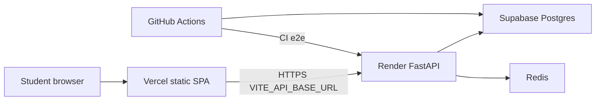
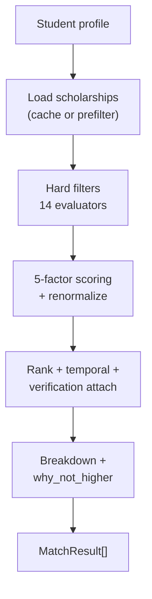
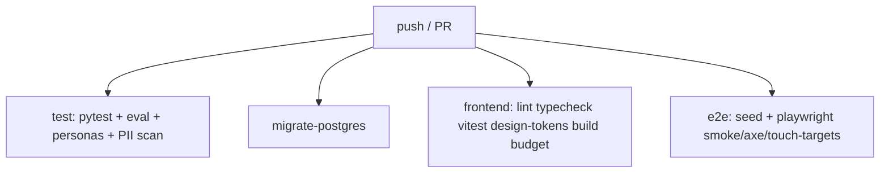
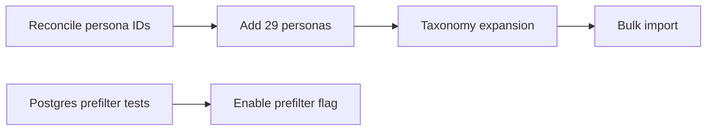
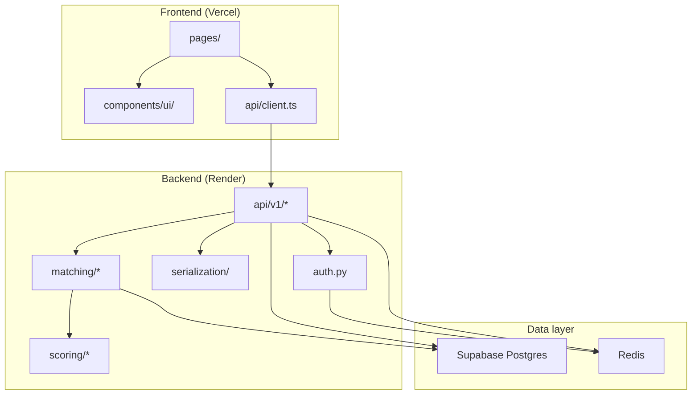

# ISKONNECT — Engineering Handoff (Phases 1–3)

**Document type:** Canonical engineering handoff  
**Owner:** Lead software architect / principal engineer (successor)  
**Last verified:** 2026-08-01  
**Repository root:** `scholarship-match/` (paths below are relative unless absolute)  
**Audience:** A senior engineer or AI agent with **no prior chat history** who must continue Phase 4 and Phase 5 safely.

> **Falsifiability rule (from Phase 3 Part XVII.3):** Every section states what would make it wrong. If a claim here disagrees with code, **code wins** — update this document and the source it cited together.

> **Authority:** This document is the **entry point**. Task semantics and long-range roadmap live in [`ISKONNECT_PRODUCT_REFINEMENT_MASTER_PLAN.md`](ISKONNECT_PRODUCT_REFINEMENT_MASTER_PLAN.md). Phase 3 execution detail lives in [`ISKONNECT_PHASE_3_MASTER_PLAN.md`](ISKONNECT_PHASE_3_MASTER_PLAN.md). Where those documents disagree on Phase 3 sequencing, the Phase 3 master plan wins — see [Section 12.1](#121-where-documents-disagree).

### Agent quick-start (Phase 4 / 5)

If you are a successor agent with no prior context, read in this order:

1. **[Section 13](#13-current-status)** — what is done vs not ready; launch blockers
2. **[Section 18](#18-next-recommended-steps)** — exact execution order (start here for implementation)
3. **[Appendix C](#appendix-c-contradiction-register)** — doc conflicts and false "done" claims (code wins)
4. **[Section 14](#14-phase-4)** + **[Section 15](#15-phase-5)** — scope for your phase
5. **[Section 16](#16-what-a-new-engineer-must-know-50-items)** — ranked guardrails before touching matching/auth

**Do first (Phase 4):** reconcile persona IDs (PR-01…41 vs shipped slugs) → fix false completions (SUBTRACT-09 redirect, ADR-006 income key) → Postgres prefilter parity → add remaining personas → catalog import toward 300 listings (with verification capacity plan updated).

**Do not:** public launch, enable `PLAN_PREFILTER_ENABLED` without Postgres tests, loosen eval oracle thresholds, or duplicate eligibility logic outside `eligibility_result.py`.

**Master plans for task IDs:** Refinement plan = long-range PRD; Phase 3 plan = truth/trust execution (authoritative for ADR numbering and MATCH-* IDs in repo).

---

## Table of contents

1. [Project overview](#1-project-overview)
2. [Architecture](#2-architecture)
3. [Phase history](#3-phase-history)
4. [Current product state](#4-current-product-state)
5. [Matching engine](#5-matching-engine)
6. [Design system](#6-design-system)
7. [Security](#7-security)
8. [Performance](#8-performance)
9. [Testing](#9-testing)
10. [Project decisions (ADRs)](#10-project-decisions-adrs)
11. [Known technical debt](#11-known-technical-debt)
12. [Product refinement](#12-product-refinement)
13. [Current status](#13-current-status)
14. [Phase 4](#14-phase-4)
15. [Phase 5](#15-phase-5)
16. [What a new engineer must know (50 items)](#16-what-a-new-engineer-must-know-50-items)
17. [Repository map](#17-repository-map)
18. [Next recommended steps](#18-next-recommended-steps)

Appendices: [A. Key file index](#appendix-a-key-file-index) · [B. Verification commands](#appendix-b-verification-commands) · [C. Contradiction register](#appendix-c-contradiction-register) · [G. Decision log](#appendix-g-decision-log)

---

## 1. Project overview

### 1.1 What ISKONNECT is

**ISKONNECT** (repo folder: `scholarship-match`; product name varies “Iskonnect” / “ISKONNECT”) is a **policy-aware scholarship discovery platform for Filipino students**. Students build a structured profile (academics, location, income, equity flags, documents); the platform applies **hard eligibility filters**, **Philippine policy-aware priority groups**, and a **transparent weighted scoring engine**, then explains *why* each program matched.

It is **not** a disbursement system, not an admissions predictor, and not a black-box recommender. It is a **discovery layer over third-party truth**: every listing is meant to carry provenance, verification metadata, and a link to the official provider site.

**Live stack (Public Beta, July 2026):** Vercel (React SPA) · Render (FastAPI) · Supabase (Postgres) · Redis (rate limits, cache, token denylist) · GitHub Actions (CI + scheduled jobs).

### 1.2 Why it exists

Scholarship information in the Philippines is scattered across CHED, DOST-SEI, TESDA, LGU portals, SUC pages, and private foundations. Students miss programs they qualify for, or waste time on ones they do not. Aggregators often optimize for volume, not **verified, explainable eligibility**.

ISKONNECT’s defensible asset (per Product Refinement §19.1) is **verified, explained, provenance-tracked scholarship data** — not catalog size alone.

### 1.3 Who the users are

| Persona | Needs | Device reality |
|--------|--------|----------------|
| **Senior high / incoming college** (Grade 11–12) | First exposure; jargon-heavy forms; mobile-first | Android phone, mobile data, 360px viewport |
| **Continuing college / TVET / ALS completers** | Income + GWA + field alignment; provisional matches when data sparse | Same; often shared devices |
| **Graduate / working students** | Fewer programs; age and enrollment constraints | Same |
| **Sponsors / schools (early portals)** | Review applications / verifications | Secondary; role-gated |
| **Maintainer / admin** | Staging import, verification, catalog health | Desktop |

Primary success metric is **trust per interaction**, not raw match count (Phase 3 anti-metrics: raising “matches shown” by loosening eligibility is a failure).

### 1.4 Product philosophy (Refinement §3, P1–P12)

Decision rules when options conflict (lower number wins):

1. **Trust before aesthetics** — never hide uncertainty to reduce clutter.
2. **Speed before animation** — motion ≤200ms on critical paths; interruptible.
3. **Mobile-first** — design at 360px first.
4. **Accessibility is functional** — WCAG 2.2 AA floor.
5. **Professional over flashy** — institution-grade, not marketing microsite.
6. **Consistency over novelty** — one pattern everywhere or replace everywhere.
7. **Radical transparency about data quality** — match score ≠ odds of winning.
8. **Clarity over completeness in copy** — Grade 11 reading level; Filipino terms where they are the real terms (GWA, 4Ps).
9. **Simple interfaces** — one primary action per screen.
10. **Evidence-based decisions** — measure before and after.
11. **Reliability over feature velocity** — empty/error/loading states are part of the feature.
12. **Inclusive by default** — equity groups are first-class, not “other”.

Decision rules when options conflict (lower number wins) — full list from Refinement §3:

| ID | Principle |
|----|-----------|
| P1 | Trust before aesthetics |
| P2 | Speed before animation |
| P3 | Mobile-first |
| P4 | Accessibility is functional (WCAG 2.2 AA) |
| P5 | Professional over flashy |
| P6 | Consistency over novelty |
| P7 | Radical transparency about data quality |
| P8 | Clarity over completeness in copy |
| P9 | Simple interfaces — one primary action per screen |
| P10 | Evidence-based decisions |
| P11 | Reliability over feature velocity |
| P12 | Inclusive by default |

When P7 conflicts with P5 (e.g. showing a scary "unknown deadline" badge), **P7 wins** — soften with glossary and next steps, never hide.

### 1.4b Engineering principles (E1–E15, Refinement §4)

| ID | Rule | Violation example |
|----|------|-------------------|
| E1 | Never break existing functionality | Merging without pytest/eval |
| E2 | Additive API only | Renaming JSON fields breaking SPA |
| E3 | Single eligibility source | New filter in router |
| E4 | Reuse primitives | Custom button on dashboard |
| E5 | Delete dead code with grep proof | Keeping unused route "just in case" |
| E6 | Split files >400 lines | Ignored — SUBTRACT-10 debt |
| E7 | `types.ts` mirrors schemas | Drift on profile shape |
| E8 | Test behavior at seams | Mocking entire eligibility engine |
| E9 | Ratchet coverage | Lowering pytest floor |
| E10 | Measure before optimizing | Prefilter on without timing |
| E11 | Server-Timing on hot paths | Blind Redis TTL change |
| E12 | No PII in logs | Logging email on auth failure |
| E13 | ADR for architecture | Supabase Auth without ADR |
| E14 | One concern per PR | Matching + landing rewrite |
| E15 | Catalog via staging workflow | SQL INSERT in prod |

### 1.5 Trust philosophy

Trust is **architectural**, not marketing copy:

- **`FieldEvidence`** (`app/models.py`) — per-field provenance (`source_url`, snippet, reviewer). Best single architectural decision per Phase 3 review.
- **Lifecycle honesty** — unknown status must not render as “Open now” (`TRUST-02`; `frontend/src/utils/scholarshipStatus.ts:109-120`).
- **Non-guarantee at decision points** — `MatchConfidenceNote` on cards, dashboard, modals (`TRUST-04`).
- **No fabricated social proof** — `/success-stories` is an honest empty stub.
- **External documents only** — student files are URLs (Drive links), not server-side storage (`applications.py` design).
- **RA 10173** — export + hard delete endpoints exist and are tested.

### 1.6 Recommendation philosophy

The **match score (0–100)** is **eligibility fitness**: alignment between profile and scholarship criteria. Weights: academic 30%, income 28%, field 22%, geographic 10%, equity priority 10% (`app/scoring/config.py`, policy `v1.1`). Non-applicable factors renormalize (`app/scoring/engine.py:34-45`).

It is **not**:

- Probability of acceptance
- Provider approval
- Competitive rank against other applicants

Copy and UI must say so (`MatchConfidenceNote`, `/transparency`, Terms). **Anti-metric:** rising average scores driven by placeholder defaults (e.g. missing GWA → 0.3 academic component) is a regression, not success.

### 1.7 Engineering philosophy (Refinement §4, E1–E15)

High-signal rules for successors:

- **E1:** Never break existing functionality — pytest + eval + persona + E2E gates.
- **E2:** Additive API changes only (Vercel and Render deploy independently).
- **E3:** Single source of truth — eligibility only in `eligibility_result.py`; status labels in `scholarshipStatus.ts` + `application_status.py`.
- **E4–E5:** Reuse primitives; delete dead code with grep evidence.
- **E6:** Split files >400 lines (deferred — see §11).
- **E7:** `types.ts` mirrors Pydantic schemas.
- **E8–E9:** Test behavior at seams; ratchet coverage.
- **E10–E11:** Performance budgets + Server-Timing before optimizing.
- **E12:** No PII in logs; consent before profile persist.
- **E13–E14:** ADRs for architecture; one concern per PR.
- **E15:** Catalog changes via staging workflow (`docs/verification.md`).

### 1.8 Why transparency beats “AI magic”

The product thesis (Phase 3 §1.2) is **correctness and honesty**, not opaque optimization:

- Matching is **deterministic** and **explainable** — every match carries breakdown + `why_not_higher` where applicable.
- **Fail-open on unknowns** is a product choice but must be **disclosed** (`unverified_requirements`, strict eval oracle).
- A 99.86% eval recall with a **lenient oracle** proves engine–oracle agreement, not real-world correctness (`eval/oracle.py`).
- Students and regulators can interrogate rules; black-box ML would contradict P7 and auditability.

### 1.9 What would make this section wrong

- Product positioning shifts to disbursement or admissions prediction.
- Match score marketing copy claims “chance of winning.”
- `FieldEvidence` or export/delete paths removed.

---

## 2. Architecture

### 2.1 System context



| Component | Role | Why separated |
|-----------|------|----------------|
| **Vercel** | Built React SPA only | Frontend has no secrets; CDN edge; independent deploy |
| **Render** | FastAPI `/api/v1/*`, Gunicorn+Uvicorn | Python backend; cold-start on free tier documented |
| **Supabase** | Postgres via SQLAlchemy + Alembic | Managed DB; **not** Supabase Auth — own JWT |
| **Redis** | Rate limits, catalog cache, plan cache, JWT denylist | Shared state across workers |
| **GitHub Actions** | CI, cron maintenance, keepalive | Ops without app runtime |

**Never** put `DATABASE_URL` or `SECRET_KEY` in Vercel (`docs/architecture.md`, `docs/deployment.md`).

### 2.2 Request path

1. User loads SPA (`frontend/src/App.tsx`).
2. `apiFetch()` (`frontend/src/api/client.ts`) calls Render.
3. Middleware stack on incoming request (last registered = outermost): **SecurityHeaders** → **RequestLogging** (+ `wall` Server-Timing) → **CORS** → **SlowAPI** (`app/main.py:166-177`).
4. Router handler → SQLAlchemy session → JSON via `app/serialization/scholarship.py` where applicable.

**Cold starts:** Render free tier 15–30s; `ApiWarmupBanner` after 3s (`P1-09`).

### 2.3 Backend layering (why)

| Layer | Path | Rationale |
|-------|------|-----------|
| API | `app/api/v1/` | HTTP, auth deps, rate limits |
| Matching | `app/matching/` | Eligibility + orchestration |
| Scoring | `app/scoring/` | Pluggable engine (`ScoringEnginePort`) |
| Taxonomy | `app/taxonomy/` | Regions, GWA, PSCED, schools |
| Serialization | `app/serialization/` | Single shape for API/cache/match |
| Jobs | `app/jobs/` | Cron: maintenance, links, digest |
| Scripts | `app/scripts/` | Import, seed, verification bundles |

**Eligibility authority:** only `evaluate_eligibility()` in `app/matching/eligibility_result.py`. `hard_filters.py` delegates to it — do not reintroduce parallel boolean helpers (`SUBTRACT-08 removed legacy helpers).

### 2.4 Authentication architecture (why own JWT)

- **Supabase** provides Postgres (+ optional Storage), **not** Supabase Auth.
- **HS256 JWT** access (30 min) + rotating refresh (7 days, ADR-008) in `app/auth.py`.
- **Admin role from DB**, not JWT claim alone (`auth.py:300-319` region — verify in file).
- **Refresh rotation** atomic; tested — do not rewrite lightly (Phase 3 “explicitly excellent”).
- Tokens in **`localStorage`** (`auth_token`, `auth_refresh_token`) — ADR-008 accepted risk; CSP compensating control (partial — see §7).

### 2.5 Data model (30 tables)

Headline entities (`app/models.py`):

- **Catalog:** `scholarships`, `field_evidence`, `organizations`, `scholarships_staging`
- **Users:** `users`, `students`, `refresh_tokens`
- **Matching:** `match_runs`, `match_results`
- **Engagement:** `saved_scholarships`, `applications`, `document_checklists`, `notifications`
- **Trust:** `scholarship_reports`, `audit_logs`, `product_feedback`
- **Portals:** `sponsors`, `schools`, verification tables
- **Deferred vertical:** `hte_partners`, `internship_opportunities`, `ojt_compliance_vault` (no API — SUBTRACT-03 defer)

**Alembic head:** `043_scholarship_versions_cascade` (43 migrations).

Four overlapping scholarship state fields documented in [`catalog-state-machine.md`](catalog-state-machine.md): `is_active`, `editorial_state`, `data_status`, `application_status`.

### 2.6 Matching pipeline (summary)

See [Section 5](#5-matching-engine). `/plan/{profile_id}` (`app/api/v1/matches.py`):

1. Plan cache lookup (Redis, 600s TTL)
2. Load scholarships (full catalog cache **or** SQL prefilter if `PLAN_PREFILTER_ENABLED`)
3. `MatchService.get_matches()` → filter → score → rank → temporal/freshness/verification attach
4. Timeline + preparation plan
5. Cache store

### 2.7 Frontend architecture (why)

- **React 18 + Vite 6 + TypeScript strict** — SPA, no SSR.
- **No React Query** (ADR-005 pending measurement) — Context + `useEffect` + `apiFetch`; offline search cache in IndexedDB.
- **Three shells:** `PublicLayout`, `DashboardLayout` (auth required), `AdaptiveSearchLayout` (public search with optional dashboard chrome).
- **Lazy routes** except auth pages — `manualChunks` for vendor/radix/sentry/framer-motion (`vite.config.ts`).

### 2.8 CI/CD and ops

**CI** (`.github/workflows/ci.yml`): `test` (pytest 70% cov + eval + personas) · `migrate-postgres` · `frontend` (lint, typecheck, vitest, dev-strings, build, bundle budget) · `e2e` (Postgres + seed + uvicorn + preview + Playwright smoke/axe).

**Scheduled:** catalog maintenance, link checker, deadline reminders, retention scan, keepalive (5 min), weekly digest.

**Monitoring intent (OPS-03):** API 5xx, `/plan` p95, auth failure spike, incorrect-listing reports — **not fully wired** (§13).

### 2.9 API surface (23 routers)

Registered in `app/main.py:179-202` (order matters for path conflicts — e.g. `sample-matches` before `{profile_id}`):

| Router module | Domain |
|---------------|--------|
| `auth_routes` | Login, register, refresh, logout, verify email |
| `profiles` | CRUD student profiles |
| `product_features` | Sample matches, feature flags |
| `scholarships` | Detail, list by ID |
| `scholarship_search` | Paginated search + filters |
| `scholarship_staging` | Admin staging import |
| `matches` | `/plan/{profile_id}` generation |
| `match_history` | Past match runs |
| `saved_scholarships` | Bookmarks |
| `applications` | Application tracking |
| `suggestions` | Autocomplete / suggestions |
| `reports` | Incorrect listing reports |
| `organizations` | Provider orgs |
| `notifications` | In-app notifications |
| `analytics` | Product analytics events |
| `feedback_routes` | Product feedback |
| `sponsor_portal` | Sponsor role workflows |
| `school_portal` | School role workflows |
| `scoring_admin` | Scoring policy admin |
| `audit_routes` | Audit log access |
| `admin_extended` | Extended admin ops |
| `admin_catalog` | Catalog admin |
| `admin_queues` | Verification queues |

**Auth tiers:** public (search, detail), authenticated (profile, plan, saved, applications), admin (`require_admin`), portal roles (sponsor/school deps). Cross-user isolation is pytest-covered — copy existing `Depends` patterns on new routes.

**Health:** `GET /health` at `main.py:205` checks DB + optional Redis ping.

### 2.10 Middleware order (critical)

Registration in `main.py:167-177` (Starlette: **last added = outermost** on incoming requests):

1. `CORSMiddleware` (inner)
2. `RequestLoggingMiddleware`
3. `SecurityHeadersMiddleware` (outer)

Server-Timing `wall` header is attached in the logging layer. Do not reorder without checking CORS preflight and header visibility.

### 2.11 Redis usage inventory

| Use | Behavior if Redis absent |
|-----|--------------------------|
| JWT denylist / revocation | **Fail-closed** on refresh (SEC-02) |
| Rate limiting (SlowAPI) | Degraded / in-memory fallback per config |
| Plan result cache | Cache miss → recompute (slower) |
| Catalog snapshot cache | Cache miss → DB load |

Keys are implementation details in cache modules — grep `redis` under `app/` when changing TTLs.

### 2.12 Serialization trust contract

`app/serialization/scholarship.py` defines the API-facing scholarship shape including trust keys (`data_status`, `application_status`, `editorial_state`, verification fields, requirement payloads). Frontend `scholarshipStatus.ts` must stay aligned with backend enums — dual maintenance is intentional until taxonomy ADR-004 lands.

### 2.13 What would make this section wrong

- Migration to Supabase Auth or cookie-only sessions without updating this doc.
- Matching logic duplicated outside `eligibility_result.py`.
- RLS policies added without ADR update.

---

## 3. Phase history

### 3.1 Prototype arc (v0.1 – v1.6, Dec 2025 – Apr 2026)

From `.cursor/plans/00_INDEX.md` and `frontend/src/data/changelog.ts`:

| Version | When | Milestone |
|---------|------|-----------|
| v0.1 | Dec 2025 | Backend foundation, auth research |
| v0.2 | Jan 2026 | FastAPI + DB model |
| v0.5 | Feb 2026 | End-to-end student flows |
| v0.8 | Mar–Jun 2026 | Matching, search, admin, security |
| v1.0 Beta | Jul 2026 | Public beta label, polish |

**Built:** explainable engine, accounts, search, bookmarks, applications, document checklists, sponsor/school/admin portals, staging import, deploy (Vercel+Render+Supabase), refresh-token rotation, cross-user authz tests, RA 10173 export/delete, eval harness.

### 3.2 Phase 1 — Measure and critical fixes (P1-01 … P1-11)

**Goal:** Remove login friction and mobile blockers before design-system work (`ISKONNECT_PRODUCT_REFINEMENT_MASTER_PLAN.md` §20).

| Task | Deliverable | Evidence |
|------|-------------|----------|
| P1-01 | Server-Timing + client perf marks | `app/utils/server_timing.py`, `perf-baseline.md` template |
| P1-02 | Touch-target inventory | 133 violations pre-viewport → **0** post-M0 (`touch-target-inventory.md`) |
| P1-03 | Remove `/auth/me` on login path | `has_profile` in login response |
| P1-04 | Dashboard redirect after first profile complete | Celebratory state |
| P1-05 | Register → profile builder if no profile | `getPostAuthPath()` |
| P1-06 | Centralized email validation | Client + server |
| P1-07 | Route-shaped skeletons | No bare “Loading…” |
| P1-08 | BottomNav on search layout | BL-11 fix |
| P1-09 | Cold-start banner @ 3s | `ApiWarmupBanner` |
| P1-10 | Primary color ramp fix | BL-01 |
| P1-11 | Keepalive 5 min + secondary pinger | `.github/workflows/keepalive*.yml` |

**Metrics intent:** login → skeleton ≤200ms; dashboard content improved ≥30% warm p75 (tables in `perf-baseline.md` still **empty** — gap).

**Lessons:** Measure first (E10/E11); perceived perf (skeletons) ships before backend optimization.

### 3.3 Phase 2 — Design system and mobile (DS-01 … MOB-16)

**Goal:** One visual system, 44px targets, shadcn-style primitives, token layer (`PHASE-2-EXIT-report.md`).

| Theme | Outcomes |
|-------|----------|
| Tokens | CSS variables in `index.css`, Tailwind mapping (ADR-001) |
| Typography | Inter body + Russo One display only (ADR-003); self-hosted fonts |
| Primitives | ~21 `components/ui/*` (shadcn-style; no separate ADR) |
| Motion | framer-motion landing only (ADR-002); reduced-motion global |
| Badges | Lifecycle + qualification on semantic tone tokens |
| Mobile | Filter bottom sheet, safe areas, responsive tables |
| Guards | Design-token checker, touch probe, contrast unit test |
| Reference | `/design-system` route (dev; not in prod nav) |

**Lighthouse baseline (Phase 2 exit):** mobile landing/search **Performance 67**; Accessibility 90–96 (`lighthouse-phase-2-baseline.md`).

**Deferred:** Full raw-palette sweep (~3,200 utilities outside guarded paths); landing LAND-* → Phase 5.

### 3.4 Phase 3 — Truth, trust, launch readiness (M0–M8)

**Canonical spec:** [`ISKONNECT_PHASE_3_MASTER_PLAN.md`](ISKONNECT_PHASE_3_MASTER_PLAN.md) — **supersedes** Refinement §20’s “Phase 3 = perf/a11y/audit” block. Phase 3 reframes prior Phase 3 work as **M5/M6/M7** inside truth-first milestones.

#### M0 — Stop the harm (TRUST-01 … 05)

| ID | Fix |
|----|-----|
| TRUST-01 | Profile draft preserved anonymous→auth (`mergeProfileDrafts`, `AuthContext`) |
| TRUST-02 | Unknown lifecycle → `needs_verification`, not `open` |
| TRUST-03 | `today_manila()` for deadlines |
| TRUST-04 | `MatchConfidenceNote` at decision points |
| TRUST-05 | “Not calculated yet” vs 0% |

Report: `reports/TRUST-01-report.md`.

#### M1 — Safety net (QA-01 … 06)

| ID | Fix |
|----|-----|
| QA-01 | Postgres + uvicorn + `seed_ci_e2e.py` in CI |
| QA-02 | 6 Playwright smoke paths |
| QA-03 | pytest-cov **70%** ratchet; vitest thresholds at measured baseline (A8) |
| QA-04 | axe on 12 routes (hard gate); jsx-a11y on `ui/**` |
| QA-05 | 12 personas (`test_persona_matching.py`) |
| QA-06 | Bundle budget script |

#### M2 — Truthful matching (MATCH-01 … 08)

Provisional disclosure, strict eval oracle + over-inclusion **0.047%** baseline, `almost_qualified` (ADR-006), citizenship UNKNOWN, geographic `cities_match`, catalog state machine doc, prefilter parity tests.

Reports: `MATCH-01-report.md`, `MATCH-02-report.md`.

#### M3 — Launch security (SEC-01 … 09)

Fail-closed config, Redis revocation fail-closed, CSP report-only in SPA, ADR-008/009, PII scrub, deletion rate limit, 10-char passwords, erasure path, security checklist.

#### M4 — Honest interface (CLARITY-01 … 08)

`errorCopy.ts`, glossary, step validation, completion meter fix, mobile search reorder, register copy, CI dev-string guard.

#### M5 — Performance (PERF-*)

manualChunks, hero JPG removal, plan cache, prefilter flag (default off), Server-Timing on hot paths, N+1 fix on applications.

#### M6 — Accessibility (A11Y-*)

SkipLink, `<main id="main-content">`, focus ring, dialog migrations, combobox ARIA (partial), LiveRegion, axe in CI (**soft** assertions — gap).

#### M7 — Subtract (SUBTRACT-*)

`codebase-audit-2026Q3.md`, dead code removed, shared error banner; **SUBTRACT-09 redirect not implemented**; SIPP tables deferred; SUBTRACT-10 not done.

#### M8 — Launch gate (OPS-*)

`catalog-readiness.md` (**Do not launch** ~24 listings), `verification-capacity.md`, ADR-001–009, `PHASE-3-EXIT-report.md`, monitoring **partial**.

### 3.5 Verification state (2026-08-01)

| Gate | Status |
|------|--------|
| pytest 352 @ 71.42% | Green locally |
| Eval regression | Green |
| 12 personas | Green |
| Frontend lint/typecheck/test/build | Green |
| E2E smoke + axe (desktop) | In CI |
| PAT/EAT human | **Not signed** |
| Lighthouse 67→90 post-M5 | **Not re-run** |
| NVDA/TalkBack | Template only (`a11y-manual-pass.md`) |

### 3.6 Major regressions prevented

- Profile wipe at registration (TRUST-01)
- “Open now” for unknown status (TRUST-02)
- Manila deadline bug on UTC hosts (TRUST-03)
- Silent fail-open matching unmeasured (MATCH-02 strict oracle)
- Unsafe production config if `ENVIRONMENT` unset (SEC-01 inverted default)
- Token revocation no-op without Redis (SEC-02)

### 3.7 Lessons learned

1. **Correctness gates beat category-ordered milestones.**
2. **Personas before taxonomy expansion** (Phase 4 dependency).
3. **Document disagreements explicitly** — task ID collisions caused confusion.
4. **“Done” requires code verification**, not report checkboxes (SUBTRACT-09, axe hard gate).
5. **Solo maintainer:** catalog size and verification throughput are launch constraints (`OPS-02`).

### 3.9 Phase reports catalog (falsifiable sequence)

All under `docs/engineering/reports/`:

| Report | Phase | Proves |
|--------|-------|--------|
| `P1-01-report.md` … `P1-11-report.md` | Phase 1 | Each critical fix with before/after intent |
| `M0-report.md` | Phase 3 M0 | Viewport/touch baseline |
| `PHASE-2-EXIT-report.md` | Phase 2 | Design system exit |
| `TRUST-01-report.md` | Phase 3 M0 | Trust fixes TRUST-01…05 |
| `MATCH-01-report.md`, `MATCH-02-report.md` | Phase 3 M2 | Provisional + strict oracle |
| `QA-01-report.md` | Phase 3 M1 | CI Postgres + E2E |
| `PHASE-3-EXIT-report.md` | Phase 3 M8 | Milestone checklist (**verification gaps remain — §13**) |

Reports are the **reliable timeline** when all doc headers share the same date (2026-07-31).

### 3.10 Prototype changelog highlights (`frontend/src/data/changelog.ts`)

Public-facing version history from v0.1.0 through v1.0.0 Beta documents student-visible milestones: first profile builder, matching explanations, saved scholarships, mobile improvements, transparency pages, beta label. Cross-check against `.cursor/plans/00_INDEX.md` for internal prototype plan IDs (v1.0–v1.6).

### 3.11 Phase 3 milestone task map (abbreviated)

| Milestone | Task prefixes | Theme |
|-----------|---------------|-------|
| M0 | TRUST-* | Stop trust harm |
| M1 | QA-* | CI safety net |
| M2 | MATCH-* | Matching truth |
| M3 | SEC-* | Security hardening |
| M4 | CLARITY-* | Copy/UX honesty |
| M5 | PERF-* | Performance |
| M6 | A11Y-* | Accessibility |
| M7 | SUBTRACT-* | Audit + delete |
| M8 | OPS-* | Launch gates + docs |

Full task IDs and acceptance criteria: `ISKONNECT_PHASE_3_MASTER_PLAN.md` Parts IV–XII.

### 3.13 What would make this section wrong

- New phase renumbering without updating this timeline.
- Git history becomes available and contradicts report-only sequencing.

---

## 4. Current product state

Thirteen feature areas with maturity, limitations, and pointers.

### 4.1 Authentication and onboarding

| Aspect | State |
|--------|-------|
| **Maturity** | Production-ready core |
| **Implementation** | `app/auth.py`, `frontend/src/context/AuthContext.tsx`, `RegisterPage`, `LoginPage` |
| **Strengths** | Refresh rotation, denylist, `has_profile` on login, post-auth routing |
| **Limitations** | localStorage tokens; 10-char password floor; no MFA |
| **Future** | Cookie migration (ADR-008 review 2026-10-31); OAuth if ever needed |

### 4.2 Profile builder and dashboard

| Aspect | State |
|--------|-------|
| **Maturity** | Production-ready with known edge cases |
| **Implementation** | `ProfileBuilderPage`, `ProfileDashboard.tsx`, `profiles.py` |
| **Strengths** | Draft merge (TRUST-01), step validation (CLARITY-03), completion meter fix (CLARITY-04) |
| **Limitations** | Large files (`ProfileDashboard.tsx` ~840 lines); some fields still sparse for provisional matches |
| **Future** | Split dashboard; expand persona coverage before new fields |

### 4.3 Scholarship search and catalog browse

| Aspect | State |
|--------|-------|
| **Maturity** | Beta — functional, catalog thin |
| **Implementation** | `ScholarshipSearchPage.tsx`, `scholarships.py`, offline cache |
| **Strengths** | Paginated search, filter sheet mobile, lifecycle badges |
| **Limitations** | ~24 seeded listings vs ≥300 launch gate |
| **Future** | DATA-* import pipeline; fix opportunity routing |

### 4.4 Matching and plan (`/plan`)

| Aspect | State |
|--------|-------|
| **Maturity** | Engine verified; UX honest |
| **Implementation** | `matches.py`, `MatchService`, `PlanPage` |
| **Strengths** | Explainability, provisional disclosure, plan cache, optional prefilter |
| **Limitations** | Prefilter off by default; unpaginated match history; p95 unmeasured in prod |
| **Future** | ADR-007 flip after Postgres parity proof; PERF-12 pagination on list endpoints |

### 4.5 Scholarship detail and transparency

| Aspect | State |
|--------|-------|
| **Maturity** | Production-ready |
| **Implementation** | `ScholarshipDetailPage.tsx`, `TransparencyPage`, `MatchMethodologyPage` |
| **Strengths** | Trust keys in serialization, glossary terms, report incorrect listing |
| **Limitations** | `/match-methodology` still separate route (SUBTRACT-09 not done); axe ruleset differs on detail page |
| **Future** | Consolidate methodology into transparency or implement redirect |

### 4.6 Saved scholarships and applications

| Aspect | State |
|--------|-------|
| **Maturity** | Production-ready |
| **Implementation** | `saved_scholarships.py`, `applications.py`, dashboard tabs |
| **Strengths** | Status machine aligned frontend/backend |
| **Limitations** | `GET /applications` unpaginated; N+1 fixed in M5 but large users untested |
| **Future** | Pagination; notification digests |

### 4.7 Document checklists

| Aspect | State |
|--------|-------|
| **Maturity** | Beta |
| **Implementation** | Checklist models + UI on detail/application flows |
| **Strengths** | Tied to scholarship requirements |
| **Limitations** | No file upload — URL-only by design |
| **Future** | Optional Supabase Storage if policy changes |

### 4.8 Admin, staging, verification

| Aspect | State |
|--------|-------|
| **Maturity** | Maintainer-ready; not scaled for 300+ listings solo |
| **Implementation** | `AdminPage.tsx` (~1,236 lines), staging import, `verification.md` |
| **Strengths** | 4-layer verification model, CSV contract, audit logs |
| **Limitations** | 30-day staleness SLA unrealistic at scale (`verification-capacity.md`); monolithic admin UI |
| **Future** | Verification queue UX; split admin modules |

### 4.9 Sponsor and school portals

| Aspect | State |
|--------|-------|
| **Maturity** | Early / role-gated |
| **Implementation** | Sponsor/school routers, verification workflows |
| **Strengths** | Separate authz paths tested |
| **Limitations** | Low real-world usage; partnership gate in Refinement §19.2 not met |
| **Future** | Phase 5 partnership tasks |

### 4.10 Notifications and feedback

| Aspect | State |
|--------|-------|
| **Maturity** | Functional |
| **Implementation** | `notifications.py`, digest cron, `product_feedback` |
| **Strengths** | Weekly digest job exists |
| **Limitations** | Push/email depth limited |
| **Future** | Deadline reminder tuning |

### 4.11 PWA and offline

| Aspect | State |
|--------|-------|
| **Maturity** | Partial |
| **Implementation** | `vite-plugin-pwa`, Workbox `NetworkOnly` on auth API paths |
| **Strengths** | Offline scholarship search cache |
| **Limitations** | No offline plan generation |
| **Future** | Mobile readiness checklist items |

### 4.12 Design system and marketing shell

| Aspect | State |
|--------|-------|
| **Maturity** | Phase 2 complete; landing Phase 5 |
| **Implementation** | `/design-system`, landing sections, tokens |
| **Strengths** | Consistent primitives on app routes |
| **Limitations** | Landing still has motion-heavy sections; raw palette debt outside guarded paths |
| **Future** | LAND-* tasks Phase 5 |

### 4.13 Ops, monitoring, compliance

| Aspect | State |
|--------|-------|
| **Maturity** | Documentation > wiring |
| **Implementation** | Cron jobs, security checklist, export/delete |
| **Strengths** | RA 10173 endpoints, config guards |
| **Limitations** | OPS-03 monitoring unwired; PAT/EAT unsigned; CSP enforcing phase missing |
| **Future** | Sign checklists; wire alerts |

### 4.14 What would make this section wrong

- Feature shipped without updating this matrix.
- Catalog crosses 300 published without updating readiness doc.

---

## 5. Matching engine

**Authority:** `app/matching/` (~2,380 lines across 9 modules). **Do not duplicate eligibility logic elsewhere.**

### 5.1 Pipeline diagram



### 5.2 Hard filters (14 evaluators)

Implemented in `eligibility_result.py` with per-key **fail-open** vs **fail-closed** behavior:

| Filter key | Typical behavior when data missing |
|------------|-------------------------------------|
| `citizenship` | Fail-open → UNKNOWN (MATCH-03) |
| `income` | Fail-closed over ceiling when known |
| `gwa` | Fail-open below threshold when unknown |
| `field_of_study` | Fail-open |
| `region` / `city` | Geographic matcher with `cities_match` |
| `age`, `enrollment`, `graduation_year`, etc. | Per-key tables in code |

**Expired deadlines:** `FILTER_EXPIRED_FROM_MATCHES` defaults `true` in `app/config.py:91-94`; consumed in `_evaluate_data_status` at `eligibility_result.py:217-219`. Documented in `docs/deployment.md` and `docs/engineering/security-checklist.md` (A1, 2026-08-01).

### 5.3 Eligibility state machine

`_derive_status()` at `eligibility_result.py:904-919`:

| Status | Meaning |
|--------|---------|
| `eligible` | All hard requirements met |
| `almost_qualified` | Achievable unmet keys only (ADR-006) |
| `not_eligible` | Hard fail |
| `provisional` | Sparse profile; fail-open paths active |
| `unverified_requirements` | Scholarship criteria incomplete |

**ADR-006 vs code:** ADR lists `income` as achievable; `_ACHIEVABLE_UNMET_KEYS` (`eligibility_result.py:71-73`) **excludes** `income` so over-ceiling income stays `not_eligible` — **code is correct**; ADR must be corrected.

### 5.4 Scoring

Weights in `app/scoring/config.py`: academic **30**, income **28**, field **22**, geographic **10**, equity **10**; `policy_version` **v1.1**.

Renormalization when factors N/A (`engine.py:34-45`). Score is **not** probability.

### 5.5 Dual oracle (eval harness)

| Mode | Purpose |
|------|---------|
| **Lenient** | Regression gate: recall ≥0.99, precision ≥0.995, FP ≤10 (`test_eval_regression.py`) |
| **Strict** | Over-inclusion ≤0.047% baseline (MATCH-02) |

Lenient oracle proves **internal consistency**, not ground truth.

### 5.6 Personas (12 shipped)

`app/tests/test_persona_matching.py` + fixtures — IDs like `maria_freshman_stem`, `minimal_profile` (**not** Refinement `PR-01…PR-41`). Phase 4 must reconcile naming before adding 29 more.

### 5.7 Prefilter parity

`test_plan_prefilter_parity.py` runs on **SQLite** in the main `test` job and on **Postgres** (jsonb columns, migration 029) in the `migrate-postgres` CI job. `_prefilter_scholarships_query` uses `json_list_contains` / `json_list_empty` so ILIKE works on both dialects. `PLAN_PREFILTER_ENABLED` remains **off** until p95 validation (ADR-007).

### 5.8 Edge cases to preserve

- Manila `today_manila()` for deadlines (TRUST-03)
- Citizenship UNKNOWN fail-open with disclosure
- Income over ceiling → not eligible (not almost_qualified)
- Provisional matches must show confidence note
- Senior-high recall gate ≥0.95 in eval regression

### 5.9 Hard-filter evaluator registry (line-indexed)

All evaluators live in `eligibility_result.py` and compose into `_EVALUATOR_REGISTRY` at line 876:

| Evaluator | Start line | Keys / notes |
|-----------|------------|--------------|
| `_evaluate_data_status` | 217 | Expired/broken when `filter_expired_from_matches` true (`config.py:91-93`) |
| `_evaluate_age` | 240 | Min/max age |
| `_evaluate_education_level` | 260 | SHS/college/TVET/ALS |
| `_evaluate_region` | 298 | Region + city |
| `_evaluate_school` | 404 | Named school |
| `_evaluate_school_category` | 483 | SUC/private/etc. |
| `_evaluate_year_level` | 520 | Year level |
| `_evaluate_enrollment_status` | 566 | Enrollment state |
| `_evaluate_citizenship` | 603 | UNKNOWN fail-open (MATCH-03) |
| `_evaluate_school_type` | 636 | Public/private |
| `_evaluate_income` | 673 | Over ceiling → NOT_ELIGIBLE |
| `_evaluate_gwa` | 739 | GWA threshold |
| `_evaluate_field` | 772 | Field / PSCED |
| `_evaluate_members_only` | 840 | Membership gates |

**Status derivation** (`_derive_status`, lines 904-919): single achievable UNMET → `almost_qualified`; other UNMET → `not_eligible`; UNKNOWN → `provisionally_qualified`; unverified MET → provisional; else `qualified`. Achievable keys at lines 71-73 exclude `income` despite ADR-006 table listing it.

### 5.10 Scoring and verification (detail)

Scoring weights in `config.py:15-21`; renormalization in `engine.py`. Document readiness removed from score in M4. Four-layer verification: staging import → automated cron → human review → user reports (`verification.md`). Overlapping scholarship state fields documented in `catalog-state-machine.md`.

Eval CI thresholds: recall ≥0.99, precision ≥0.995, FP ≤10, senior-high recall ≥0.95, explanation ≥0.95, strict over-inclusion ≤0.047%.

### 5.11 Roadmap (Phase 4+)

- Remaining 29 personas (`MATCH-07` Refinement sense vs Phase 3 sense — see Appendix C)
- Postgres prefilter parity tests
- Taxonomy expansion per Refinement §15
- Catalog depth for meaningful recall metrics

### 5.12 What would make this section wrong

- New filter added outside `eligibility_result.py`.
- Achievable keys changed without ADR + persona + eval updates.
- Strict oracle baseline loosened without report.

---

## 6. Design system

### 6.1 Token layer (ADR-001)

CSS variables in `frontend/src/index.css` — semantic colors (`--primary`, `--destructive`, `--muted`), spacing, radii, focus ring. Tailwind maps via `tailwind.config.js`.

**Guard:** `scripts/check-design-tokens.mjs` — **not in CI** (gap).

### 6.2 Typography (ADR-003)

- **Body:** Inter (self-hosted)
- **Display:** Russo One only
- Refinement §5.1 (Google Fonts + Montserrat) is **historical** — invalidated Phase 2

### 6.3 Primitives (~21 in `components/ui/`)

shadcn-style: `Button`, `Card`, `Dialog`, `Sheet`, `Input`, `Select`, `Badge`, `Alert`, etc. **Rule:** new UI uses primitives; no one-off raw Tailwind on app routes (E4).

Reference route: `/design-system` (dev).

### 6.4 Motion (ADR-002)

- Landing: framer-motion allowed
- App routes: CSS transitions ≤200ms
- `prefers-reduced-motion` honored globally

### 6.5 Color, badges, focus

- Lifecycle badges: `scholarshipStatus.ts` + semantic tokens
- Qualification badges on cards (`ScholarshipCardV2.tsx`)
- Focus ring token; skip link (`SkipLink.tsx`); `<main id="main-content">` on all shells

### 6.6 Touch targets

44px minimum; inventory **0 violations** post-M0. Playwright touch probe exists but **cannot fail CI** (`expect(allViolations.length).toBeGreaterThanOrEqual(0)`).

### 6.7 How to build new UI

1. Check `/design-system` and existing patterns on same route type.
2. Use `ui/*` primitives + semantic tokens.
3. Add glossary term if domain jargon (`GlossaryTerm.tsx`).
4. Wire loading/error/empty via `errorCopy.ts` patterns.
5. Run vitest if logic; axe route if new page.
6. Do not add React Query until ADR-005 measurement task completes.

### 6.8 UI primitive inventory (`frontend/src/components/ui/`)

Representative set (~21 files): `alert`, `badge`, `button`, `card`, `checkbox`, `dialog`, `dropdown-menu`, `input`, `label`, `select`, `sheet`, `skeleton`, `switch`, `tabs`, `textarea`, `tooltip`, and related Radix wrappers. Import from `@/components/ui/*` — do not fork variants per page.

**jsx-a11y** eslint rules apply to `ui/**` per QA-04. When adding a primitive, mirror existing focus/disabled/aria patterns from `dialog` or `sheet`.

### 6.9 Frontend route map (selected)

From `frontend/src/App.tsx` — auth pages eager-loaded; most others lazy.

**Public marketing / trust**

| Path | Component | Notes |
|------|-----------|-------|
| `/` | Landing | framer-motion allowed |
| `/how-it-works`, `/why-iskonnect` | Info | |
| `/transparency` | TransparencyPage | Trust hub |
| `/match-methodology` | MatchMethodologyPage | **Still separate** (SUBTRACT-09) |
| `/how-we-verify` | VerificationPage | |
| `/faq`, `/terms`, `/about`, `/contact` | Static trust | |
| `/success-stories` | Empty honest stub | P7 |

**Catalog / search**

| Path | Component | Notes |
|------|-----------|-------|
| `/scholarships/search` | ScholarshipSearchPage | Paginated; partial combobox a11y |
| `/scholarships/:id` | ScholarshipDetailPage | Large file (~707 lines) |
| `/opportunities/:typeSlug` | OpportunityComingSoonPage | Available slugs redirect (e.g. scholarships → search); others show coming soon |

**Auth**

| Path | Notes |
|------|-------|
| `/login`, `/register` | Eager loaded |
| `/forgot-password`, `/reset-password`, `/verify-email` | |

**Authenticated app** (DashboardLayout)

| Path | Notes |
|------|-------|
| `/dashboard` | ProfileDashboard |
| `/profile-builder` | Multi-step |
| `/plan` | Match plan |
| `/applications`, `/settings` | |
| `/admin` | AdminPage (~1,236 lines) |

**Dev-only:** `/design-system` — component reference.

### 6.10 PWA and service worker

`vite-plugin-pwa` configures Workbox. Authenticated API paths use **NetworkOnly** — no stale private data offline. Scholarship search may use IndexedDB cache for browse resilience; plan generation requires network.

### 6.12 What would make this section wrong

- New Montserrat or Google Fonts dependency.
- Raw hex colors on guarded app routes without token migration.

---

## 7. Security

### 7.1 Authentication and session security

| Control | Implementation | Notes |
|---------|----------------|-------|
| Access JWT | HS256, 30 min | `app/auth.py` |
| Refresh token | Rotating, 7 days | ADR-008; atomic rotation tested |
| Revocation | Redis denylist | Fail-closed if Redis down (SEC-02) |
| Admin | DB role check | Not JWT claim alone |
| Password | Min 10 chars | SEC-07 |

**Residual risk:** Tokens in `localStorage` — XSS exfiltration; mitigations partial (CSP report-only only).

### 7.2 Authentication flow (step-by-step)

1. **Register / login** — `POST /api/v1/auth/register` or `login`; returns access + refresh JWT and `has_profile` flag (P1-03).
2. **Client storage** — `AuthContext` writes tokens to `localStorage` keys `auth_token` and `auth_refresh_token` (ADR-008).
3. **Authenticated requests** — `apiFetch` attaches `Authorization: Bearer <access>`.
4. **Access expiry** — Client refreshes via `POST /api/v1/auth/refresh` with rotation; old refresh invalidated.
5. **Logout** — Refresh token jti added to Redis denylist; access token short-lived.
6. **Redis down** — Refresh path **fail-closed** (SEC-02); user must re-login when access expires.
7. **Admin** — Separate `require_admin` dependency; role from DB not JWT alone.

Do not shorten access TTL without updating banner/copy; do not store refresh in sessionStorage without threat model update.

### 7.3 Configuration guards (SEC-01)

`app/config.py`: `resolved_validation_environment()` treats **unset `ENVIRONMENT` as production** — prevents accidental debug defaults in prod.

Required secrets validated at startup; weak defaults rejected in production mode.

### 7.4 RA 10173 (Data Privacy Act)

- **Export:** user data export endpoint
- **Erasure:** hard delete with rate limiting (SEC-08)
- **PII scrubbing:** logging middleware scrubs known patterns (SEC-06)
- **Consent:** profile persist requires explicit consent path (E12)

### 7.5 Security headers and CSP

- **Backend:** `app/middleware/security_headers.py` — HSTS, X-Frame-Options, etc.; **CSP deliberately omitted** (lines 19-20)
- **Frontend:** CSP **report-only** meta in `frontend/index.html` (SEC-03)
- **Enforcing CSP phase:** **Not shipped** — SEC-03 stopped at report-only

### 7.6 Threat model (summary)

| Threat | Mitigation | Residual |
|--------|------------|----------|
| XSS → token theft | CSP (partial), React escaping | localStorage exposure |
| IDOR on profiles/apps | Auth deps + tests | New endpoints must copy pattern |
| Token replay after logout | Redis denylist | Redis outage → fail-closed (good) but availability hit |
| Scraping / abuse | SlowAPI rate limits | Tuning needed at scale |
| Incorrect catalog harm | Reporting + verification | Catalog depth low |
| Config leak | Env-only secrets | Developer discipline |

### 7.7 ADR-008 / ADR-009

- **ADR-008:** Refresh rotation + localStorage tradeoff; review 2026-10-31
- **ADR-009:** Fail-closed security defaults

See [Section 10](#10-project-decisions-adrs).

### 7.8 Security checklist

`docs/security-checklist.md` — pre-launch items; several open (CSP enforce, monitoring).

### 7.9 What would make this section wrong

- Cookie-only auth shipped without doc update.
- CSP enforcing deployed but doc still says report-only.

---

## 8. Performance

### 8.1 Known bottlenecks

| Area | Issue | Mitigation shipped |
|------|-------|-------------------|
| `/plan` | Full catalog scan | Plan cache 600s; optional SQL prefilter (off) |
| Render cold start | 15-30s free tier | Keepalive + banner |
| Bundle size | Large vendor | manualChunks; hero JPG removed |
| Applications list | N+1 queries | Fixed M5 |
| Unpaginated lists | `/applications`, saved, match-runs | PERF-12 partial |

### 8.2 Frontend bundle strategy

`vite.config.ts` `manualChunks`: vendor, radix, sentry, framer-motion separated.

`scripts/check-bundle-budget.mjs`: entry ≤120 KB gzip, vendor ≤420 KB gzip vs measured **~43.7 KB / ~109.7 KB** — ~4× headroom (not ratcheted).

### 8.3 Backend caching (Redis)

| Key pattern | TTL | Purpose |
|-------------|-----|---------|
| Plan results | 600s | Hot path |
| Catalog snapshot | varies | Scholarship load |
| Rate limit counters | window | SlowAPI |

### 8.4 Server-Timing

`app/utils/server_timing.py` on hot paths; client marks in perf baseline template.

### 8.5 Budgets vs actuals

| Metric | Budget / target | Actual (known) |
|--------|-----------------|----------------|
| Lighthouse mobile perf | 90 post-M5 | **67 baseline only** — not re-run |
| `/plan` p95 | Part VIII criterion | **Unmeasured** |
| pytest coverage | ≥70% | 71.42% |
| Frontend coverage | QA-03 ratchet at measured | **14.81%** measured; thresholds **14/30/42** (A8, 2026-08-01) |
| Bundle entry | ≤120 KB gzip | ~43.7 KB |
| Bundle vendor | ≤420 KB gzip | ~109.7 KB |

`perf-baseline.md`: **template with empty tables** — "'Unmeasured' is itself a finding."

### 8.6 What would make this section wrong

- Lighthouse 90 verified post-M5 with dated report.
- `PLAN_PREFILTER_ENABLED=true` in prod without Postgres parity proof.

---

## 9. Testing

### 9.1 Backend (pytest)

- **58 test files**, **352 tests** (Phase 3 exit)
- **Coverage:** 71.42% with `--cov-fail-under=70` (`pytest.ini`)
- **Key suites:** auth, authz, eligibility, eval regression, personas, prefilter parity, deletion/export

### 9.2 Frontend (Vitest)

- **15 test files**, **43 tests**
- Thresholds in `vite.config.ts`: lines/statements **14**, functions **30**, branches **42** — floored measured baseline (QA-03, A8 2026-08-01); see `reports/QA-03-report.md`

### 9.3 Playwright E2E

| Spec | Purpose |
|------|---------|
| `smoke.spec.ts` | 6 critical paths |
| `a11y.spec.ts` | axe on 12 routes — **hard gate** (`expect`, uniform WCAG tags) |
| `touch-targets.spec.ts` | Touch-target audit at 360px — **hard gate** (allowlist + blocking count) |

CI: Postgres + seed + uvicorn + preview + Playwright (QA-01).

### 9.4 Eval harness

`app/eval/` — lenient + strict oracle; gates in `test_eval_regression.py`:

- recall ≥ 0.99
- precision ≥ 0.995
- FP ≤ 10
- senior-high recall ≥ 0.95
- explanation coverage ≥ 0.95

### 9.5 CI job graph



**CI blocking guards (A4, 2026-08-01):** design-token audit in `frontend` job; touch-target hard fail in `e2e` job; PII log scan in `test` job.

### 9.6 Guard scripts

| Script | Threshold | In CI? |
|--------|-----------|--------|
| `check-bundle-budget.mjs` | 120/420 KB | Yes |
| `audit:dev-strings` | no dev copy in prod paths | Yes (M8) |
| `check-design-tokens.mjs` | raw palette in guarded paths | Yes (A4) |
| `check_pii_logs.py` | no PII field refs in logger calls | Yes (A4) |
| `touch-targets.spec.ts` | interactive ≥44px at 360px (allowlist) | Yes (A4) |

### 9.7 Safe-change protocol

1. **Matching/eligibility:** run pytest + eval + personas; update ADR if behavior change.
2. **API:** additive fields only; update `types.ts` (E7).
3. **Frontend UI:** lint + typecheck + vitest; axe the route.
4. **Migrations:** Alembic forward-only; test on Postgres in CI.
5. **Config flags:** document in `deployment.md` + security checklist.
6. **Never** mark task done without code verification (R-08).

### 9.9 Scheduled GitHub Actions workflows

Exact files in `.github/workflows/` (verify on change):

| File | Purpose |
|------|---------|
| `ci.yml` | PR/push: pytest, migrate, frontend, e2e |
| `keepalive.yml`, `keepalive-secondary.yml` | Render warm ping (~5 min) |
| `deadline-maintenance.yml` | Catalog deadline state updates |
| `deadline-reminders.yml` | Student deadline notifications |
| `link-checker.yml` | Broken official links |
| `retention-cleanup.yml` | Data retention / cleanup |
| `notification-cleanup.yml` | Notification hygiene |
| `weekly-digest.yml` | Email/digest batch |
| `scraper.yml` | **Disabled** — `app/scrapers/` empty |

Cron failures are not yet alerted (OPS-03 gap).

### 9.10 Config and environment test matrix

| Environment | How validated |
|-------------|---------------|
| Local dev | SQLite or local Postgres; optional Redis |
| CI `test` job | pytest + coverage |
| CI `migrate-postgres` | Alembic against service container |
| CI `e2e` | Postgres + `seed_ci_e2e.py` + Playwright |
| Production | `ENVIRONMENT=production` guards in `config.py` |

Reproduce E2E failures locally with the same seed script before blaming flake.

### 9.12 What would make this section wrong

- axe switched to hard `expect()` without updating §13.
- ~~Frontend coverage ratcheted to measured baseline.~~ **Done (A8, 2026-08-01).**

---

## 10. Project decisions (ADRs)

All ADRs in `docs/engineering/adr/`. **Repo implements Phase 3 numbering** (Refinement Appendix F stale on ADR-005/006).

### ADR-001 — Design tokens

**Decision:** CSS variables + Tailwind semantic mapping.  
**Alternatives:** CSS-in-JS, hardcoded palette.  
**Tradeoff:** Guard script exists but not CI-enforced.  
**Status:** Accepted.

### ADR-002 — Motion policy

**Decision:** framer-motion landing only; ≤200ms elsewhere; reduced-motion.  
**Alternatives:** No motion; motion everywhere.  
**Status:** Accepted.

### ADR-003 — Typography

**Decision:** Inter + Russo One, self-hosted.  
**Alternatives:** Montserrat display (rejected Phase 2).  
**Status:** Accepted.

### ADR-004 — Taxonomy model

**Decision:** Deferred to Phase 4; placeholder reserves ADR number. Align critical options in Phase 3 (SUBTRACT-05) without full taxonomy migration.  
**Alternatives:** Big-bang taxonomy server; static-only frontend options.  
**Open:** PSCED versioning, profile migration, server-generated option payloads.  
**Status:** Proposed (placeholder) — **not** shadcn primitives (primitives are implementation pattern under `components/ui/` without a dedicated ADR).

### ADR-005 — React Query (deferred)

**Decision:** Defer until measured pain; imperative `apiFetch` for now.  
**Alternatives:** Adopt immediately.  
**Status:** Proposed / deferred — **Phase 3 numbering** (Refinement had ADR-005 = almost_qualified).

### ADR-006 — `almost_qualified`

**Decision:** Separate state for achievable unmet keys.  
**Achievable keys in code:** five keys in `_ACHIEVABLE_UNMET_KEYS`; **not** `income`.  
**Status:** Accepted; ADR text aligned with code (A1, 2026-08-01).

### ADR-007 — Plan prefilter

**Decision:** SQL prefilter behind `PLAN_PREFILTER_ENABLED` (default false).  
**Risk:** SQLite-only parity tests today.  
**Status:** Accepted; flip criteria documented in plan.

### ADR-008 — Refresh rotation + localStorage

**Decision:** Rotating refresh + localStorage access tokens.  
**Review:** 2026-10-31 cookie migration evaluation.  
**Status:** Accepted.

### ADR-009 — Postgres RLS posture

**Decision:** FastAPI is sole authorization layer at launch; RLS enabled without policies on some tables; API connects as owner so RLS bypassed for app queries. Blueprint in `docs/supabase_rls_blueprint.sql` for future Supabase Auth.  
**Compensating controls:** `require_profile_owner`, authz pytest suite, `require_admin`.  
**Review:** When Supabase Auth migration scoped.  
**Status:** Accepted.

**Note:** Fail-closed Redis denylist (SEC-02) is a **security pattern**, not ADR-009.

### 10.1 What would make this section wrong

- New ADR-010+ without listing here.
- ADR-006 corrected but code re-adds income to achievable keys without test update.

---

## 11. Known technical debt

### 11.1 Current debt

| Item | Severity | Location |
|------|----------|----------|
| Monolithic `auth.py` (~395 lines) | Medium | Not split into package |
| `AdminPage.tsx` ~1,236 lines | High | SUBTRACT-10 |
| `eligibility_result.py` ~883 lines | High | Core — split carefully |
| pytest in production `requirements.txt` | Low | Part II.5 |
| Empty `app/scrapers/` + disabled workflow | Low | Intentional disable |
| Multiple deploy artifacts | Low | Only Render+Vercel live |
| README markdown broken ~L119+ | Medium | OPS-04 gap |
| Study assets in repo | Low | DOCS_AUDIT_MANIFEST category |

### 11.2 Deferred intentionally

| Item | Rationale |
|------|-----------|
| SIPP/OJT tables (SUBTRACT-03) | Defer vs reversible drop — audit records defer |
| React Query (ADR-005) | Await measurement |
| Cookie auth migration | ADR-008 review date |
| Full palette sweep | ~3,200 utilities — Phase 2 defer |
| Landing LAND-* | Phase 5 |

### 11.3 SUBTRACT-10 — oversized files (~18 >400 lines)

Originally 8 files; problem **grew**. Examples: `AdminPage.tsx` 1,236; `eligibility_result.py` 883; `ProfileDashboard.tsx` 840; `schemas.py` 739; `ScholarshipDetailPage.tsx` 707; `profiles.py` 486; `DashboardTopbar.tsx` 482; `ScholarshipCardV2.tsx` 471; `models.py` 461; `applications.py` 452.

**Why deferred:** M0-M8 prioritized trust/matching over splits; splits need test coverage to avoid regressions.

### 11.4 False completion claims (fix in Phase 4)

- **SUBTRACT-09:** stale docs claimed `/match-methodology` → `/transparency` redirect; **`App.tsx:130` still renders `MatchMethodologyPage`**; redirect claims corrected in A1 (2026-08-01); route consolidation deferred to Phase 5 `CONT-04`.
- **axe hard gate:** **Resolved (A3, 2026-08-01).** `a11y.spec.ts` uses hard `expect` on 12 routes with uniform `.withTags()`.

### 11.5 What would make this section wrong

- SUBTRACT-10 completed without updating file list.
- Scrapers activated without documentation.

---

## 12. Product refinement

**Source:** `ISKONNECT_PRODUCT_REFINEMENT_MASTER_PLAN.md` (1,878 lines) — PRD + principles + roadmap.

### 12.1 Where documents disagree

See [Appendix C](#appendix-c-contradiction-register) — **do not silently merge**.

Key conflicts:

- **"Phase 3"** = perf/a11y (Refinement §20) vs truth/trust (Phase 3 Master Plan) — **Phase 3 plan wins**.
- **`MATCH-nn` IDs** collide between Refinement §14.6 and Phase 3 Part II.
- **ADR numbering** in Refinement Appendix F stale.
- **Personas:** PR-01…41 vs 12 shipped with different IDs.

### 12.2 How principles constrain future work

- P7 transparency → no black-box ML matching without new ADR
- P12 inclusive → equity groups stay first-class in filters/scoring
- §19 partnerships → traction gate before sponsor scale
- §21 Definition of Done → PAT/EAT, catalog depth, verification capacity
- Anti-metrics in Phase 3 → do not optimize match count via loosening eligibility

### 12.3 Taxonomy and catalog (§15)

PSCED fields, regions, schools — expansion is Phase 4 DATA/MATCH work; must stay aligned with import CSV contract (`docs/import_csv_contract.md`).

### 12.4 What would make this section wrong

- Refinement plan deleted or superseded without successor doc.
- Partnership gate removed without stakeholder sign-off.

---

## 13. Current status

### 13.1 Summary matrix

| Area | Status |
|------|--------|
| Core auth + profiles | **Complete / verified** |
| Matching engine | **Complete / verified** (with ADR-006 doc fix needed) |
| Design system (app routes) | **Production-ready** |
| Security core | **Production-ready** (CSP enforce pending) |
| CI test gates | **Production-ready** (axe/touch/token gaps) |
| Catalog depth | **Not ready** (~24 vs ≥300) |
| Verification ops | **Not ready** at 300+ solo |
| Performance proof | **Incomplete** (Lighthouse, p95) |
| Human sign-off | **Not ready** (PAT/EAT) |
| Monitoring | **Not wired** (OPS-03) |

### 13.2 Launch blockers (plain language)

1. **Catalog:** ~24 seeded listings; `catalog-readiness.md` requires ≥300 published for launch gate.
2. **Verification capacity:** ~~30-day staleness SLA impossible solo at 300+~~ — **Promise revised (A7, 2026-08-01):** 90-day median launch gate, per-listing dates, no public 30-day SLA (`verification-capacity.md`).
3. **OPS-06:** Product Acceptance Test / Executive Acceptance Test **unsigned**.
4. **OPS-03:** Monitoring alerts **unwired**.
5. **Lighthouse:** Mobile 67 → 90 **unverified** after M5 optimizations.

### 13.3 Phase 3 exit honesty

`PHASE-3-EXIT-report.md` marks M0-M8 engineering **done**; Part VIII exit items **16, 19, 20, 23, 24, 27, 29, 30** remain open:

- axe hard gate
- Lighthouse re-run
- `/plan` p95 measured
- screen-reader manual passes
- SUBTRACT-10 splits
- OPS-03 monitoring
- PAT/EAT signed

**Stance:** "Engineering shipped, verification incomplete."

### 13.4 What would make this section wrong

- Public launch declared while blockers above remain.
- Catalog readiness doc updated to "go" without ≥300 verified listings.

---

## 14. Phase 4

**Scope (from master plans):** Matching depth + data/catalog expansion — personas, taxonomy, import pipeline, ADR-007 prefilter flip, doc reconciliation.

### 14.1 Preparation already done

| Item | State |
|------|-------|
| ADR-004 placeholder | Taxonomy ADR reserved; full migration Phase 4 |
| ADR-007 flag | `PLAN_PREFILTER_ENABLED` default false |
| Prefilter parity test | SQLite + Postgres in CI (A6) |
| Personas | **12 of 41** shipped; fixture catalog **50 scholarships** (B1, 2026-08-01); **3 assertion layers + goldens** (B2, 2026-08-01) |
| Catalog state machine doc | `catalog-state-machine.md` |
| Eval strict oracle baseline | 0.047% over-inclusion |

### 14.2 MATCH tasks (Phase 3 numbering)

| ID | Intent | Dependency |
|----|--------|------------|
| MATCH-01 | Persona fixture catalog (≥40 scholarships) | Provisional disclosure done M2; **fixture catalog expanded (B1, 2026-08-01)** |
| MATCH-02 | Strict eval oracle | Done M2 |
| MATCH-07 | Catalog state machine | Doc done; enforce in UI ongoing |
| MATCH-08 | Prefilter parity | SQLite; extend Postgres |
| Persona expansion | 29 remaining | Reconcile PR-nn vs shipped IDs first |

**Warning:** Refinement `MATCH-01` = persona catalog, `MATCH-07` = personas doc — **different tasks**.

### 14.3 DATA tasks

- Staging import scale-up per `import_csv_contract.md`
- Verification workflow at higher volume
- Field evidence completeness on new listings
- ~~Fix `/opportunities/scholarships` routing bug~~ — **Done (A5, 2026-08-01)**

### 14.4 Dependencies



### 14.5 Risks

- Importing 300 listings without verification capacity → trust debt (R-15 capacity; see Appendix C.14)
- Enabling prefilter without Postgres parity → wrong exclusions
- ADR-006 doc/code drift confusing new matchers

### 14.6 Expected outputs

- ≥32 personas with green tests (Refinement §1.3)
- Catalog readiness doc moves toward "conditional go"
- Corrected ADR-006, SUBTRACT-09 redirect or consolidation
- Postgres prefilter parity suite
- ~~Frontend coverage ratchet to measured baseline~~ — **Done (A8, 2026-08-01)**
- ~~MATCH-01 fixture catalog ≥40 scholarships~~ — **Done (B1, 2026-08-01)**
- ~~MATCH-02/03 assertion layers + goldens~~ — **Done (B2, 2026-08-01)**
- ~~MATCH-06 explanation quality assertions~~ — **Done (B3, 2026-08-01)**

### 14.7 What would make this section wrong

- Phase 4 scope redefined in a new plan without updating this section.

---

## 15. Phase 5

**Scope:** Landing (LAND-01…10), content (CONT-01…08), UX polish (UX-11/12/15/16), analytics + referral instrumentation, Refinement §19.2 traction gate.

### 15.1 Landing and marketing

- LAND-* from Refinement §20 Phase 5 block
- Success stories only when real stories exist (P7)
- Performance budget re-verify on landing (target Lighthouse 90 mobile)

### 15.2 Content and SEO

- CONT-* tasks for honest copy, glossary expansion, transparency pages
- Fix README and broken markdown (OPS-04)

### 15.3 Analytics and referrals

- Instrumentation per roadmap — no fabricated metrics
- §19.2 partnership traction gate before sponsor portal scale

### 15.4 What would make this section wrong

- Landing ships fabricated testimonials.
- Analytics collects PII without consent update.

---

## 16. What a new engineer must know (50 items)

Ranked by importance (1 = highest).

1. Eligibility logic lives **only** in `app/matching/eligibility_result.py` — never duplicate (E3).
2. Match score is **eligibility fitness**, not win probability (P7, scoring config).
3. Fail-open paths must surface **provisional** / **unverified_requirements** + UI disclosure.
4. `today_manila()` governs deadlines — not UTC date (TRUST-03).
5. Refresh token rotation is security-critical — read ADR-008 before changing auth.
6. Redis denylist **fail-closed** — outages block refresh (SEC-02, ADR-009).
7. Unset `ENVIRONMENT` validates as **production** (`app/config.py`).
8. Vercel has **no** database secrets — API only on Render.
9. Supabase = Postgres only; **own JWT**, not Supabase Auth.
10. API changes must be **additive** — independent deploys (E2).
11. Run **pytest + eval + personas** before any matching PR merges.
12. Strict eval oracle baseline **0.047%** — do not loosen silently.
13. `_ACHIEVABLE_UNMET_KEYS` **excludes income** — ADR-006 text is wrong; code is right.
14. `FILTER_EXPIRED_FROM_MATCHES` defaults true — document if toggling.
15. Catalog ~**24** listings — launch gate ≥**300** (`catalog-readiness.md`).
16. Solo maintainer cannot meet **30-day verification SLA** at 300+ — change promise first.
17. Phase 3 Master Plan **supersedes** Refinement §20 Phase 3 naming.
18. **MATCH-nn** and **ADR-nn** IDs differ between Refinement and Phase 3 — check Appendix C.
19. Shipped personas use IDs like `maria_freshman_stem`, not `PR-01`.
20. `PLAN_PREFILTER_ENABLED` default **false** — ADR-007; Postgres parity unproven.
21. Plan cache TTL **600s** — invalidate carefully when testing match changes.
22. Frontend uses **no React Query** — ADR-005 deferred; use `apiFetch`.
23. Token keys: `auth_token`, `auth_refresh_token` in localStorage.
24. Three layouts: Public, Dashboard (auth), AdaptiveSearch — all have `<main id="main-content">`.
25. Use `components/ui/*` primitives on app routes (ADR-004).
26. Typography: **Inter + Russo One** only (ADR-003); ignore Refinement §5.1 fonts.
27. Motion on landing only; respect `prefers-reduced-motion` (ADR-002).
28. `MatchConfidenceNote` required at match decision points (TRUST-04).
29. Unknown scholarship lifecycle → **`needs_verification`**, not open (TRUST-02).
30. Profile drafts merge on register/login (`mergeProfileDrafts`, TRUST-01).
31. RA 10173 export + delete endpoints exist — test when touching user data.
32. CSP is **report-only** in `index.html`; backend omits CSP header.
33. axe in CI is a **hard gate** on 12 routes (A3, 2026-08-01); serious/critical violations fail the build.
34. Touch-target Playwright spec **cannot fail** — fix before trusting it.
35. Design-token guard **not in CI** — run locally on token changes.
36. Bundle budgets allow ~4× regression headroom — ratchet when stable.
37. pytest coverage floor **70%**; frontend thresholds artificially low (2%).
38. CI e2e uses **Postgres + seed_ci_e2e.py** — reproduce locally for flakes.
39. Alembic head **`043_scholarship_versions_cascade`** — forward-only migrations.
40. Staging import follows `docs/verification.md` + CSV contract — no prod direct edits.
41. `FieldEvidence` is the trust backbone — preserve on serialization path.
42. `/match-methodology` **still exists** — SUBTRACT-09 redirect **not** implemented.
43. ~~`/opportunities/scholarships` is a **dead end**~~ — **Fixed (A5, 2026-08-01).**
44. `perf-baseline.md` tables empty — measure before claiming perf wins.
45. PAT/EAT and OPS-03 monitoring **unsigned/unwired** — launch blockers.
46. Lighthouse **67** mobile baseline — 90 target **unverified** post-M5.
47. `app/scrapers/` empty; scraper workflow **disabled** — intentional.
48. Do not mark tasks done without **code verification** (R-08, SUBTRACT-09 lesson).
49. Read **both** master plans + this doc; reconcile via Appendix C.
50. When docs disagree with code, **fix docs or code explicitly** — never assume.

### 16.1 What would make this section wrong

- Rankings stale after a major architectural pivot (e.g., Supabase Auth migration).

---

## 17. Repository map

### 17.1 Top-level layout

```
scholarship-match/
├── app/                    # FastAPI backend
│   ├── api/v1/             # HTTP routers (23 routers)
│   ├── matching/           # Eligibility + match orchestration
│   ├── scoring/            # Weighted scoring engine
│   ├── middleware/         # Security, logging, timing
│   ├── models.py           # SQLAlchemy ORM (30 tables)
│   ├── auth.py             # JWT + refresh (monolithic)
│   ├── config.py           # Settings + env guards
│   ├── tests/              # pytest (58 files)
│   └── eval/               # Oracle + fixtures
├── frontend/
│   ├── src/
│   │   ├── App.tsx         # Routes
│   │   ├── api/            # apiFetch client
│   │   ├── components/ui/  # Design primitives
│   │   ├── context/        # Auth, etc.
│   │   └── pages/          # Route pages
│   └── e2e/                # Playwright
├── alembic/versions/       # 43 migrations
├── docs/                   # Architecture, deployment, engineering
├── scripts/                # Guards, seed, import helpers
└── .github/workflows/      # CI + cron
```

### 17.2 Dependency diagram



### 17.3 Critical cross-boundary contracts

| Boundary | Contract |
|----------|----------|
| Frontend ↔ API | OpenAPI-ish parity via `types.ts` + Pydantic schemas |
| API ↔ Matching | Profile + scholarship dicts → `MatchResult` |
| Matching ↔ Scoring | Eligible/provisional only scored |
| API ↔ DB | SQLAlchemy models; no Supabase client |
| CI ↔ Runtime | `seed_ci_e2e.py` fixtures match persona tests |

### 17.4 What would make this section wrong

- Major folder restructure without updating this map.
- Router count or migration head changes without edit.

---

## 18. Next recommended steps

Exact execution order after Phase 3 — **do not reorder** without updating dependencies.

### 18.1 Immediate (week 1)

1. **Fix false-completion docs:** SUBTRACT-09 (redirect or update docs), ADR-006 achievable keys table, Appendix G decision log for SUBTRACT-03 defer.
2. **Reconcile persona naming** — mapping doc PR-01…41 ↔ shipped IDs before adding personas.
3. ~~**Hard axe gate**~~ — **Done (A3, 2026-08-01).** `expect.soft` removed; scholarship-detail uses same WCAG tag ruleset as other routes.
4. ~~**Wire CI gaps**~~ — **Done (A4, 2026-08-01).** Design-token audit, touch-target hard fail, PII log scan wired in `ci.yml`.
5. ~~**Fix `/opportunities/scholarships`** dead end~~ — **Done (A5, 2026-08-01).** Available types redirect via `searchPath`; unknown slugs 404.

### 18.2 Short-term (weeks 2–4)

6. ~~**Postgres prefilter parity tests**~~ — **Done (A6, 2026-08-01).** Postgres parity in `migrate-postgres` CI job; evaluate `PLAN_PREFILTER_ENABLED` separately after p95 proof.
7. ~~**MATCH-01 fixture catalog (≥40 scholarships)**~~ — **Done (B1, 2026-08-01).** 50 fixtures; `test_fixture_catalog_covers_all_restriction_types`; 12 personas unchanged.
8. ~~**MATCH-02/03 persona assertion layers + goldens**~~ — **Done (B2, 2026-08-01).** `expected_status`, `expected_detail_status`, `ranking_invariants`, golden files; `regenerate_persona_goldens.py`.
9. ~~**MATCH-06 explanation quality assertions**~~ — **Done (B3, 2026-08-01).** Breakdown, readable reasons, `why_not_higher`, provisional `unverified_requirements` in persona suite.
10. **Add personas** in batches with eval + strict oracle check each batch.
11. **Measure perf** — fill `perf-baseline.md`; re-run Lighthouse mobile; measure `/plan` p95.
12. ~~**Frontend coverage ratchet**~~ — **Done (A8, 2026-08-01).** Thresholds floored to measured 14.81% / 30.31% / 42.37%; override in `reports/QA-03-report.md`.
13. **CSP enforcing phase** — complete SEC-03.

### 18.3 Catalog and ops (parallel but gated)

14. **Import pipeline** toward 300 listings — **unblocked (A7, 2026-08-01)** after verification promise revision; follow `verification-capacity.md` adopted posture during import.
15. **Split `AdminPage.tsx`** first (highest line count, isolated).
16. **Wire OPS-03 monitoring** — 5xx, p95, auth failures, incorrect listing rate.
17. **Execute PAT/EAT** — human sign-off on `product-acceptance-test-checklist.md`.

### 18.4 Before public launch

18. Catalog readiness **go** with evidence.
19. ~~Verification SLA **honest** on site copy~~ — **Done (A7, 2026-08-01).** 90-day median launch gate documented; per-listing dates + `GET /api/v1/public/catalog-trust`; copy guard in CI; no 30-day public SLA.
20. Lighthouse **≥90** mobile verified on landing + search + plan.
21. Screen-reader manual pass completed (`a11y-manual-pass.md` not blank).
22. README markdown repaired (OPS-04).
23. Remove or relocate study assets per DOCS_AUDIT_MANIFEST.

### 18.5 Phase 5 entry criteria

- Phase 4 persona + catalog gates met
- Launch blockers in §13 cleared or explicitly waived with sign-off
- Traction metrics instrumented for §19.2 gate

### 18.6 What would make this section wrong

- Team skips doc reconciliation and adds personas with colliding IDs.
- Launch proceeds with unsigned PAT/EAT.

---

---

## Supplement: Launch gates and ops depth

This supplement expands §13 with verbatim gate logic from ops docs so successors need not infer from scattered files.

### S.1 Catalog readiness (OPS-01)

Source: `catalog-readiness.md`.

**Recommendation:** Do not launch publicly. Seed catalog ≈**24** scholarships (`seed_data.py` title count). Launch gate: **≥300 published** with **median verification age under 90 days** (Phase 3 plan §19.2).

| Gate | Target | Seed reality |
|------|--------|--------------|
| Published listings | ≥300 | ~24 (**~276 short**) |
| Verification freshness | <90 days median | Not computed in repo |
| Regional coverage | Major PH regions | Partial in seed |

Production measurement SQL (run on live DB before any launch decision):

```sql
SELECT
  COUNT(*) FILTER (WHERE is_active = true) AS published,
  COUNT(*) FILTER (
    WHERE is_active = true
      AND last_verified_at >= NOW() - INTERVAL '90 days'
  ) AS verified_within_90d
FROM scholarships;
```

Paste results into `catalog-readiness.md` with date — until then, treat production counts as **unknown**.

### S.2 Verification capacity (OPS-02)

Source: `verification-capacity.md`. Solo maintainer realistic throughput:

| Activity | Rate |
|----------|------|
| New listing full verification | 8–12 / week |
| Re-verification refresh | 15–25 / week |
| Mixed net updates | ~20 / week |

**30-day staleness promise at 300 listings:** ~300 re-checks/month needed vs ~80 capacity → **not achievable** without staff, automation, or promise change. **Adopted posture (A7, 2026-08-01):** show `last_verified_at` per listing; public catalog-trust aggregate; launch gate = **90-day median**; internal 30-day flagging for maintainers only (`needs_verification`, TRUST-02).

Steady-state solo capacity at 30-day cycle ≈**80 listings** before backlog grows.

### S.3 Product acceptance and monitoring (OPS-06 / OPS-03)

- **PAT/EAT:** `product-acceptance-test-checklist.md` — human sign-off **pending**.
- **OPS-03 monitoring:** Intended signals — API 5xx rate, `/plan` p95 latency, auth failure spikes, incorrect-listing report rate — **not wired** to alerting as of Phase 3 exit.

### S.4 Import and staging discipline (E15)

No direct production catalog edits. Path: CSV → staging tables → admin review → publish. Contract: `docs/import_csv_contract.md`. Runbook: `docs/verification.md`. Violating this bypasses field evidence and audit trail.

### S.5 What would make this supplement wrong

- Production SQL results pasted showing ≥300 verified listings.
- Additional verifiers hired without updating capacity doc.

---

## Appendix A. Key file index

| Topic | Path |
|-------|------|
| Phase 3 master plan | `docs/engineering/ISKONNECT_PHASE_3_MASTER_PLAN.md` |
| Product refinement PRD | `docs/engineering/ISKONNECT_PRODUCT_REFINEMENT_MASTER_PLAN.md` |
| Phase 3 exit report | `docs/engineering/reports/PHASE-3-EXIT-report.md` |
| Eligibility core | `app/matching/eligibility_result.py` |
| Scoring weights | `app/scoring/config.py` |
| Eval regression | `app/tests/test_eval_regression.py` |
| Eval harness (oracle, fixtures) | `eval/` (repo root — not `app/eval/`) |
| Persona tests | `app/tests/test_persona_matching.py` |
| Persona fixture catalog | `app/tests/fixtures/persona_catalog.json` |
| Persona goldens | `app/tests/fixtures/golden/` |
| Golden regeneration | `app/scripts/regenerate_persona_goldens.py` |
| Auth | `app/auth.py` |
| Config guards | `app/config.py` |
| Main app + middleware | `app/main.py` |
| Frontend routes | `frontend/src/App.tsx` |
| API client | `frontend/src/api/client.ts` |
| CI workflow | `.github/workflows/ci.yml` |
| pytest config | `pytest.ini` |
| Vite config | `frontend/vite.config.ts` |
| QA-03 coverage report | `docs/engineering/reports/QA-03-report.md` |
| Bundle budget | `frontend/scripts/check-bundle-budget.mjs` |
| Catalog readiness | `docs/engineering/catalog-readiness.md` |
| Verification capacity | `docs/engineering/verification-capacity.md` |
| Public catalog trust API | `app/api/v1/public_catalog.py` |
| Codebase audit | `docs/engineering/codebase-audit-2026Q3.md` |
| ADRs | `docs/engineering/adr/` |

---

## Appendix B. Verification commands

From repo root `scholarship-match/`:

```bash
# Backend
pytest --cov=app --cov-report=term-missing

# Frontend
cd frontend && npm run lint && npm run typecheck && npm test && npm run build

# Bundle budget
node frontend/scripts/check-bundle-budget.mjs

# E2E (requires Postgres + seed — see QA-01)
cd frontend && npx playwright test
```

---

## Appendix C. Contradiction register

**Purpose:** Record every known doc-vs-doc and doc-vs-code conflict. **Code wins** unless an ADR explicitly pending change.

### C.1 Phase naming

| Source A | Claim | Source B | Claim | **Reality** |
|----------|-------|----------|-------|-------------|
| Refinement §20 | Phase 3 = perf/a11y/audit | Phase 3 Master Plan | Phase 3 = truth/trust; absorbs former as M5-M7 | **Phase 3 Master Plan governs** execution |

### C.2 Task ID collisions (`MATCH-nn`)

| ID | Refinement §14.6 | Phase 3 Master Plan |
|----|------------------|---------------------|
| MATCH-01 | Persona fixture catalog | Provisional disclosure |
| MATCH-07 | Personas documentation | Catalog state machine |
| MATCH-08 | Prefilter parity | Prefilter parity (**same**) |

**Reality:** Use phase report + file paths to identify work; do not assume ID alone.

### C.3 ADR numbering

| ADR | Refinement Appendix F | Phase 3 / repo |
|-----|----------------------|----------------|
| ADR-005 | Data-fetching | React Query deferred |
| ADR-006 | almost_qualified | almost_qualified |

**Reality:** Repo files follow **Phase 3 numbering**.

### C.4 Persona identity and count

| Claim | Source |
|-------|--------|
| ≥32 personas; PR-01…PR-41 | Refinement §1.3, §14.4 |
| 12 personas shipped; `maria_freshman_stem`, etc. | `test_persona_matching.py`, MATCH-02 |

**Reality:** 12 shipped with **slug ids** and **`pr_ids` mapping** to Refinement PR-01…PR-41 (see `persona-id-map.md`, A2); 29 PR personas not yet implemented as separate slugs.

### C.5 Frontend coverage ratchet

| Claim | Source |
|-------|--------|
| Thresholds at measured baseline | QA-03 |
| lines/statements=14, functions=30, branches=42 | `frontend/vite.config.ts` (A8, 2026-08-01) |
| Measured 14.81% statements / 42.37% branches | `reports/QA-03-report.md` |

**Reality:** **Ratcheted (A8, 2026-08-01).** CI fails on deliberate coverage decrease; override procedure in `QA-03-report.md`.

### C.6 Phase 3 exit vs exit criteria

| Claim | Source |
|-------|--------|
| M0-M8 complete | `PHASE-3-EXIT-report.md` |
| Items 16,19,20,23,24,27,29,30 open | Phase 3 Part VIII |

**Reality:** **Engineering shipped, verification incomplete** — axe soft, Lighthouse not re-run, p95 unmeasured, manual a11y blank, SUBTRACT-10 open, OPS-03 unwired, PAT/EAT unsigned.

### C.7 perf-baseline.md

| Claim | Source |
|-------|--------|
| Before/after measurements required | PERF-01, Part XII |
| All tables empty | `perf-baseline.md` |

**Reality:** Template only; unmeasured is a finding.

### C.8 SUBTRACT-03 outcome

| Claim | Source |
|-------|--------|
| Remove SIPP/OJT tables with reversible migration | Phase 3 plan |
| **Defer** | `codebase-audit-2026Q3.md` |

**Reality:** Tables remain; defer recorded in [Appendix G](#appendix-g-decision-log) (2026-08-01).

### C.9 Refinement §5.1 design snapshot

| Claim | Source |
|-------|--------|
| Google Fonts, Inter + Montserrat, no shadcn | Refinement §5.1 |
| Self-hosted Inter + Russo One, ui primitives | Phase 2 exit |

**Reality:** §5.1 is **pre-Phase-2 history**.

### C.10 Verified false completion claims

| Claim | Doc says | Code says |
|-------|----------|-----------|
| **SUBTRACT-09** | Redirect `/match-methodology` → `/transparency` (`codebase-audit-2026Q3.md`, `architecture.md`) | **Docs corrected (A1, 2026-08-01).** Route still live: `App.tsx:130` renders `MatchMethodologyPage`; linked from `TransparencyPage.tsx:138`, `landing/TrustSection.tsx:62`, `Navbar.tsx:47`. Consolidation deferred to Phase 5 `CONT-04`. |
| **ADR-006 income achievable** | Six keys including `income` in ADR text | **Resolved (A1, 2026-08-01).** ADR-006 corrected; code unchanged: five keys, **no income** (`eligibility_result.py:71-73`); `test_income_bracket_over_ceiling_not_eligible` |
| **SUBTRACT-10** | 8 files >400 lines addressed | ~**18** files now; all original 8 still over budget |
| **CI blocking gates** | design-token, touch-target, PII-in-logs block every push | **Resolved (A4, 2026-08-01).** Steps in `ci.yml`; touch spec fails on blocking violations; allowlist at `touch-target-allowlist.json` |
| **axe M6 gate** | Hard-fail from M6 | **Resolved (A3, 2026-08-01).** `a11y.spec.ts` hard-fails on serious/critical; 12 routes, uniform `.withTags()` |
| **PERF-12 pagination** | List endpoints paginated | `/plan`, `/scholarships/search` yes; `/applications`, `/saved-scholarships`, `/match-runs` **no** |
| **A11Y-09 combobox** | Complete | **Partial (A3, 2026-08-01).** `ScholarshipSearchPage` search input now has `role="combobox"`; `AutocompleteInput` unchanged |
| **SEC-03 CSP** | Enforcing phase | Report-only in `index.html`; backend omits CSP |
| **Prefilter parity** | Ready to flip | **Resolved (A6, 2026-08-01).** Postgres jsonb parity in `migrate-postgres` job; prefilter uses `json_list_*` helpers |
| **Bundle budgets** | Ratcheted | ~4× headroom vs actuals |

### C.11 New defects (not in prior audits)

| Issue | Evidence |
|-------|----------|
| `/opportunities/scholarships` dead end | `opportunityTypes.ts` available; `OpportunityComingSoonPage.tsx:8-20` 404s available types | **Resolved (A5, 2026-08-01).** Inverted guard fixed; `scholarships` redirects to `/scholarships/search` |

**Resolved in A1 (2026-08-01):** `FILTER_EXPIRED_FROM_MATCHES` — was undocumented; now in `deployment.md` and `security-checklist.md` (default `true`, `config.py:91-94`).

### C.12 Docs vs reality spot-checks

| Item | Finding |
|------|---------|
| pytest in prod deps | Still in `requirements.txt` |
| Scrapers | Empty `app/scrapers/`; `scraper.yml` disabled |
| Deploy artifacts | `render.yaml`, `railway.json`, Docker files coexist; **Render + Vercel live** per `deployment.md` |
| README | Broken markdown ~L119+ despite OPS-04 |
| Study assets | `PROGRAMMING_MASTERY_QUESTION_BANK.md`, etc. still in repo after manifest move |

### C.14 R-15 ID collision (two different risks, one ID)

| Source | R-15 meaning |
|--------|----------------|
| Refinement §22 risk register | **Coverage ratchet** blocks urgent fixes (Likelihood Low, Impact Low) |
| Phase 3 master plan §XIX / handoff §13.2 | **Verification labor** does not scale; 30-day SLA unkeepable at 300+ listings (Impact Critical) |
| Handoff §14.5, §18 catalog notes | Often cites "R-15" for **verification capacity** without disambiguation |

**Reality:** When citing R-15, write **"R-15 (§22, coverage ratchet)"** or **"R-15 (capacity / OPS-02)"**. Decision log entry in [Appendix G](#appendix-g-decision-log) (2026-08-01).

### C.13 What would make this register wrong

- Conflicts fixed in code/docs without updating this table.
- New contradictions discovered but not appended here.

---

## Appendix G. Decision log

Record deviations and doc corrections during Phase 4+ execution. **Code wins** when docs disagree with implementation.

| Date | Task / topic | Change | Rationale | Follow-up |
|------|----------------|--------|-----------|-----------|
| 2026-07-31 | — | Handoff document created | Baseline audit completed | Begin Phase 4 |
| 2026-08-01 | SUBTRACT-03 | **Defer** drop of SIPP/OJT tables (`hte_partners`, `internship_opportunities`, `ojt_compliance_vault`) | Reversible schema; no API surface; audit recorded defer vs Phase 3 plan drop | Revisit when opportunity verticals launch or AUDIT-16 decides delete |
| 2026-08-01 | R-15 | Clarify **two meanings** of risk ID R-15 in docs | Refinement §22 = coverage ratchet; Phase 3 / handoff often = verification capacity (OPS-02) | Always disambiguate when citing; see Appendix C.14 |
| 2026-08-01 | ADR-006 (A1) | Removed `income` from achievable-keys table in ADR-006 | Code already excludes income from `_ACHIEVABLE_UNMET_KEYS`; over-ceiling income must stay `not_eligible` | None — ADR now matches code |
| 2026-08-01 | SUBTRACT-09 (A1) | Corrected stale docs that claimed redirect shipped | `App.tsx:130` still serves `/match-methodology`; redirect was never implemented | Route consolidation in Phase 5 `CONT-04` (code change), not A1 |
| 2026-08-01 | FILTER_EXPIRED (A1) | Documented `FILTER_EXPIRED_FROM_MATCHES` in deployment and security checklist | Flag defaults `true` in `config.py`; behavior affects match results | None |
| 2026-08-01 | A2 persona IDs | Added `pr_ids` to 12 shipped personas + `persona-id-map.md` | Reconcile Refinement PR-01…41 vs slug ids before B5 expansion | B5 adds remaining 29 personas |
| 2026-08-01 | A3 axe gate | Replaced `expect.soft` with hard `expect`; uniform WCAG tags on all 12 routes | M6 accessibility fixes should now block regressions in CI | A11Y-13 manual pass remains open |
| 2026-08-01 | A3 supporting fixes | E2E email → `e2e-test@example.com`; CORS includes `:4173`; contrast/combobox/nested-interactive fixes for hard gate | Latent violations blocked CI when gate flipped; Pydantic rejected `.test` TLD | Re-seed CI DB on next e2e run |
| 2026-08-01 | A4 CI guards | Wired design-token audit, touch-target hard fail, PII log scan in `ci.yml`; redacted email recipient in `email.py` logs | Phase 3 matrix claimed blocking gates that were not enforced | Allowlist entries only when justified; `# pii-safe:` escape for rare exceptions |
| 2026-08-01 | A5 opportunities route | Fixed inverted `oppType.available` guard; added `searchPath` redirect for live verticals | `/opportunities/scholarships` showed false 404 | Future verticals set `searchPath` when `available: true` |
| 2026-08-01 | A6 prefilter parity | Postgres jsonb parity tests in `migrate-postgres` CI; prefilter uses `json_list_*` helpers | SQLite-only parity left jsonb ILIKE unverified on prod dialect | `PLAN_PREFILTER_ENABLED` still off until p95 validation |
| 2026-08-01 | A7 verification promise | Adopted 90-day median launch gate + per-listing dates; `GET /api/v1/public/catalog-trust`; `audit:verification-copy` in CI | Solo maintainer cannot keep 30-day public SLA at 300+ listings | Unblocks B12 catalog import; `STALE_VERIFICATION_DAYS=30` stays internal |
| 2026-08-01 | A8 frontend coverage | Vitest thresholds floored to measured baseline (14/30/42); `QA-03-report.md` + override procedure | QA-03 claimed ratchet but thresholds were 2%/1% | Re-baseline via report checklist when tests added |
| 2026-08-01 | B1 MATCH-01 fixtures | Expanded `persona_catalog.json` to 49→50 scholarships; coverage meta-test; strip `_` fixture keys in parity util | Refinement §14.3 dimensions; personas layer-1 unchanged | B2 adds assertion layers; B5 adds remaining personas |
| 2026-08-01 | B2 MATCH-02/03 layers | Added `expected_status`, `expected_detail_status`, `ranking_invariants`, golden JSON per persona, regeneration script | Persona suite layer-1 only; R-03 needs reviewed diffs | B4 mutation check uses ranking invariants |
| 2026-08-01 | B3 MATCH-06 explanations | Persona tests for breakdown, readable explanation, `why_not_higher` when score &lt; 100, provisional `unverified_requirements` | Phase 3 claimed disclosure but persona suite did not assert it | Extend if new fixture shapes lack explanations |

### G.1 What would make this appendix wrong

- A row is added without date or without a verifiable code/doc reference.
- SUBTRACT-09 marked "done" in any doc while `MatchMethodologyPage` route remains without noting CONT-04 as the planned consolidation.

---

*End of handoff document. Maintain this file when resolving any row in Appendix C or adding Appendix G entries.*
