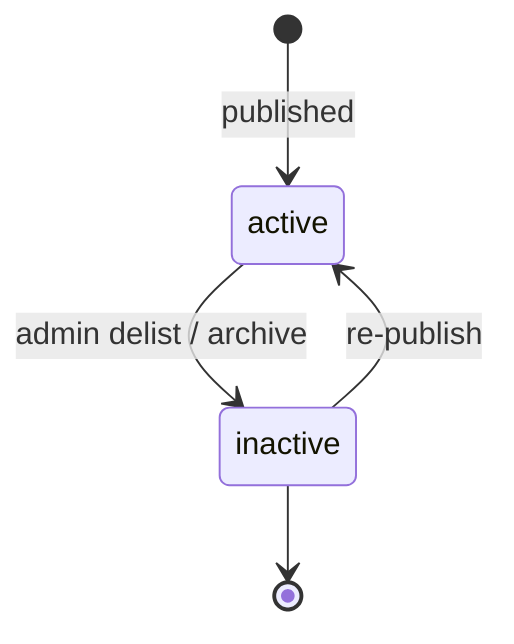
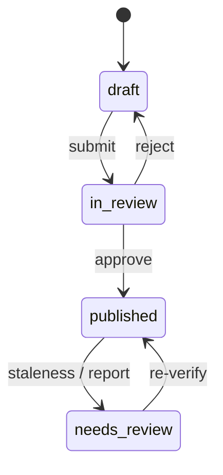

# Catalog state machine

**Task:** MATCH-07  
**Last updated:** 2026-07-31

ISKONNECT scholarships carry four overlapping state fields. This document reconciles them for engineers and operators.

## Fields

| Field | Layer | Purpose |
| --- | --- | --- |
| `is_active` | Catalog visibility | `false` = delisted; excluded from student matching |
| `editorial_state` | Ops workflow | Draft/review/publish pipeline for content team |
| `data_status` | Data quality | Freshness, link health, verification backlog |
| `application_status` | Student-facing lifecycle | When to apply; synced at write time via `compute_application_status` |

## State diagrams

### `is_active`

### `editorial_state` (typical values)

### `data_status`

| Value | Meaning | Matching impact |
| --- | --- | --- |
| `active` | Normal catalog row | Included |
| `needs_review` | Stale or flagged | Included; provisional penalty; `application_status → needs_verification` |
| `expired` | Past cycle, no reopen signal | Excluded from matches |
| `broken_link` | Link check failed | Excluded from matches |
| `past_deadline` | Deadline passed (data layer) | Excluded from matches |

Maintenance job flags verification older than **30 days** (`STALE_VERIFICATION_DAYS`) as `needs_review`.

### `application_status` (student-facing)

Derived by `app/utils/application_status.py` from cycle dates, `data_status`, and `is_active`:

| Value | Typical meaning |
| --- | --- |
| `open` | Accepting applications this cycle |
| `closed` | Window ended, no reopen prediction |
| `previous_cycle` | Historical cycle only |
| `expected_reopen` | Closed now; predicted next open |
| `archived` | `is_active=false` |
| `needs_verification` | `data_status=needs_review` or unknown lifecycle |

**MATCH-03:** A listing with **null `application_deadline`** and verification older than 30 days (or never verified) is surfaced as `needs_verification` in temporal classification even when no hard deadline exists.

## Valid combinations (common)

| is_active | editorial_state | data_status | application_status | Notes |
| --- | --- | --- | --- | --- |
| true | published | active | open | Happy path |
| true | published | needs_review | needs_verification | Stale data; student sees verify copy |
| true | published | active | expected_reopen | Between cycles |
| false | * | * | archived | Delisted |
| true | draft | active | open | **Impossible for production** — drafts must not be published |

## Contradictions flagged for Phase 4

| Combination | Issue |
| --- | --- |
| `is_active=false` + `application_status=open` | Should be `archived`; run maintenance sync |
| `data_status=expired` + `application_status=open` | Lifecycle drift; re-sync |
| `editorial_state=draft` + visible in search | Publish gate missing |
| Null deadline + stale verification + `application_status=open` | MATCH-03 temporal override to `needs_verification` |

## Code references

- Lifecycle derivation: `app/utils/application_status.py`
- Temporal override (null deadline): `app/matching/temporal_state.py`
- Eligibility data-status gate: `app/matching/eligibility_result.py` (`_evaluate_data_status`)
- Staleness threshold: `app/utils/trust_constants.py`
