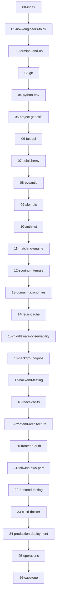

# Iskonnect From-Zero Apprenticeship — Index

> **Purpose:** Teach you to rebuild, maintain, extend, debug, deploy, and operate Iskonnect without AI assistance. Every lesson is grounded in the real codebase at `scholarship-match/`.

---

## How to use this curriculum

1. **Read in order** the first time. Later lessons assume earlier concepts.
2. **Do every exercise** before reading the solution. Mastery comes from struggle, not skimming.
3. **Open the cited files** in your editor while reading. This is not a novel — it is a map.
4. **Run the commands** in a terminal on your machine. Typing `mkdir` yourself matters.
5. **Keep a learning log** (notebook or `docs/learning/learning-log.md`) with questions and "aha" moments.

### Time estimate

| Part | Lessons | Suggested pace |
|------|---------|----------------|
| Part 0 — Orientation | 00–01 | 1–2 days |
| Part 1 — Foundations | 02–05 | 3–5 days |
| Part 2 — Backend | 06–17 | 2–3 weeks |
| Part 3 — Frontend | 18–22 | 1–2 weeks |
| Part 4 — Delivery & Ops | 23–26 | 1 week |
| Capstone rebuild | 26 | 3–5 days |

---

## Lesson dependency graph



---

## Syllabus

### Part 0 — Orientation

| # | Lesson | What you will master |
|---|--------|----------------------|
| 00 | [Index](00-index.md) | Navigation, glossary, goals |
| 01 | [How Engineers Think](01-how-engineers-think.md) | Mental models, request lifecycle, reading code |

### Part 1 — Foundations & Day-0 Setup

| # | Lesson | What you will master |
|---|--------|----------------------|
| 02 | [Terminal & OS](02-terminal-and-os.md) | Shell, filesystem, processes, ports |
| 03 | [Git & Version Control](03-git-and-version-control.md) | History, branches, collaboration |
| 04 | [Python Environment & Dependencies](04-python-env-and-deps.md) | venv, pip, requirements pinning |
| 05 | [Project Genesis — Day 0](05-project-genesis-day0.md) | First folder, first API, first model |

### Part 2 — Backend Mastery

| # | Lesson | What you will master |
|---|--------|----------------------|
| 06 | [FastAPI & Request Lifecycle](06-fastapi-and-request-lifecycle.md) | ASGI, routers, DI, middleware |
| 07 | [SQLAlchemy & Data Modeling](07-sqlalchemy-data-modeling.md) | ORM, sessions, pooling |
| 08 | [Pydantic & Schemas](08-pydantic-validation-and-schemas.md) | Validation, serialization |
| 09 | [Alembic Migrations](09-alembic-migrations.md) | Schema evolution, 001→025 |
| 10 | [Auth: JWT & bcrypt](10-auth-jwt-bcrypt.md) | Tokens, hashing, authorization |
| 11 | [Matching Engine Architecture](11-matching-engine-architecture.md) | Two-stage pipeline, ports |
| 12 | [Scoring Engine Internals](12-scoring-engine-internals.md) | Weights, explanations |
| 13 | [Domain Taxonomies](13-domain-taxonomies.md) | PSCED, PSGC, GWA, equity groups |
| 14 | [Redis, Cache & Rate Limiting](14-redis-cache-and-rate-limiting.md) | Shared state, abuse protection |
| 15 | [Middleware & Observability](15-middleware-observability-sentry.md) | Sentry, request IDs, logging |
| 16 | [Background Jobs & Data Ingest](16-background-jobs-and-data-ingest.md) | Scrapers, CSV import |
| 17 | [Backend Testing](17-backend-testing-philosophy.md) | pytest, fixtures, authz tests |

### Part 3 — Frontend Mastery

| # | Lesson | What you will master |
|---|--------|----------------------|
| 18 | [React, Vite & TypeScript](18-react-vite-typescript.md) | SPA, components, build |
| 19 | [Frontend Architecture](19-frontend-architecture-routing-state.md) | Routing, API client, state |
| 20 | [Frontend Auth & Data Flow](20-frontend-auth-and-data-flow.md) | AuthContext, protected routes |
| 21 | [Tailwind, PWA & Performance](21-tailwind-pwa-virtualization-perf.md) | CSS, virtualization, offline |
| 22 | [Frontend Testing](22-frontend-testing.md) | Vitest, RTL, mocking |

### Part 4 — Delivery, Operations & Mastery

| # | Lesson | What you will master |
|---|--------|----------------------|
| 23 | [CI/CD & Docker](23-ci-cd-and-docker.md) | GitHub Actions, containers |
| 24 | [Production Deployment](24-production-deployment.md) | Render, Vercel, Supabase |
| 25 | [Operations & Incident Response](25-operations-and-incident-response.md) | Monitoring, backups, scaling |
| 26 | [Maintenance & Rebuild Capstone](26-maintenance-and-rebuild-capstone.md) | Refactoring, full rebuild checklist |

---

## Graduation goals

By the end of lesson 26 you should be able to:

1. Rebuild Iskonnect from an empty folder.
2. Explain every major architectural decision.
3. Understand every important file.
4. Debug production issues.
5. Safely add new features.
6. Maintain the system long-term.
7. Deploy and operate the platform yourself.
8. Build similar systems without relying on AI-generated code.

---

## Glossary (seed)

| Term | One-line definition | First introduced |
|------|---------------------|------------------|
| **API** | Application Programming Interface — how programs talk to each other over HTTP | [06](06-fastapi-and-request-lifecycle.md) |
| **ASGI** | Asynchronous Server Gateway Interface — Python standard for async web servers | [06](06-fastapi-and-request-lifecycle.md) |
| **ORM** | Object-Relational Mapper — maps Python classes to database tables | [07](07-sqlalchemy-data-modeling.md) |
| **Migration** | Versioned script that changes database schema | [09](09-alembic-migrations.md) |
| **JWT** | JSON Web Token — signed blob carrying user identity | [10](10-auth-jwt-bcrypt.md) |
| **Hard filter** | Rule that completely excludes a scholarship (Stage 1) | [11](11-matching-engine-architecture.md) |
| **Scoring** | Weighted ranking of survivors (Stage 2) | [12](12-scoring-engine-internals.md) |
| **PSCED** | Philippine Standard Classification of Education — field-of-study taxonomy | [13](13-domain-taxonomies.md) |
| **PSGC** | Philippine Standard Geographic Code — official location codes | [13](13-domain-taxonomies.md) |
| **SPA** | Single Page Application — one HTML shell, JS handles navigation | [18](18-react-vite-typescript.md) |
| **CORS** | Cross-Origin Resource Sharing — browser security for API calls | [06](06-fastapi-and-request-lifecycle.md) |
| **RLS** | Row Level Security — Postgres policy restricting row access | [09](09-alembic-migrations.md) |
| **CI/CD** | Continuous Integration / Continuous Deployment | [23](23-ci-cd-and-docker.md) |

---

## Repository map (quick reference)

```
scholarship-match/
├── app/                    # Python backend package
│   ├── main.py             # FastAPI entry, middleware, router mount
│   ├── db.py               # SQLAlchemy engine + get_db()
│   ├── models.py           # ORM table definitions
│   ├── schemas.py          # Pydantic request/response models
│   ├── auth.py             # JWT + password hashing
│   ├── api/v1/             # HTTP route handlers (19 modules)
│   ├── matching/           # Stage 1 hard filters + orchestration
│   ├── scoring/            # Stage 2 weighted scorer
│   ├── taxonomy/           # Philippine policy data (PSCED, GWA, regions)
│   ├── middleware/         # Request logging, security headers
│   ├── tests/              # pytest suite
│   └── scripts/            # CSV import, seeding
├── alembic/                # Database migrations (versions 001–025)
├── frontend/               # React + Vite SPA
│   └── src/
│       ├── main.tsx        # React bootstrap + Sentry
│       ├── App.tsx         # Router + layout
│       ├── api/client.ts   # HTTP client to backend
│       ├── contexts/       # AuthContext, etc.
│       └── pages/          # Route-level components
├── docs/                   # Deployment, observability, this curriculum
├── requirements.txt        # Python dependencies
├── Dockerfile              # Container image
├── Procfile                # Render/Heroku process types
└── docker-compose.yml      # Local Postgres + Redis
```

---

## Curriculum status

All **27 lessons** (00–26) are complete. Work through them in order; use lesson **26** as the rebuild capstone and graduation checklist.

## Related existing docs

- [Production Operations Handbook](../../operations-handbook/00-index.md) — full deploy, ops, scaling handbook (Parts 1–10)
- [DEPLOYMENT.md](../../DEPLOYMENT.md) — production deploy checklist
- [OBSERVABILITY.md](../../OBSERVABILITY.md) — Sentry and alerting
- [ENGINEERING_HANDBOOK.md](../../ENGINEERING_HANDBOOK.md) — architecture overview
- [SCORING_ENGINE.md](../../../SCORING_ENGINE.md) — scoring design notes

---

*Next lesson: [01 — How Engineers Think](01-how-engineers-think.md)*
