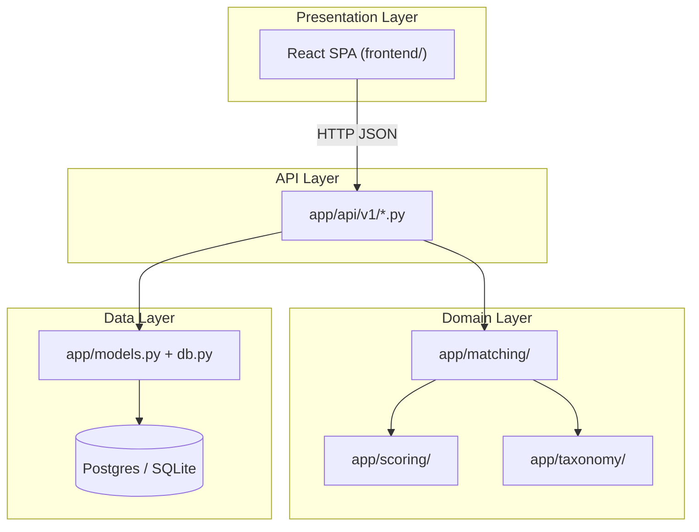
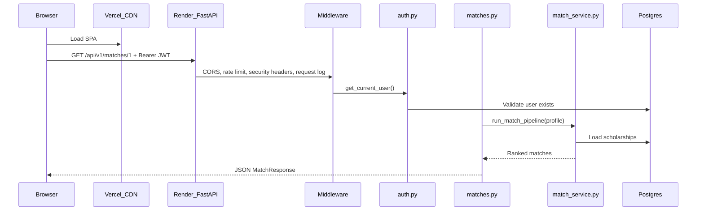

# Lesson 01 — How Engineers Think

> **Prerequisite:** None. Start here after the [index](00-index.md).

---

## What this lesson teaches

Before touching code, you need the **mental models** experienced engineers use to navigate systems like Iskonnect. This lesson builds the map every other lesson hangs on.

---

## Concept: Software as layers

### 1. Definition

A **layer** is a boundary between concerns. Each layer knows only what it needs about the layer below.

### 2. Why layers exist

Without layers, changing one part (e.g. swapping SQLite for Postgres) would require rewriting everything.

### 3. Problem solved

**Isolation of change.** You can replace the database without rewriting the matching engine.

### 4. Before layers

Early programs were one giant file: UI, business logic, and disk access mixed together ("spaghetti code").

### 5. Alternatives

- **Microservices:** each layer is a separate deployable service (overkill for Iskonnect today).
- **Monolith with modules:** one deployable, but internal packages (`app/matching/`, `app/scoring/`) — **what Iskonnect uses**.

### 6. Tradeoffs

| Approach | Pros | Cons |
|----------|------|------|
| Monolith + modules | Simple deploy, easy local dev | All code scales together |
| Microservices | Independent scaling | Network complexity, ops burden |

### Analogy

A restaurant: **waiter** (API routes) takes orders, **kitchen** (matching engine) prepares food, **pantry** (database) stores ingredients. The waiter does not cook; the kitchen does not handle payment.

### Iskonnect's layers

---

## Concept: Request lifecycle

### 1. Definition

The **request lifecycle** is the path an HTTP request travels from browser click to JSON response.

### 2. Why it exists

Understanding lifecycle lets you answer: "Where do I add auth? Where does caching happen? Where did this 500 come from?"

### 3. Problem solved

**Debuggability.** You can trace `GET /api/v1/matches/42` through middleware → auth → route → service → database → response.

### 4. Before modern frameworks

CGI scripts: one `.cgi` file per URL, no shared middleware.

### 5. Alternatives

- **WSGI** (sync Python): Flask, Django pre-async.
- **ASGI** (async Python): FastAPI, Starlette — **Iskonnect uses this**.

### 6. Tradeoffs

ASGI handles concurrent I/O better but async code is harder to reason about. Iskonnect's hot path (matching) is CPU-bound sync Python inside async handlers — acceptable for current scale.

### Iskonnect request path (example: get matches)

**Key files:**
- Entry: [`app/main.py`](../../../app/main.py) — mounts routers, middleware stack
- Auth: [`app/auth.py`](../../../app/auth.py) — `get_current_user()`
- Route: [`app/api/v1/matches.py`](../../../app/api/v1/matches.py)
- Service: [`app/matching/match_service.py`](../../../app/matching/match_service.py)

**If you removed `get_current_user`:** Any authenticated route would accept anonymous requests or crash — a security incident.

**Senior evaluation:** Middleware order matters. CORS must run before routes; rate limiting should run early; auth runs per-route via `Depends()`.

---

## Concept: Reading unfamiliar code

### The three-pass method

1. **Pass 1 — Structure (30 min):** Read `README.md`, `main.py`, folder tree. Do not read implementation yet.
2. **Pass 2 — Data flow (1–2 hr):** Pick one user action (e.g. "run match"). Trace frontend → API → service → DB. Use your editor's "Go to definition."
3. **Pass 3 — Edge cases:** Search for `HTTPException`, `try/except`, `AUTH_DISABLED`, `TODO`. Read tests — they document expected behavior.

### How each level thinks

| Level | First question | Risk |
|-------|----------------|------|
| **Beginner** | "What does this line do?" | Gets lost in syntax |
| **Intermediate** | "What module owns this?" | Misses cross-cutting concerns (auth, logging) |
| **Senior** | "What invariant must hold? What breaks if I change this?" | May over-engineer |

### Common misconception

> "I'll understand the codebase by reading every file top to bottom."

**Reality:** Engineers read **vertically** (one feature end-to-end) and **horizontally** (one layer across features). Never linearly through 200 files.

---

## Concept: Invariants

### 1. Definition

An **invariant** is a rule that must always be true.

### 2. Iskonnect invariants (examples)

- A user can only read/write their own profile (`user_id` ownership).
- Hard filters run **before** scoring — eliminated scholarships never receive a score.
- Passwords are never stored plaintext — only bcrypt hashes.
- Production must have `AUTH_DISABLED=false`.

### 3. Why invariants matter

When adding a feature, ask: "Does this violate an invariant?" If yes, redesign.

---

## How engineers evaluate code (senior checklist)

When reviewing any file, seniors ask:

1. **Ownership:** Who calls this? Who is responsible for bugs?
2. **Failure modes:** What happens on null input, DB down, timeout?
3. **Security:** Can user A access user B's data?
4. **Observability:** If this fails at 3 AM, will Sentry/logs tell us?
5. **Testability:** Is there a test? Can I write one without booting the whole app?
6. **Change cost:** If requirements shift, how many files change?

---

## Typical production failures (Iskonnect-specific)

| Symptom | Likely cause | Where to look |
|---------|--------------|---------------|
| 401 on all API calls | Expired JWT, wrong `SECRET_KEY` | `auth.py`, frontend `AuthContext` |
| CORS error in browser | `CORS_ORIGINS` missing Vercel URL | `app/main.py`, Render env |
| Empty match results | No scholarships seeded, or all hard-filtered | `match_service.py`, DB row count |
| 429 Too Many Requests | Rate limit hit | `app/limiter.py`, Redis |
| 500 on startup | Migration failed, bad `DATABASE_URL` | Render logs, `alembic upgrade head` |
| Slow match page | Large payload, no virtualization | `MatchResultsPage.tsx` |

---

## Exercises

### Level 1 — Understanding

1. Draw (on paper) the four layers of Iskonnect and name one file in each layer.
2. List the middleware stack in order as mounted in `app/main.py`.
3. What is the difference between `app/models.py` and `app/schemas.py`?

Solution

1. Presentation: `frontend/src/pages/MatchResultsPage.tsx`. API: `app/api/v1/matches.py`. Domain: `app/matching/match_service.py`. Data: `app/db.py` + Postgres.
2. Read `main.py` after line 120: `SlowAPIMiddleware`, `CORSMiddleware`, `SecurityHeadersMiddleware`, `RequestLoggingMiddleware` (verify order in your checkout).
3. `models.py` = database tables (SQLAlchemy ORM). `schemas.py` = API input/output shapes (Pydantic). ORM is persistence; schemas are the HTTP contract.

### Level 2 — Implementation

1. Add a comment block at the top of a scratch file listing every router imported in `main.py` and one endpoint each exposes (use `/docs` or grep `@router`).

### Level 3 — Debugging

1. Set `AUTH_DISABLED=true` in `.env`. Start the backend. Call `GET /api/v1/profiles` with and without an `Authorization` header. Document the difference.

### Level 4 — Architecture

1. A stakeholder asks: "Can we let sponsors edit scholarships directly in the browser using Supabase client SDK?" Using what you know about RLS (migration 020) and custom JWT auth, write a one-paragraph answer explaining why this is non-trivial.

Solution

Not safely without significant work. Iskonnect uses custom JWT (`sub` = app `users.id`), not Supabase Auth (`auth.uid()`). Migration 020 enables RLS but creates zero policies — Postgres owner connection bypasses RLS anyway. Browser Supabase client would be deny-all or wide-open until policies align JWT `sub` with `auth.uid()` and roles are modeled in Postgres policies. Today, authorization is entirely app-layer in FastAPI (`get_current_user`, ownership checks in routes). A senior would recommend keeping sponsor edits behind authenticated API routes until a deliberate auth migration is planned.

---

*Previous: [00 — Index](00-index.md) | Next: [02 — Terminal & OS](02-terminal-and-os.md)*
