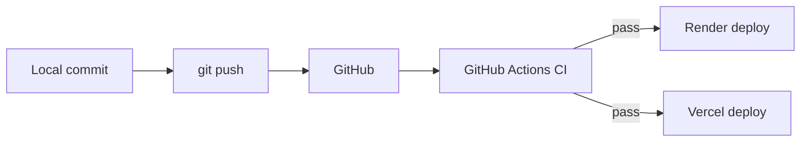

# Lesson 03 — Git & Version Control

> **Prerequisite:** [02 — Terminal & OS](02-terminal-and-os.md)

---

## Concept: Version control

### 1. Definition

**Version control** records snapshots of your project over time so you can undo, compare, and collaborate.

### 2. Why it exists

Without it, folders become `project_final`, `project_final_v2`, `project_FINAL_REAL`.

### 3. Problem solved

**History, branching, collaboration, audit trail.**

### 4. Before Git

CVS, SVN — centralized servers. **Git** (2005) is distributed: every clone has full history.

### 5. Alternatives

Mercurial, Fossil, zip files emailed (please no).

### 6. Tradeoffs

Git is powerful but confusing. Learning 10 commands covers 90% of daily work.

### Analogy

Git is a **time machine with parallel universes** (branches). Commits are save points; merge combines universes.

---

## Command reference

### `git init`

| Aspect | Detail |
|--------|--------|
| **Syntax** | `git init` |
| **Meaning** | Create `.git/` folder — start tracking this directory |
| **When** | Day 0, after `mkdir scholarship-match` |
| **Internal** | Creates object database for blobs, trees, commits |
| **Output** | `Initialized empty Git repository in ...` |
| **Mistakes** | Running inside `app/` instead of repo root — nest repos accidentally |
| **Discovery** | `git help init` |

### `git clone`

| Aspect | Detail |
|--------|--------|
| **Syntax** | `git clone https://github.com/you/scholarship-match.git` |
| **Meaning** | Copy remote repo + full history to local machine |
| **When** | Setting up a second machine or teammate onboarding |
| **Internal** | Downloads objects, checks out default branch |
| **Output** | New folder with all files |

### `git status`

Shows modified, staged, untracked files. Run constantly.

### `git add`

| Aspect | Detail |
|--------|--------|
| **Syntax** | `git add app/main.py` or `git add .` |
| **Meaning** | Stage changes for next commit |
| **Why** | Commits only include staged files — lets you split logical changes |
| **Mistakes** | `git add .` stages secrets in `.env` — use `.gitignore` |

### `git commit`

| Aspect | Detail |
|--------|--------|
| **Syntax** | `git commit -m "Add FastAPI health endpoint"` |
| **Meaning** | Snapshot staged changes with message |
| **Why** | Atomic unit of history |
| **Good messages** | Imperative, specific: "Fix matches.py missing import" not "fixes" |

### `git branch` / `git checkout` / `git switch`

```bash
git branch feature/auth          # create branch pointer
git switch feature/auth          # move HEAD to branch (modern)
git switch -c feature/auth       # create and switch
```

**Why branches:** `main` stays deployable; features develop in isolation.

### `git merge`

Combines branch history into current branch. Conflicts happen when same lines edited — resolve manually.

---

## `.gitignore` — what never enters Git

Iskonnect should ignore (verify your `.gitignore`):

```
venv/
.venv/
__pycache__/
*.pyc
.env
dev.db
node_modules/
frontend/dist/
.pytest_cache/
```

**If `.env` is committed:** `SECRET_KEY` and `DATABASE_URL` are in git history forever — rotate secrets immediately.

---

## Reconstructing Iskonnect history (conceptual timeline)

Git history in this repo tells the story migrations tell in the database:

| Era | Likely commits | Evidence in repo |
|-----|----------------|------------------|
| Genesis | Initial schema, profiles, scholarships | `alembic/versions/001_initial_schema.py` |
| Auth | Users, JWT, refresh tokens | `014_refresh_tokens_and_user_auth.py` |
| Matching v2 | Scoring engine, match history | `006`, `012` |
| Production hardening | RLS, indexes, Redis | `017`, `020`, launch plans |
| SIPP/OJT | Internship tables | `025_sipp_ojt_compliance.py` |

**Codebase historian skill:** `git log --oneline -- app/matching/` shows when matching changed. `git blame app/auth.py` shows who wrote each line and when.

---

## Git + deployment

- **GitHub** hosts the repo.
- **Render** and **Vercel** deploy from `main` branch pushes.
- **GitHub Actions** (`.github/workflows/ci.yml`) runs tests on every PR.



---

## How engineers think

| Level | Behavior |
|-------|----------|
| Beginner | Giant commits, "update" messages |
| Intermediate | Feature branches, meaningful commits |
| Senior | Small PRs, migration down-paths, never force-push `main` |

**Production failure:** Force-pushed `main` without team sync → lost commits → redeploy old broken code.

---

## Exercises

### Level 1 — Understanding

1. What is the difference between `git add` and `git commit`?
2. Why must `.env` be in `.gitignore`?

### Level 2 — Implementation

1. `git init` in a practice folder. Create `README.md`, commit. Create branch `add-health`, add a one-line change, commit, merge to `main`.

### Level 3 — Debugging

1. Run `git status` with dirty `node_modules/` — should not appear if ignored. If it does, fix `.gitignore`.

### Level 4 — Architecture

1. Design a branching strategy for Iskonnect: `main` (production), `staging`, feature branches. When do migrations run?

<details>
<summary>Solution</summary>

`main` → auto-deploy Render/Vercel production. Optional `staging` branch → staging environment with `ENVIRONMENT=staging`. Feature branches → PR → CI (pytest, alembic upgrade/downgrade/upgrade, frontend tests) → merge. Migrations run on Render **release** command (`alembic upgrade head`) before web traffic, not on every developer laptop in production. Developers run migrations locally against dev DB only.
</details>

---

*Previous: [02 — Terminal & OS](02-terminal-and-os.md) | Next: [04 — Python Environment & Dependencies](04-python-env-and-deps.md)*
