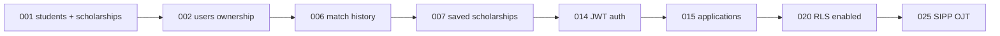

# Lesson 05 — Project Genesis (Day 0)

> **Prerequisite:** [04 — Python Environment & Dependencies](04-python-env-and-deps.md)

---

## The problem we were solving

**Day 0 question:** Filipino students cannot find scholarships they qualify for because information is scattered across websites, PDFs, and Facebook posts.

**Day 0 product hypothesis:** If we structure scholarship requirements and student profiles in a database, we can automatically filter and rank matches.

This lesson reconstructs the **first engineering decisions** chronologically.

---

## Stage 1: Name the project folder

```bash
mkdir Iskonnect
cd Iskonnect
mkdir scholarship-match
cd scholarship-match
git init
```

### Why `scholarship-match` folder name?

- Descriptive of MVP function (matching scholarships).
- Brand became **Iskonnect** later (user-visible text in `index.html`, `main.py` title).
- **Runtime identifiers** (`scholarship-match-frontend` npm name, redis keys) were not renamed — avoiding breaking deploy paths and localStorage keys.

**Senior tradeoff:** Rename brand in UI cheap; rename repo/package expensive.

---

## Stage 2: First backend skeleton

### Files created (conceptual order)

| Order | File | Why |
|-------|------|-----|
| 1 | `app/__init__.py` | Python package marker |
| 2 | `app/main.py` | HTTP entry point |
| 3 | `requirements.txt` | `fastapi`, `uvicorn` |
| 4 | `app/db.py` | Database connection |
| 5 | `app/models.py` | Table definitions |
| 6 | `alembic/` | Schema versioning |

### First `main.py` (minimal reconstruction)

```python
from fastapi import FastAPI

app = FastAPI(title="Scholarship Matcher")

@app.get("/health")
def health():
    return {"status": "ok"}
```

**Commands:**

```bash
pip install fastapi uvicorn
uvicorn app.main:app --reload --port 8000
```

Visit `http://localhost:8000/health` → `{"status":"ok"}`.

**What `/health` is for:** Load balancers and Render ping this to know the process is alive. Iskonnect's `/health` later checks DB and scraper runs ([`app/main.py`](../../../app/main.py)).

---

## Stage 3: First data model

### Why two tables first?

Migration [`001_initial_schema.py`](../../../alembic/versions/001_initial_schema.py) creates:

1. **`students`** — who is applying
2. **`scholarships`** — what they can apply to

Everything else (users, auth, applications, match history) came **after** MVP proved the matching concept.

### Key columns (students)

- **Identity:** `full_name`, `email`
- **Academic:** `gwa_raw`, `gwa_scale`, `gwa_normalized`, `field_of_study_broad`
- **Geographic:** `region`, `province`, `city_municipality`
- **Equity:** `is_pwd`, `is_indigenous_people`, `is_solo_parent_dependent`, etc.
- **Socioeconomic:** `household_income_annual`, `income_bracket`

### Key columns (scholarships)

- **Eligibility:** `min_gwa_normalized`, `max_income_threshold`, `min_age`, `max_age`
- **Geo:** `eligible_regions`, `eligible_cities` (JSON in Text columns)
- **Field:** `eligible_courses_psced`, `eligible_courses_specific`
- **Meta:** `title`, `provider`, `link`, `application_deadline`

**Why JSON in Text columns early?** Fast to ship; Postgres JSONB came in later migrations. Tradeoff: harder to query, easier to iterate.

---

## Stage 4: First API routes

Conceptual first endpoints (now spread across modules):

| Method | Path | Purpose |
|--------|------|---------|
| GET | `/api/v1/scholarships` | List catalog |
| POST | `/api/v1/profiles` | Create student profile |
| GET | `/api/v1/matches/{profile_id}` | Run matcher |

**Why `/api/v1/` prefix?** Versioning — if you break the API, ship `/api/v2/` without killing mobile clients on v1.

---

## Stage 5: First matching logic

Initially matching may have been inline in the route. Iskonnect evolved to:

```
app/matching/hard_filters.py   → Stage 1 eliminate
app/matching/match_service.py  → orchestrate
app/scoring/                   → Stage 2 rank
```

**Why extract?** Testability and replaceable scoring engine (port/adapter pattern — lesson 11).

---

## Stage 6: Seed data

```bash
python seed_data.py   # or later: python -m app.scripts.seed_demo_csvs
```

Without seed data, matching returns empty — demos fail, developers lose confidence.

---

## Stage 7: Frontend appears

```bash
cd frontend
npm create vite@latest . -- --template react-ts
npm install
npm install react-router-dom tailwindcss
```

**Why React + Vite + TypeScript?**

| Choice | Why | Alternative |
|--------|-----|-------------|
| React | Component model, hiring pool | Vue, Svelte |
| Vite | Fast dev server vs Webpack | Create React App (deprecated) |
| TypeScript | Catch API shape bugs at compile time | JavaScript |

---

## Evolution timeline (migrations as archaeology)



Each migration = a product decision frozen in SQL.

---

## What would break if you removed Stage 0 pieces?

| Removed | Effect |
|---------|--------|
| `students` table | No profiles — entire product gone |
| `scholarships` table | Nothing to match against |
| `/health` | Render marks service unhealthy — no traffic |
| `app/` package | uvicorn cannot import — server won't start |

---

## How engineers think at genesis

| Level | Focus |
|-------|-------|
| Beginner | "Make it work on my laptop" |
| Intermediate | "Structure for one feature end-to-end" |
| Senior | "What's the smallest schema/API that validates the hypothesis?" |

**Lesson:** Iskonnect's first schema was already **policy-aware** (equity flags, income brackets) — the domain was known upfront, not bolted on later.

---

## Exercises

### Level 1 — Understanding

1. Why were `students` and `scholarships` the first tables?
2. What does the `/api/v1/` prefix buy you?

### Level 2 — Implementation

1. From empty folder, create minimal FastAPI app with `/health` and one `GET /api/v1/scholarships` returning hardcoded JSON list of 2 scholarships.
2. Run with uvicorn and curl the endpoints.

### Level 3 — Debugging

1. Intentionally run uvicorn from wrong directory. Fix `ModuleNotFoundError`.

### Level 4 — Architecture

1. You are at Day 0. A cofounder wants MongoDB instead of Postgres/SQLite. Write pros/cons for Iskonnect's relational eligibility queries.

<details>
<summary>Solution</summary>

Scholarship matching is relational: students ↔ scholarships with filters on typed columns (income, GWA, region). SQL excels at indexed filters and joins (applications, saved, match_runs). MongoDB flexible schema helps rapid prototyping but makes multi-table integrity (FK cascades in migrations 022–023) harder. Iskonnect chose SQLAlchemy + Postgres for ACID, Alembic migrations, and Supabase hosting — correct for structured eligibility data.
</details>

---

*Previous: [04 — Python Environment & Dependencies](04-python-env-and-deps.md) | Next: [06 — FastAPI & Request Lifecycle](06-fastapi-and-request-lifecycle.md)*
