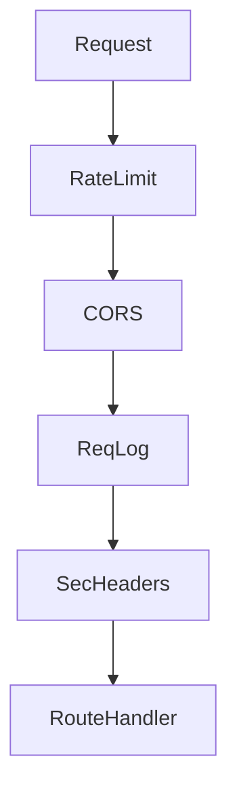

# Lesson 06 — FastAPI & Request Lifecycle

> **Prerequisite:** [05 — Project Genesis](05-project-genesis-day0.md)

---

## Concept: HTTP API

### 1. Definition

An **API** exposes operations over **HTTP** using verbs (`GET`, `POST`, `PUT`, `PATCH`, `DELETE`) and paths (`/api/v1/matches/1`).

### 2. Why HTTP

Universal — browsers, mobile apps, and scripts all speak HTTP.

### 3. Problem solved

**Decoupling** frontend (React) from backend (Python). Teams can ship independently.

### 4. Before REST APIs

Server-rendered HTML (Django templates) — backend and UI tangled.

### 5. Alternatives

GraphQL, gRPC, WebSockets. REST + JSON is simplest for CRUD + matching.

### 6. Tradeoffs

REST: cacheable, simple. GraphQL: flexible queries, harder caching.

---

## Concept: ASGI and FastAPI

### 1. Definition

**ASGI** (Asynchronous Server Gateway Interface) is the Python standard for async web servers.

**FastAPI** is a framework that builds on Starlette, providing routing, validation, and OpenAPI docs.

### 2. Why FastAPI for Iskonnect

- Automatic OpenAPI at `/docs` (dev only)
- Pydantic integration for request bodies
- `Depends()` for dependency injection
- Large ecosystem, fast development

### 3. Entry point: [`app/main.py`](../../../app/main.py)

```python
app = FastAPI(
    title="Iskonnect",
    lifespan=lifespan,
    docs_url=None if _docs_disabled else "/docs",
)
```

**`lifespan`** runs startup/shutdown hooks:

- `setup_logging()`
- `settings.validate_for_production()` — fails deploy if `SECRET_KEY` is default in production
- `_run_startup_migrations()` — optional `alembic upgrade head`

**If lifespan removed:** Migrations might not run on startup; production misconfig might slip through.

---

## Middleware stack (order matters)

Middleware wraps every request — **last added runs first** on incoming requests (Starlette onion model).

In `main.py`:

1. `SlowAPIMiddleware` — rate limiting
2. `CORSMiddleware` — browser cross-origin access
3. `RequestLoggingMiddleware` — audit trail
4. `SecurityHeadersMiddleware` — HSTS, CSP headers



### CORS

**Problem:** Browser on `https://iskonnect.vercel.app` calling `https://api.onrender.com` is cross-origin. Without CORS headers, browser blocks response.

**Fix:** `CORS_ORIGINS` env lists allowed frontend URLs ([`app/config.py`](../../../app/config.py)).

---

## Routers

`APIRouter` groups related endpoints. `main.py` mounts 19 routers:

```python
app.include_router(matches.router, prefix="/api/v1")
app.include_router(profiles.router, prefix="/api/v1")
# ...
```

Each file in [`app/api/v1/`](../../../app/api/v1/) defines `router = APIRouter()` and route functions.

**Example pattern** ([`scholarships.py`](../../../app/api/v1/scholarships.py)):

```python
router = APIRouter()

@router.get("/scholarships")
def list_scholarships(db: Session = Depends(get_db)):
    ...
```

Full path: `/api/v1` + `/scholarships` = `/api/v1/scholarships`.

---

## Dependency injection (`Depends`)

### 1. Definition

**Dependency injection** supplies shared resources (DB session, current user) to route functions without global state.

### 2. [`get_db()`](../../../app/db.py)

```python
def get_db():
    db = SessionLocal()
    try:
        yield db
    finally:
        db.close()
```

FastAPI calls this per request, ensures session closes even on error.

### 3. `get_current_user` ([`app/auth.py`](../../../app/auth.py))

```python
def get_current_user(
    credentials: Annotated[HTTPAuthorizationCredentials | None, Depends(security)],
    db: Session = Depends(get_db),
) -> models.User:
```

Route declares `user: models.User = Depends(get_current_user)` — unauthenticated requests get 401.

**Senior evaluation:** DI makes routes testable — override `get_db` with test session in pytest.

---

## Global exception handler

`main.py` catches unhandled exceptions:

- Tags Sentry with `request_id`
- Returns generic 500 (no stack trace to client)
- Logs full traceback server-side

**If removed:** Raw exceptions leak internals to users; Sentry misses errors.

---

## Operational endpoints

| Path | Purpose |
|------|---------|
| `/health` | DB + Redis + scraper status; 503 if DB down |
| `/ready` | Kubernetes-style readiness |
| `/metrics` | Row counts for ops |
| `/docs` | Swagger UI (disabled in production) |

---

## Command: `uvicorn`

```bash
uvicorn app.main:app --reload --port 8000
```

| Flag | Production? |
|------|-------------|
| `--reload` | Never |
| `--host 0.0.0.0` | Yes (accept external connections) |
| `--workers N` | Use gunicorn instead |

Production ([`Procfile`](../../../Procfile)):

```
web: gunicorn app.main:app -k uvicorn.workers.UvicornWorker -w ${WEB_CONCURRENCY:-2} ...
```

---

## Exercises

### Level 1 — Understanding

1. Why is `/docs` disabled in production?
2. What does `Depends(get_db)` guarantee on exceptions?

### Level 2 — Implementation

1. Add `GET /api/v1/ping` returning `{"pong": true}` in a new router; mount in `main.py`.

### Level 3 — Debugging

1. Remove Vercel URL from `CORS_ORIGINS`. Observe browser console CORS error. Fix.

### Level 4 — Architecture

1. Should rate limiting be middleware or per-route decorator? How does Iskonnect do both?

<details>
<summary>Solution</summary>

`/docs` exposes API surface to attackers. `Depends(get_db)` `finally: db.close()` runs even if route raises. Iskonnect uses SlowAPI middleware globally + `@limiter.limit()` on sensitive routes (auth, register) for finer control.
</details>

---

*Previous: [05 — Project Genesis](05-project-genesis-day0.md) | Next: [07 — SQLAlchemy & Data Modeling](07-sqlalchemy-data-modeling.md)*
