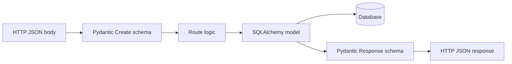

# Lesson 08 — Pydantic Validation & Schemas

> **Prerequisite:** [07 — SQLAlchemy & Data Modeling](07-sqlalchemy-data-modeling.md)

---

## Concept: Validation at the boundary

### 1. Definition

**Pydantic** models define expected shape and types of data crossing system boundaries (HTTP JSON ↔ Python).

### 2. Why separate from ORM

- **ORM** (`models.py`) = database truth (nullable columns, legacy fields)
- **Schema** (`schemas.py`) = API contract (what clients send/receive)

### 3. Problem solved

Invalid data rejected **before** business logic — `"age": "not a number"` → 422 Unprocessable Entity.

### 4. Before Pydantic

Manual `if` checks in every route — inconsistent, forgotten.

### 5. Alternatives

Marshmallow, dataclasses + custom validators. Pydantic v2 is fastest and FastAPI-native.

---

## [`app/schemas.py`](../../../app/schemas.py)

Hundreds of lines defining:

- `StudentCreate`, `StudentUpdate`, `StudentResponse`
- `ScholarshipCreate`, `ScholarshipResponse`
- `MatchResponse`, `MatchItem`, `MatchDiagnostics`
- `ApplicationOut`, `TokenResponse`, etc.

### Example pattern

```python
class StudentCreate(BaseModel):
    full_name: str
    email: EmailStr
    region: str | None = None
    gwa_raw: str | None = None
```

FastAPI uses this as `body: StudentCreate` — auto-validates POST body.

### `model_config = ConfigDict(from_attributes=True)`

Enables `StudentResponse.model_validate(orm_row)` — maps SQLAlchemy object to Pydantic.

---

## List vs detail responses (Phase 4 optimization)

**Problem:** Nesting full `ScholarshipResponse` (with `description`, `breakdown`) in list endpoints → 50KB+ payloads.

**Solution:** List endpoints return slim shapes `{id, title, provider, final_score}`; detail endpoints return full object.

**Senior evaluation:** API design is UX — mobile 3G users feel payload size.

---

## Request/response flow



---

## Email and URL validation

`pydantic[email]` provides `EmailStr`. Custom validators in schemas enforce HTTPS document URLs (RA 10173 privacy hardening).

---

## What breaks if schemas removed?

- FastAPI loses automatic OpenAPI shapes
- No type checking on inbound data
- Frontend/backend drift — silent bugs

---

## Exercises

### Level 1 — Understanding

1. Why can't we use ORM models directly as API responses in all cases?
2. What HTTP status for Pydantic validation failure?

### Level 2 — Implementation

1. Add optional field `nickname: str | None` to profile create schema; ensure ORM column exists or is ignored explicitly.

### Level 3 — Debugging

1. POST invalid email to `/api/v1/auth/register` — read 422 response body structure.

### Level 4 — Architecture

1. Design a `ScholarshipListItem` vs `ScholarshipDetail` schema pair — list fields for each.

<details>
<summary>Solution</summary>

ORM exposes DB columns clients should never see (internal flags). Validation failure = 422. ListItem: id, title, provider, deadline, final_score. Detail: all eligibility fields + description + required_documents.
</details>

---

*Previous: [07 — SQLAlchemy](07-sqlalchemy-data-modeling.md) | Next: [09 — Alembic Migrations](09-alembic-migrations.md)*
