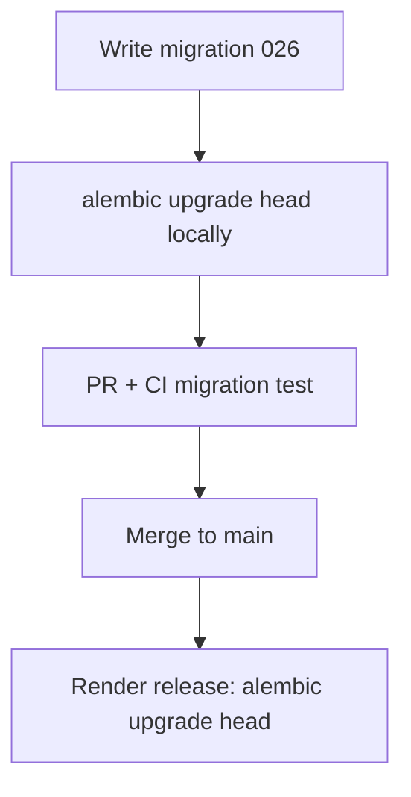

# Lesson 09 — Alembic Migrations

> **Prerequisite:** [08 — Pydantic & Schemas](08-pydantic-validation-and-schemas.md)

---

## Concept: Schema migration

### 1. Definition

A **migration** is a versioned script that changes database schema (`upgrade`) and can reverse (`downgrade`).

### 2. Why Alembic

SQLAlchemy's official migration tool — tracks revision chain, runs in CI and Render release.

### 3. Problem solved

**Team sync:** Everyone's Postgres matches production structure.

### 4. Before migrations

Manual SQL on production — "did someone run the ALTER on staging?"

### 5. Alternatives

Django migrations, Flyway, Prisma migrate. Alembic pairs with SQLAlchemy ORM.

---

## File layout

```
scholarship-match/
├── alembic.ini          # Alembic config
└── alembic/
    ├── env.py           # Connects to DATABASE_URL from settings
    └── versions/
        ├── 001_initial_schema.py
        ├── 002_add_users_and_profile_ownership.py
        ...
        └── 025_sipp_ojt_compliance.py
```

Each file has:

```python
revision = "025"
down_revision = "024"

def upgrade() -> None:
    op.create_table(...)

def downgrade() -> None:
    op.drop_table(...)
```

**Chain:** `001 → 002 → ... → 025` (head).

---

## Commands dissected

### `alembic upgrade head`

| Aspect | Detail |
|--------|--------|
| **Meaning** | Apply all migrations up to latest |
| **When** | Local setup, Render **release** command |
| **Internal** | Alembic reads `alembic_version` table, runs pending `upgrade()` functions |
| **Mistakes** | Wrong `DATABASE_URL` — migrates wrong database |

### `alembic downgrade -1`

Revert one revision — **dangerous on production** with data loss.

### `alembic revision -m "add foo"`

Create new empty migration file — engineer fills `upgrade`/`downgrade`.

### `alembic current`

Show current revision ID in connected DB.

---

## Reading Iskonnect history

| Revision | Milestone |
|----------|-----------|
| 001 | `students`, `scholarships` |
| 002 | `users`, profile ownership |
| 005 | `role` enum on users |
| 006 | `match_runs` history |
| 007 | `saved_scholarships` |
| 014 | refresh tokens, auth columns |
| 015 | `applications`, feedback |
| 016 | sponsor/school portals |
| 018 | document vault, scraper_runs |
| 020 | RLS **enabled** (no policies yet) |
| 024 | guardian fields, PSGC on students |
| 025 | SIPP/OJT tables |



---

## CI migration test (launch hardening)

GitHub Actions runs:

1. `alembic upgrade head`
2. `alembic downgrade base`
3. `alembic upgrade head`

**Why:** Catches broken `downgrade()` before production.

---

## `RUN_MIGRATIONS_ON_STARTUP`

[`main.py`](../../../app/main.py) `_run_startup_migrations()` — optional auto-migrate on boot.

| Environment | Recommendation |
|-------------|----------------|
| Local dev | `true` — convenient |
| Production | `false` — use Render release command; fail fast if release fails |

---

## RLS caveat (020)

Migration enables Row Level Security on public tables but **creates zero policies**. FastAPI connects as table owner → **RLS bypassed**. Security is app-layer JWT today.

**Misconception:** "RLS is on, we're safe at DB level." **False** for current architecture.

---

## Exercises

### Level 1 — Understanding

1. What table tracks applied migrations?
2. Why never edit old migration files after deploy?

### Level 2 — Implementation

1. Run `alembic current` against local DB. Run `alembic history --verbose | head`.

### Level 3 — Debugging

1. Error: "Can't locate revision identified by '023'" — causes and fixes.

### Level 4 — Architecture

1. Add nullable column vs new table — when to choose each for `guardian_email`?

<details>
<summary>Solution</summary>

`alembic_version` table. Editing old migrations desyncs deployed DBs — only add new revisions. Missing revision: wrong branch, incomplete git pull, or DB from different env. guardian_email is attribute of student → nullable column on `students` (migration 024 approach).
</details>

---

*Previous: [08 — Pydantic](08-pydantic-validation-and-schemas.md) | Next: [10 — Auth JWT & bcrypt](10-auth-jwt-bcrypt.md)*
