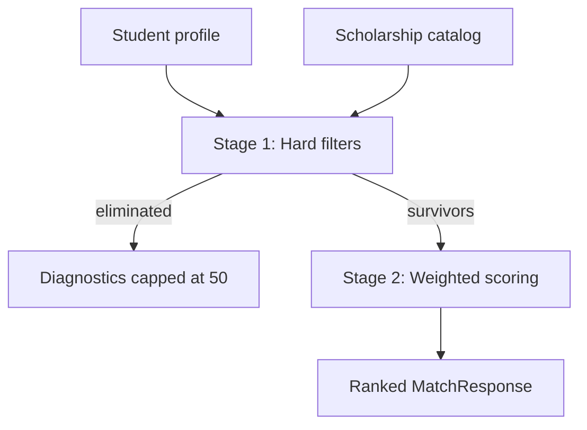

# Lesson 11 — Matching Engine Architecture

> **Prerequisite:** [10 — Auth JWT & bcrypt](10-auth-jwt-bcrypt.md)

---

## The problem

Given one student profile and N scholarships, which programs are realistic matches and in what order?

**Naive approach:** Score everything — wastes CPU on impossible matches (wrong region, income too high).

**Iskonnect approach:** **Two-stage pipeline.**



---

## Stage 1: Hard filters

[`app/matching/hard_filters.py`](../../../app/matching/hard_filters.py)

**Invariant:** If any hard filter fails, scholarship **never** gets a score.

Filters include:

- Education level mismatch
- Age min/max
- Income above ceiling
- GWA below minimum
- Geographic restriction failure
- Citizenship requirements
- Equity group requirements
- `data_status` expired/broken_link (when flagged)

### Deadlines (special case)

`is_application_deadline_passed()` exists but deadlines are **not** Stage 1 hard excludes by default — passed-deadline scholarships sort to bottom with `eligibility_status=false` and explanation message (`DEADLINE_PASSED_MESSAGE`).

**Product decision:** Show "you qualified but too late" vs hide entirely.

---

## Stage 2: Scoring (orchestrated)

[`app/matching/match_service.py`](../../../app/matching/match_service.py)

1. Load scholarships (from cache or DB)
2. `filter_scholarships()` → candidates + eliminated
3. For each candidate, build `ScoringPayload`
4. Call `WeightedDeterministicScorer.score()`
5. Assemble `MatchResponse` with diagnostics

---

## Port/adapter pattern (inversion of control)

[`app/matching/scoring_port.py`](../../../app/matching/scoring_port.py)

```python
class ScoringEnginePort(ABC):
    @abstractmethod
    def score(self, payload: ScoringPayload) -> ScoringResult:
        ...
```

**Why:** Swap scoring algorithm without touching filters or routes. Default implementation: [`app/scoring/`](../../../app/scoring/) `WeightedDeterministicScorer`.

**Beginner mistake:** Put scoring math inside `matches.py` route — untestable, unreplacable.

**Senior evaluation:** Domain logic lives in services, not HTTP handlers.

---

## API entry

[`app/api/v1/matches.py`](../../../app/api/v1/matches.py) — calls match service, enforces profile ownership, returns Pydantic response.

**Historical bug:** Missing `get_profile_dict` import caused `NameError` — integration tests catch this.

---

## What breaks if hard filters removed?

Students see scholarships they cannot apply to — trust destroyed, support burden spikes.

## What breaks if port removed?

Tight coupling — cannot A/B test scoring policies or run admin scoring experiments (`scoring_admin.py`).

---

## Exercises

### Level 1 — Understanding

1. Name three hard filters.
2. Why two stages instead of one score with penalties?

### Level 2 — Implementation

1. Trace `GET /api/v1/matches/{id}` from route to `filter_scholarships` in debugger or print statements.

### Level 3 — Debugging

1. Profile matches zero scholarships — distinguish "all hard-filtered" vs "empty catalog" using diagnostics.

### Level 4 — Architecture

1. Design interface for plug-in scorer #2 (ML-based). What inputs/outputs must match?

<details>
<summary>Solution</summary>

Level, income, GWA examples. Hard filters guarantee eligibility truth; scoring ranks among eligible options. Plug-in must implement `ScoringEnginePort.score(ScoringPayload) -> ScoringResult` with same fields for frontend contract.
</details>

---

*Previous: [10 — Auth](10-auth-jwt-bcrypt.md) | Next: [12 — Scoring Engine Internals](12-scoring-engine-internals.md)*
