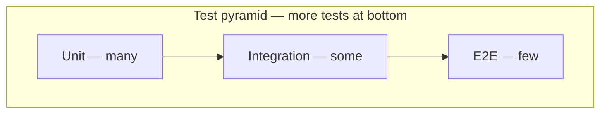

# Lesson 17 — Backend Testing Philosophy

> **Prerequisite:** [16 — Background Jobs & Data Ingest](16-background-jobs-and-data-ingest.md)

---

## Concept: Automated testing

### 1. Definition

**Tests** are code that asserts other code behaves correctly.

### 2. Why pytest

Simple fixtures, great FastAPI integration, CI standard for Python.

### 3. Problem solved

**Regression prevention** — fix auth once, test ensures it never breaks again.

---

## Test layout

[`app/tests/`](../../../app/tests/) — `test_*.py` modules:

| File | Focus |
|------|-------|
| `conftest.py` | Shared fixtures |
| `test_matching.py` | Hard filters |
| `test_scoring_engine.py` | Scorer math |
| `test_gwa_normalizer.py` | Taxonomy |
| `test_match_service_integration.py` | End-to-end match pipeline |
| `test_authz_isolation.py` | **Cross-user 403** |
| `test_application_status_auth.py` | Application ownership |

---

## Fixtures ([`conftest.py`](../../../app/tests/conftest.py))

```python
os.environ.setdefault("RUN_MIGRATIONS_ON_STARTUP", "false")

@pytest.fixture
def sqlite_engine():
    engine = create_engine("sqlite://", poolclass=StaticPool, ...)
    Base.metadata.create_all(bind=engine)
```

**In-memory SQLite** — fast, isolated, no Postgres needed for unit tests.

`TestClient` overrides `get_db` to use test session.

---

## Test pyramid for Iskonnect



- **Unit:** `gwa_normalizer`, scoring components
- **Integration:** `match_service` with DB
- **API:** `TestClient` hits routes with JWT

---

## Authorization tests (critical)

[`test_authz_isolation.py`](../../../app/tests/test_authz_isolation.py)

Asserts user B gets **403** when accessing user A's:

- Profiles
- Applications
- Match runs
- Saved scholarships
- Documents

**Why:** App-layer auth bugs are silent data breaches — must have regression tests.

---

## Migration CI

`.github/workflows/ci.yml`:

```
alembic upgrade head
alembic downgrade base
alembic upgrade head
pytest
```

---

## Command: `pytest`

```bash
cd scholarship-match
pytest                    # all tests
pytest app/tests/test_authz_isolation.py -v
pytest -k "gwa"           # name filter
```

| Flag | Meaning |
|------|---------|
| `-v` | Verbose |
| `-x` | Stop on first failure |
| `--tb=short` | Shorter tracebacks |

---

## Philosophy

| Level | Approach |
|-------|----------|
| Beginner | No tests, manual clicking |
| Intermediate | Tests for bugs that burned you |
| Senior | Tests for invariants and authz before features ship |

**Rule:** If it caused a production incident, it gets a test.

---

## Exercises

### Level 1 — Understanding

1. Why `RUN_MIGRATIONS_ON_STARTUP=false` in conftest?
2. Unit vs integration example in Iskonnect?

### Level 2 — Implementation

1. Run full pytest suite locally. Fix any env issues.

### Level 3 — Debugging

1. One test fails after schema change — trace fixture vs migration drift.

### Level 4 — Architecture

1. Write pseudocode for a test ensuring expired JWT returns 401 on `GET /api/v1/profiles`.

<details>
<summary>Solution</summary>

Prevents TestClient from migrating developer's real DATABASE_URL. Unit: test_gwa_normalizer. Integration: test_match_service_integration. Pseudocode: create user, mint expired token, client.get with Authorization Bearer, assert status_code == 401.
</details>

---

*Previous: [16 — Jobs & Ingest](16-background-jobs-and-data-ingest.md) | Next: [18 — React, Vite & TypeScript](18-react-vite-typescript.md)*
