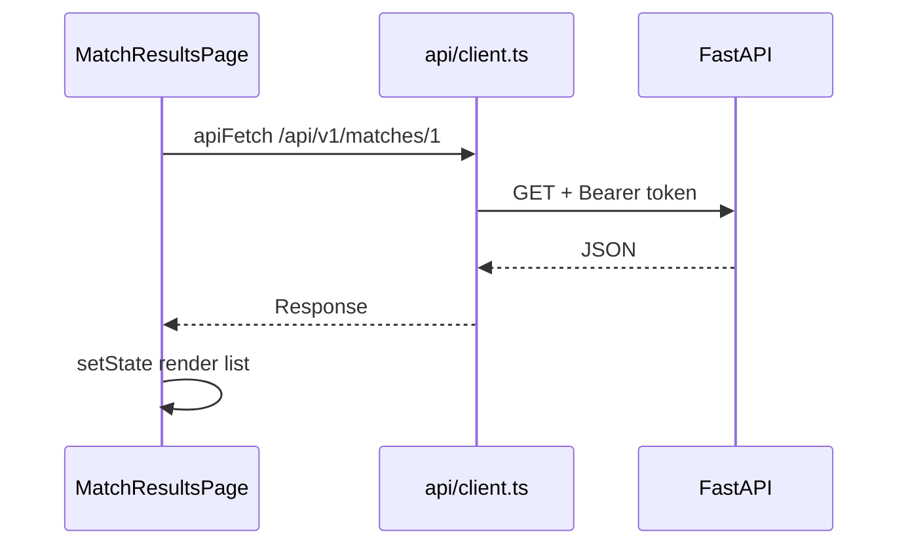

# Lesson 19 — Frontend Architecture, Routing & State

> **Prerequisite:** [18 — React, Vite & TypeScript](18-react-vite-typescript.md)

---

## React Router

[`App.tsx`](../../../frontend/src/App.tsx) defines routes:

| Path | Page | Layout |
|------|------|--------|
| `/` | Landing | Public |
| `/login`, `/register` | Auth | Public |
| `/dashboard` | ProfileDashboard | Dashboard |
| `/matches/:profileId` | MatchResults | Dashboard |
| `/scholarships/search` | ScholarshipSearch | Adaptive |
| `/admin` | Admin | Dashboard + AdminGuard |

**Layouts:**

- `PublicLayout` — marketing nav/footer
- `DashboardLayout` — sidebar + topbar
- `AdaptiveSearchLayout` — search-specific chrome

---

## API client

[`frontend/src/api/client.ts`](../../../frontend/src/api/client.ts)

```typescript
export const API_BASE_URL = _apiBase ?? "http://localhost:8000";
```

Production **requires** `VITE_API_BASE_URL` — build throws if missing in PROD.

### Features

- **30s timeout** — Render cold starts
- **Retry** idempotent GET on network failure
- **`NetworkError`** — distinguish offline vs 4xx/5xx
- **Api busy events** — `iskonnect-api-busy` / `iskonnect-api-idle` for [`ApiWarmupBanner`](../../../frontend/src/components/ApiWarmupBanner.tsx)

### `apiFetch(path, options)`

Prepends `API_BASE_URL`, tracks in-flight count, attaches auth in callers.

**Never put `SECRET_KEY` or `DATABASE_URL` in Vercel** — only `VITE_*` public vars.

---

## State management choices

| Mechanism | Used for |
|-----------|----------|
| **React Context** | Auth, theme, saved scholarships |
| **useState/useEffect** | Page-local UI state |
| **localStorage** | Auth tokens, profile draft (`iskonnect_profile_draft`) |
| **URL params** | Search query, profile id in path |

No Redux — complexity not justified yet.

---

## Hooks

[`frontend/src/hooks/`](../../../frontend/src/hooks/)

- `useScholarshipSearch.ts` — query, filters, pagination
- `useDebounce.ts` — delay search API calls

**Custom hooks** extract reusable logic from pages.

---

## Data flow diagram



---

## Guards

- `AdminGuard` — role === admin
- `SponsorGuard`, `SchoolGuard` — portal roles

Redirect to login or 403 UI if unauthorized.

---

## Exercises

### Level 1 — Understanding

1. Why `VITE_` prefix on env vars?
2. What triggers ApiWarmupBanner?

### Level 2 — Implementation

1. Add `console.log` in `apiFetch` — trace one search request.

### Level 3 — Debugging

1. Production build calls `localhost:8000` — missing env var diagnosis.

### Level 4 — Architecture

1. When would you add React Query instead of manual `useEffect` fetch?

<details>
<summary>Solution</summary>

Vite only exposes `VITE_*` to client bundle — prevents leaking secrets. API_BUSY event when in-flight > 0. React Query when cache invalidation, stale-while-revalidate, and deduping matter across many pages.
</details>

---

*Previous: [18 — React & Vite](18-react-vite-typescript.md) | Next: [20 — Frontend Auth & Data Flow](20-frontend-auth-and-data-flow.md)*
