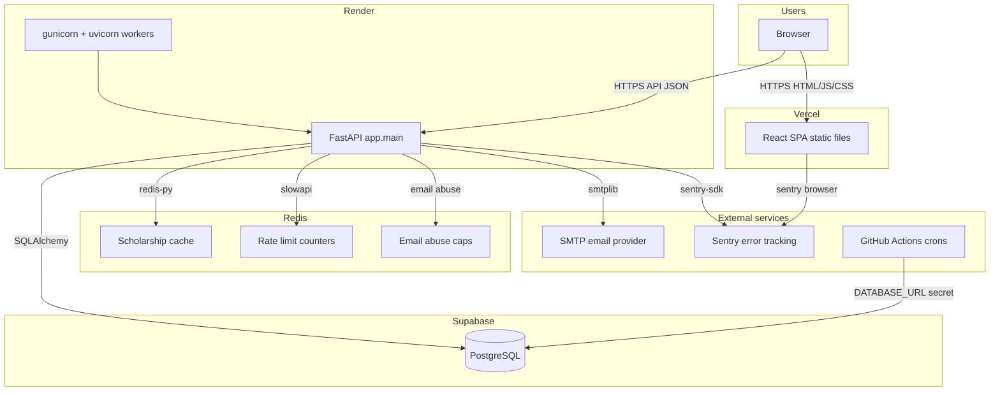
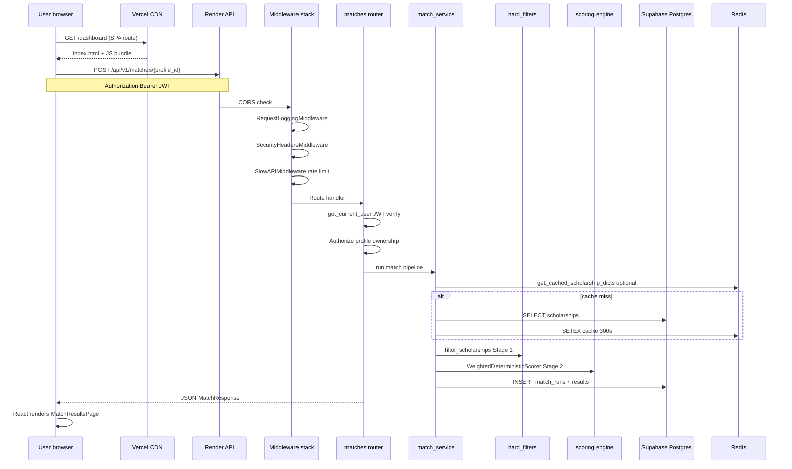
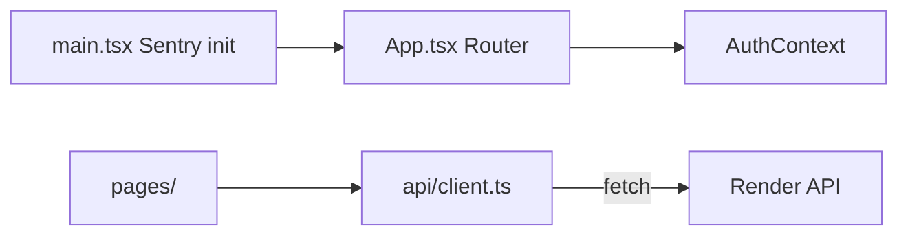
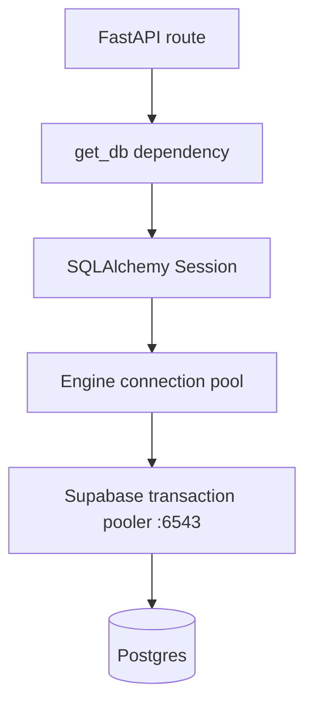
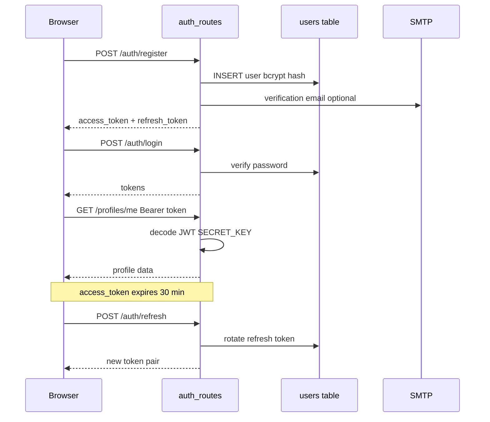
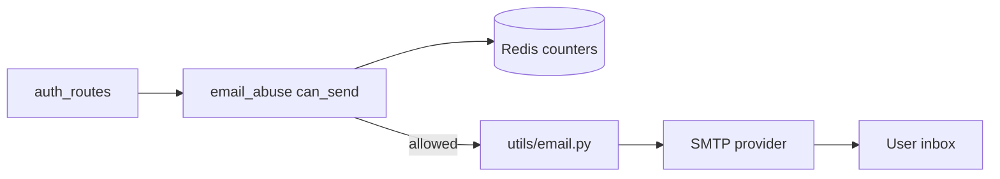
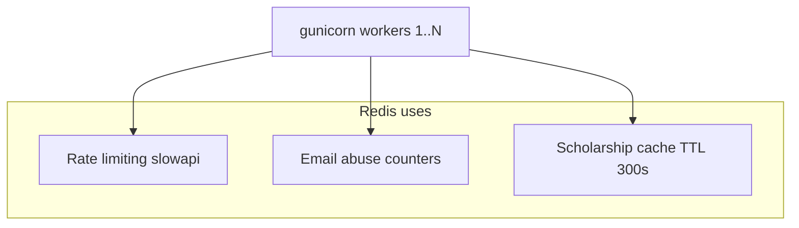
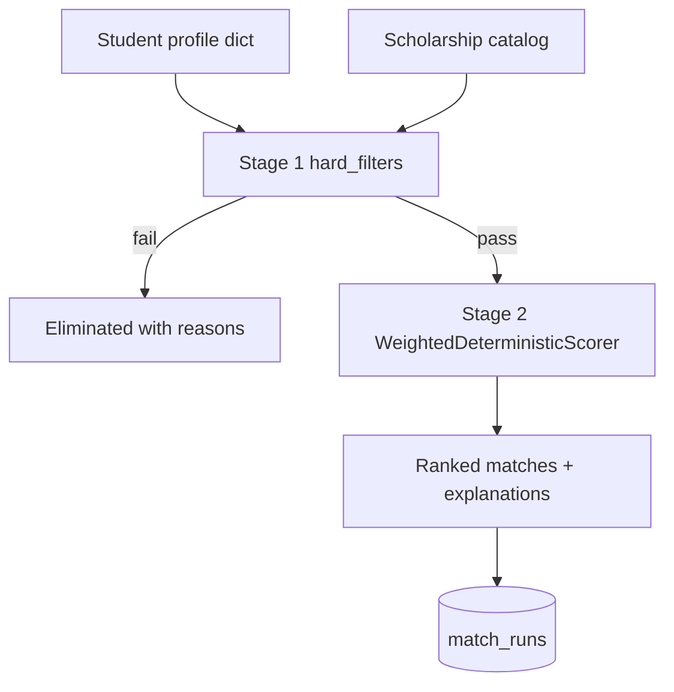
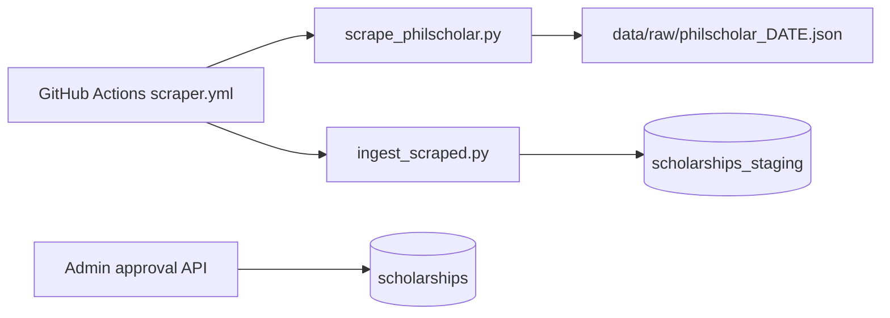
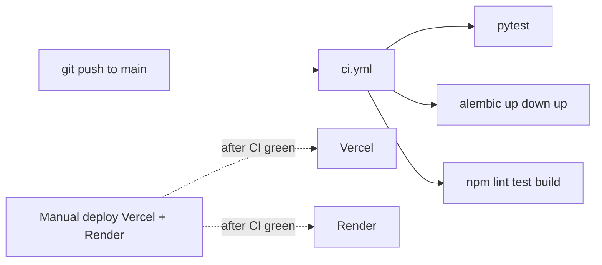

# Part 1 — Architecture

> Understand **what** Iskonnect is in production, **how** every piece connects, and **why** it was built this way — before you deploy anything.

---

## 1.1 Production architecture (the four boxes + two helpers)

Iskonnect in production is not one server. It is **six cooperating services** that you configure separately:



### What each box does

| Component | Technology | Runs what | Does NOT run |
|-----------|------------|-----------|--------------|
| **Vercel** | CDN + build pipeline | Built React SPA (`frontend/`) | Python, database, business logic |
| **Render** | Web service | FastAPI via **gunicorn** + uvicorn workers | Frontend build, Postgres data storage |
| **Supabase** | Managed Postgres | Tables, indexes, backups | Application code (you use SQLAlchemy, not Supabase JS client) |
| **Redis** | Key-value store | Shared cache + rate limits across workers | Persistent primary data |
| **SMTP provider** | Email relay (Resend, SendGrid, etc.) | Delivers verification + reset emails | User accounts (that's in Postgres) |
| **GitHub Actions** | CI + scheduled jobs | Tests, scraper, deadline maintenance | HTTP API for users |

### Critical architectural decision: custom JWT auth

- **What:** User login uses JWT tokens signed with `SECRET_KEY` in `app/auth.py`.
- **Why:** The app predates a Supabase Auth integration; all auth logic is in FastAPI.
- **What breaks if misunderstood:** You might assume Supabase Dashboard → Authentication matters. **It does not** for this app. Users live in the `users` table; tokens are app-issued.
- **Alternative:** Migrate to Supabase Auth + RLS policies (major migration; RLS is enabled but has zero policies today).
- **How engineers discovered this:** Early MVP needed auth fast; Postgres-as-a-service (Supabase) was added later without switching auth providers.
- **Verify:** `GET /api/v1/auth/me` with `Authorization: Bearer <token>` returns your user.
- **Troubleshoot:** 401 errors → check `SECRET_KEY` matches across deploys, token expiry, `AUTH_DISABLED=false`.

---

## 1.2 Request lifecycle: one click end to end

Trace: **User clicks "Find My Matches"** → results appear.



### Step-by-step (plain language)

1. **User opens the app** — Browser requests `https://your-app.vercel.app`. Vercel serves static files from the last `npm run build`. React boots from `frontend/src/main.tsx`.
2. **User is already logged in** — `AuthContext` (`frontend/src/contexts/AuthContext.tsx`) reads `access_token` from `localStorage`, may refresh via `POST /api/v1/auth/refresh`.
3. **User clicks "Find My Matches"** — React calls `apiFetch("/api/v1/matches/{id}", { method: "POST" })` in `frontend/src/api/client.ts`.
4. **Browser sends HTTPS request to Render** — URL is `VITE_API_BASE_URL + path`. This env var is **baked in at Vercel build time**.
5. **Render's reverse proxy** forwards to gunicorn master, which assigns a uvicorn worker.
6. **Middleware runs** (order in `app/main.py`):
   - CORS — rejects if origin not in `CORS_ORIGINS`
   - Request logging — assigns `request_id`, logs method/path/status
   - Security headers — HSTS, X-Frame-Options, etc.
   - Rate limiting — `slowapi` via `app/limiter.py`
7. **Router** `app/api/v1/matches.py` validates JWT, checks user owns the profile (403 if not).
8. **Service layer** `app/matching/match_service.py` orchestrates the two-stage pipeline.
9. **Database** — reads scholarships, writes `match_runs` row with JSON results.
10. **Response** — JSON back to browser; React navigates to results page.

### What breaks if you skip understanding this

- Changing API URL in Vercel env without **redeploying** → frontend still calls old API.
- Wrong `CORS_ORIGINS` → browser blocks response (looks like "server down").
- Missing Redis in production → API **refuses to start** (`validate_for_production`).

---

## 1.3 Frontend flow



| File | Role |
|------|------|
| `frontend/src/main.tsx` | Bootstraps React; initializes Sentry if `VITE_SENTRY_DSN` set |
| `frontend/src/App.tsx` | React Router routes, layout, guards |
| `frontend/src/contexts/AuthContext.tsx` | Login state, token refresh, logout |
| `frontend/src/api/client.ts` | All HTTP calls; 30s timeout for Render cold starts |
| `frontend/vercel.json` | SPA rewrite: all paths → `index.html` |

**SPA rewrite — why:** React Router handles `/dashboard`, `/matches`, etc. client-side. Without the rewrite, refreshing `/dashboard` would 404 on Vercel (no physical file at that path).

**Cold start UX:** `ApiWarmupBanner` listens for `iskonnect-api-busy` events while `apiFetch` has requests in flight.

---

## 1.4 Backend request flow

### Process model (production)

**What:** gunicorn master + N uvicorn worker processes (`WEB_CONCURRENCY`, default 2).

**Why:** A single Python process handles one request at a time per worker for CPU-bound work; multiple workers use multiple CPU cores. Uvicorn workers speak ASGI (FastAPI's protocol).

**What breaks if you use bare `uvicorn` with 1 process in production:** Under load, requests queue; rate limits and cache are per-process (wrong counts, stale cache).

**Authoritative start command** ([Procfile](../../Procfile)):

```
web: gunicorn app.main:app -k uvicorn.workers.UvicornWorker -w ${WEB_CONCURRENCY:-2} -b 0.0.0.0:$PORT --forwarded-allow-ips='*' --proxy-headers
```

| Flag | Meaning |
|------|---------|
| `-k uvicorn.workers.UvicornWorker` | Each worker runs ASGI (FastAPI) |
| `-w 2` | Two worker processes |
| `-b 0.0.0.0:$PORT` | Listen on Render-assigned port |
| `--forwarded-allow-ips='*'` | Trust `X-Forwarded-For` from Render proxy |
| `--proxy-headers` | Pass client IP correctly to rate limiter |

**Release command** (runs before new version goes live):

```
release: alembic upgrade head
```

**How engineers discovered this:** Heroku/Render popularized Procfile; gunicorn is the standard Python WSGI/ASGI process manager.

**Verify:** Render logs show `Booting worker with pid:` for each worker.

**Troubleshoot:** If workers crash on boot, check `validate_for_production()` errors in logs.

### Middleware stack (inbound order)

1. `SlowAPIMiddleware` — rate limits
2. `CORSMiddleware` — cross-origin
3. `RequestLoggingMiddleware` — audit log + request ID
4. `SecurityHeadersMiddleware` — security headers

### API surface (mounted in `app/main.py`)

All routes under `/api/v1/`:

| Router module | Domain |
|---------------|--------|
| `auth_routes` | Register, login, refresh, verify email, reset password |
| `profiles` | Student profile CRUD |
| `matches` | Run matching, get results |
| `scholarship_search` | Paginated search |
| `scholarships` | Catalog list/detail |
| `scholarship_staging` | Admin staging queue |
| `admin_extended` | Admin operations |
| `applications`, `saved_scholarships`, `match_history` | User data |
| `sponsor_portal`, `school_portal` | Multi-tenant portals (optional) |

### Health endpoints

| Endpoint | Purpose | HTTP 503 when |
|----------|---------|---------------|
| `GET /health` | Uptime monitors | Database unreachable |
| `GET /ready` | K8s-style readiness | Database unreachable |
| `GET /metrics` | Operational counters | Query fails |

**Example healthy `/health` response:**

```json
{
  "status": "ok",
  "checks": {
    "db": true,
    "cache": true,
    "scraper_last": {
      "source": "philscholar",
      "status": "success",
      "started_at": "2026-06-23T19:00:00",
      "records_found": 142
    }
  }
}
```

**Degraded example** (DB up, Redis down):

```json
{
  "status": "ok",
  "checks": {
    "db": true,
    "cache": false,
    "scraper_last": null
  }
}
```

Note: Redis failure does **not** flip overall status to degraded — only DB failure returns 503.

---

## 1.5 Database flow



| Setting | Default | Purpose |
|---------|---------|---------|
| `DATABASE_URL` | sqlite dev | Connection string |
| `DB_POOL_SIZE` | 5 | Persistent connections per worker |
| `DB_MAX_OVERFLOW` | 10 | Burst connections |

**Why Supabase transaction pooler (port 6543):** Render runs multiple gunicorn workers; each opens several connections. Pooler multiplexes them so you don't exhaust Postgres `max_connections`.

**What breaks without pooler:** `too many connections` errors under load.

**Alternative:** Session pooler (port 5432) — fewer features, not recommended for serverless/multi-worker.

**Migrations:** Alembic revisions in `alembic/versions/`. Production runs via Render **release command**, not on every boot (`RUN_MIGRATIONS_ON_STARTUP=false`).

**Key tables:**

| Table | Purpose |
|-------|---------|
| `users` | Accounts (email, password hash, role) |
| `students` | Profile data linked to `users` |
| `scholarships` | Live catalog |
| `scholarships_staging` | Pending scraped/imported rows |
| `match_runs` | Match history + JSON results |
| `refresh_tokens` | Hashed refresh tokens |
| `scraper_runs` | Scraper audit log |

---

## 1.6 Authentication flow



| Token | Lifetime | Storage |
|-------|----------|---------|
| Access token | 30 minutes | `localStorage` |
| Refresh token | 14 days | `localStorage` + hashed in DB |

**Email flows:** `send_email_verification_email`, `send_password_reset_email` in `app/utils/email.py`. Links use `FRONTEND_URL` + token query param.

**Abuse protection:** `app/utils/email_abuse.py` — per-email cooldown, daily cap, global cap (Redis counters).

---

## 1.7 Email flow



| Env var | Example |
|---------|---------|
| `SMTP_HOST` | `smtp.resend.com` |
| `SMTP_PORT` | `587` |
| `SMTP_USER` | `resend` |
| `SMTP_PASSWORD` | API key |
| `EMAIL_FROM` | `noreply@iskonnect.ph` |
| `FRONTEND_URL` | `https://iskonnect.ph` |

**What breaks if SMTP not configured:** API won't start in production (`validate_for_production`).

**Alternatives:** Resend, SendGrid, Amazon SES, Mailgun — any SMTP-compatible provider.

**Verify:** Register a test user; check inbox and Render logs for `email_sent` or SMTP errors.

---

## 1.8 Redis flow

Redis serves **three** distinct purposes:



| Feature | Module | Key pattern |
|---------|--------|-------------|
| Rate limits | `app/limiter.py` | slowapi internal keys |
| Email abuse | `app/utils/email_abuse.py` | per-email / global counters |
| Scholarship cache | `app/scholarship_cache.py` | `iskonnect:scholarships_json:v1` |

**Why Redis is required in production:** Without it, each gunicorn worker has separate in-memory rate limits and cache — a user could exceed limits by hitting different workers, and cache invalidation would be inconsistent.

**Graceful fallback:** If Redis is down, scholarship cache falls back to per-process memory; rate limits fall back to `memory://` — but production **blocks startup** without `REDIS_URL` configured.

**Alternatives:** Upstash Redis (serverless), Render Redis, Redis Cloud.

**Verify:** `GET /health` → `"cache": true`. After admin approves a scholarship, cache invalidates via `invalidate_scholarship_cache()`.

---

## 1.9 Scholarship matching flow

Two-stage deterministic pipeline:



| Stage | Module | What it does |
|-------|--------|--------------|
| 1 | `app/matching/hard_filters.py` | Excludes by region, income, education level, field, etc. |
| 2 | `app/scoring/engine.py` | Weighted score + explanation breakdown |

**Orchestrator:** `app/matching/match_service.py`  
**API entry:** `app/api/v1/matches.py`  
**Port abstraction:** `app/matching/scoring_port.py` (allows swapping scorers)

Deep dive: [Part 6 — Data Pipeline](06-data-pipeline.md).

---

## 1.10 Scraper flow



| Schedule | Workflow | When |
|----------|----------|------|
| Mon & Thu 03:00 PHT | `scraper.yml` | Scrape + ingest |
| Daily | `deadline-maintenance.yml` | Expire past deadlines |
| Weekly | `retention-cleanup.yml` | Inactive user retention |

**Listing change detection:** If PhilScholar HTML hash unchanged, scraper writes `.skip` file; ingest step skips.

**Health visibility:** `/health` includes `scraper_last` from `scraper_runs` table.

---

## 1.11 Monitoring flow

```mermaid
flowchart TB
  API[FastAPI]
  FE[React frontend]
  SentryBE[Sentry backend]
  SentryFE[Sentry frontend]
  Uptime[UptimeRobot /health]
  Logs[Render logs]
  GHA[GitHub Actions CI]

  API -->|unhandled exception| SentryBE
  FE -->|browser error| SentryFE
  Uptime -->|every 5 min| API
  API --> Logs
  GHA -->|on push| pytest + migrate test
```

| Signal | Source | Alert |
|--------|--------|-------|
| Error spikes | Sentry | >10 events in 5 min |
| API down | UptimeRobot on `/health` | HTTP 503 or timeout |
| Deploy regression | GitHub Actions CI | Failed build blocks merge |
| Scraper stale | `/health` scraper_last | Manual investigation |

Deep dive: [Part 8 — Observability](08-observability.md).

---

## 1.12 CI/CD architecture



**Important:** CI does **not** auto-deploy to production in the default setup. You deploy Vercel and Render separately (or connect auto-deploy in their dashboards).

---

## 1.13 Security model summary

| Layer | Mechanism | Gap to know |
|-------|-----------|-------------|
| Transport | HTTPS everywhere (Vercel + Render + Supabase) | — |
| Auth | JWT in `Authorization` header | Not HttpOnly cookies |
| Authorization | App-layer checks in routes | RLS enabled but **no policies** — FastAPI is sole gate |
| Rate limiting | slowapi + Redis | Per IP (with `TRUST_PROXY_HEADERS`) |
| Secrets | Env vars only | Never in Vercel frontend for DB/SECRET_KEY |
| Docs | `/docs` disabled in production | Prevents API enumeration |

---

## 1.14 Local vs production comparison

| Aspect | Local dev | Production |
|--------|-----------|------------|
| Frontend | `npm run dev` :5173 | Vercel CDN |
| Backend | `uvicorn --reload` :8000 | gunicorn on Render |
| Database | SQLite `dev.db` or Supabase | Supabase pooler |
| Redis | Optional `docker-compose` | Required |
| Email | Optional / logs only | SMTP required |
| Migrations | `RUN_MIGRATIONS_ON_STARTUP=true` ok | Release command only |
| Auth | `AUTH_DISABLED=true` possible | Must be `false` |

---

*Previous: [Index](00-index.md) · Next: [Part 2 — Deployment](02-deployment.md)*
