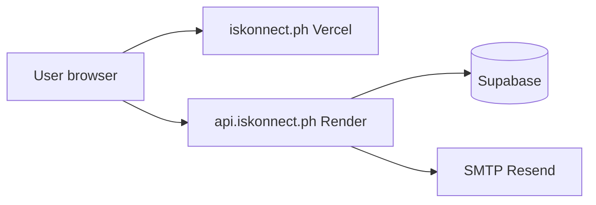

# Part 4 — Domains and DNS

> Turn `your-app.vercel.app` and `iskonnect-api.onrender.com` into **`iskonnect.ph`** — and understand every record you create.

---

## Why domains matter

| Without custom domain | With custom domain |
|----------------------|-------------------|
| `scholarship-match-abc123.vercel.app` | `https://iskonnect.ph` |
| Looks like a demo | Looks like a product |
| URL changes if you recreate Vercel project | Stable brand URL |
| Harder to remember for users | Shareable, trustworthy |

**What breaks if skipped:** Nothing technically — app works on free subdomains. Marketing, email deliverability (SPF/DKIM on your domain), and user trust suffer.

---

## Core concepts

### Domain name

**What:** Human-readable address (`iskonnect.ph`) that maps to IP addresses.

**Analogy:** Domain = business name on a building directory; IP = actual suite number.

**Parts:**
- `iskonnect` — second-level name (you choose)
- `.ph` — country-code TLD (Philippines)

---

### Registrar

**What:** Company you **buy** the domain from.

**Examples:** Namecheap, Cloudflare Registrar, GoDaddy, Google Domains (now Squarespace).

**Why:** ICANN-accredited sellers maintain who owns the domain.

**What breaks if you lose access:** Someone else can take over your domain. Use password manager + 2FA.

**Alternative:** Some platforms offer subdomains only (not a real TLD you own).

---

### DNS (Domain Name System)

**What:** Global phone book translating `iskonnect.ph` → server IP addresses.

**Why:** Browsers need IP addresses; humans need names.

**How engineers discovered it:** Early internet used a single `HOSTS.TXT` file — didn't scale; DNS distributed the lookup.

**Verify DNS propagation:**
```powershell
nslookup iskonnect.ph
```

**Expected (after setup):**
```
Name:    iskonnect.ph
Address: 76.76.x.x
```

---

### Nameservers

**What:** Servers authoritative for your domain's DNS records.

**Why:** Registrar can point domain to Cloudflare/Vercel/Route53 nameservers for advanced DNS.

**Two common patterns:**

| Pattern | Nameservers point to | DNS managed in |
|---------|---------------------|----------------|
| **Registrar DNS** | Namecheap default | Registrar dashboard |
| **Cloudflare proxy** | Cloudflare | Cloudflare dashboard |

**What breaks if wrong:** Records you add in wrong dashboard have no effect.

---

### DNS record types (what Iskonnect uses)

| Type | Purpose | Iskonnect usage |
|------|---------|-----------------|
| **A** | Domain → IPv4 address | Vercel may use A records for apex |
| **AAAA** | Domain → IPv6 address | Vercel IPv6 |
| **CNAME** | Alias → another hostname | `www` → Vercel; `api` → Render |
| **MX** | Mail server | Email provider (Resend/SendGrid) |
| **TXT** | Text verification | SPF, DKIM, domain ownership |

#### A record

**What:** Maps name directly to IPv4.

**Example:** `iskonnect.ph` → `76.76.21.21`

**Analogy:** Writing a person's home address directly.

#### CNAME record

**What:** Alias — "ask this other name instead."

**Example:** `www.iskonnect.ph` → `cname.vercel-dns.com`

**Analogy:** "Forward my mail to John's address."

**Limitation:** Cannot use CNAME on apex (`iskonnect.ph`) per old DNS rules — Vercel uses **A record** for apex or **ALIAS/ANAME** at some providers.

#### MX record

**What:** Where to deliver email **to** `@iskonnect.ph` mailboxes.

**Iskonnect note:** You send **from** `noreply@iskonnect.ph` via SMTP provider — you need SPF/DKIM **TXT** records, not necessarily MX unless you receive mail.

#### TXT record

**What:** Arbitrary text for verification and email auth.

**Examples:**
```
v=spf1 include:amazonses.com ~all
resend._domainkey → DKIM key
```

---

### SSL / TLS certificates

**What:** Encrypts HTTPS traffic; proves site identity.

**Why:** Browsers show "Not Secure" without it; required for production trust.

**How Iskonnect gets SSL:**
- **Vercel** — auto-provisions Let's Encrypt when domain verified
- **Render** — auto-provisions when custom domain added

**What breaks if SSL fails:** Browser blocks site; API calls fail.

**Verify SSL:**
```powershell
curl.exe -sI https://iskonnect.ph | findstr "HTTP"
```
**Expected:** `HTTP/1.1 200` or `HTTP/2 200`

**Online tool:** https://www.ssllabs.com/ssltest/

---

## Buy a domain (step by step)

### What we're doing
Purchasing `iskonnect.ph` (or your chosen name) for 1+ years.

### Why
Stable URLs for `FRONTEND_URL`, `CORS_ORIGINS`, and `EMAIL_FROM`.

### Walkthrough (Namecheap example)

1. namecheap.com → search `iskonnect.ph`
2. Add to cart → checkout
3. Enable **WhoisGuard** (privacy) if included
4. Complete payment (~₱500–1500/year for `.ph`)
5. Domain appears in **Dashboard → Domain List**

### Verify purchase
- Dashboard shows domain
- Status: **Active**
- You can open **Advanced DNS** tab

### Troubleshoot
- `.ph` domains may require local documentation — check registrar rules
- Domain in "pending" — wait 24h or contact support

### Alternatives
- `.com` if `.ph` unavailable
- Cloudflare Registrar (at-cost pricing)

---

## Connect Vercel (frontend domain)

### What we're doing
Point `iskonnect.ph` and `www.iskonnect.ph` to Vercel.

### Why
Users visit your brand URL; `FRONTEND_URL` and email links use this domain.

### Dashboard steps

1. **Vercel** → Project → **Settings → Domains**
2. Add `iskonnect.ph` → Vercel shows required DNS records
3. Add `www.iskonnect.ph` → usually CNAME to `cname.vercel-dns.com`

**Typical records to add at registrar:**

| Type | Host | Value |
|------|------|-------|
| A | `@` | `76.76.21.21` (Vercel shows exact IP) |
| CNAME | `www` | `cname.vercel-dns.com` |

4. Save at registrar
5. Vercel → Domains → wait for **Valid Configuration** ✓

### Update application config

**Render env:**
```
CORS_ORIGINS=https://iskonnect.ph,https://www.iskonnect.ph
FRONTEND_URL=https://iskonnect.ph
```

**Redeploy Render** after changing env vars.

**Vercel env:** No change to `VITE_API_BASE_URL` (still points to API subdomain).

### Verify
```powershell
nslookup iskonnect.ph
curl.exe -sI https://iskonnect.ph
```
- Browser opens site with padlock icon
- Login works (no CORS errors)

### Troubleshoot
| Problem | Fix |
|---------|-----|
| "Invalid Configuration" in Vercel | DNS records wrong; wait up to 48h propagation |
| Apex works, www doesn't | Add www CNAME |
| SSL pending | Wait 10–60 min after DNS valid |
| CORS after domain | Add **both** apex and www to `CORS_ORIGINS` |

---

## Connect Render (API subdomain)

### What we're doing
Create `api.iskonnect.ph` pointing to Render.

### Why
Clean separation: `iskonnect.ph` = frontend, `api.iskonnect.ph` = backend.

### Dashboard steps

1. **Render** → `iskonnect-api` service → **Settings → Custom Domains**
2. Add `api.iskonnect.ph`
3. Render shows CNAME target, e.g. `iskonnect-api.onrender.com`

4. **Registrar DNS:**

| Type | Host | Value |
|------|------|-------|
| CNAME | `api` | `iskonnect-api.onrender.com` |

5. Wait for Render **Verified** + SSL issued

### Update Vercel frontend

**Critical:** `VITE_API_BASE_URL` must change to custom API domain.

**Vercel env:**
```
VITE_API_BASE_URL=https://api.iskonnect.ph
```

**Redeploy Vercel** (rebuild required).

### Verify
```powershell
curl.exe -s https://api.iskonnect.ph/health
```
**Expected:** Same healthy JSON as Render subdomain.

Browser → Network tab → API calls go to `api.iskonnect.ph`.

---

## Email DNS (SPF, DKIM)

### What we're doing
Authorizing your SMTP provider to send as `@iskonnect.ph`.

### Why
Without SPF/DKIM, verification emails land in spam or get rejected.

### Resend example

1. Resend dashboard → **Domains** → Add `iskonnect.ph`
2. Resend shows TXT records to add
3. Registrar → Advanced DNS → add each TXT
4. Resend → **Verify**

**Typical records:**
| Type | Host | Purpose |
|------|------|---------|
| TXT | `@` | SPF |
| TXT | `resend._domainkey` | DKIM |

### Verify
- Resend shows **Verified**
- Send test email; check headers show `dkim=pass`

### Troubleshoot
- Propagation delay up to 48h
- Duplicate SPF records — merge into one TXT

---

## DNS propagation

### What
Time for DNS changes to spread worldwide (TTL-dependent).

### Why
Different DNS servers cache old records.

### Verify propagation

**Command:**
```powershell
nslookup api.iskonnect.ph
nslookup iskonnect.ph 8.8.8.8
```

Second command queries Google DNS directly.

**Online:** https://dnschecker.org — enter hostname, check global results.

### Expected timeline
- 5–30 minutes: often works locally
- Up to 48 hours: worst case

### What breaks if you don't wait
You think setup failed; you change records again, causing more confusion.

---

## Full DNS map (target state)

```
iskonnect.ph          A      → Vercel IP
www.iskonnect.ph      CNAME  → cname.vercel-dns.com
api.iskonnect.ph      CNAME  → iskonnect-api.onrender.com
iskonnect.ph          TXT    → SPF
resend._domainkey     TXT    → DKIM
```



---

## SSL troubleshooting

| Symptom | Cause | Fix |
|---------|-------|-----|
| `NET::ERR_CERT_COMMON_NAME_INVALID` | Cert for wrong domain | Wait for Render/Vercel auto-cert |
| Mixed content warnings | HTTP resources on HTTPS page | Fix hardcoded `http://` in app |
| Cert expired | Auto-renew failed | Re-verify domain in dashboard |
| API SSL error from browser | Custom domain not verified on Render | Complete CNAME setup |

---

## Redirect strategy (www vs apex)

**Recommendation:** Pick one canonical URL.

**Vercel:** Settings → Domains → set redirect `www` → apex (or vice versa).

**Update `FRONTEND_URL` and `CORS_ORIGINS`** to match canonical choice only, or include both.

---

## Decision log: why subdomain for API?

| Approach | Pros | Cons |
|----------|------|------|
| `api.iskonnect.ph` | Clear separation; standard pattern | Extra DNS record |
| Same domain `/api` proxy | Single origin | Vercel rewrites to Render add complexity |
| Keep `onrender.com` | No DNS work | Unprofessional; CORS still works |

**Iskonnect uses:** Separate subdomain on Render (simplest with current architecture).

---

*Previous: [Part 3 — Verification](03-verification.md) · Next: [Part 5 — Testing Production](05-testing-production.md)*
