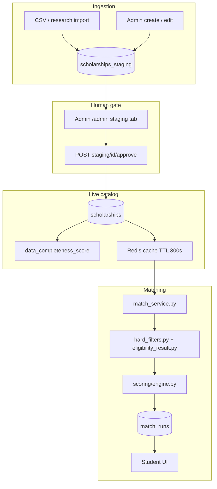

# Part 6 — Scholarship Data Pipeline

> Trace **one scholarship** from research/import to a student's recommendation — every file, every decision.

ISKONNECT does **not** use automated web scraping. The catalog is a **team-verified, structured database**: imports land in staging, admins approve every row, and nightly maintenance keeps deadlines and verification fresh.

---

## Pipeline overview

---

## Ingestion paths

| Path | Script / endpoint | Destination |
|------|-------------------|-------------|
| **CSV → staging** | `app/scripts/csv_to_staging.py` | `scholarships_staging` (pending) |
| **CSV → live (admin)** | `app/scripts/import_scholarships.py` | `scholarships` (legacy direct import) |
| **Admin UI** | `POST /api/v1/scholarships` | `scholarships` |
| **Staging approve** | `POST /api/v1/scholarships/staging/{id}/approve` | `scholarships` |

**Policy:** All staging rows require **explicit admin approval**. There is no auto-promotion from external sources.

On approve, `verification_source` is set via `verification_source_for()` in `app/utils/staging_promotion.py` (legacy PhilScholar sources map to `team_verified`).

---

## Completeness & publishability

- **Score:** `app/utils/data_completeness.py` — weighted 0–100 on write and nightly via `app/jobs/catalog_maintenance.py`.
- **Gate:** Matches and public search use `publishable_only=True` in `get_cached_scholarship_dicts()` — records below `PUBLISHABILITY_THRESHOLD` (40) are excluded from matching/search cache.
- **Admin dashboard:** `GET /api/v1/admin/data-quality` — tier distribution, gap views, high-priority queue.

---

## Catalog maintenance (not scraping)

**Job:** `python -m app.jobs.catalog_maintenance`

Runs via GitHub Actions **Scholarship deadline maintenance** (`deadline-maintenance.yml`).

1. Past `application_deadline` → `data_status=expired`, sync `application_status`
2. Stale `last_verified_at` (>30 days) → `data_status=needs_review`
3. Invalidate scholarship list cache
4. `run_data_quality_checks()` + `recompute_completeness_scores()`
5. Log run to `scraper_runs` table (legacy name; stores all maintenance jobs)

**Health check:** `GET /health` → `checks.maintenance_last` (recent job run metadata).

---

## Matching path

1. Student profile → `GET /api/v1/plan/{profile_id}` or `POST /api/v1/match-runs`
2. `match_service.py` loads **publishable** catalog from cache
3. `hard_filters.py` calls `evaluate_eligibility()` — single `EligibilityResult` contract
4. Non-`not_eligible` rows scored and ranked
5. Response includes `qualification_status`, `qualifying_requirements`, `missing_requirements`, verification badges

**Detail page:** `GET /api/v1/scholarships/{id}?profile_id=` attaches the same eligibility verdict when a profile is provided.

---

## Key files

| File | Role |
|------|------|
| `app/utils/staging_promotion.py` | Staging → live promotion rules |
| `app/utils/scholarship_persist.py` | Persist + completeness on write |
| `app/matching/eligibility_result.py` | Eligibility contract |
| `app/jobs/data_quality.py` | Quality counts + completeness recompute |
| `app/api/v1/admin_queues.py` | Admin data-quality dashboard API |

---

## Troubleshooting

| Symptom | Check |
|---------|--------|
| Scholarship missing from search/matches | `data_completeness_score`, `is_active`, `data_status` |
| Staging not clearing | Admin approve queue; `dedupe_key` conflicts |
| Stale verification badges | Run `catalog_maintenance`; review `needs_review` queue |
| `/health` degraded | `DATABASE_URL`, Redis, `maintenance_last` in checks |
