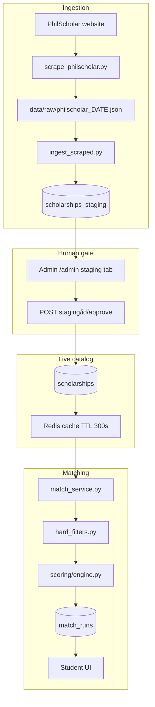

# Part 6 — Scholarship Data Pipeline

> Trace **one scholarship** from PhilScholar's website to a student's recommendation — every file, every decision.

---

## Pipeline overview



**Alternate ingestion paths** (same staging/live flow):
- **CSV import:** `app/scripts/import_scholarships.py` → live table (legacy scraper columns) or `csv_to_staging.py` → staging
- **Gemini / research CSV:** pipe-delimited lists in cells; `schemas.Scholarship` coerces `|` → lists on staging approve (see [Beta CSV import](#beta-csv-import-gemini--research) below)
- **Manual admin entry:** Admin UI → staging or direct

### Beta CSV import (Gemini / research)

Use this path to load 200–500 researched scholarships without manual cell editing.

**CSV conventions**
- List columns use **pipe** separators inside cells: `College|Graduate`, `Public|Private`, `ITR|TOR`
- Empty cells = unknown (coerced to `null` / `[]` by Pydantic validators in `app/schemas.py`)
- `scholarship_type`: use `Merit-based` (aliases `Merit`, `Academic` normalize automatically)
- Research-only columns (`application_status`, `cycle_type`, `last_open_date`, `last_close_date`, `research_notes`, `source_urls`) are **ignored** on import (`extra="ignore"`)

**Provenance**
- Set `source=gemini_research` in the CSV
- On staging approve, `verification_source` is set to `manual` via `verification_source_for()` in `app/utils/staging_promotion.py` (trusted auto-promote applies only to `philscholar` / `scraper`)

**Commands**
```powershell
python -m app.scripts.csv_to_staging --csv data/scholarships.csv
# Admin → Staging tab → approve rows
```

Or batch JSON: `POST /api/v1/scholarships/staging/import` with `{ "rows": [ ... ] }` (admin JWT).

**Verify after import**
```powershell
python -m pytest app/tests/test_scholarship_csv_coercion.py -v
python -m app.jobs.catalog_maintenance
```

---

## Stage 1: Source website

**Source:** PhilScholar public listing pages.

**File:** [app/scrapers/scrape_philscholar.py](../../app/scrapers/scrape_philscholar.py)

**What it does:**
1. Fetches HTML from PhilScholar
2. Parses scholarship cards (BeautifulSoup + lxml)
3. Extracts title, provider, link, deadlines, etc.
4. Writes JSON array to `data/raw/philscholar_YYYY-MM-DD.json`
5. Logs run to `scraper_runs` table via [app/scrapers/run_logging.py](../../app/scrapers/run_logging.py)

**Listing change detection:**
- Computes hash of listing HTML
- If unchanged from last successful run → writes `.skip` file instead of re-ingesting
- GitHub Actions checks for `.skip` and exits early

**Trigger:** [.github/workflows/scraper.yml](../../.github/workflows/scraper.yml)
- Schedule: Mon & Thu ~03:00 PHT (`0 19 * * 1,4` UTC)
- Manual: `workflow_dispatch`

**What breaks if skipped:** Catalog goes stale; no new programs discovered.

**Verify:**
```sql
SELECT * FROM scraper_runs ORDER BY started_at DESC LIMIT 1;
```
```powershell
curl.exe -s https://YOUR_API/health
# checks.scraper_last populated
```

---

## Stage 2: Raw JSON

**Path:** `data/raw/philscholar_2026-06-25.json`

**Shape:** JSON array of objects:
```json
[
  {
    "title": "CHED Merit Scholarship Program",
    "provider": "CHED",
    "link": "https://...",
    "source": "philscholar",
    "description": "...",
    "deadline": "2026-08-31"
  }
]
```

**Not committed to git** in production flow — generated in CI runner, consumed immediately.

---

## Stage 3: Ingest to staging

**File:** [app/scripts/ingest_scraped.py](../../app/scripts/ingest_scraped.py)

**Command:**
```powershell
python -m app.scripts.ingest_scraped --source data/raw/philscholar_2026-06-25.json
```

**What it does (per row):**
1. Validate title + link present
2. Compute `dedupe_key` via [app/utils/dedupe.py](../../app/utils/dedupe.py)
3. Skip if pending staging row with same `dedupe_key`
4. Skip if live `scholarships` duplicate (by link or title+provider)
5. Insert `scholarships_staging` with `status='pending'`

**Log output example:**
```
ingest_scraped created=5 skipped_dup=120 skipped_live=10 skipped_inv=2
```

---

## Deduplication (deep dive)

**File:** [app/utils/dedupe.py](../../app/utils/dedupe.py)

**Algorithm:**
```python
raw = "|".join([title.lower(), provider.lower(), link.lower()])
dedupe_key = sha256(raw).hexdigest()[:64]
```

| Check | When | Purpose |
|-------|------|---------|
| `dedupe_key` in pending staging | Ingest | Don't queue same scholarship twice |
| Live duplicate by link | Ingest | Don't stage if already published |
| Live duplicate by title+provider | Ingest | Catch link changes |

**Why SHA-256:** Stable, collision-resistant key for DB index.

**What breaks if dedupe wrong:** Duplicate scholarships in catalog → confused users and inflated match lists.

**Verify:**
```sql
SELECT dedupe_key, title, status, COUNT(*) 
FROM scholarships_staging 
GROUP BY dedupe_key, title, status 
HAVING COUNT(*) > 1;
-- Should return 0 rows
```

---

## Stage 4: Validation (implicit)

Staging rows hold full scholarship payload as JSON. Validation happens at:
- **Ingest:** required fields (title, link)
- **Approve:** Pydantic `Scholarship` schema validation in [scholarship_staging.py](../../app/api/v1/scholarship_staging.py)

**Invalid approve → 500** with `staging_approve_invalid_payload` in logs.

---

## Stage 5: Admin approval

**API:** [app/api/v1/scholarship_staging.py](../../app/api/v1/scholarship_staging.py)

| Endpoint | Action |
|----------|--------|
| `GET /api/v1/scholarships/staging` | List pending |
| `POST /api/v1/scholarships/staging/{id}/approve` | Promote to live |
| `POST /api/v1/scholarships/staging/{id}/reject` | Mark rejected |

**Approve flow:**
1. Admin JWT required (`role=admin`)
2. Load staging row
3. Parse payload → `Scholarship` schema
4. Insert `scholarships` row
5. Set staging `status='approved'`
6. Call `invalidate_scholarship_cache()`
7. Write audit log entry

**Why human approval:** Scrapers make mistakes; policy fields need human judgment before students see data.

**Alternatives:** Auto-approve high-confidence sources (not implemented — would need confidence scoring).

---

## Stage 6: Live database

**Table:** `scholarships`

**Key columns for matching:**
| Column | Used for |
|--------|----------|
| `is_active` | Excluded if false |
| `application_deadline` | Soft sort / eligibility display |
| `eligible_regions`, `eligible_cities` | Hard filter |
| `income_bracket_max` | Hard filter + scoring |
| `education_levels` | Hard filter |
| `eligible_psced`, `eligible_specific_courses` | Field matching |
| `needs_tags` | Equity / needs matching |
| `data_status` | `expired`, `needs_review`, etc. |

**Cache:** [app/scholarship_cache.py](../../app/scholarship_cache.py)
- Redis key: `iskonnect:scholarships_json:v1`
- TTL: 300 seconds
- Invalidated on any scholarship mutation

---

## Stage 7: Matching (Stage 1 — hard filters)

**File:** [app/matching/hard_filters.py](../../app/matching/hard_filters.py)

**What:** Eliminates scholarships the student **cannot** qualify for.

**Examples of hard exclusions:**
- Region not in `eligible_regions`
- Income above scholarship maximum
- Education level mismatch
- Field of study not aligned (strict cases)

**Output:** `(candidates, eliminated)` — eliminated rows include `reason` for diagnostics.

**Important:** Passed deadlines are **not** hard-excluded by default — they sort to bottom with `eligibility_status=false` post-scoring.

**Orchestrator:** [app/matching/match_service.py](../../app/matching/match_service.py) lines ~156–167

---

## Stage 8: Scoring (Stage 2)

**Files:**
- [app/scoring/engine.py](../../app/scoring/engine.py) — `WeightedDeterministicScorer`
- [app/scoring/components.py](../../app/scoring/components.py) — component calculators
- [app/scoring/explanation.py](../../app/scoring/explanation.py) — human-readable reasons
- [app/scoring/config.py](../../app/scoring/config.py) — weights

### Default weights (sum = 1.0)

| Component | Weight | What it measures |
|-----------|--------|------------------|
| academic | 0.30 | GWA vs requirements |
| income | 0.28 | Income bracket fit |
| field_alignment | 0.22 | PSCED / course match |
| geographic | 0.10 | Region/city proximity |
| equity_priority | 0.10 | Equity group alignment |

**DB-driven weights:** Set `DB_DRIVEN_WEIGHTS=true` to load from `scoring_weights` table (admin tunable).

**Port abstraction:** [app/matching/scoring_port.py](../../app/matching/scoring_port.py) — allows swapping scorer implementation.

### GWA normalization

**File:** [app/taxonomy/gwa_normalizer.py](../../app/taxonomy/gwa_normalizer.py)

Converts Philippine grade scales (5.0, 4.0, percentage) to comparable values. Unknown scale → `None` (fail-soft, no silent mis-score).

---

## Stage 9: Match run persisted

**API:** [app/api/v1/matches.py](../../app/api/v1/matches.py)

**Table:** `match_runs`
- `student_id`, `profile_snapshot`, `results` (JSON array), `diagnostics`

**Response includes per match:**
- `final_score`
- `breakdown` (component scores)
- `explanation[]`, `why_not_higher[]`, `suggestions[]`
- `confidence`

---

## Stage 10: User recommendation

**Frontend:** [MatchResultsPage.tsx](../../frontend/src/pages/MatchResultsPage.tsx)

Reads match run by ID from URL `?run=` or fetches latest.

**User sees:** Ranked cards with scores, eligibility status, external application links.

---

## End-to-end trace example

**Scholarship:** "CHED Merit Scholarship Program"

| Step | Location | State |
|------|----------|-------|
| 1 | PhilScholar HTML | Public web page |
| 2 | `scrape_philscholar.py` | Parsed to JSON |
| 3 | `data/raw/philscholar_2026-06-25.json` | Raw file on CI runner |
| 4 | `ingest_scraped.py` | `scholarships_staging` id=42, pending |
| 5 | Admin approves | `scholarships` id=17, active |
| 6 | Redis cache | Cached dict includes id=17 |
| 7 | Student clicks Find Matches | hard_filters → passes |
| 8 | Scoring engine | score 78.5, rank #3 |
| 9 | `match_runs` id=99 | JSON persisted |
| 10 | MatchResultsPage | Student sees CHED Merit at #3 |

---

## Catalog maintenance (parallel pipeline)

**Not part of ingest** but affects live data:

| Job | File | Schedule |
|-----|------|----------|
| Deadline expiry | [expire_scholarship_deadlines.py](../../app/scripts/expire_scholarship_deadlines.py) | Daily (GitHub Actions) |
| Catalog maintenance | [catalog_maintenance.py](../../app/jobs/catalog_maintenance.py) | Called by above |
| Link checker | [link_checker.py](../../app/jobs/link_checker.py) | Optional (`ENABLE_LINK_CHECKER`) |

**Effect:** Past deadlines → `is_active=false`, `data_status=expired`; cache invalidated.

---

## How to verify correctness

### Data volume
```powershell
curl.exe -s https://YOUR_API/metrics
```

### Staging queue health
```sql
SELECT status, COUNT(*) FROM scholarships_staging GROUP BY status;
```

### No duplicate live scholarships
```sql
SELECT LOWER(TRIM(link)), COUNT(*) 
FROM scholarships 
WHERE link IS NOT NULL AND link != ''
GROUP BY LOWER(TRIM(link)) 
HAVING COUNT(*) > 1;
```

### Matching regression
```powershell
python -m pytest app/tests/test_match_service_integration.py app/tests/test_scoring_engine.py -v
```

### Manual spot check
1. Pick a known scholarship in DB
2. Build student profile that should match
3. Run matches
4. Confirm scholarship appears with expected score range and explanations

---

## Troubleshooting data issues

| Issue | Investigation | Fix |
|-------|---------------|-----|
| Missing new scholarships | `scraper_runs` status; staging pending count | Run scraper; approve staging |
| Duplicates in catalog | dedupe_key collisions; link variants | Merge manually; improve dedupe |
| Wrong match scores | Profile data; GWA scale; weights | Fix profile; check `scoring_weights` |
| Stale search results | Redis cache | Wait 300s or approve any row to invalidate |
| All scholarships expired | `deadline-maintenance` job | Check GitHub Actions; re-import |

---

*Previous: [Part 5 — Testing Production](05-testing-production.md) · Next: [Part 7 — Operations](07-operations.md)*
