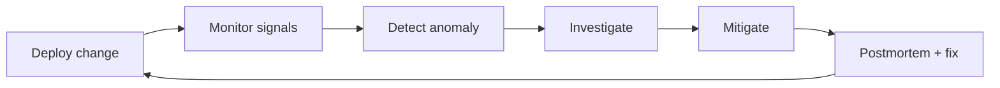

# Part 7 — Operations

> Runbooks for everything that goes wrong **after** launch — and how to ship updates safely.

---

## Operations mindset

Production operations is a loop:



**Your three tools:** logs, metrics, database queries.

---

## Debugging toolkit

### `grep` — search text in files/logs

**What:** Find lines matching a pattern.

**Syntax:** `grep <pattern> <file>`

**PowerShell equivalent:**
```powershell
Select-String -Path "render-log.txt" -Pattern "unhandled_exception"
```

**When:** Searching exported Render logs for error strings.

---

### `ps` — list processes

**What:** Shows running processes.

**PowerShell:** `Get-Process`

**When:** Local dev — is uvicorn still running on port 8000?

```powershell
Get-Process -Name python -ErrorAction SilentlyContinue
```

---

### `netstat` — network connections

**What:** Shows which ports are in use.

**PowerShell:**
```powershell
netstat -ano | findstr :8000
```

**Expected (local dev):** Line showing `LISTENING` on 8000.

**When:** "Address already in use" error on `uvicorn` startup.

**Fix:** Kill process using port or use different port.

---

## Deploy updates

### What we're doing
Shipping new code to production.

### Standard procedure

1. **Develop locally** — tests pass
2. **Commit and push** to `main`
3. **Wait for CI green** (GitHub Actions)
4. **Render** auto-deploys (if connected) or manual deploy
5. **Vercel** auto-deploys frontend (if connected)
6. **Watch release command** — `alembic upgrade head` in Render logs
7. **Run smoke tests** — [Part 5](05-testing-production.md)

### Backend-only change
```powershell
git add app/
git commit -m "fix: match scoring edge case"
git push origin main
```
Monitor Render → Events → Deploy live.

### Frontend-only change
```powershell
git add frontend/
git commit -m "fix: dashboard layout"
git push origin main
```
Monitor Vercel → Deployments.

### Migration included
**Extra caution:**
1. CI `migrate-postgres` job must pass (up/down/up)
2. Backup Supabase before deploy ([BACKUP_ROLLBACK.md](../BACKUP_ROLLBACK.md))
3. Render release command applies migration before traffic shifts

### What breaks if you skip CI
Broken migrations reach production; API fails to start.

### Verify
```powershell
curl.exe -s https://YOUR_API/health
curl.exe -s https://YOUR_API/metrics
```

---

## Roll back bad deployments

### Application rollback (no schema change)

**Symptoms:** 500 errors after deploy; Sentry spike; feature broken.

**Investigation:**
1. Sentry → filter by `release` or time window
2. Render logs → tracebacks
3. Identify last good deploy in Render Events

**Mitigation:**
1. Render → **Manual Deploy** → select previous commit → Deploy
2. Vercel → Deployments → previous deployment → **Promote to Production**
3. Verify `/health` and smoke tests

**RCA questions:**
- Did CI pass?
- Was migration involved?
- Env var change?

### Database rollback (bad migration)

**Symptoms:** Missing columns; 500 on all DB routes; data corruption.

**Stop traffic first:**
- Render → Suspend service OR maintenance banner

**Options:**

| Option | When |
|--------|------|
| `alembic downgrade -1` | Downgrade script tested; reversible migration |
| Supabase PITR | Data corrupted; need point-in-time restore |
| Restore backup to new project | Major corruption |

**Procedure (downgrade):**
```powershell
$env:DATABASE_URL = "your-supabase-uri"
alembic downgrade -1
# Redeploy previous app version
```

**Never** run downgrade on production without testing on staging copy.

See [BACKUP_ROLLBACK.md](../BACKUP_ROLLBACK.md).

---

## Handle outages

### Symptoms
- UptimeRobot alert
- `/health` returns 503
- Users report "Unable to reach server"
- Sentry quiet (may mean API not running at all)

### Investigation steps

1. **Check Render status** — status.render.com
2. **Check Supabase status** — status.supabase.com
3. **curl /health**
   ```powershell
   curl.exe -s -w "`nHTTP %{http_code}`n" https://YOUR_API/health
   ```
4. **Render logs** — last 100 lines
5. **Supabase dashboard** — project paused? connection limit?

### Common root causes

| Cause | Fix |
|-------|-----|
| Supabase paused (free tier inactivity) | Resume project |
| Invalid production config | Fix env vars; redeploy |
| Connection pool exhausted | Reduce workers; increase pooler tier |
| OOM kill | Upgrade Render instance |
| Bad migration | Rollback per above |

### Communication template
```
Iskonnect is experiencing issues affecting [login/matching/etc].
We are investigating. Updates every 30 minutes.
Status: investigating | identified | monitoring | resolved
```

---

## Fix broken emails

### Symptoms
- Users don't receive verification/reset emails
- SMTP errors in Render logs
- Emails in spam

### Investigation

1. **Production guard passed?** SMTP was required at startup — if API runs, config exists.
2. **Render logs:** search `smtp`, `email`, `send_`
3. **Redis abuse caps:** user hit daily limit?
   ```sql
   -- Check if user exists
   SELECT email, email_verified FROM users WHERE email = '...';
   ```
4. **Provider dashboard** (Resend/SendGrid) — delivery logs, bounces
5. **DNS:** SPF/DKIM verified?

### Debug send (local with production SMTP — careful)
```powershell
$env:SMTP_HOST = "smtp.resend.com"
# ... other SMTP vars
python -c "from app.utils.email import send_email_verification_email; ..."
```

### Fixes

| Issue | Fix |
|-------|-----|
| Auth failure | Rotate `SMTP_PASSWORD` API key |
| Spam folder | Complete DKIM/DMARC |
| Abuse cap | Wait 24h or adjust caps in `email_abuse.py` (code change) |
| Wrong link domain | Fix `FRONTEND_URL` |

---

## Fix scraper failures

### Symptoms
- `/health` → `scraper_last` stale or `status: failed`
- No new staging rows
- GitHub Actions workflow red

### Investigation

1. **GitHub Actions** → latest scraper run → failed step
2. **Common failures:**
   - `DATABASE_URL` secret missing/wrong
   - PhilScholar HTML structure changed
   - Empty JSON output
3. **Manual run:**
   Actions → Scholarship scrape and ingest → Run workflow

### Local reproduction
```powershell
$env:DATABASE_URL = "postgresql+psycopg2://..."
python -m app.scrapers.scrape_philscholar
python -m app.scripts.ingest_scraped --source data/raw/philscholar_YYYY-MM-DD.json
```

### Fixes

| Issue | Fix |
|-------|-----|
| HTML parse failure | Update `scrape_philscholar.py` selectors |
| All skipped as dup | Expected if catalog current |
| `.skip` file | Listing unchanged — not a failure |
| CI timeout | Increase timeout or optimize scraper |

### Fallback data path
```powershell
python -m app.scripts.import_scholarships --csv path/to/scholarships.csv
```

---

## Fix database issues

### Symptoms
- `/health` 503, `db: false`
- Slow queries
- `too many connections`

### Investigation

```sql
-- Connection count (Supabase SQL editor)
SELECT count(*) FROM pg_stat_activity;

-- Table sizes
SELECT relname, n_live_tup FROM pg_stat_user_tables ORDER BY n_live_tup DESC;

-- Recent errors — check Render logs for SQLAlchemy exceptions
```

### Fixes

| Issue | Fix |
|-------|-----|
| Wrong DATABASE_URL | Fix Render env; use pooler :6543 |
| Pool exhausted | Lower `WEB_CONCURRENCY` or `DB_POOL_SIZE` |
| Supabase paused | Resume in dashboard |
| Disk full | Upgrade plan; archive old `match_runs` |

### Emergency read-only mode
No built-in flag — suspend Render service and show static maintenance page on Vercel (manual).

---

## Handle traffic spikes

### Symptoms
- Slow API responses
- 429 rate limits increasing
- Render CPU at 100%

### Investigation
- Render metrics (paid plans)
- `/metrics` user count growth
- Sentry performance (if enabled)

### Mitigations

| Action | Effect |
|--------|--------|
| Increase `WEB_CONCURRENCY` | More parallel requests (watch DB connections) |
| Upgrade Render instance | More CPU/RAM |
| Upgrade Redis | Higher command throughput |
| UptimeRobot on /health | Reduces cold starts (free tier) |
| CDN already on Vercel | Frontend scales automatically |

---

## Investigate user complaints

### "I can't log in"

1. Verify user exists: `SELECT * FROM users WHERE email = '...'`
2. Check `email_verified` if required
3. Test login via curl with their credentials (ask them to reset password)
4. Check rate limit (429)

### "My matches are wrong"

1. Get `user_id` → `student_id` → latest `match_runs` row
2. Inspect `profile_snapshot` in match run vs current profile
3. Check if scholarships hard-filtered — `diagnostics.eliminated_scholarships`
4. Verify GWA scale in profile

### "Scholarship link is broken"

1. `SELECT link, data_status FROM scholarships WHERE title ILIKE '%...%'`
2. Run link checker job if enabled
3. Admin: mark `needs_review` or deactivate

---

## Investigate missing scholarships

### Checklist

```
[ ] In scholarships_staging as pending? → Admin approve
[ ] Scraper run succeeded? → scraper_runs table
[ ] Ingest skipped as duplicate? → GitHub Actions logs
[ ] is_active = false? → deadline maintenance
[ ] Hard-filtered for this user? → match diagnostics
[ ] Redis cache stale? → wait 5 min or invalidate
```

### SQL
```sql
SELECT id, title, is_active, data_status FROM scholarships WHERE title ILIKE '%search term%';
SELECT id, title, status FROM scholarships_staging WHERE title ILIKE '%search term%';
```

---

## Investigate incorrect matches

### Procedure

1. Reproduce with same profile ID
2. Export match run JSON from DB
3. For specific scholarship, check:
   - Hard filter pass/fail reasons
   - Component breakdown scores
   - Profile field values used (`profile_snapshot`)
4. Compare with [SCORING_ENGINE.md](../../SCORING_ENGINE.md) and weights in `config.py`

### Regression test
```powershell
python -m pytest app/tests/test_scoring_engine.py -v --tb=long
```

### If weights wrong
- Check `DB_DRIVEN_WEIGHTS` and `scoring_weights` table
- Admin scoring endpoints in `scoring_admin.py`

---

## Root cause analysis template

After every significant incident:

```markdown
## Incident: [title]
**Date:** 
**Duration:** 
**Impact:** [users affected, features down]

### Timeline
- HH:MM — Alert fired
- HH:MM — Investigation started
- HH:MM — Root cause identified
- HH:MM — Mitigated
- HH:MM — Resolved

### Root cause
[One sentence]

### Contributing factors
- 

### What went well
- 

### What went poorly
- 

### Action items
| Action | Owner | Due |
|--------|-------|-----|
| | | |
```

---

*Previous: [Part 6 — Data Pipeline](06-data-pipeline.md) · Next: [Part 8 — Observability](08-observability.md)*
