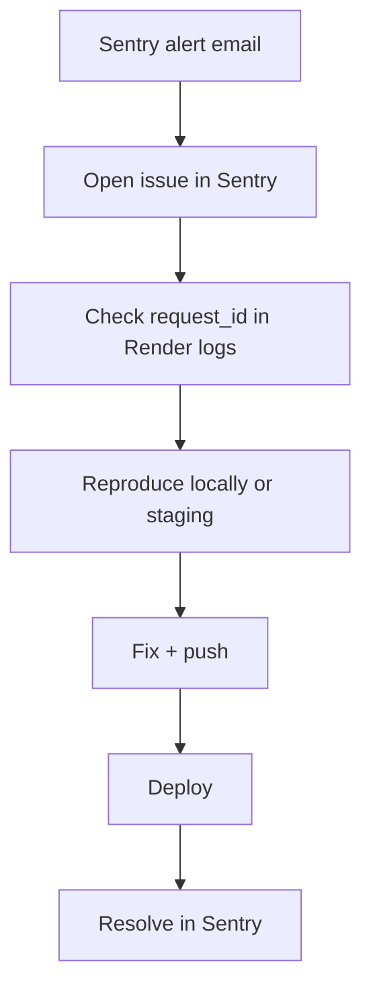

# Part 8 — Observability

> See problems before users report them. Know what healthy looks like.

Builds on [OBSERVABILITY.md](../OBSERVABILITY.md) and [MONITORING_GUIDE.md](../MONITORING_GUIDE.md).

---

## Observability pillars

| Pillar | Iskonnect implementation | Where to look |
|--------|-------------------------|---------------|
| **Logs** | Python logging + request middleware | Render logs |
| **Metrics** | `/metrics` endpoint | curl, future Prometheus |
| **Traces** | Sentry 10% sample rate | Sentry Performance |
| **Errors** | Sentry backend + frontend | Sentry Issues |
| **Uptime** | UptimeRobot on `/health` | UptimeRobot dashboard |

```mermaid
flowchart TB
  subgraph signals [Signals]
    Logs[Application logs]
    Metrics[/metrics counts]
    Errors[Sentry issues]
    Uptime[Health probe]
  end

  subgraph tools [Tools]
    Render[Render log stream]
    SentryDash[Sentry dashboard]
    UptimeRobot[UptimeRobot]
    Supabase[Supabase metrics]
  end

  subgraph human [Operator]
    You[Founder / on-call]
  end

  Logs --> Render
  Metrics --> You
  Errors --> SentryDash
  Uptime --> UptimeRobot
  Render --> You
  SentryDash --> You
  UptimeRobot --> You
```

---

## Logging

### What gets logged

**File:** [app/middleware/request_logger.py](../../app/middleware/request_logger.py)

Every HTTP request logs:
- `request_id` (from `X-Request-ID` header or generated)
- Method, path, status code, duration

**Startup log** ([app/main.py](../../app/main.py)):
```
[startup] environment=production database=postgres @ ...pooler.supabase.com:6543 cors_origins=[...]
```

**Unhandled exceptions:**
```
[request_id] unhandled_exception path=/api/v1/... method=POST err=...
```

### Structured logging

**Env:** `STRUCTURED_LOGGING=true`

**Why:** JSON logs parse better in log aggregators (Datadog, etc.).

**What breaks if off:** Logs are still readable strings — fine for early stage.

### What to search in Render logs

| Pattern | Meaning |
|---------|---------|
| `unhandled_exception` | 500 error |
| `health_db_check_failed` | DB down |
| `health_redis_check_failed` | Redis issue |
| `Rate limit exceeded` | Abuse or aggressive client |
| `staging_approve` | Admin actions |
| `smtp` / `email` | Email delivery |
| `Invalid production configuration` | Boot failure |

### Log levels

| Level | When |
|-------|------|
| WARNING | Degraded deps, auth_disabled in dev |
| ERROR | Unhandled exceptions |
| INFO | Normal request flow (if enabled) |

### PII scrubbing

- Do **not** log passwords, tokens, or full JWTs
- Sentry: review before enabling full request body capture
- `request_id` is safe to share with users for support tickets

---

## Sentry

### Backend setup

**Env:** `SENTRY_DSN` on Render

**Code:** [app/main.py](../../app/main.py)
- Init on import if DSN set
- Global handler tags: `request_id`, `path`
- `traces_sample_rate=0.1` (10% of requests traced)

### Frontend setup

**Env on Vercel:**
```
VITE_SENTRY_DSN=...
VITE_SENTRY_ENVIRONMENT=production
VITE_SENTRY_RELEASE=<git-sha>
```

**Code:** [frontend/src/main.tsx](../../frontend/src/main.tsx)

### Recommended alert rule

From [OBSERVABILITY.md](../OBSERVABILITY.md):

| Setting | Value |
|---------|-------|
| Name | Production error spike |
| Condition | > 10 events in 5 minutes |
| Filter | `environment:production` |
| Action | Email or Slack |

**Why this threshold:** Catches deploy regressions without alerting on single 404s.

### Sentry dashboard walkthrough

1. **Issues** — grouped exceptions; click for stack trace
2. **Releases** — correlate errors with deploy version (`VITE_SENTRY_RELEASE`)
3. **Performance** — slow transactions (10% sample)
4. **Alerts** — configure spike rule above

### Healthy vs broken in Sentry

| Healthy | Broken |
|---------|--------|
| 0–2 new issues per day | Spike > 10 in 5 min |
| Issues are known edge cases | New issue on core path (login, matches) |
| Resolved after fix deploy | Same issue count rising hourly |

---

## Metrics

### `GET /metrics`

**Returns:**
```json
{
  "scholarships": 150,
  "users": 42,
  "staging_pending": 7
}
```

**Use cases:**
- Daily operator check — growth trends
- Post-deploy sanity — counts didn't drop to zero
- Scraper health — `staging_pending` increasing

**Security:** Counts are semi-sensitive — restrict public access on mature product.

### Future: Prometheus

Comment in `main.py` mentions Prometheus-style text optional later. Not implemented today.

### Supabase metrics

Dashboard → **Reports**:
- Database size
- Active connections
- API requests (if using Supabase API — not primary for this app)

### Render metrics

Paid plans: CPU, memory, response time graphs.

---

## Error tracking workflow



**User reports bug with request_id:**
1. Search Render logs for that ID
2. Find stack trace or Sentry issue with same tag

---

## Dashboards that matter

### Daily glance (5 minutes)

| Dashboard | Check |
|-----------|-------|
| UptimeRobot | All green |
| Sentry | No new critical issues |
| `curl /health` | `status: ok` |
| `curl /metrics` | Reasonable counts |

### Weekly review (30 minutes)

| Dashboard | Check |
|-----------|-------|
| Sentry | Top 5 issues by frequency — fix or mute |
| GitHub Actions | All workflows green last 7 days |
| Supabase | DB size trend; connection peaks |
| `/health` scraper_last | Recent successful run |
| Staging queue | `staging_pending` not growing unbounded |

---

## What a healthy system looks like

```
UptimeRobot:     100% last 7 days (except planned maintenance)
/health:         HTTP 200, db:true, cache:true
/metrics:        scholarships > 0, users growing steadily
Sentry:          < 5 unresolved issues, no spike alerts
Render logs:     No unhandled_exception in last hour
CI:              Green on main
Scraper:         Last run < 4 days ago (Mon/Thu schedule)
Email:           Provider delivery rate > 95%
```

---

## What a broken system looks like

```
UptimeRobot:     Down or flapping
/health:         HTTP 503 or timeout
Sentry:          Alert firing; new issue on POST /auth/login
Render logs:     Repeated health_db_check_failed
Users:           Twitter/feedback complaining
/metrics:        scholarships = 0 unexpectedly
```

**Priority order:**
1. Restore `/health` (DB + API up)
2. Stop data corruption (pause writes if needed)
3. Fix user-facing path (login, matches)
4. Fix secondary (scraper, emails)

---

## Alerts summary

| Alert | Source | Threshold | Action |
|-------|--------|-----------|--------|
| API down | UptimeRobot | /health not 200 for 2 checks | Investigate Render + Supabase |
| Error spike | Sentry | >10 events / 5 min | Check last deploy |
| DB connections | Supabase | > 80% of limit | Reduce workers or upgrade |
| Scraper stale | Manual / script | scraper_last > 7 days | Run workflow manually |
| Disk space | Supabase | > 80% of quota | Archive or upgrade |

---

## Request correlation

**Header:** `X-Request-ID`

**Client may send; server always returns on errors:**
```json
{
  "detail": "An internal error occurred.",
  "request_id": "abc-123"
}
```

**Support script:** "Please share the error ID shown on screen" → grep logs.

---

## Enable structured logging in production

Render env:
```
STRUCTURED_LOGGING=true
```

Redeploy. Logs become JSON lines — easier to parse if you later add a log drain.

---

*Previous: [Part 7 — Operations](07-operations.md) · Next: [Part 9 — Scaling](09-scaling.md)*
