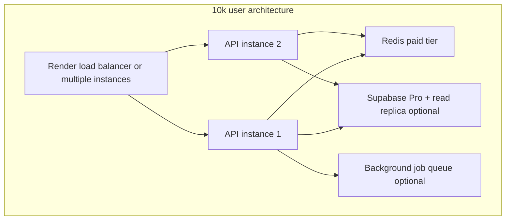

# Part 9 — Scaling

> What changes at 100, 1,000, 10,000, and 100,000 users — bottlenecks, costs, and when to upgrade.

Iskonnect's architecture today is optimized for **launch and early growth** on free/low-cost tiers. This part teaches you to recognize limits before users feel them.

---

## Current architecture limits (baseline)

| Component | Free/cheap tier limit | First bottleneck |
|-----------|----------------------|------------------|
| Render Web Service | 512MB RAM, cold starts | CPU + memory under concurrent match runs |
| Supabase Postgres | 500MB, 2 connections direct / pooler | Storage + connection count |
| Upstash Redis | 10K commands/day | Rate limit + cache commands |
| Vercel | 100GB bandwidth | Usually not first bottleneck |
| GitHub Actions | 2000 min/month | Scraper runtime |
| SMTP free tier | ~100 emails/day | Registration + reset volume |

---

## Scale tier: ~100 users

**Profile:** Friends, beta testers, school pilot. Mostly daytime traffic.

### Expected load
- ~10–50 API requests/minute peak
- ~5–20 match runs/day
- DB size < 50MB

### Bottlenecks
| Bottleneck | Symptom | Likelihood |
|------------|---------|------------|
| Render cold start | 15–30s first request after idle | **High** on free tier |
| Single-region latency | Slow for users far from Singapore | Low (PH users OK) |
| Manual admin approval | Staging queue backlog | Medium |

### Infrastructure (no changes needed)
- Free Render + Supabase + Upstash works
- `WEB_CONCURRENCY=2` sufficient
- UptimeRobot ping every 5 min mitigates cold starts

### Monitoring requirements
- UptimeRobot on `/health`
- Weekly Sentry check
- Manual scraper verification

### Cost estimate
**$0–15/month** (domain only if custom)

### Failure points
- Supabase project pauses after 1 week inactivity on free tier → **visit dashboard weekly**
- Render free tier spins down → cold starts

---

## Scale tier: ~1,000 users

**Profile:** School-wide rollout, social media traction, press mention.

### Expected load
- ~100–500 API requests/minute peak
- ~100–500 match runs/day
- DB size 100–500MB
- Email: tens of verifications/day

### Bottlenecks
| Bottleneck | Symptom | Fix |
|------------|---------|-----|
| Render free cold starts | User complaints about slow loads | **Upgrade to paid Render** ($7+/mo) |
| DB connections | `too many connections` in logs | Tune `WEB_CONCURRENCY`, `DB_POOL_SIZE` |
| Match CPU time | Slow POST /matches | More workers; optimize cache hit rate |
| Redis commands | Upstash limit approached | Upgrade Upstash tier |
| Email daily cap | Resend 100/day exceeded | Paid email plan |

### Infrastructure changes

```
Render:     Starter or Standard instance (always-on)
WEB_CONCURRENCY: 2 → 4 (watch DB connections: 4 workers × pool_size)
Supabase:   Pro plan if > 500MB or need PITR
Redis:      Paid Upstash or Render Redis
SMTP:       Paid tier
```

**Connection math:**
```
Max connections ≈ WEB_CONCURRENCY × (DB_POOL_SIZE + DB_MAX_OVERFLOW)
Default: 2 × (5 + 10) = 30 peak — OK for pooler
At 4 workers: 4 × 15 = 60 — still OK with pooler; monitor Supabase dashboard
```

### Monitoring requirements
- Sentry alert rule active
- Daily `/metrics` check
- Supabase connection graph
- Render CPU/memory (paid)

### Cost estimate
**$25–75/month**
- Render $7–25
- Supabase Pro $25
- Redis $0–10
- Email $0–20
- Domain $1

### Failure points
- Rate limiting triggers for school NAT (many users, one IP) → tune slowapi limits
- Scholarship cache stale for 5 min after bulk approve → acceptable or reduce TTL

---

## Scale tier: ~10,000 users

**Profile:** Regional adoption, multiple schools, regular media.

### Expected load
- ~1,000–5,000 API requests/minute peak
- ~2,000+ match runs/day
- DB size 1–5GB
- Concurrent match runs stress CPU

### Bottlenecks
| Bottleneck | Symptom | Fix |
|------------|---------|-----|
| Match endpoint CPU | p95 latency > 5s | Horizontal scale; async match queue |
| Postgres write load | Slow inserts on match_runs | Archive old runs; index tuning |
| Full catalog scan | Every match loads all scholarships | Pre-filter in SQL; pagination in matcher |
| Redis memory | Large cached JSON | Shorter TTL; cache minimal fields |
| Admin staging queue | Can't approve fast enough | Auto-approve rules; more admins |
| GitHub Actions scraper | Single-threaded scrape too slow | Dedicated worker or more frequent smaller runs |

### Infrastructure changes



**Concrete upgrades:**
1. **Render Standard** or multiple instances behind load balancer
2. **Supabase Pro** with PITR and larger disk
3. **Async matching** (not in codebase today — would queue match job, poll result)
4. **CDN** already on Vercel — ensure aggressive caching of static assets
5. **Read replica** for search-heavy queries (requires code changes to route reads)

### Code-level optimizations (future work)
- Match job queue (Celery/RQ/ARQ) — decouple match from HTTP request
- SQL-level pre-filter before in-memory hard filters
- Slim scholarship cache payload (list vs detail split — Phase 4 blueprint)
- `react-virtual` already helps frontend large lists

### Monitoring requirements
- Sentry performance monitoring
- Custom alerts on `/metrics` growth rate
- DB slow query log (Supabase Pro)
- On-call rotation if team > 1

### Cost estimate
**$100–300/month**

### Failure points
- Match run table bloat → retention job for old runs
- Single Redis instance → SPOF; use managed Redis with HA

---

## Scale tier: ~100,000 users

**Profile:** National platform, government partnership, CHED integration.

### Expected load
- ~10,000+ API requests/minute peak
- Match runs become batch workloads
- DB 10GB+
- Email thousands/day

### Bottlenecks
| Bottleneck | Symptom | Required change |
|------------|---------|-----------------|
| Monolithic match in request | Timeouts | **Mandatory** async job queue + workers |
| Single Postgres | Write ceiling | Read replicas; possibly shard by region |
| Render | Instance limits | Kubernetes (GKE/EKS) or dedicated cloud (AWS/GCP) |
| Redis | Memory + throughput | Redis Cluster or ElastiCache |
| Scraper | Can't keep catalog fresh | Dedicated scraping infra; multiple sources |
| Custom JWT auth | Session management at scale | Consider auth service; refresh token cleanup job |

### Infrastructure changes

**Likely migration path away from pure free stack:**

| Layer | 100k architecture |
|-------|-----------------|
| Frontend | Vercel Pro or CloudFront + S3 |
| API | Container orchestration (Fly.io, ECS, Cloud Run) with autoscaling |
| Workers | Separate match/scrape worker pools |
| DB | Supabase Team/Enterprise or self-managed Postgres + PITR |
| Redis | Managed HA cluster |
| Email | SES or SendGrid at volume |
| Observability | Datadog/New Relic + PagerDuty |

### Monitoring requirements
- 24/7 on-call
- SLOs defined (e.g. 99.9% API availability)
- Synthetic monitoring every 1 min
- Capacity planning monthly

### Cost estimate
**$1,000–5,000+/month** depending on match volume and data size

### Failure points
- Operational complexity — need dedicated DevOps/SRE
- Compliance (RA 10173) — data residency, DPA audits
- DDoS — WAF (Cloudflare) in front of API

---

## Scaling decision matrix

| Signal | Action now |
|--------|------------|
| Cold starts complained about | Paid Render or uptime ping |
| `/health` 503 connections | Reduce workers or upgrade Supabase |
| Sentry slow transactions on `/matches` | Profile match code; plan async queue |
| DB > 400MB on free | Supabase Pro |
| Email bounces rising | Fix DKIM; upgrade SMTP |
| 429 spikes from schools | Rate limit by user ID not just IP (code change) |
| Staging > 500 pending | More admin capacity or auto-approve |

---

## Cost vs reliability trade-off

| Tier | Cost | Reliability | When to use |
|------|------|-------------|-------------|
| Free stack | $0–15/mo | Low (cold starts, pauses) | Development, < 100 users |
| Paid starter | $25–75/mo | Medium (always-on API) | **Launch target** — 100–1k users |
| Pro stack | $100–300/mo | High | 1k–10k users, match load growing |
| Enterprise | $1k+/mo | Very high | 100k users, dedicated ops |

**Founder advice:** Stay in **Paid starter** until users complain about speed or you see connection errors in logs. Premature optimization wastes money; delayed optimization loses users.

---

## What NOT to scale prematurely

| Premature upgrade | Why wait |
|-------------------|----------|
| Kubernetes | Render/Railway handles 1k users fine |
| Read replicas | Need read-heavy code path separation first |
| Multi-region | PH-focused product; single region OK for years |
| Custom auth service | JWT + refresh tokens work to 10k+ |
| Microservices | Monolith FastAPI is correct for current team size |

---

*Previous: [Part 8 — Observability](08-observability.md) · Next: [Part 10 — Founder Operator Handbook](10-founder-operator-handbook.md)*
