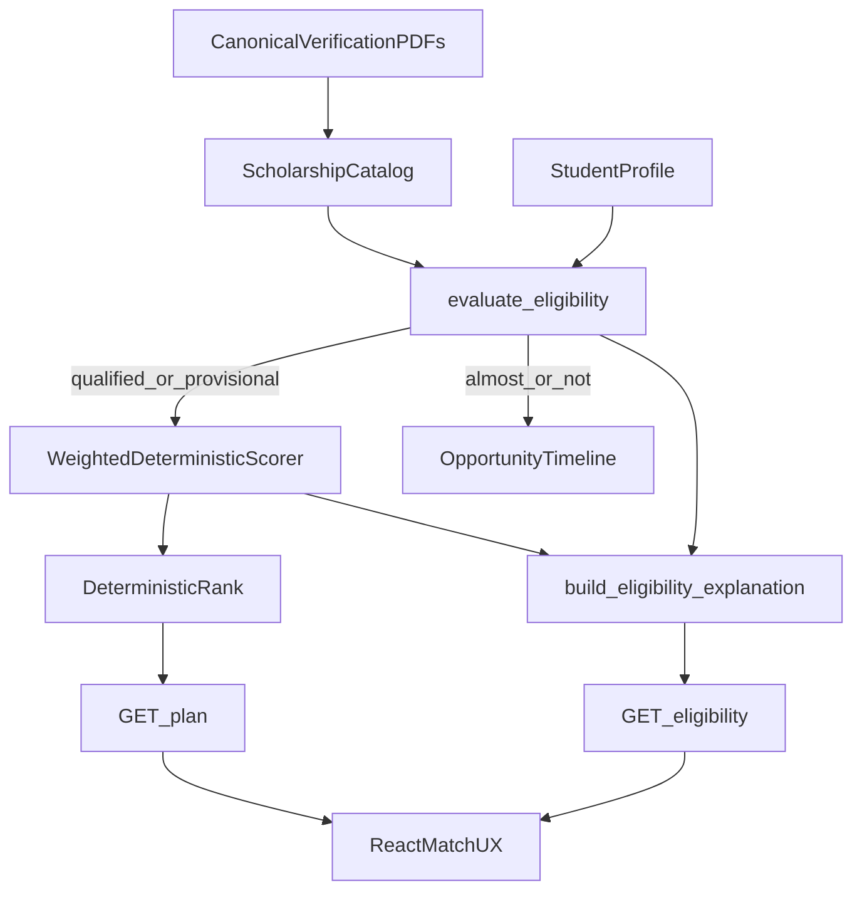
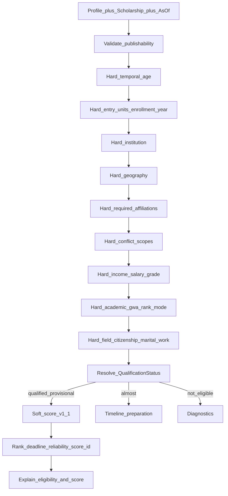

### Implications for the architecture (inventory-driven)
1. **Most frequent classes are already field-based** (citizenship, level, year, GWA, income, field, residency, school category). Priority is **data remediation**, not new DDL.
2. **Highest false-positive classes lacking hard support today:** RC07 zero units, RC21 empty partner lists, RC24–26 registries, RC34–35 exclusivity.
3. **Highest false-negative classes:** RC13 academic OR, RC12 rank alternatives, RC16 uncapped merit tracks mis-capped in DB.
4. **Process-heavy classes** (RC44/45 good moral/health, much of RC39/42) should stay **explain/document readiness**, not block matching unless profile evidence exists.
5. **RC47 multi-track** validates splitting DOST/BPMSP/QCSP tracks (or explicit track objects) over overloaded single rows—aligns with remediation_manifest DOST graduate splits.
6. After adversarial review (Section 13A), the 21 unsupported classes collapse into **sparse atomic columns + relational conflict scopes + matching conventions**—not a general `eligibility_policy` JSON document in v1.

---

## 2. Architecture Review

- **Database:** Adequate entity model; underused school locks; overloads `priority_groups`; needs sparse additive columns + relational conflict scopes—not a policy document store yet
- **Matching engine:** Keep hard→soft; extend evaluators; do not rewrite into ad-hoc stages
- **Schema:** Reuse first; prefer nullable columns + join tables over JSON policy bags for v1
- **API:** Extend eligibility payload keys; no new matching products
- **Frontend:** Verbatim explanations; progressive disclosure for new profile inputs (avoid provisional flooding)
- **Validation:** Publishability gates are first-class (strongest idea in the plan)
- **Explainability:** Backend-authored templates from requirement keys
- **Determinism:** Preserve; pure functions of profile+scholarship+as_of
- **Modularity:** Evaluator registry remains the extension point
- **Normalization:** Conflict scopes and required affiliations as catalog/join tables
- **Extensibility:** Column+convention now; introduce typed policy JSON only when compound-rule volume crosses an explicit trigger

---

## 3. Schema Review (reuse-first)

### Reuse before inventing
- **Incoming / freshman tracks:** reuse `eligible_enrollment_status` (`incoming_freshman`, …).
- **Year-restricted continuing grants:** reuse `eligible_year_levels`.
- **Consortium / partner locks:** reuse `eligible_schools` / `eligible_school_systems`. Populate; never add `partner_school_restricted`.
- **Sector / affiliation hard gates:** do **not** overload soft `priority_groups`. Introduce explicit **required affiliations**.
- **Return service existence:** reuse `has_return_service`; details stay explanation metadata.
- **Age bounds:** reuse `min_age`/`max_age` where numeric; add as-of columns only for birthdate-cutoff programs.
- **Bag bag:** never put hard rules in `type_attributes`.

### Chosen schema evolution (revised after adversarial review)

**A. Scholarship — sparse atomic columns (v1; no `eligibility_policy` JSON)**
- `max_prior_tertiary_units` INT NULL
- `min_work_experience_years` INT NULL
- `max_class_rank` INT NULL
- `max_class_percentile` FLOAT NULL
- `academic_gate_mode` TEXT NULL CHECK IN (`and`,`or`)
- `allow_transferee` BOOLEAN NULL
- `allow_shiftee` BOOLEAN NULL
- `first_undergraduate_only` BOOLEAN NOT NULL DEFAULT false
- `min_residency_years` INT NULL
- `age_as_of_date` DATE NULL
- `age_as_of_rule` TEXT NULL CHECK IN (`born_on_or_after`,`born_on_or_before`,`age_at_date_lte`,`age_at_date_gte`)
- `max_parent_salary_grade` INT NULL
- `parent_program_id` INT NULL FK → scholarships(id) — for RC47 track splits

**Academic OR convention (replaces `academic_any_of` JSON):**
- Only `min_gwa_normalized` → GWA gate
- Only rank/percentile → rank gate
- Both set and `academic_gate_mode='or'` → either may satisfy academic requirement
- Both set and mode `and` or NULL → AND (safe default). BPMSP-class rows must set mode=`or` during backfill

**B. Conflict scopes — relational, not JSONB list**
- `conflict_scopes(id, code UNIQUE, label, description)` — seed `national_stufap`, `lgu_grant`, …
- `scholarship_conflict_scopes(scholarship_id, scope_id)`
- `student_active_grant_scopes(student_id, scope_id, source, verified)` — self-report allowed; `verified` default false

**C. Required affiliations — separate from soft priority**
- `affiliation_codes(id, code UNIQUE, kind, label)` — kinds: `registry`, `equity`, `employment`, `other`
- `scholarship_required_affiliations(scholarship_id, affiliation_id)`
- `student_affiliations(student_id, affiliation_id, attested_at)`
- Existing equity booleans sync into `student_affiliations` for known codes
- `priority_groups` remains soft/scoring or reserved-slot messaging only; hard membership uses required affiliations

**D. Student evaluation inputs (nullable; progressive profile)**
- `prior_tertiary_units`, `class_rank`, `class_size`, `work_experience_years`, `marital_status`, `parent_salary_grade`, `parent_status`, `is_hei_faculty_or_staff`, `residency_years_in_locality`
- Wire `is_4ps_listahanan` end-to-end

**E. Explicitly deferred (not in v1)**
- `eligibility_policy` JSONB / versioning
- General predicate tables / rules DSL
- Family graph for RC36

**F. Still rejected from NotebookLM**
- `incoming_year_only`, `partner_school_restricted`, `lgu_exclusivity_clause`, free-text `sectoral_restriction`

### Trigger to introduce `eligibility_policy` later
Only if compound predicates exceed ~15 scholarships, nested boolean logic repeats in Tier 1 rules, or admin tooling needs a heterogeneous rare-rule editor. Until then, column+convention wins.

---

## 4. Matching Engine Review

### Keep
Hard eligibility authority, soft scoring v1.1, deadline as sort/flag, almost-qualified timeline.

### Modify — evaluator order
1. publishability/data_status
2. age (numeric + age_as_of)
3. entry (enrollment, prior units, transferee/shiftee, first_ug)
4. institution
5. geography (+ min_residency_years)
6. required affiliations
7. conflict scopes
8. income + parent salary grade
9. academic (GWA/rank + `academic_gate_mode`)
10. field / citizenship / marital / work experience
11. legacy `members_only` as deprecated shim during migration

### Critical — provisional flooding
- Gate inactive (N/A) when scholarship constraint is NULL
- Missing profile input → UNKNOWN with explicit next action
- Per-gate flags (`GATE_PRIOR_UNITS`, `GATE_ACADEMIC_OR`, `GATE_CONFLICTS`, `GATE_AFFILIATIONS`, `GATE_AGE_AS_OF`)
- Optional later `STRICT_PROFILE_GATES` fail-closed after profile adoption metrics pass

---

## 5. Rule Modeling Strategy

Prefer the least powerful mechanism that fits inventory frequency: columns for quantitative gates, join tables for scopes/affiliations, enrollment/year lists for entry windows, explanation-only for family caps and process docs. No scholarship-ID branching.

---

## 6. Data Model Improvements

**Chosen direction (revised):** field-based core + relational lookup/join tables + matching conventions. JSON policy is a documented escape hatch, not the default. Advantages: queryable, FK-safe, form-friendly, no dual representation. Disadvantage: occasional new nullable columns as rare rules appear—acceptable at current scale.

---

## 7. Matching Pipeline Design

Renewal remains explanation metadata only in v1.

---

## 8. Explainability Architecture

Backend-authored templates from stable requirement keys. New keys: `prior_units`, `academic` (with OR evidence), `conflict_scope`, `required_affiliation`, `work_experience`, `age_as_of`, `marital_status`. FE renders verbatim.

---

## 9. Migration Strategy

1. Phase 0 data remediation
2. Additive DDL (columns + join tables); behavior unchanged
3. Enable per-gate flags independently
4. Backfill from verification artifacts; set `academic_gate_mode='or'` only where Tier 1 requires OR
5. Staging → persona/eval → progressive prod enablement
6. Rollback = disable gate flag

**Compatibility without policy versions:** NULL new columns preserve legacy behavior. If policy JSON is introduced later: version field + one-release dual-read + data migration; unknown versions fail publish validation.

---

## 10. Testing Strategy

Unit evaluators; migration up/down; persona FP/FN; strict oracle; publishability CI. Academic matrix covers mode `or`/`and`/NULL. Join-table tests for conflicts/affiliations.

Persona gates: enrolled+units barred from DOST/BPMSP; ranker matches BPMSP OR; LGU conflict excludes; non-consortium barred from ERDT/ASTHRDP; non-NCFRS barred from CoScho.

---

## 11. Implementation Roadmap

Phase 0 Data → Phase 1 Schema (columns+joins) → Phase 2 Taxonomies+publish validators → Phase 3 Evaluators behind per-gate flags → Phase 4 API → Phase 5 Progressive profile UX → Phase 6 CI gates → Phase 7 Prod validation.

---

## 12. Implementation Specification (engineering contract)

### SPEC-01 — Catalog data remediation (P0)
Align live rows to canonical policy; populate `eligible_schools` / enrollment statuses; splits/merges/URLs/income fixes.

### SPEC-02 — Sparse atomic columns (replaces hybrid JSON policy) (P0)
Ship Section 3A columns; no `eligibility_policy` in v1. Acceptance: BPMSP OR expressible; DOST zero-units expressible; MEXT age_as_of expressible.

### SPEC-03 — Entry / prior-units gate (P0)
`max_prior_tertiary_units` + student `prior_tertiary_units` + enrollment backfill.

### SPEC-04 — Academic OR via column convention (P1)
`academic_gate_mode` + rank columns; Persona B passes BPMSP.

### SPEC-05 — Institutional lock via data (P0)
Populate `eligible_schools`; publish fails if consortium list empty.

### SPEC-06 — Required affiliations (P0–P1)
Catalog + joins; CoScho/DA ACEF/SIDA enforce registries; deprecate hard use of `members_only`+`priority_groups` for registries.

### SPEC-07 — Conflict scopes relational (P0)
Catalog + joins; Persona C excluded; FK prevents typos; join lists all national_stufap programs.

### SPEC-08 — Work experience + age-as-of columns (P1)
Column-based, not policy JSON.

### SPEC-09 — Family-cap honesty (P2)
Explain-only; no fake household graph.

### SPEC-10 — Explainability templates (P1)
Stable keys for all new gates.

### SPEC-11 — API compatibility (P1)
New requirement keys additive.

### SPEC-12 — Per-gate feature flags (P0 ops)
Independent enable/disable; time-boxed removal after soak.

### SPEC-13 — Publishability validation (P0, elevated)
API reject on publish + CI over catalog. Examples: consortium ⇒ schools non-empty; mode=`or` ⇒ ≥2 academic predicates; required affiliations ⇒ valid codes; conflict-scoped ⇒ ≥1 scope row; zero-unit programs ⇒ `max_prior_tertiary_units` set; track children ⇒ `parent_program_id` set.

---

## 13. NotebookLM Recommendation Verdicts

- `incoming_year_only` → **Replace** with enrollment_status + prior units
- `rank_cutoff_alternative` alone → **Replace** with rank columns + `academic_gate_mode`
- `sectoral_restriction` VARCHAR → **Replace** with required affiliations
- `lgu_exclusivity_clause` → **Replace** with relational conflict scopes
- `partner_school_restricted` → **Reject**; populate `eligible_schools`
- `one_scholar_per_family` hard gate → **Reject** for v1
- Data remediation P0 → **Accept**
- Three-stage rewrite → **Modify** into ordered evaluators
- `eligibility_policy` JSON (our earlier proposal) → **Defer/reject for v1** after adversarial review

---

## 13A. Adversarial Architecture Review (final challenge)

Assume the prior plan is wrong. Findings:

### Finding 1 — `eligibility_policy` JSON was overengineering (ACCEPT → design changed)
Compound OR ~3 programs; birthdate as-of ~6; transferee bars ~2; first-degree-only 1; residency-duration 1. A versioned JSON rule document, schema validator, admin JSON UX, and dual-representation lint fails YAGNI. **Better:** nullable columns + `academic_gate_mode`. Escape hatch documented for later.

### Finding 2 — JSONB conflict_scopes list was a schema smell (ACCEPT → relational)
String lists invite typos, lack FK integrity, and age poorly. With ~9 exclusivity programs, catalog + join tables are cheaper long-term.

### Finding 3 — `members_only` + `priority_groups` semantic overload (ACCEPT → required affiliations)
Soft priority tags must not be hard sector gates.

### Finding 4 — Provisional flooding / trust collapse (ACCEPT → per-gate rollout)
Many new profile fields → mass `provisionally_qualified` → trust failure. Mitigate with inactive-when-NULL gates, progressive prompts, per-gate flags.

### Finding 5 — Policy versioning complexity was self-inflicted (ACCEPT → removed from v1)
NULL columns are the compatibility strategy. No v1/v2/v3 interpreter matrix.

### Finding 6 — Dual-path feature-flag rot (ACCEPT → per-gate flags, time-boxed)
One mega-flag with two full engines is how dead code lives forever.

### Finding 7 — Redundant entry signals (ACKNOWLEDGE)
`incoming_freshman` and `max_prior_tertiary_units=0` overlap. Both may apply; units is stricter; publish validation should require both when Tier 1 states both.

### Finding 8 — Self-reported grants/registries (ACKNOWLEDGE)
Label unverified; never claim provider-confirmed.

### Finding 9 — Admin UX risk if JSON had shipped (ACCEPT by deferral)
Columns and join pickers are form-friendly; raw JSON is not.

### Finding 10 — ORM Text vs Postgres JSONB drift (pre-existing)
Hygiene item; new relational tables avoid making it worse.

### Finding 11 — `almost_qualified` key-set drift
New unmet keys must be classified into achievable vs hard-exclude sets deliberately.

### Finding 12 — Performance
Non-issue at current scale. Do not use performance theater to justify abstractions.

### Finding 13 — Track splits multiply rows
Correct for RC47; needs `parent_program_id` + grouped UX.

### Would a senior review reject the revised design?
**No.** After removing policy JSON from v1, relationalizing conflict scopes, separating required affiliations, and confronting provisional flooding, the architecture is **fundamentally sound**: deterministic hard→soft matching, data-first remediation, reuse-first schema, publishability as quality gate, complexity proportional to measured rule-class frequency.

### Biggest residual risk
Not schema shape — **catalog backfill discipline** and **profile adoption**. Empty `eligible_schools` or uncollected prior units still produce bad matches under a perfect engine.

---

## 14. Architecture Critique (self-review, post-revision)

- Too many student fields → progressive disclosure; gates inactive when constraint NULL
- Column growth over time → accept slow accretion; promote to policy JSON only at trigger
- Join-table verbosity → tiny cardinality; admin multi-select
- Self-report gaming → unverified labels; future attestation
- Per-gate flag matrix → time-boxed removal after soak
- Track-split UX clutter → `parent_program_id` + grouped UI

**Collapsed MVP if staffing is tight:** Phase 0 data + `max_prior_tertiary_units` + populate `eligible_schools` + enrollment_status backfill alone removes the worst critical FPs. Academic OR, conflicts, and affiliations follow immediately after.

---

## Bottom line

The migration plan’s **principles** were right; its **largest abstraction (`eligibility_policy` JSON) was premature** given the canonical inventory. The revised plan keeps deterministic matching and data-first remediation, replaces JSON policy with **column+convention**, replaces JSON conflict lists with **relational scopes**, separates **required affiliations** from soft priority tags, and elevates **publishability validation** as primary quality control. That is the design that should be implemented.
